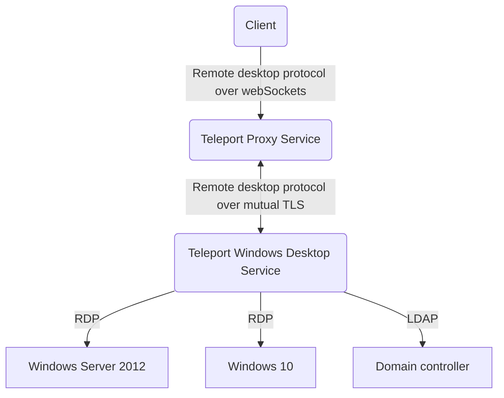

The topics in this guide describe how to configure Teleport to provide secure, passwordless 
access to Microsoft Windows desktops and servers. Teleport for Windows desktops provides the
following key features:

- Passwordless access to Windows hosts backed by secure cryptographic authentication.
- Configurable role-based access controls (RBAC) for groups of hosts and users.
- Configurable clipboard and directory sharing for copying and pasting to and from 
remote Windows hosts.
- Session recording for all desktop activity.
- Audit logs that track user activity.

Teleport Desktop Access relies on the remote desktop protocol (RDP) to connect to
remote Windows hosts. Therefore, Teleport Desktop Access only supports the following 
Windows hosts that are accessible over RDP:

- Windows Server 2012 R2, or later.
- Windows 10, or later.

The following diagram provides a simplified view of the architecture for Teleport
Desktop Access:

## Getting started

You can configure Teleport Desktop Access to control access for the following scenarios:
- Local users who access computers that aren't joined to an Active Directory domain.
- Domain users who access computers that are joined to an Active Directory domain.

If you're managing access for combination of both local users and domain users, you'll need
to configure Teleport Desktop for both scenarios. For more information about configuring basic access using Teleport Desktop Access, see the 
following topics:

- [Configure access for local Windows users](./windows-local-users.mdx)
- [Configure access for Active Directory automatically](./active-directory.mdx)
- [Configure access for Active Directory manually](./active-directory-manual.mdx)

## Managing desktop access

The following topics provide information about performing common tasks and 
Windows-specific configuration settings, role-based permissions, and audit events:

- [Configure Windows-specific role permissions](./rbac.mdx)
- [Configure clipboard sharing](./clipboard.mdx)
- [Configure directory sharing](./directory-sharing.mdx)
- [Record and play back sessions](./sessions.mdx)
- [Troubleshooting desktop access](./troubleshooting.mdx)
- [Windows-specific audit events](./reference/audit.mdx)
- [Windows-specific configuration settings](./reference/configuration.mdx)
- [Windows-specific command reference](./reference/cli.mdx)

