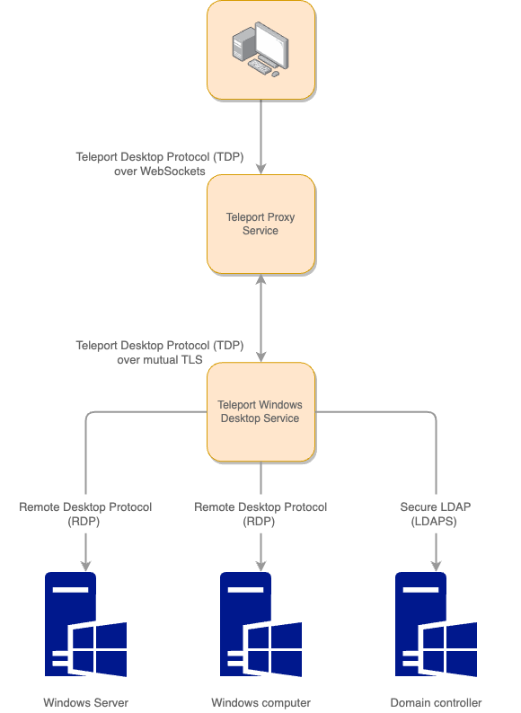

The topics in this guide describe how to configure Teleport to provide secure, passwordless 
access to Microsoft Windows desktops and servers. For Windows, Teleport provides the
following key features:

- Passwordless access to Windows hosts backed by secure cryptographic authentication.
- Configurable role-based access controls (RBAC) for groups of hosts and users.
- Configurable clipboard and directory sharing for copying and pasting to and from 
remote Windows hosts.
- Session recording for all desktop activity.
- Audit logs that track user activity.

Teleport Windows Desktop Services relies on the remote desktop protocol (RDP) to connect to
remote Windows hosts. Therefore, Teleport only supports the following Windows hosts that are 
accessible over RDP:

- Windows Server 2012 R2, or later.
- Windows 10, or later.

The following diagram provides a simplified view of the architecture for managing
access to Windows computers through Teleport:

It's worth noting that the Teleport Windows Desktop Service implements a minimal set 
of remote desktop protocol features to minimize security vulnerabilities for Windows
computers. Because secure access is the top priority, the Windows Desktop Service 
might not be as performant as other RDP clients. 

You should use the Teleport Windows Desktop Service to manage access 
to Windows computers where you store or manipulate your most sensitive information, 
rather than as a direct replacement for tools that provide general purpose access 
to Windows computers.

## Getting started

You can configure Teleport Windows Desktop Service to control access for the following 
scenarios:

- Local users who access computers that aren't joined to an Active Directory domain.
- Domain users who access computers that are joined to an Active Directory domain.

If you're managing access for combination of both local users and domain users, you'll 
need to configure Teleport Windows Desktop Service for both scenarios. For more 
information about configuring basic access using Teleport Windows Desktop Service, see 
the following topics:

- [Configure access for local Windows users](./getting-started.mdx)
- [Configure access for Active Directory with scripts](./active-directory.mdx)
- [Configure access for Active Directory manually](./active-directory-manual.mdx)

## Managing desktop access

The following topics provide information about performing common tasks and 
Windows-specific configuration settings, role-based permissions, and audit events:

- [Role-Based Access Control for Desktops](./rbac.mdx)
- [Clipboard Sharing](./reference/clipboard.mdx)
- [Directory Sharing](./directory-sharing.mdx)
- [Session Recording and Playback](./reference/sessions.mdx)
- [Troubleshooting Desktop Access](./troubleshooting.mdx)
- [Desktop Access Audit Events Reference](./reference/audit.mdx)
- [Desktop Access Configuration Reference](./reference/configuration.mdx)
- [Desktop Access CLI Reference](./reference/cli.mdx)

