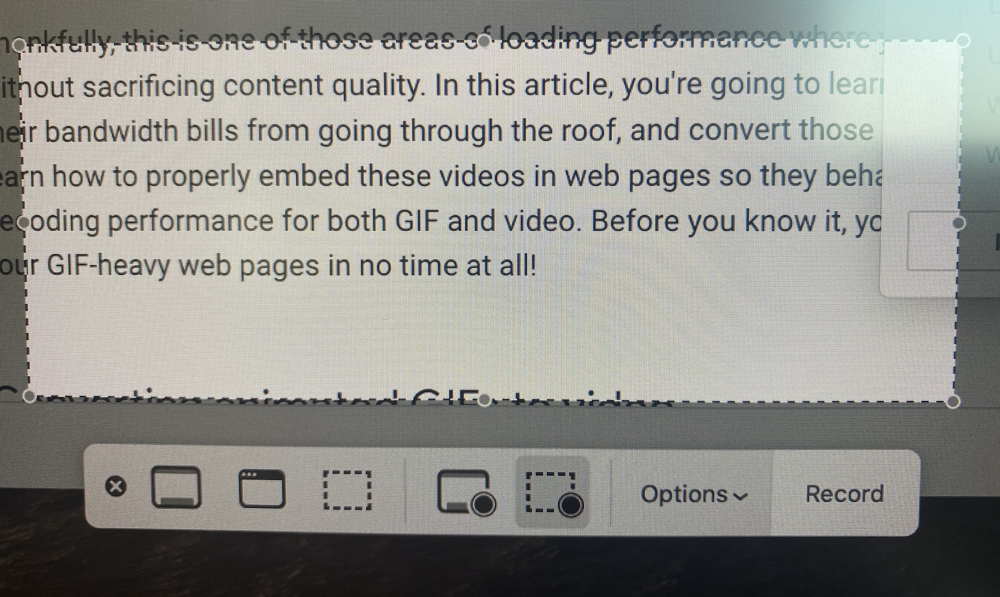
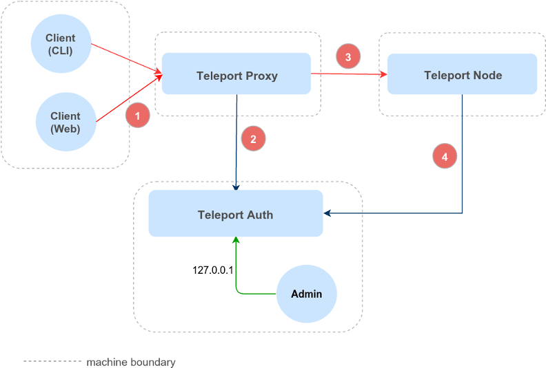

# Documentation Best Practices

This article serves to define [documentation](../docs) best practices.

## Work Flow

This section describes the general workflow for writing documentation:

1. Select a branch from [github.com/gravitational/teleport](https://github.com/gravitational/teleport/) corresponding to the version of the documentation/product you'd like to work on.
2. Use `$ git submodule update --init --recursive` when you `git switch` to or `git checkout` a new branch!
3. Make changes locally using [Next](https://github.com/gravitational/next), our primary documentation tool.
4. Use an editing and (Flesch-Kincaid) conversational scoring tool like Grammarly.
5. Validate your changes locally using the provided [linters](https://github.com/gravitational/next#development-related-commands).
6. Commit your changes and create a PR.
7. Get approved by two reviewers, squash, and merge your changes in. 

Typically if you make changes to some version `6.1`, you'll also want to port those changes to `master/main`, and any version following `6.1`.

In other words, making changes to `6.1` usually entails making changes to `6.2` and `7.0 (master/main)`. This isn't universally the case (if some document or change is specific to a single version) but generally applies. Eventually, most of this will be automated since it can be a bit cumbersome.

To see the current submodule and version mappings review [the mappings](https://github.com/gravitational/next/blob/main/.gitmodules).

## Tooling

Our documentation is primarily built with [Next](https://github.com/gravitational/next) which has the following features:

1. It compiles React and specifically, React within Markdown. This gives us the ability to create uniform UI/UX markers (the reusable UI/UX components React is known for) that engage and help the reader.
2. Lints and checks both React and native language *within* Markdown as part of the CI/CD and PR process.
3. Several pre-compilation plugins, processors, and hooks that we can extend as needed. This gives us a lot of power and flexibility to automate some of the more tedious tasks.

**Diagrams:**

- Use [Teleport's lucidchart library](https://app.lucidchart.com/lucidchart/dfcf1f4a-5cf0-4758-8ebb-f6ea86900aba/edit) to create diagrams with a consistent design language.
- Diagram multistep sections using sequence diagrams that depicts steps linearly.
- Several great examples are available here: https://gravitational.slab.com/posts/diagrams-ix9nzhpd.
- Reach out to the design team for custom requests and for advice to improve your designs.

**Videos:**

- Mac users should use Quicktime's `Cmd-Shift-5` to record a small part of the screen:



**Convert Mov to MP4 and WebM**

Quicktime outputs large `.mov` files. Use `ffmpeg` to convert them into `mp4` and `webm`
web-friendly formats:

```code
# create MP4
$ ffmpeg -i input.mov -b:v 0 -crf 25 output.mp4
# create WebM
$ ffmpeg -i input.mov -c vp9 -b:v 0 -crf 41 output.webm
```

**Embed videos**

```html
<video autoPlay loop muted playsInline>
  <source src="https://goteleport.com/teleport/videos/database-access-preview/dbaccessdemo.mp4" type="video/mp4" />
  <source src="https://goteleport.com/teleport/videos/database-access-preview/dbaccessdemo.webm" type="video/webm" />
Your browser does not support the video tag.
</video>
```

To test videos locally, add them to the `../img/video` folder of the docs.
For production, upload to the website and refer from there:

```html
<video autoplay loop muted playsinline>
  <source src="https://goteleport.com/teleport/videos/database-access-preview/dbaccessdemo.mp4" type="video/mp4" />
  <source src="https://goteleport.com/teleport/videos/database-access-preview/dbaccessdemo.webm" type="video/webm" />
Your browser does not support the video tag.
</video>
```

## Style guide

Some standards are presently codified in the [Next](https://github.com/gravitational/next) repository by way of MDX linters. Make sure to use these!

The following standards are already in use. Please follow them (although these are non-blocking, do read the comments below):

1. `tsh`, `tctl`, and other core commands should be placed in tic marks.
2. All ports or values should be enclosed in tic marks `443`.
3. Footnotes should be ordered by appearance (chronological precedence). `2` should not come before `1`.
4. Tend to write sparser one to two-sentence groupings rather than lengthier text block paragraphs.
5. Use periods at the end of a line even in a list unless the ending item is a command.
6. Titles should have all words capitalized except for determiners (`a`, `the`, etc.) - headings should be sentence-case. `How to Access a Teleport Node` vs. `Step 2/3. How to access a Teleport Node`. Also, `Next steps` is preferred over `Next Steps`. The reasoning for this is that Titles render more pleasingly using word-casing. We want to clarify proper nouns and products in steps by using sentence-casing. Please use consistent header sentence-casing (`I am an example header`, `I Am another Example header`, `I am a Third header`).
7. Prefer putting commands (like BASH) into full-line elements:
   ```
   #Example
   ```
   vs `Example`. The full-line element renders with a handy copy icon.
8. Article titles should follow a `Title Name | Teleport Docs` format. The total character count should not exceed 70 for the entire title since this can impact SEO. **The suffix** (`| Teleport Docs`) **will be added automatically by the Next engine** but keep a lookout for character count and that titles correctly render. 
9. Page rank matters less now but content matters more. Make sure to have a good, well-worded, description that uses common keywords around the subject. Also, liberally sprinkle said keywords throughout the article.
10. Use numbered lists for any sequence of steps **but use these sparingly**. We prefer short paragraph blocks with minimal bullet points and numbered lists. This leads to a preference for completeness and brevity rather than ennumeration. Also, prefer bullet points.
11. We should avoid using scare-quotes `""` to refer to a sub-service/proper noun - these often have negative connotations associated with them. E.g. - "Trusted Cluster" vs  *Trusted Cluster*. Use italics for concept keywords and tic marks for values. (Clarification: it's harmless to use quotes to approximate or indicate something but not to name or refer to a proper noun. It can be quite conversational and friendly in those other contexts.)
12. Avoid scare-quotes when describing something - just describe it. `Teleport is a way to "access stuff"` vs. `Teleport represents an evolution of SSH`.

The rest are subject to final approval by the developer relations team. In general, it's still a good idea to adopt some of these when writing your next article:

1. Consistent acronyms and concept keyword use (`2-factor`, `two-factor`, `2fa`, `tfa`).
2. Consistent use of contractions - many teams tend to favor an all-or-nothing approach here. Contractions keep the language sparse, concise, and conversational. For more formal language, we'd probably want to avoid them.
3. Product proper nouns should be capitalized. `trusted cluster` -> `Trusted Cluster`
4. Product proper nouns should be bolded. `Trusted Cluster` -> **Trusted Cluster**
5. Acronyms should always be introduced following a concept keyword and then consistently used thereafter (no concept keyword used) in an article (saves space, typing, and reading - guarantees the shorthanded term is available).

**Pros:**

- These are relatively minor improvements overall but help to set more uniform documentation standards.
- Stylistically, this helps to ensure more professional, neat, and tidy docs.
- Helps set clear, baseline, guidelines we can expand as documentation needs grow. We can apply these uniformly for blogs, docs, etc.
- May assist with any future localization efforts since setting a config file for a language is easier when words are one-to-one.
- Assists with improving searches by content or keyword.
- Acronyms are occasionally (but only very rarely) associated with multiple concepts. This reduces some potential ambiguities. (Especially for concepts that exist in a complex and particularly acronym-prone space.)
- These are often helpful for new hires since they can simultaneously be reading and learning the material while performing basic editing.
- Consistent and helpful styling has an impact on customer satisfaction. Small stylistic changes can improve the efficacy of docs. It's a lot easier to find that *one, crucial, config value* if it's bolded or highlighted.

## Testing

1. Make sure to manually test commands and steps!
2. Make sure to run linting on your docs!

## MDX and UI/UX components

Next uses Markdown with React (hence, the `.mdx` filename suffix). 

- MDX supports powerful templating features like variable interpolation.
- This section briefly describes some of the features that're most relevant when writing documentation.

### Variables, templating, and interpolation

Many documentation teams struggle with maintaining the vast number of articles and resources that are eventually created and consumed. Links and images have to be rechecked for accuracy/relevance.

To ease this burden, we can replace links and code examples with *variables* so we don't have to constantly update everything after each release.

- Variables are stored in the `docs/config.json` file under the key `variables`.
- Variables can be nested inside the config.
- To insert variables into the page use `(\= path.to.variable \=)` syntax (remove backslashes in actual code).
- Variables will be linted when a PR is created as part of our CI/CD process. If the variable didn't exist in the config, it would throw an error which you must remedy to merge.

### Includes

To prevent content duplication, it's very useful to include code examples or other MDX files inside the current page (akin to API or code-reuse). This allows documentation to reduce maintenance overhead and focus on writing new articles.

Use `(\! path-to-file.mdx \!)` syntax (remove backslashes in actual code).

Paths are resolved from the root of the repository.

Includes will only work in these two cases:

1. Include surrounded by newlines. E. g.:

   ```md
   Some text.

   (\! include.mdx \!)

   Some other text.
   ```

   If the include is an `mdx` file, it will be parsed and rendered as a markdown. In other cases
   it will be included as-is.

2. Include inside the code blocks. E. g.:

   ````md
   ```code
   # Code example below

   (\! include.sh \!)

   ```
   ````

   These will be inserted as-is, even in the case of the `mdx` files.

- Includes in any other places will not be resolved and will be left as is.
- Includes will be linted when a PR is created as part of our CI/CD process.
- If the file didn't exist in the repository, it will throw an error. Wrong placement of includes will also throw errors.

### Scopes

There are three versions of Teleport: `oss`, `enterprise`, and `cloud`. And docs can be switched
to one of these versions using a selector at the top of the page. Based on the selector's value, 
some MDX components can hide or show different content sections. Check the components' descriptions
below to see which component can be affected by this selector. They will have a `scope` subsection
in their description.

### Image pixel density marker

- The browser can't distinguish between retina-ready and not retina-ready images.
- Because of this, screenshots made on the retina screens may look large on the page.
- To hint to the browser that the images are meant for retina display, we can add the suffix `@Nx` to the image's file name. For example, screenshots made on macOS
  should have the suffix `filename@2x.png`.
- It will tell the browser to scale images
  down twice to show them in their actual size.
- Different Operating Systems may require different suffixes based on which logical and physical resolutions their screens have.

### Notice

<Notice type="tip">Notice content.</Notice>

If you want to add notice like the one above to the page, use this syntax:

```
<Notice type="tip">
  Notice content.
</Notice>
```

`type` can be one of the following values: `warning`, `tip`, `note`, `danger`.
Different types will result in different colors for the background and different icons. 
Omitting the type or using some other value will result in resetting it to the `tip`.

**Scope**

`scope` is an optional prop. If `scope` is set, component will be only shown if provided scope
is selected. `scope` can be either one of these strings `oss`, `enterprise`, `cloud`, or an array of
multiple scopes. To set multiple scopes use this syntax: `scope={["oss", "cloud"]}`.

### Admonitons

<Admonition
  title="Admontion title"
  type="tip"
>
  Admontion content.
</Admonition>

If you want to add admonition like the one above to the page, use this syntax:

```jsx
<Admonition title="Admontion title" type="tip">
 Admontion content.
</Admonition>
```

`type` can be one of the following values: `warning`, `tip`, `note`, `danger`.
Different types will result in different colors for the header. Omitting the type
or using some other value will result in resetting it to the `tip`.

If `title` is omitted, `type` will be used instead as the title value.

### Tabs

<Tabs>
  <TabItem label="First label">
    First tab.
  </TabItem>

  <TabItem label="Second label">
    Second tab.
  </TabItem>
</Tabs>

To insert tabs block like the one above use this syntax:

```jsx
<Tabs>
  <TabItem label="First label">
    First tab.
  </TabItem>
  <TabItem label="Second label">
    Second tab.
  </TabItem>
</Tabs>
```

**Scope**

`scope` is an optional prop for `TabItem`. If `scope` is set, the tab will be automatically selected
if the provided scope is selected. If multiple tabs have the same `scope` value, the first
will be selected. `scope` can be either one of these strings `oss`, `enterprise`, `cloud`,
or an array of multiple scopes. To set multiple scopes use this syntax: `scope={["oss", "cloud"]}`.

### Details

<Details title="Details title" min="7.0" opened>
  Details content
</Details>

To insert a details block like the one above, use this syntax:

```
<Details title="Details title" min="7.0" opened>
  Details content
</Details>
```

**Scope**

`scope` is an optional prop. If `scope` is set, the component will be unfolded when this scope
is selected and folded in some other scope is selected (but the user will still be able
to unfold it manually). `scope` can be either one of these strings `oss`, `enterprise`, `cloud`,
or an array of multiple scopes. To set multiple scopes use this syntax: `scope={["oss", "cloud"]}`.


`scopeOnly`- if this prop is set on the component, the component will only be visible
in the provided scope and invisible in all other scopes.

### Figures

The new Figure component can help with customizing and using images, figures, and diagrams:

<Figure
  align="center"
  bordered
  caption="Example"
>
  
</Figure>

```jsx
<Figure
  align="center"
  bordered
  caption="Example"
>
  
</Figure>
```
