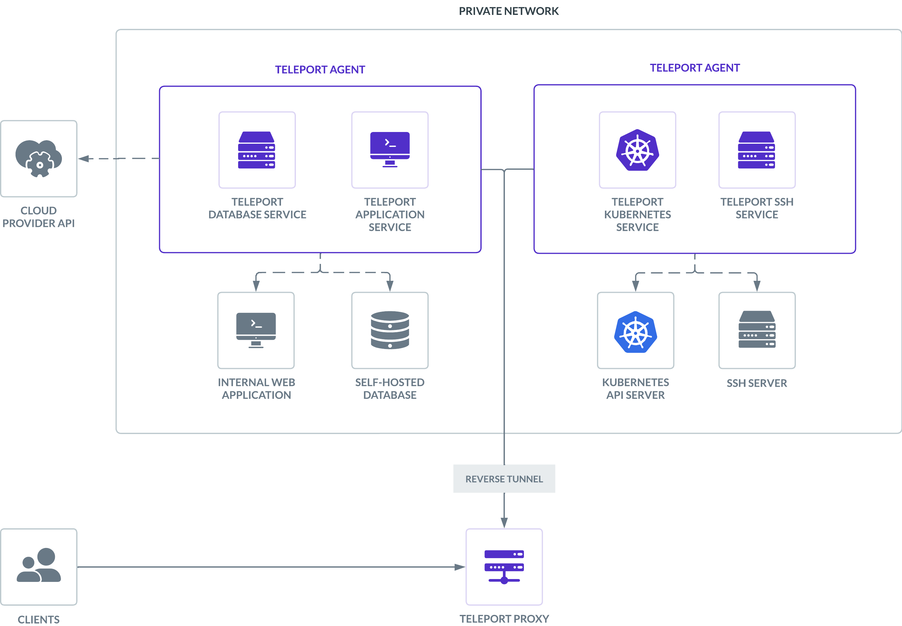

You can use Teleport to protect infrastructure resources like servers and
databases by deploying **Teleport Agents**. Teleport Agents run one or more
services, such as the Teleport SSH Service and Teleport Database Service, to
proxy traffic to and from resources in your infrastructure. This section shows
you how to use Teleport Agents to enable secure access to your infrastructure.

To establish trust between an Agent and your Teleport cluster, you use one of
several **join methods**. When joining an Agent, you can configure the services
that run on the agent. You can also edit the configuration of an Agent to change
the services that run on it.

Read our guide for how to use Terraform to [deploy a pool of
Agents](../../admin-guides/infrastructure-as-code/terraform-starter/enroll-resources.mdx). 

For more information on the architecture of Teleport Agents, read
[Teleport Agent Architecture](../../reference/architecture/agents.mdx).

When a Teleport process first runs, it checks its configuration file to
determine which services are enabled. Each service then connects separately to
the Teleport Auth Service, which checks whether it has created a **join token**
for that service. If so, the Auth Service issues the Agent credentials signed
for that service. 

There are multiple methods you can use to join a Teleport process to your
cluster in order to run Teleport services, including an instance of the Proxy
Service. Choose the method that best suits your infrastructure:

|Method|Description|When to use|
|------|-----------|-----------|
|[EC2 Identity Document](aws-ec2.mdx)|A Teleport process running on an EC2 instance authenticates to your cluster via a signed EC2 instance identity document.|Your Teleport process will run on EC2 and your Teleport cluster is self hosted.|
|[AWS IAM](aws-iam.mdx)|A Teleport process uses AWS credentials to join the cluster, whether running on EC2 or not.|At least some of your infrastructure runs on AWS.|
|[Azure Managed Identity](azure.mdx)|A Teleport process demonstrates that it runs in your Azure subscription by sending a signed attested data document and access token to the Teleport Auth Service.|Your Teleport process will run on Azure.|
|[Kubernetes ServiceAccount](kubernetes.mdx)|A Teleport process uses a Kubernetes-signed proof to establish a trust relationship with your Teleport cluster.|Your Teleport process will run on Kubernetes.|
|[GCP IAM](gcp.mdx)|A Teleport process uses a GCP-signed token to establish a trust relationship with your Teleport cluster.|Your Teleport process will run on a GCP VM.|
|[OCI IAM](oracle.mdx)|A Teleport process uses Oracle Cloud credentials to join the cluster.|Your Teleport process will run on an OCI Compute instance.|
|[Join Token](join-token.mdx)|A Teleport process presents a join token provided when starting the service.|There is no other supported method for your cloud provider.|

The credentials that the Auth Service issues to Agents are signed for specific
services. To run new services on an Agent, you must repeat the initial join
procedure for those services. See [Enable a New Service on an
Agent](add-service-to-agent.mdx) for how to edit the services that are running
on a Teleport Agent.

