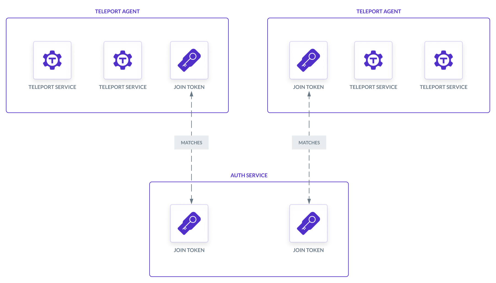

An agent is a Teleport instance configured to run one or more Teleport services
in order to proxy infrastructure resources. For a brief architectural overview
of how agents run in a Teleport cluster, read the [Introduction to Teleport
Agents](introduction.mdx).

This guide shows you how to deploy a pool of Teleport agents running on virtual
machines by declaring it as code using Terraform.

There are several methods you can use to join a Teleport agent to your cluster,
which we discuss in the [Joining Services to your
Cluster](../../index.mdx) guide. In this guide, we will use
the **join token** method, where the operator stores a secure token on the Auth
Service, and an agent presents the token in order to join a cluster.

No matter which join method you use, it will involve the following Terraform
resources:

- Compute instances to run Teleport services
- A join token for each compute instance in the agent pool



## Prerequisites

(!docs/pages/includes/edition-prereqs-tabs.mdx!)

<Admonition type="tip">

We recommend following this guide on a fresh Teleport demo cluster so you can
see how an agent pool works. After you are familiar with the setup, apply the
lessons from this guide to protect your infrastructure. You can get started with
a demo cluster using:
- A demo deployment on a [Linux server](../../admin-guides/deploy-a-cluster/linux-demo.mdx)
- A [Teleport Enterprise Cloud trial](https://goteleport.com/signup)

</Admonition>

- An AWS, Google Cloud, or Azure account with permissions to create virtual
  machine instances.
  
- Cloud infrastructure that enables virtual machine instances to connect to the
  Teleport Proxy Service. For example:
  - An AWS subnet with a public NAT gateway or NAT instance.
  - Google Cloud NAT
  - Azure NAT Gateway

  In minimum-security demo clusters, you can also configure the VM instances you
  deploy to have public IP addresses.

- Terraform v(=terraform.version=) or higher.

- An identity file for the Teleport Terraform provider. Make sure you are
  familiar with [how to set up the Teleport Terraform
  provider](../../admin-guides/infrastructure-as-code/terraform-provider/terraform-provider.mdx) before
  following this guide.

- (!docs/pages/includes/tctl.mdx!)

## Step 1/3. Import the Terraform module

1. Navigate to the directory where you plan to organize files for your root
   Terraform module.

1. Move the identity file for the Teleport Terraform provider into your project
   directory so the Terraform provider can access it. Name the file
   `terraform-identity`.
   
   <Admonition type="warning">
   
   If you don't have an identity file available, make sure you have followed the
   [prerequisites for this guide](#prerequisites).
   
   </Admonition>

1. Fetch the Teleport code repository and copy the example Terraform
   configuration for this project into your current working directory. Copy
   the appropriate child module for your cloud provider into a subdirectory
   called `cloud` and HCL configurations for Teleport resources into a
   subdirectory called `teleport`:

   <Tabs>
   <TabItem label="AWS">

   ```code
   $ git clone --depth=1 https://github.com/gravitational/teleport teleport-clone
   $ cp -R teleport-clone/examples/agent-pool-terraform/teleport teleport
   $ cp -R teleport-clone/examples/agent-pool-terraform/aws cloud
   $ rm -rf teleport-clone
   ```

   </TabItem>
   <TabItem label="Google Cloud">

   ```code
   $ git clone --depth=1 https://github.com/gravitational/teleport teleport-clone
   $ cp -R teleport-clone/examples/agent-pool-terraform/teleport teleport
   $ cp -R teleport-clone/examples/agent-pool-terraform/gcp cloud
   $ rm -rf teleport-clone
   ```

   </TabItem>
   <TabItem label="Azure">

   ```code
   $ git clone --depth=1 https://github.com/gravitational/teleport teleport-clone
   $ cp -R teleport-clone/examples/agent-pool-terraform/teleport teleport
   $ cp -R teleport-clone/examples/agent-pool-terraform/azure cloud
   $ rm -rf teleport-clone
   ```

   </TabItem>
   </Tabs>

1. Create a file called `main.tf` with the following content, which imports the
   `agent-pool-terraform` module for your cloud provider:

<Tabs>
<TabItem label="AWS">

```hcl
module "teleport" {
  source                = "./teleport"
  agent_count           = 2
  agent_roles           = ["Node"]
  proxy_service_address = "teleport.example.com:443"
  teleport_edition      = "oss"
  teleport_version      = "(=teleport.version=)"
}

module "agents" {
  region           = ""
  source           = "./cloud"
  subnet_id        = ""
  userdata_scripts = module.teleport.userdata_scripts
}
```

</TabItem>
<TabItem label="Google Cloud">

```hcl
module "teleport" {
  source                = "./teleport"
  agent_count           = 2
  agent_roles           = ["Node"]
  proxy_service_address = "teleport.example.com:443"
  teleport_edition      = "oss"
  teleport_version      = "(=teleport.version=)"
}

module "agents" {
  gcp_zone         = "us-east1-b"
  google_project   = ""
  source           = "./cloud"
  subnet_id        = ""
  userdata_scripts = module.teleport.userdata_scripts
}
```

</TabItem>
<TabItem label="Azure">

```hcl
module "teleport" {
  source                = "./teleport"
  agent_count           = 2
  agent_roles           = ["Node"]
  proxy_service_address = "teleport.example.com:443"
  teleport_edition      = "oss"
  teleport_version      = "(=teleport.version=)"
}

module "agents" {
  azure_resource_group = ""
  public_key_path      = ""
  region               = "East US"
  source               = "./cloud"
  subnet_id            = ""
  userdata_scripts     = module.teleport.userdata_scripts
}
```

</TabItem>
</Tabs>

Edit the `module "teleport"` block in `main.tf` as follows:

1. Assign `agent_count` to `2` for high availability. As you scale your Teleport
   usage, you can increase this count to ease the load on each agent. 

1. Modify the elements of the `agent_roles` list.

   The Teleport Auth Service associates a join token with one or more roles,
   identifying the Teleport services that are allowed to use the token. Modify
   `agent_roles` to include the token roles that correspond to the Teleport
   services you plan to run on your agent nodes:

   | Role value  | Service it enables           |
   |-------------|------------------------------|
   | `App`       | Teleport Application Service |
   | `Discovery` | Teleport Discovery Service   |
   | `Db`        | Teleport Database Service    |
   | `Kube`      | Teleport Kubernetes Service  |
   | `Node`      | Teleport SSH Service         |

   The elements of the `agent_roles` list also determine which Teleport services
   the agents deployed by the `agent-pool-terraform` module will run. For
   example, if the value of `agent_roles` is `["Node", "Db"]`, the configuration
   file enables the Teleport SSH Service and Teleport Database Service.
   
   If the value of the `agent_roles` input variable includes the `Node` role,
   the configuration also adds the `role: agent-pool` label to the Teleport SSH
   Service on each instance. This makes it easier to access hosts in the agent
   pool later. The script makes Teleport the only option for accessing agent
   instances by disabling OpenSSH on startup and deleting any authorized public
   keys.

1. Assign `proxy_service_address` to the host and HTTPS port of your Teleport
   Proxy Service, e.g., `mytenant.teleport.sh:443`.

   <Admonition type="tip">
   
   Make sure to include the port.
   
   </Admonition>

1. Make sure `teleport_edition` matches your Teleport edition. Assign this to
   `oss`, `cloud`, or `enterprise`. The default is `oss`.

1. If needed, change the value of `teleport_version` to the version of Teleport
   you want to run on your agents. It must be either the same major version as
   your Teleport cluster or one major version behind.

Edit the `module "agents"` block in `main.tf` as follows:

1. If you are deploying your instance in a minimum-security demo environment and
   do not have a NAT gateway, NAT instance, or other method for connecting your
   instances to the Teleport Proxy Service, modify the `module` block to
   associate a public IP address with each agent instance: 

   ```hcl
   insecure_direct_access=true
   ```

1. Assign the remaining input variables depending on your cloud provider:

<Tabs>
<TabItem label="AWS">

1. Assign `region` to the AWS region where you plan to deploy Teleport agents,
   such as `us-east-1`.
1. For `subnet_id`, include the ID of the subnet where you will deploy Teleport
   agents.

</TabItem>
<TabItem label="Google Cloud">

1. Assign `google_project` to the name of your Google Cloud project and
   `gcp_zone` to the zone where you will deploy agents, such as `us-east1-b`.
1. For `subnet_id`, include the name or URI of the Google Cloud subnet where you
   will deploy the Teleport agents.

</TabItem>
<TabItem label="Azure">

1. Assign `azure_resource_group` to the name of the Azure resource group where
   you are deploying Teleport agents.

1. The module uses `public_key_path` to pass validation, as Azure VMs must
   include an RSA public key with at least 2048 bits. Once the module deploys
   the VMs, a cloud-init script removes the public key and disables OpenSSH. Set
   this input to the path to a valid public SSH key.

1. Assign `region` to the Azure region where you plan to deploy Teleport agents,
   such as `East US`.

1. For `subnet_id`, include the ID of the subnet where you will deploy Teleport
   agents. Use the following format:

   ```text
   /subscriptions/SUBSCRIPTION/resourceGroups/RESOURCE_GROUP/providers/Microsoft.Network/virtualNetworks/NETWORK_NAME/subnets/SUBNET_NAME
   ```

</TabItem>
</Tabs>

## Step 2/3. Add provider configurations

In this step, you will configure the `agent-pool-terraform` module for your
Teleport cluster and cloud provider.

In your project directory, create a file called `providers.tf` with the
following content:

<Tabs>
<TabItem label="AWS">

```hcl
terraform {
  required_providers {
    aws = {
      source  = "hashicorp/aws"
      version = "~> 4.0"
    }

    teleport = {
      source  = "terraform.releases.teleport.dev/gravitational/teleport"
      version = "(=teleport.plugin.version=)"
    }
  }
}

provider "aws" {
  region = AWS_REGION
}

provider "teleport" {
  # Update addr to point to your Teleport Cloud tenant URL's host:port
  addr               = PROXY_SERVICE_ADDRESS
  identity_file_path = "terraform-identity"
}
```

Replace the following placeholders:

| Placeholder           | Value                                                                        |
|-----------------------|------------------------------------------------------------------------------|
| AWS_REGION            | The AWS region where you will deploy agents, e.g., `us-east-2`               |
| PROXY_SERVICE_ADDRESS | The host and port of the Teleport Proxy Service, e.g., `example.teleport.sh:443` |

</TabItem>
<TabItem label="Google Cloud">
```hcl
terraform {
  required_providers {
    google = {
      source  = "hashicorp/google"
      version = "~> 5.5.0"
    }

    teleport = {
      source  = "terraform.releases.teleport.dev/gravitational/teleport"
      version = "(=teleport.plugin.version=)"
    }
  }
}

provider "google" {
  project = GOOGLE_CLOUD_PROJECT
  region  = GOOGLE_CLOUD_REGION
}

provider "teleport" {
  # Update addr to point to your Teleport Cloud tenant URL's host:port
  addr               = PROXY_SERVICE_ADDRESS
  identity_file_path = "terraform-identity"
}
```

Replace the following placeholders:

| Placeholder           | Value                                                                        |
|-----------------------|------------------------------------------------------------------------------|
| GOOGLE_CLOUD_PROJECT| Google Cloud project where you will deploy agents. |
| GOOGLE_CLOUD_REGION | Google Cloud region where you will deploy agents. |
| PROXY_SERVICE_ADDRESS | The host and port of the Teleport Proxy Service, e.g., `example.teleport.sh:443` |


</TabItem>
<TabItem label="Azure">
```hcl
terraform {
  required_providers {
    azurerm = {
      source  = "hashicorp/azurerm"
      version = "~> 3.0.0"
    }

    teleport = {
      source  = "terraform.releases.teleport.dev/gravitational/teleport"
      version = "(=teleport.plugin.version=)"
    }
  }
}

provider "teleport" {
  identity_file_path = "terraform-identity"
  # Update addr to point to your Teleport Cloud tenant URL's host:port
  addr               = PROXY_SERVICE_ADDRESS
}

provider "azurerm" {
  features {}
}
```

Replace the following placeholders:

|Placeholder|Value|
|---|---|
| PROXY_SERVICE_ADDRESS | The host and port of the Teleport Proxy Service, e.g., `example.teleport.sh:443` |

</TabItem>
</Tabs>

## Step 3/3. Verify the deployment

Make sure your cloud provider credentials are available to Terraform using the
standard approach for your organization.

Apply the Terraform configuration:

```code
$ terraform init
$ terraform apply
```

Once the `apply` command completes, run the following command to verify that
your agents have deployed successfully. This command, which assumes that the
agents have the `Node` role, lists all Teleport SSH Service instances with the
`role=agent-pool` label:

```code
$ tsh ls role=agent-pool
Node Name                  Address    Labels
-------------------------- ---------- ---------------
ip-10-1-1-187.ec2.internal ⟵ Tunnel   role=agent-pool
ip-10-1-1-24.ec2.internal  ⟵ Tunnel   role=agent-pool
```

## Next step: Enroll infrastructure resources

In this section, we describe the two ways to configure your agent pool to
protect infrastructure resources with Teleport.

### Define dynamic resources in Terraform 

You can declare Terraform resources that enroll your infrastructure with
Teleport. The Teleport Terraform provider currently supports the following:

|Infrastructure Resource|Terraform Resource|
|---|---|
|Application|`teleport_app`|
|Database|`teleport_database`|

To declare a dynamic resource with Terraform, add a configuration block similar
to the ones below to a `*.tf` file in your `agent-pool-terraform` project
directory. 

The Teleport Terraform provider creates these on the Auth Service backend, and
the relevant Teleport services query them in order to proxy user traffic. For a
full list of supported resources and fields, see the [Terraform provider
reference](../../reference/terraform-provider.mdx).

<Tabs>
<TabItem label="Application">

```hcl
resource "teleport_app" "example" {
  metadata = {
    name        = "example"
    description = "Test app"
    labels = {
      // Teleport adds this label by default, so add it here to
      // ensure a consistent state.
      "teleport.dev/origin" = "dynamic"
    }
  }

  spec = {
    uri = "localhost:3000"
  }
}
```

</TabItem>
<TabItem label="Database">

```hcl
resource "teleport_database" "example" {
  metadata = {
    name        = "example"
    description = "Test database"
    labels = {
      // Teleport adds this label by default, so add it here to
      // ensure a consistent state.
      "teleport.dev/origin" = "dynamic"
    }
  }

  spec = {
    protocol = "postgres"
    uri      = "localhost"
  }
}
```

</TabItem>
</Tabs>

### Configure Teleport services in the agent pool

Each Teleport service reads its local configuration file (`/etc/teleport.yaml`
by default) to determine which infrastructure resources to proxy. You can edit
this configuration file to enroll resources with Teleport.

In the setup we explored in this guide, you can edit the user data script for
each instance to add configuration settings to, for example, the
`database_service` or `kubernetes_service` sections.

To see how to configure each service, read its section of the documentation:

- [SSH Service](../server-access/introduction.mdx)
- [Database Service](../database-access/database-access.mdx)
- [Kubernetes Service](../kubernetes-access/introduction.mdx)
- [Windows Desktop Service](../desktop-access/introduction.mdx)
- [Application Service](../application-access/introduction.mdx)

## Further reading: How the module works

In this section, we explain the resources configured in the
`agent-pool-terraform` module.

### Join token

The `agent-pool-terraform` module deploys one virtual machine instance for each
Teleport agent. Each agent joins the cluster using a token. We create each token
using the `teleport_provision_token` Terraform resource, specifying the token's
value with a `random_string` resource:

```hcl
(!examples/agent-pool-terraform/teleport/token.tf!)
```

When we apply the `teleport_provision_token` resources, the Teleport Terraform
provider creates them on the Teleport Auth Service backend. 

### User data script

Each Teleport agent deployed by the `agent-pool-terraform` module loads a user
data script that creates a Teleport configuration file for the agent. The
services enabled by the configuration file depend on the value of the
`agent_roles` input variable:

```text
(!examples/agent-pool-terraform/teleport/userdata!)
```

### Virtual machine instances

Each cloud-specific child module of `agent-pool-terraform` declares resources to
deploy a virtual machine instance on your cloud provider:

<Tabs>
<TabItem label="AWS">

`ec2-instance.tf` declares a data source for an Amazon Linux 2023 machine image
and uses it to launch EC2 instances that run Teleport agents with the
`teleport_provision_token` resource:

```hcl
(!examples/agent-pool-terraform/aws/ec2-instance.tf!)
```

</TabItem>
<TabItem label="Google Cloud">

`gcp-instance.tf` declares Google Compute Engine instances that use the
`teleport_provision_token` to run Teleport agents:

```hcl
(!examples/agent-pool-terraform/gcp/gcp-instance.tf!)
```

</TabItem>
<TabItem label="Azure">

`azure-instance.tf` declares an Azure virtual machine resource to run Teleport
agents using the `teleport_provision_token` resource, plus the required network
interface for each instance. 

Note that while Azure VM instances require a user account, this module declares
a temporary one to pass validation, but uses Teleport to enable access to the
instances:

```hcl
(!examples/agent-pool-terraform/azure/azure-instance.tf!)
```

</TabItem>
</Tabs>

