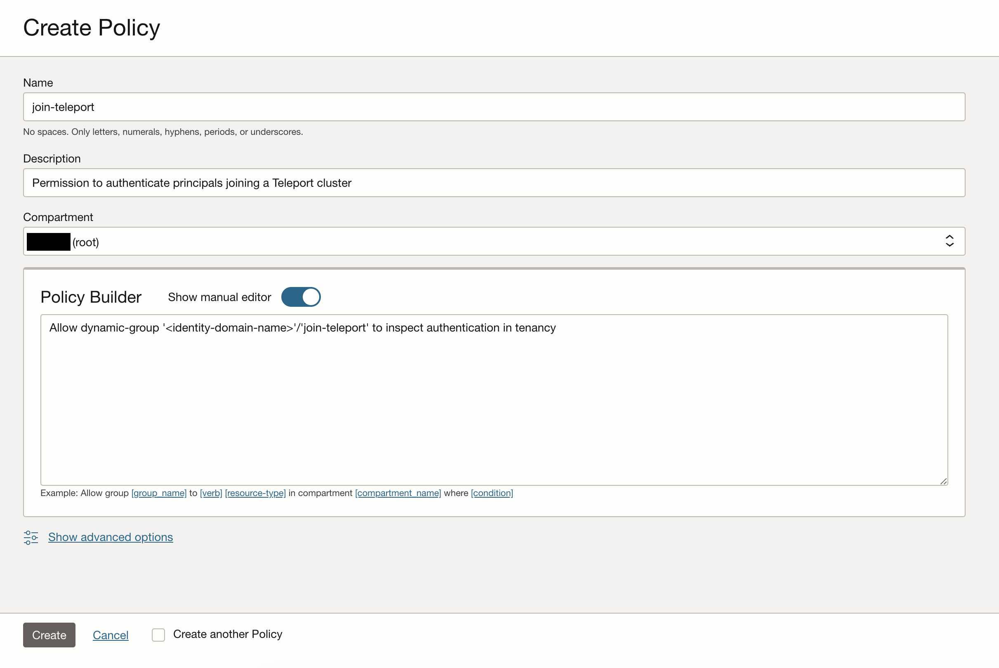

This guide will explain how to use the **Oracle join method** to configure
Teleport processes to join your Teleport cluster without sharing any secrets
when they are running in an Oracle Cloud Infrastructure (OCI) Compute instance.

The Oracle join method is available to any Teleport process running on an
OCI Compute instance.

## Prerequisites

(!docs/pages/includes/edition-prereqs-tabs.mdx version="17.3.0"!)

- An OCI Compute instance to host a Teleport service.
- (!docs/pages/includes/tctl.mdx!)

## Step 1/5. Create the Oracle joining token

Configure your Teleport Auth Service with a special dynamic token which will
allow services from your OCI tenants to join your Teleport cluster.

Under the hood, services will prove that they are running in your OCI
tenant by sending a presigned self-authentication request to the OCI API
for the Auth Service to execute.

Create the following `token.yaml` file with an `oracle.allow` rule specifying
the Oracle tenant(s), compartment(s), and region(s) in which your OCI
Compute instances will run:

(!docs/pages/includes/provision-token/oracle-spec.mdx!)

Run the following command to create the token:

```code
$ tctl create token.yaml
```

## Step 2/5. Configure permissions

Every OCI Compute instance needs permission to authenticate itself with the
Oracle Cloud API so the presigned request can succeed.

### Create a dynamic group

In the OCI console, navigate to
[Identity/Domains](https://cloud.oracle.com/identity/domains).
Select your domain, then select **Dynamic groups**. Click **Create dynamic group**.
Create a group with the following matching rule, using the OCID of the
compartment your instance is in:
```code
Any {instance.compartment.id = '<Var name="compartment-id" />'}
```


<Notice type="tip">

To minimize unnecessary permissions, configure your matching rules to match
the rules in the token created in step 1.

</Notice>

### Add policy to group

In the OCI console, navigate to
[Identity/Domains/Policy](https://cloud.oracle.com/identity/domains/policies).
Click **Create Policy**. Create the following policy, using the name of the
selected identity domain:
```code
Allow dynamic-group '<Var name="identity-domain" />'/'join-teleport' to inspect authentication in tenancy
```



## Step 3/5. Install Teleport

Install Teleport on your OCI Compute instance.

(!docs/pages/includes/install-linux.mdx!)

## Step 4/5. Configure your services

The Oracle join method can be used for Teleport processes running the SSH (`Node`), Proxy,
Kubernetes, Application, Database, or Windows Desktop Services. The Teleport
process should be run directly on an OCI Compute instance.

Configure your Teleport process with a custom `teleport.yaml` file. Use the
`join_params` section with `token_name` matching your token created in Step 1
and `method: oracle` as shown in the following example config:

```yaml
# /etc/teleport.yaml
version: v3
teleport:
  join_params:
    token_name: oracle-token
    method: oracle
  proxy_server: https://teleport.example.com:443
ssh_service:
  enabled: yes
auth_service:
  enabled: no
proxy_service:
  enabled: no
```

## Step 5/5. Launch your Teleport process

(!docs/pages/includes/start-teleport.mdx!)

Once you have started Teleport, confirm that your service is able to connect to
and join your cluster.