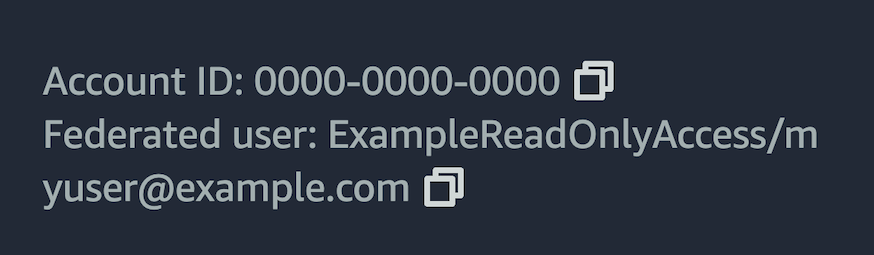

Teleport integrates with AWS IAM Roles Anywhere to provide AWS Console and CLI access.
This allows you to take advantage of Teleport role-based access controls, just-in-time Access Requests and other Teleport Zero Trust Access and Identity Governance capabilities to manage access to your AWS infrastructure.

If you're already using AWS IAM Roles Anywhere and looking to protect access to your AWS environment with Teleport, while ensuring full compatibility with all AWS API based tooling (such as CLI tools or terraform), this guide provides a recommended way for you to do that.
If you're looking to provide AWS CLI access to your users with audit capture by going through Teleport proxy, or Roles Anywhere are not adopted at your organization, take a look at the guide for [agent-based AWS access](aws-console.mdx) instead.

This guide will explain how to:

- Configure AWS Console and CLI access with Teleport using Roles Anywhere
- Access the AWS Management Console
- Access the AWS Command Line Interface (CLI)
- Access applications using AWS SDKs

## How it works

Teleport uses AWS IAM Roles Anywhere to issue temporary credentials for assuming target IAM roles.

Access is managed through Teleport's RBAC policies, ensuring credentials are only generated for authorized users and roles.
No additional service is required, as it runs in the control plane (Proxy Service and Auth Service).

For web console access, you can navigate to the resources page in Teleport Web UI and click on the AWS Application which is named after the Roles Anywhere profile.

For CLI and SDK based access, you must use `tsh` to obtain AWS credentials.

## Prerequisites

(!docs/pages/includes/edition-prereqs-tabs.mdx!)

- (!docs/pages/includes/tctl.mdx!)
- Permissions in AWS to:
  - create IAM Roles Anywhere trust anchor
  - create IAM Roles Anywhere profiles
  - create IAM roles
- `aws` command line interface (CLI) tool in PATH. Read the AWS documentation to
  [install or update the latest version of the AWS
  CLI](https://docs.aws.amazon.com/cli/latest/userguide/cli-chap-install.html).

## Step 1/4. Configure AWS IAM Roles Anywhere integration

In this section, you will configure AWS IAM resources to allow Teleport to issue AWS credentials.

Navigate to the Teleport Web UI, click on Enroll New Resource in the Resources listing page, and follow the guide after clicking on AWS CLI/Console Access tile.

<details>
  <summary>Manually configure the integration</summary>

  You will create the following resources in AWS:

  | Name                                 | Resource                        | Function                                                                                  |
  |--------------------------------------|---------------------------------|-------------------------------------------------------------------------------------------|
  | `TeleportRolesAnywhereIntegrationCA` | IAM Roles Anywhere trust anchor | Allow access from Teleport into AWS.                                                      |
  | `TeleportRolesAnywhereProfileSync`   | IAM role                        | Allows Teleport to iterate over AWS Roles Anywhere profiles and import them as resources. |
  | `TeleportRolesAnywhereProfileSync`   | IAM Roles Anywhere profile      | Allows access to `TeleportRolesAnywhereProfileSync` IAM role.                             |

  ### Create an IAM Roles Anywhere Trust Anchor

  First, you will create an IAM Roles Anywhere Trust Anchor which trusts the Teleport's AWS Roles Anywhere CA.

  1. Obtain the Teleport certificate:
     ```code
     $ tctl auth export --type awsra
     -----BEGIN CERTIFICATE-----
     MIIDqjCCApKgAwIBAgIQMIK8/WiQ/rUOrjlmB0IHVTANBgkqhkiG9w0BAQsFADBv
     ...
     -----END CERTIFICATE-----
     ```
  1. Navigate to [Create a trust anchor](https://console.aws.amazon.com/rolesanywhere/home/trust-anchors/create) page.
    Name the trust anchor `TeleportRolesAnywhereIntegrationCA` and add the Teleport's `awsra` CA certificate you obtained in the previous step as an External certificate bundle.
  1. Copy the Trust Anchor ARN <Var name="Trust Anchor ARN" />

  ### Set up Profile Sync

  Next, you will create the required AWS resources to enable the profile sync.

  1. Navigate to [Create Role](https://console.aws.amazon.com/iam/home?#/roles/create) and create a new IAM role called `TeleportRolesAnywhereProfileSync`.
    Trust policy must include the Roles Anywhere service principal:
    ```json
    {
        "Version": "2012-10-17",
        "Statement": [
            {
                "Effect": "Allow",
                "Principal": {
                    "Service": "rolesanywhere.amazonaws.com"
                },
                "Action": [
                    "sts:AssumeRole",
                    "sts:SetSourceIdentity",
                    "sts:TagSession"
                ]
            }
        ]
    }
    ```
  1. Copy the IAM role ARN <Var name="Role ARN" />
  1. Navigate to the [TeleportRolesAnywhereProfileSync Role](https://console.aws.amazon.com/iam/home?#/roles/details/TeleportRolesAnywhereProfileSync) and create a new inline policy:
    ```json
    {
        "Version": "2012-10-17",
        "Statement": [
            {
                "Sid": "RolesAnywhereProfileSync",
                "Effect": "Allow",
                "Action": [
                    "rolesanywhere:ListProfiles",
                    "rolesanywhere:ListTagsForResource",
                    "rolesanywhere:ImportCrl",
                    "iam:GetRole"
                ],
                "Resource": [
                    "*"
                ]
            }
        ]
    }
    ```

  1. Now, navigate to the [Create a Profile](https://console.aws.amazon.com/rolesanywhere/home/profiles/create) page and name it `TeleportRolesAnywhereProfileSync`.
    Add the role created in the last step (`TeleportRolesAnywhereProfileSync`) and create the Profile.
  1. Copy the Profile ARN <Var name="Profile ARN" />

  ### Create a Teleport AWS IAM Roles Anywhere integration
  Now that the required AWS resources are created, you can create a Teleport AWS IAM Roles Anywhere integration.

  1. Write the following contents to a file called `roles-anywhere-integration.yaml`:
    ```yaml
    kind: integration
    sub_kind: aws-ra
    version: v1
    metadata:
      name: <Var name="Integration Name" />
    spec:
      aws_ra:
        trust_anchor_arn: <Var name="Trust Anchor ARN" />
        profile_sync_config:
          enabled: true
          profile_arn: <Var name="Profile ARN" />
          role_arn: <Var name="Role ARN" />
    ```

  1. Create the integration with the following command:
    ```code
    $ tctl create -f roles-anywhere-integration.yaml
    ```

  Teleport will now start syncing AWS IAM Roles Anywhere profiles as AWS applications, every 5 minutes.
</details>

## Step 2/4. Create an AWS IAM Roles Anywhere profile and assign IAM roles

Now, you will create an example profile and role so that you can test the integration.

If you are already leveraging AWS IAM Roles Anywhere profiles, you can skip this step.

1. Navigate to [Create role](https://console.aws.amazon.com/iam/home?#/roles/create) and create a new IAM role called `ExampleReadOnlyAccess`.
  Trust policy must include the Roles Anywhere service principal:
  ```json
  {
      "Version": "2012-10-17",
      "Statement": [
          {
              "Effect": "Allow",
              "Principal": {
                  "Service": "rolesanywhere.amazonaws.com"
              },
              "Action": [
                  "sts:AssumeRole",
                  "sts:SetSourceIdentity",
                  "sts:TagSession"
              ]
          }
      ]
  }
  ```

  Add the AWS-managed `ReadOnlyAccess` policy to the role.
  Copy the role ARN <Var name="Read Only Role ARN" />.

1. Now, navigate to [Create a Profile](https://console.aws.amazon.com/rolesanywhere/home/profiles/create) page and name it `ExampleReadOnlyAccess`.
  Add the role created in the last step (`ExampleReadOnlyAccess`) and create the Profile.
  
  Copy the Profile ARN <Var name="Read Only Profile ARN" />.

## Step 3/4. Set up access
Now you need to grant your users access to the imported AWS profiles/roles.
You will create a Teleport role which will grant access to the `ExampleReadOnlyAccess` Profile and associated IAM role.

  <Tabs>
    <TabItem label="Web UI">
    Open your Teleport cluster Web UI, select the "Zero Trust Access" and then "Roles".

    Click the "Create New Role" button, set the role name to `aws-ro-access`.
    Next, add an Application Access entry, in the Resources section, with the following:
    - Labels: `teleport.dev/aws-roles-anywhere-profile-arn': '<Var name="Read Only Profile ARN" />'`
    - AWS Role ARNs: <Var name="Read Only Role ARN" />

    Proceed to the next steps and create the role.
    </TabItem>

    <TabItem label="Via tctl">
      1. Create a file named `example-read-only-access-role.yaml` with the following contents:
        ```yaml
        kind: role
        version: v8
        metadata:
          name: aws-ro-access
        spec:
          allow:
            app_labels:
              'teleport.dev/aws-roles-anywhere-profile-arn': '<Var name="Read Only Profile ARN" />'
            aws_role_arns:
            - <Var name="Read Only Role ARN" />
        ```

      1. Create the role with the following command:
        ```code
        $ tctl create -f example-read-only-access-role.yaml
        ```
    </TabItem>
  </Tabs>

Assign the Role to the users you want to allow access. You can also assign it to an [Access List](../../../identity-governance/access-lists/guide.mdx) or use it in conjunction with [Access Requests](../../../identity-governance/access-requests/access-requests.mdx).

## Step 4/4. Access AWS resources

Now that you have configured the Integration and set up the Role, users can access AWS resources through Teleport.

### Access AWS Management Console

1. Visit the home page of the Teleport Web UI and click **Resources**.
   If the Integration found any profiles as expected, the Web UI will display the name of the Profile.
   If you don't see any profiles, see the [Troubleshooting](#troubleshooting) section.

1. Click the **Launch** button for the AWS Console application, then click on the role you would like to assume when signing in to the AWS Console:

   

1. You will get redirected to the AWS Management Console, signed in with the selected role.
   You should see your Teleport user name as a federated login assigned to `ExampleReadOnlyRole` in the top-right corner of the AWS Console:

   

### Access AWS using AWS CLI or other AWS SDK based tools

#### Obtain the credentials
On your desktop, log into the AWS App Profile that was synced:

```code
$ tsh apps login --aws-role arn:aws:iam::278576220453:role/ExampleReadOnlyAccess example-read-only-access
Logged into AWS app "example-read-only-access".

Your IAM role:
    arn:aws:iam::123456789012:role/ExampleReadOnlyAccess

Example AWS CLI commands:
    aws --profile example-read-only-access s3 ls
    AWS_PROFILE=example-read-only-access aws s3 ls
```

#### Access AWS using AWS CLI
You can now access all your AWS resources from the command line using the `aws` command line tool.

You need to pass the `--profile` flag or export the `AWS_PROFILE` environment variable with the name of the profile you created earlier.

```code
$ aws --profile example-read-only-access s3 ls
...
```

#### Access AWS from Terraform
Using Terraform requires you to set the profile in the provider.
```hcl
provider "aws" {
  profile = "example-read-only-access"
  // ...
}
```

Setting the `AWS_PROFILE` environment variable is also an option.

## Troubleshooting

Read this section if you run into issues while following this guide.

### Missing Profiles in Resources page
If you don't see the expected AWS profiles in the Teleport Web UI, check the following:

1. Ensure the profile sync configuration is enabled and the `profile_name_filters` are set accordingly (set it to `*` if you want to import all the profiles):

   ```code
   $ tctl get integration/<Var name="Integration Name" />
   ...
   spec:
     aws_ra:
       profile_sync_config:
         enabled: true
         profile_arn: arn:aws:rolesanywhere:eu-west-2:123456789012:profile/5c659b8f-7ca3-48ef-a1aa-14c9c93506ee
         profile_name_filters:
         - MarcoRA-*
         role_arn: arn:aws:iam::123456789012:role/TeleportRolesAnywhereProfileSync
       trust_anchor_arn: arn:aws:rolesanywhere:eu-west-2:123456789012:trust-anchor/69a0c3f8-3157-49b2-85dd-75bdef828a68
   ```

1. You can get the integration status summary by running the following command:

   ```code
   $ tctl get integration/<Var name="Integration Name" />
   ...
   status:
     aws_ra:
       last_profile_sync:
         end_time: "2025-07-23T15:46:27.475629Z"
         error_message: ""
         start_time: "2025-07-23T15:46:26.334536Z"
         status: SUCCESS
         synced_profiles: 4
   ```

   Look for any error message you might have.

1. Ensure that your Teleport role allows you access to all the expected profiles.
   AWS app resources have a specific label which you can use to control access: `teleport.dev/aws-roles-anywhere-profile-arn`.
   Set it to `*` to allow access to all profiles, like so:

   ```yaml
   kind: role
   spec:
     allow:
       app_labels:
         'teleport.dev/aws-roles-anywhere-profile-arn': '*'
   ```

## Next steps

Now that you know how to set up Teleport to protect access to the AWS Management Console and APIs, you can tailor your setup to the needs of your organization.

### Refine your AWS IAM role mapping

The `aws_role_arns` field supports template variables so they can be populated dynamically when a user authenticates to Teleport.

For example, you can configure your identity provider to define a SAML attribute or OIDC claim called `aws_role_arns`, then use this field to list each user's permitted AWS role ARNs on your IdP.
If you define a Teleport role to mention the `{{external.aws_role_arns}}` variable, the Auth Service will fill in the user's permitted ARNs based on data from the IdP:

```yaml
    aws_role_arns:
    - {{external.aws_role_arns}}
```

See the [Access Controls Reference](../../../reference/access-controls/roles.mdx) for all of the variables and functions you can use in the `aws_role_arns` field.

### Create Roles to grant access to a specific profile and IAM roles

You can create multiple Teleport roles to grant access to the profiles and IAM roles for each Profile.

See [Role Access Requests](../../../identity-governance/access-requests/role-requests.mdx) to learn more about creating Roles and how to access them using Access Requests.
