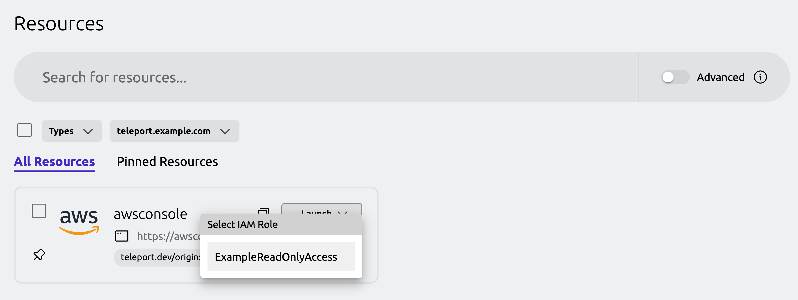
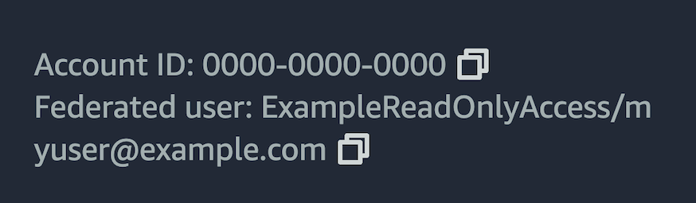
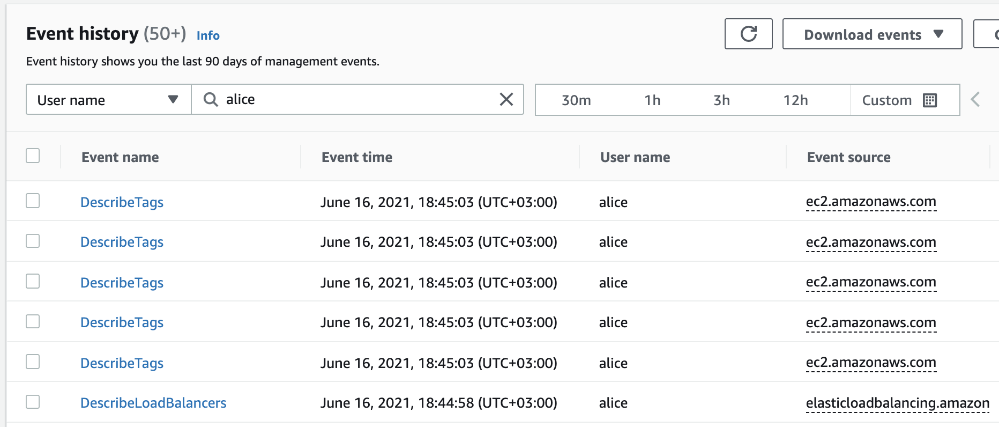

You can protect the AWS Management Console and AWS APIs with Teleport. This
makes it possible to manage access to AWS infrastructure with Teleport features
like Access Requests, Access Lists, and identity locking. You can also configure
Teleport to provide different levels of AWS access automatically when users
authenticate using your single sign-on solution.

This guide will explain how to:

- Access the AWS Management Console through Teleport.
- Access the AWS Command Line Interface (CLI) through Teleport.
- Access applications using AWS SDKs through Teleport.

In this setup, the Teleport Application Service has an AWS IAM role that can
assume one or more target IAM roles. Teleport users access the AWS Management
Console and APIs through the Teleport Web UI and `tsh`. When a user visits the
AWS Management Console or executes a command with an AWS client application, the
Teleport Application Service checks the user's RBAC permissions and, if they are
authorized, forwards the user's requests to AWS. 

## Prerequisites

(!docs/pages/includes/edition-prereqs-tabs.mdx!)

- (!docs/pages/includes/tctl.mdx!)

- An AWS EC2 instance or Elastic Kubernetes Service (EKS) cluster where you will
  run the Teleport Application Service. EC2 instances must be running a Linux
  distribution. We recommend starting with a fresh demo instance or EKS cluster
  to get familiar with the procedure before following this guide in production.

- Permissions to create IAM roles and policies in the AWS account you want to
  connect.

- `aws` command line interface (CLI) tool in PATH. Read the AWS documentation to
  [install or update the latest version of the AWS
  CLI](https://docs.aws.amazon.com/cli/latest/userguide/cli-chap-install.html).

- If you plan to run the Teleport Application Service on EKS, you will need an
  IAM OIDC provider running in your Kubernetes cluster. See the [AWS
  documentation](https://docs.aws.amazon.com/eks/latest/userguide/enable-iam-roles-for-service-accounts.html)
  for how to create an IAM OIDC provider.

  To check whether you have an IAM OIDC provider running in your cluster, run
  the following `aws` command, assigning <Var name="eks-region" /> to the
  region where your EKS cluster is running and <Var name="cluster-name" /> to
  the name of your Kubernetes cluster:

  ```code
  $ aws --region=<Var name="eks-region" /> eks describe-cluster --name <Var name="cluster-name"/> --query "cluster.identity.oidc.issuer" --output text
  ```

  If you have an IAM OIDC provider associated with your cluster, this command
  will print its ID.

## Step 1/4. Configure AWS IAM

In this section, you will configure AWS IAM resources to allow the Teleport
Application Service to proxy AWS APIs.

The rest of the guide assumes that you are protecting access to an IAM role
called `ExampleReadOnlyAccess`, which allows read-only access to AWS resources
through the AWS-managed `ReadOnlyAccess` policy. We recommend following this
guide in a demo environment with the `ExampleReadOnlyAccess` role, and
protecting production AWS roles when you are familiar with the procedure.

You will create the following resources:

|Name | Resource | Function                                   |
|---|----------|--------------------------------------------|
|`ExampleReadOnlyAccess`| IAM role | Example role to protect access to with Teleport. |
|`TeleportAWSAccess`|IAM role|Allows the Application Service to assume other roles in order to proxy user requests to AWS.|
|`AssumeRole`|IAM policy|Allows the Application Service to assume other roles in order to proxy user requests to AWS.|
|`TeleportAWSAccess` (for EC2 deployments) |EC2 instance profile|Associates the `TeleportAWSAccess` role with your EC2 instance.|

### Create a role for the Teleport Application Service

In this section, you will create an IAM role that allows the Teleport
Application Service to assume other IAM roles in order to proxy user traffic to
AWS APIs.

1. Define a trust policy to enable the Teleport Application Service to assume
   the role you will create. 

   <Tabs>
   <TabItem label="EC2">

   Create a file called `app-service-tp.json`:

   ```json
   {
     "Version": "2012-10-17",
     "Statement": [
       {
         "Effect": "Allow", 
         "Principal": {
           "Service": "ec2.amazonaws.com"
         },
         "Action": "sts:AssumeRole"
       }
     ]
   }
   ```

   </TabItem>
   <TabItem label="EKS">

   Retrieve your OIDC issuer ID, assigning <Var name="cluster-name" /> to the name
   of your EKS cluster and <Var name="eks-region" /> to the AWS region where your
   EKS cluster is running:
   
   ```code
   $ aws --region=<Var name="eks-region" /> eks describe-cluster --name <Var name="cluster-name"/> --query "cluster.identity.oidc.issuer" --output text | grep -Eo "[A-Z0-9]+$"

   AAAAAAAAAAAAAAAAAAAAAAAAAAAAAAAA
   ```
   
   Create a file called `app-service-tp.json` with the following content,
   assigning <Var name="oidc-issuer" /> to the issuer string you retrieved and
   <Var name="EKS_ACCOUNT" /> to the ID of the AWS account that belongs to your
   EKS cluster:
   
   ```json
   {
       "Version": "2012-10-17",
       "Statement": [
           {
               "Effect": "Allow",
               "Principal": {
                   "Federated": "arn:aws:iam::<Var name="EKS_ACCOUNT" />:oidc-provider/oidc.eks.<Var name="EKS_REGION" />.amazonaws.com/id/<Var name="OIDC_ISSUER" />"
               },
               "Action": "sts:AssumeRoleWithWebIdentity",
               "Condition": {
                   "StringEquals": {
                       "oidc.eks.<Var name="EKS_REGION" />.amazonaws.com/id/<Var name="OIDC_ISSUER" />:aud": "sts.amazonaws.com",
                        "oidc.eks.<Var name="EKS_REGION" />.amazonaws.com/id/<Var name="OIDC_ISSUER" />:sub": "system:serviceaccount:teleport-agent:teleport-kube-agent"

                   }
               }
           }
       ]
   }
   ```

   Later in this guide, we will install a Helm chart to deploy the Teleport
   Application Service. The chart assigns the Teleport pod to a service account
   called `teleport-kube-agent`. This trust policy authorizes workloads with
   this service account in the `teleport-agent` namespace to assume the IAM role
   we create in this section.

   </TabItem>
   </Tabs>

1. Create a role for the Teleport Application Service:

   ```code
   $ aws iam create-role --role-name "TeleportAWSAccess" \
   --assume-role-policy-document file://app-service-tp.json
   ```

1. Get the ARN of the `ExampleReadOnlyAccess` role:

   ```code
   $ ROLE_ARN=$(aws iam get-role --role-name ExampleReadOnlyAccess --query "Role.Arn" --output text)
   ```

1. Define an IAM policy to allow the Teleport Application Service to assume the
   `ExampleReadOnlyAccess` role:

   ```code
   $ cat<<EOF > teleport-assume-role.json
   { "Version": "2012-10-17",
     "Statement": [
       {
         "Effect": "Allow",
         "Action": "sts:AssumeRole",
         "Resource": "${ROLE_ARN}"
       }
     ]
   }
   EOF

   $ POLICY_ARN=$(aws iam create-policy --policy-name=AssumeExampleReadOnlyRole \
   --policy-document file://teleport-assume-role.json | jq -r '.Policy.Arn')
   $ aws iam attach-role-policy --role-name TeleportAWSAccess \
   --policy-arn ${POLICY_ARN}
   ```

### Configure a role for Teleport users to request

In this section, you will create a role that Teleport users can request access
to when making requests to AWS APIs. The Teleport Application Service assumes
this role when proxying requests:

1. Obtain AWS credentials for the account where you will run the Teleport
   Application Service and make them available to your terminal shell.

1. Create a trust policy document, which authorizes an entity to assume the role
   you want to protect access to. To do so, create a file called
   `ro-access.json` with the following content, replacing <Var
   name="AWS_ACCESS_ACCOUNT" /> with the ID of the AWS account where you will
   run the Teleport Application Service:

   ```json
   {
     "Version": "2012-10-17",
     "Statement": [
       {
         "Effect": "Allow",
         "Principal": {
           "AWS": "arn:aws:iam::<Var name="AWS_ACCESS_ACCOUNT" />:role/TeleportAWSAccess"
         },
         "Action": "sts:AssumeRole"
       }
     ]
   }
   ```

   In the setup we show in this guide, the Teleport Application Service assumes
   the `TeleportAWSAccess` role, then uses that role to assume the
   `ExampleReadOnlyAccess` role. With the trust policy above, AWS authorizes
   this operation.

   <Details title="Cross-account access">

   If you are configuring the Application Service to proxy access to IAM roles
   in another AWS account, we recommend checking the external ID of the AWS
   account where the Application Service runs. Add the external ID to the trust
   policy as follows, assigning <Var name="EXTERNAL_ID" /> to the external ID:

   ```json
   {
     "Version": "2012-10-17",
     "Statement": [
       {
         "Effect": "Allow",
         "Principal": {
           "AWS": "arn:aws:iam::<Var name="AWS_ACCESS_ACCOUNT" />:role/TeleportAWSAccess"
         },
         "Action": "sts:AssumeRole",
         "Condition": { 
           "StringEquals": { 
             "sts:ExternalId": "<Var name="EXTERNAL_ID" />" 
           } 
         }
       }
     ]
   }
   ```

   See the [AWS
   documentation](https://docs.aws.amazon.com/IAM/latest/UserGuide/id_roles_create_for-user_externalid.html)
   for details on external IDs.
   </Details>

1. Run the following commands to create the `ExampleReadOnlyAccess` role:

   ```code
   $ aws iam create-role --role-name "ExampleReadOnlyAccess" \
   --assume-role-policy-document file://ro-access.json
   ```

1. Get the ARN of the AWS-managed `ReadOnlyAccess` policy so you can attach it
   to your role:

   ```code
   $ ARN=$(aws iam list-policies --output text --query "Policies[?PolicyName=='ReadOnlyAccess'].Arn")
   ```

1. Attach the `ReadOnlyAccess` policy to the role:

   ```code
   $ aws iam attach-role-policy --role-name ExampleReadOnlyAccess --policy-arn $ARN
   ```

### Associate a role with the Teleport Application Service

Now that you have created a role for the Teleport Application Service, associate
the role with the service. 

<Tabs>
<TabItem label="EC2">

In this section, you will add the `TeleportAWSAccess` role to the instance
profile of the EC2 instance where you will install the Teleport Application
Service.

1. Create an instance profile:

   ```code
   $ aws iam create-instance-profile --instance-profile-name TeleportAWSAccess
   ```

1. Add the `TeleportAWSAccess` role to the profile:

   ```code
   $ aws iam add-role-to-instance-profile \
   --instance-profile-name TeleportAWSAccess \
   --role-name TeleportAWSAccess
   ```

1. Obtain the ID of the EC2 instance where you will install the Teleport
   Application Service.

1. Run the following command to associate the new instance profile with your
   instance, assigning <Var name="INSTANCE_ID" /> to your instance ID and 
   <Var name="AWS_REGION" /> to your AWS region:

   ```code
   $ aws ec2 associate-iam-instance-profile --iam-instance-profile Name="TeleportAWSAccess" \
   --instance-id <Var name="INSTANCE_ID" /> --region <Var name="AWS_REGION" />
   ```

</TabItem>
<TabItem label="EKS">

   Annotate the service account used by the Teleport Application Service to
   instruct it to assume the `TeleportAWSAccess` role:

   ```code
   $ kubectl annotate serviceaccount \
   -n teleport-agent \
   teleport-kube-agent eks.amazonaws.com/role-arn=arn:aws:iam::<Var name="EKS_ACCOUNT" />:role/TeleportAWSAccess
   ```

</TabItem>
</Tabs>

## Step 2/4. Configure Teleport IAM role mapping

In this step, you will define a Teleport role that confers access to the
`ExampleReadOnlyAccess` IAM role you created in the previous step.

1. Create a file called `aws-ro-access.yaml` with the following content,
   replacing <Var name="AWS_ACCOUNT" /> with the ID of the account where you
   created the `ExampleReadOnlyAccess` role:

   ```yaml
   kind: role
   version: v5
   metadata:
     name: aws-ro-access
   spec:
     allow:
       app_labels:
         '*': '*'
       aws_role_arns:
       - arn:aws:iam::<Var name="AWS_ACCOUNT" />:role/ExampleReadOnlyAccess
   ```
   
   The Teleport role called `aws-ro-access` enables users to visit the AWS
   Management Console or make requests to AWS APIs with the `ExampleReadOnlyAccess`
   role.

1. Create the role:

   ```code
   $ tctl create aws-ro-access.yaml
   ```

   (!docs/pages/includes/create-role-using-web.mdx!)

1. (!docs/pages/includes/add-role-to-user.mdx role="aws-ro-access"!)

## Step 3/4. Set up the Teleport Application Service

Now that you have configured RBAC resources in AWS and Teleport, the remaining
step is to launch the Teleport Application Service.

### Get a join token

Establish trust between your Teleport cluster and your new Application Service
instance by creating a join token:

```code
$ tctl tokens add --type=app --ttl=1h --format=text
(=presets.tokens.first=)
```

<Tabs>
<TabItem label="EC2">

On the host where you will install the Teleport Application Service, create a
file called `/tmp/token` that consists only of your token:

```code
$ echo <Var name="join-token" /> | sudo tee /tmp/token
```

### Install the Teleport Application Service

Run the following commands on the host where you will install the Teleport
Application Service:

(!docs/pages/includes/install-linux.mdx!)

### Configure the Teleport Application Service

1. On the host where you will run the Teleport Application Service, create a
   file at `/etc/teleport.yaml` with the following content:

   ```yaml
   version: v3
   teleport:
     join_params:
       token_name: "/tmp/token"
       method: token
     proxy_server: "<Var name="PROXY_ADDR" />"
   auth_service:
     enabled: off
   proxy_service:
     enabled: off
   ssh_service:
     enabled: off
   app_service:
     enabled: "yes"
     apps:
     - name: "awsconsole"
     # The public AWS Console is used after authenticating the user from Teleport
       uri: "https://console.aws.amazon.com/ec2/v2/home"
   ```

1. Edit `/etc/teleport.yaml` to replace <Var name="PROXY_ADDR" /> with the host
   and port of your Teleport Proxy Service or Teleport Cloud tenant, e.g.,
   `example.teleport.sh:443`.

   The `app_service` field configures the Teleport Application Service. Each
   item within `app_service.apps` is an application configuration. If self-hosting
   the Teleport cluster, you must have [DNS and a TLS certificate](../getting-started.mdx#subdomains-and-applications)
   configured for the application domain name associated with the Teleport 
   Proxy Service, e.g., `awsconsole.teleport.example.com`.

</TabItem>
<TabItem label="EKS">

1. Retrieve the join token you created earlier in this guide by running the
   following command and copy the token with the `App` type:

   ```code
   $ tctl tokens ls
   Token                             Type Labels Expiry Time (UTC)
   --------------------------------- ---- ------ ----------------------------
   (=presets.tokens.first=) App          14 Jun 23 21:21 UTC (20m15s)
   ```

1. Create a Helm values file called `values.yaml`, assigning <Var name="token"
   /> to the value of the join token you retrieved above, <Var
   name="example.teleport.sh:443" /> to the host **and port** of your Teleport
   Proxy Service (e.g., `teleport.example.com:443`):

   ```yaml
   authToken: <Var name="token" />
   proxyAddr: <Var name="example.teleport.sh:443" />
   roles: app
   apps:
     - name: "awsconsole"
       # The public AWS Console is used after authenticating the user from Teleport
       uri: "https://console.aws.amazon.com/ec2/v2/home"
   ```

1. (!docs/pages/includes/kubernetes-access/helm/helm-repo-add.mdx!)

1. Install the Helm chart for Teleport agent services, `teleport-kube-agent`:

   ```code
   $ helm -n teleport-agent install teleport-kube-agent teleport/teleport-kube-agent \
     --values values.yaml --create-namespace
   ```

1. Make sure that the Teleport agent pod is running. You should see one
   `teleport-kube-agent` pod with a single ready container:

   ```code
   $ kubectl -n teleport-agent get pods
   NAME                    READY   STATUS    RESTARTS   AGE
   teleport-kube-agent-0   1/1     Running   0          32s
   ```

</TabItem>
</Tabs>

Note that the URI you configure for your AWS app must start with one of the
following values in order to be recognized as an AWS console:

| Regions                   | AWS Console URL |
| ------------------------- | --------------- |
| Standard AWS regions      | `https://console.aws.amazon.com` |
| AWS GovCloud (US) regions | `https://console.amazonaws-us-gov.com` |
| AWS China regions         | `https://console.amazonaws.cn` |

<Details title="Multiple AWS accounts">

If you have multiple AWS accounts and would like to logically separate them
in the UI, register an application entry for each and set `aws_account_id`
label to the account ID:

```yaml
app_service:
  enabled: "yes"
  apps:
  - name: "awsconsole-test"
    uri: "https://console.aws.amazon.com/ec2/v2/home"
    labels:
      aws_account_id: "1234567890"
      env: test
  - name: "awsconsole-prod"
    uri: "https://console.aws.amazon.com/ec2/v2/home"
    labels:
      aws_account_id: "0987654321"
      env: prod
  - name: "awsconsole-third-party"
    uri: "https://console.aws.amazon.com/ec2/v2/home"
    labels:
      aws_account_id: "1234554321"
    aws:
      external_id: "example-external-id"
```

When showing available IAM roles, Teleport will display only role ARNs that
belong to the specific account.

For AWS accounts that require external IDs for accessing their resources, set
the `external_id` field, which the Application Service uses when assuming the
AWS roles in these accounts.

</Details>

### Start the Teleport Application Service

If you deployed the Teleport Application Service on Kubernetes, it will have
already started, and you can skip to [Step 4](#step-44-access-aws-resources).

1. (!docs/pages/includes/aws-credentials.mdx service="the Application Service"!)
1. (!docs/pages/includes/start-teleport.mdx service="the Application Service"!)

<Admonition type="warning" title="non-standard AWS regions">
For non-standard AWS regions such as AWS GovCloud (US) regions and AWS China
regions, set the corresponding region in the `AWS_REGION` environment variable
or in the AWS credentials file so that the Application Service can use the
correct STS endpoint.
</Admonition>

## Step 4/4. Access AWS resources

Now that you have configured the Teleport Application Service to proxy requests
to AWS, users can access AWS resources through Teleport.

### Access the AWS console

1. Visit the home page of the Teleport Web UI or click the **Resources** tab. If
   the Teleport Application Service is proxying the AWS Management Console as
   expected, the Web UI will display the name of the application you registered,
   which this guide assumes is `awsconsole`. (Enter the name of the application
   into the search box if there are too many resources to view all of them at
   once.)

1. Click the **Launch** button for the AWS Console application, then click on
   the role you would like to assume when signing in to the AWS Console:

   

1. You will get redirected to the AWS Management Console, signed in with the
   selected role. You should see your Teleport user name as a federated login
   assigned to `ExampleReadOnlyRole` in the top-right corner of the AWS Console:

   

### Access the AWS CLI

1. On your desktop, log into the AWS Management Console app you configured while
   following this guide:

   ```code
   $ tsh apps login --aws-role ExampleReadOnlyAccess awsconsole
   Logged into AWS app "awsconsole".
   
   Your IAM role:
     arn:aws:iam::000000000000:role/ExampleReadOnlyAccess
   
   Example AWS CLI command:
     tsh aws s3 ls
   
   Or start a local proxy:
     tsh proxy aws --app awsconsole
   ```

   The `--aws-role` flag allows you to specify the AWS IAM role to assume when
   accessing AWS APIs. You can either provide a role name like `--aws-role
   ExampleReadOnlyAccess` or a full role ARN like
   `arn:aws:iam::0000000000:role/ExampleReadOnlyAccess`.

1. Now you can use the `tsh aws` command like the native `aws` command-line
   tool:

   ```code
   $ tsh aws s3 ls
   ```

1. Run the following command to log out of the AWS application and remove
   credentials:

   ```code
   $ tsh apps logout awsconsole
   ```

### Access applications using AWS SDKs

1. On your desktop, log into the AWS Management Console app you configured while
   following this guide:

   ```code
   $ tsh apps login --aws-role ExampleReadOnlyAccess awsconsole
   ```

1. Open a new terminal and use the following command to start a local HTTPS
   proxy server that forwards AWS API traffic to the Teleport Application
   Service. Leave the terminal open since it runs in the foreground:

   ```code
   $ tsh proxy aws -p 23456
   Started AWS proxy on http://127.0.0.1:23456.
   
   Use the following credentials and HTTPS proxy setting to connect to the proxy:
     export AWS_ACCESS_KEY_ID=(=aws.aws_access_key=)
     export AWS_SECRET_ACCESS_KEY=(=aws.aws_secret_access_key=)
     export AWS_CA_BUNDLE=<ca-bundle-path>
     export HTTPS_PROXY=http://127.0.0.1:23456
   ```

1. Copy the `export` commands from the terminal and paste them into a new
   terminal window.

1. You can then run applications that use AWS SDKs to communicate with AWS APIs
   through the local proxy. For example, open a Python console and use the
   `boto3` client to fetch EC2 instances in your AWS account:

   ```python
   >>> import boto3
   >>> ec2 = boto3.resource('ec2')
   >>> for instance in ec2.instances.all():
   ...   print(instance.id)
   ...   
   ```

   It is important to check how AWS credentials and HTTPS proxy setting can be
   configured for your application. For example, command line tools like
   `terraform` and `eksctl` support setting AWS credentials and the HTTPS proxy
   using environment variables, as shown above.
   
   However, some AWS SDKs may require extra environment variables (e.g.
   `AWS_SDK_LOAD_CONFIG=true` for AWS SDK for Go v2) or require configuring the
   HTTPS proxy through code (e.g. AWS SDK for JavaScript).

1. To log out of the AWS application and remove credentials:

   ```code
   $ tsh apps logout awsconsole
   ```

### Use CloudTrail to see Teleport user activity

To view CloudTrail events for your federated sessions, navigate to the CloudTrail
[dashboard](https://console.aws.amazon.com/cloudtrail/home) and go to "Event history".

Each Teleport federated login session uses a Teleport username as the federated
username which you can search for to get the events history:



## Troubleshooting

Read this section if you run into issues while following this guide.

### `Internal Server Error` or fails to connect in Web UI

When visiting the AWS Management Console from the Teleport Web UI, you may see
an `InternalServer Error` message or other connection issues instead of the
AWS Management Console. 

If this happens, check the Teleport Application Service logs:

<Tabs>
<TabItem label="EC2">

Execute the following command on the EC2 instance that runs the Teleport
Application Service:

```code
$ journalctl -u teleport
```

</TabItem>
<TabItem label="EKS">

```code
$ kubectl -n teleport-agent logs statefulset/teleport-kube-agent
```

</TabItem>
</Tabs>

If the Teleport Application Service encounters an error sending a request to the
AWS API, the logs will show the error message stack trace.

Within the logs you may see a connection failure such as a i/o timeout
regarding `sts.amazonaws.com:443`. The Teleport Application Service must be able to
connect to `https://sts.amazonaws.com` and `https://signin.aws.amazon.com/federation`
to create an authorized AWS console session.

### The Application Service is not authorized to assume a role

If the Teleport Application Service fails to assume the `ExampleReadOnlyAccess`
role when a user attempts to access AWS, you will see an error message similar
to the following in the service's logs:

```text
AccessDenied: User: arn:aws:sts::000000000000:assumed-role/ROLE_NAME is not authorized to perform: sts:AssumeRole on resource: arn:aws:iam::000000000000:role/ExampleReadOnlyAccess
```

The `AccessDenied` message contains the principal assumed by the Teleport
Application Service in order to execute the `sts:AssumeRole` action. 

If the principal is the `TeleportAWSAccess` role, check the trust policy of the
`ExampleReadOnlyAccess` role to ensure that it contains that principal.

Otherwise, the Teleport Application Service is not assuming the
`TeleportAWSAccess` role as expected. Follow the instructions to [associate a
role with the Teleport Application
Service](#associate-a-role-with-the-teleport-application-service).

### `remote error: tls: bad certificate` error during SSM sessions

You may encounter the `remote error: tls: bad certificate` error when starting
System Session Manager (SSM) sessions using the `tsh aws ssm start-session` or
`tsh aws ecs execute-command` commands.

The issue is that `tsh` cannot properly proxy WebSocket connections sent by
SSM.

Please upgrade to the latest version of `tsh` where workarounds have been
implemented for `tsh aws ssm start-session` and `tsh aws ecs execute-command`.
For more information on the `tsh` workarounds, see the pull requests that
introduced them:

- [https://github.com/gravitational/teleport/pull/30510](https://github.com/gravitational/teleport/pull/30510)
- [https://github.com/gravitational/teleport/pull/33705](https://github.com/gravitational/teleport/pull/33705)

If you are using `tsh proxy aws` or if your `tsh` version does not contain the
above fixes, add the following domain to the `NO_PROXY` environment variable
before running `tsh` commands to ensure the WebSocket connections bypass `tsh`:
```code
export NO_PROXY=ssmmessages.us-west-1.amazonaws.com
```

Replace `us-west-1` with the AWS region you are accessing.

### Management Console expires in one hour

By default, your AWS Management Console session will expire when your Teleport
web session expires, with a maximum session duration of 12 hours. You can
adjust the duration of your Teleport session by modifying the `max_session_ttl`
parameter in your Teleport roles.

However, due to limitations in AWS IAM [role
chaining](https://docs.aws.amazon.com/IAM/latest/UserGuide/id_roles_terms-and-concepts.html#iam-term-role-chaining),
Management Console sessions will be restricted to one hour if Teleport is
running with temporary security credentials.

For example, if the Teleport Application Service is deployed on EKS with an IAM
role for service accounts (IRSA), or if the Teleport Application Services
assumes a web or SSO identity, the AWS Management Console session will be
limited to an hour.

In such cases, it is recommended to deploy the Application Service on an EC2
instance and attach an IAM role to it.

(!docs/pages/includes/aws-no-credential-provider.mdx service="Application"!)

## Next steps

Now that you know how to set up Teleport to protect access to the AWS Management
Console and APIs, you can tailor your setup to the needs of your organization.

### Refine your AWS IAM role mapping

The `aws_role_arns` field supports template variables so they can be populated
dynamically when a user authenticates to Teleport.

For example, you can configure your identity provider to define a SAML attribute
or OIDC claim called `aws_role_arns`, then use this field to list each user's
permitted AWS role ARNs on your IdP. If you define a Teleport role to mention
the `{{external.aws_role_arns}}` variable, the Auth Service will fill in the
user's permitted ARNs based on data from the IdP:

```yaml
    aws_role_arns:
    - {{external.aws_role_arns}}
```

See the [Access Controls
Reference](../../../reference/access-controls/roles.mdx)
for all of the variables and functions you can use in the `aws_role_arns` field.

### Register the AWS application dynamically

You can deploy a pool of Teleport agents to run the Teleport Application
Service, then enroll an AWS application in your Teleport cluster as a dynamic
resource. Read more about [dynamically registering
applications](../guides/dynamic-registration.mdx).

### Choose an alternative agent join method

This guide shows you how to use the **join token method** to enroll the Teleport
Application Service in your cluster. This is one of several available methods,
and we recommend reading the [Join Services to your Teleport
Cluster](../../agents/join-services-to-your-cluster/join-services-to-your-cluster.mdx) guide to configure the
most appropriate method for your environment.

## Further reading

- Learn more about AWS federation in the [AWS documentation](
  https://docs.aws.amazon.com/IAM/latest/UserGuide/id_roles_providers_enable-console-custom-url.html).
- Read the [AWS documentation](https://aws.amazon.com/blogs/security/how-to-use-trust-policies-with-iam-roles/) to learn more about how trust policies work.
