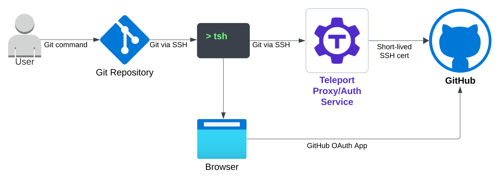
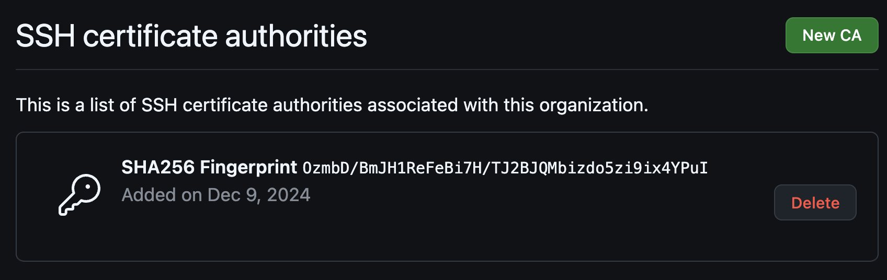

Teleport can proxy Git commands and GitHub API access for your GitHub
organizations. Two protocols are supported:

- **HTTPS (recommended)**: Proxies Git HTTPS operations and GitHub API requests
  (including the `gh` CLI). Works with any GitHub plan.
- **SSH**: Proxies Git SSH operations using short-lived SSH certificates signed
  by Teleport's CA. Requires a GitHub Enterprise Cloud account.

In this guide, you will:
- Create a GitHub App for your organization.
- Create Teleport resources for the GitHub integration.
- Configure access roles for your users.
- Run Git commands and use the GitHub CLI through Teleport.

## How it works

### HTTPS protocol

Teleport proxies HTTPS Git operations and GitHub API requests on behalf of
authenticated users. When a user runs `tsh gh` or `tsh git clone` with an
HTTPS URL, Teleport's Proxy forwards the request to GitHub using a user access
token issued by the GitHub App. The user authorizes the GitHub App once via an
OAuth flow, and Teleport stores the tokens securely on the Auth Service for
subsequent requests. Each request proxied through Teleport is logged in
Teleport's audit events with full session recording.

GitHub App permissions (configured by the admin) define the maximum set of
actions available. The user's own GitHub permissions (org membership, team
assignments, repository access) further restrict what operations succeed.

### SSH protocol

GitHub enables organizations to configure SSH Certificate Authorities (CAs) for
authentication. Teleport registers its own CA with GitHub, then signs
short-lived SSH certificates for users. Git commands route through Teleport,
which authenticates with GitHub using these certificates. No tokens are stored
for the SSH protocol -- only the user's GitHub username is needed.



## Prerequisites

(!docs/pages/includes/edition-prereqs-tabs.mdx edition="Teleport Enterprise (v17.2 or higher)"!)
- Permissions to create GitHub Apps and manage your GitHub organization's
  settings.
- (!docs/pages/includes/tctl.mdx!)
- Git locally installed.

<Admonition type="info" title="GitHub Enterprise requirement">
The SSH protocol requires a **GitHub Enterprise Cloud** account to configure SSH
certificate authorities. The HTTPS protocol works with **any GitHub plan**,
including Free and Team.
</Admonition>

## Step 1/3. Set up the integration

Choose one of the following options to set up the GitHub integration.

### Option A: Web UI guided setup (recommended)

1. Navigate to **Integrations > Enroll New Integration > GitHub Access** in the
   Teleport Web UI.

2. Enter your GitHub organization name and select which protocols to enable.
   HTTPS is recommended for most deployments.

3. Click **Create GitHub App on GitHub**. You will be redirected to GitHub where
   the app is pre-configured with default permissions (contents, issues, pull
   requests read and write).

4. Confirm app creation on GitHub and you will be redirected back to Teleport.

5. Click **Install** to install the GitHub App on your organization. During
   installation, you choose which repositories the app can access.

6. Proceed to [Step 2](#step-23-configure-access) to configure user roles.

### Option B: Manual CLI setup

#### Create a GitHub App

Go to your organization's **Developer Settings > GitHub Apps** and click
**New GitHub App**. Configure the following:

- **Homepage URL**: `https://<Var name="teleport-proxy-address"/>`
- **Callback URL**: `https://<Var name="teleport-proxy-address"/>/web/github/integration/callback`
- **Webhook**: Uncheck "Active" (not required)
- **Permissions**: For HTTPS protocol, select the permissions your developers
  need (e.g. Contents: Read & write, Issues: Read & write, Pull requests:
  Read & write). For SSH-only, no permissions are needed.

After creating the app, generate a **client secret** and note the **client ID**.

<Admonition type="tip" title="SSH-only simplification">
If you only need the SSH protocol, you can create a simpler **OAuth App**
instead of a GitHub App. The SSH flow only requires the user's GitHub username
and does not use any GitHub App permissions. GitHub App permissions only apply
to HTTPS requests.
</Admonition>

#### Create the integration resource

Create a file with the integration configuration. Replace the placeholder values
with your own:

```yaml
# github_integration.yaml
kind: integration
sub_kind: github
version: v1
metadata:
  name: github-<Var name="my-github-org"/>
spec:
  github:
    organization: <Var name="my-github-org"/>
    allow_protocols: ["ssh", "http"]
  credentials:
    id_secret:
      id: <Var name="github-app-client-id"/>
      secret: <Var name="github-app-client-secret"/>
```

Set `allow_protocols` to the protocols you want to enable. Use `["http"]` for
HTTPS-only, `["ssh"]` for SSH-only, or `["ssh", "http"]` for both.

```code
$ tctl create github_integration.yaml
```

#### Create the git server resource

```yaml
# git_server.yaml
kind: git_server
sub_kind: github
version: v2
metadata:
  name: github-<Var name="my-github-org"/>
spec:
  github:
    integration: github-<Var name="my-github-org"/>
    organization: <Var name="my-github-org"/>
    allow_protocols: ["ssh", "http"]
```

The `allow_protocols` on the git server should match the integration.

```code
$ tctl create git_server.yaml
```

#### Configure SSH certificate authority (SSH protocol only)

If you enabled the SSH protocol, export the Teleport CA and register it with
GitHub:

```code
$ tctl auth export --type github --integration github-<Var name="my-github-org"/>
```

Go to the **Authentication Security** page of your GitHub organization. Click
**New CA** under the **SSH certificate authorities** section and paste the
exported CA.



## Step 2/3. Configure access

The user role must have `github_permissions` configured to allow access to your
GitHub organization:

```yaml
# role_with_github_permissions.yaml
kind: role
metadata:
  name: github-access
spec:
  allow:
    github_permissions:
    - orgs:
      - <Var name="my-github-org"/>
version: v7
```

(!docs/pages/includes/add-role-to-user.mdx role="github-access"!)

## Step 3/3. Connect

(!docs/pages/connect-your-client/includes/tsh-git.mdx!)

## Migrating from SSH-only to HTTPS

If you have an existing SSH-only GitHub integration and want to add HTTPS
support:

1. **Create a GitHub App** on GitHub for your organization (see
   [Option B](#create-a-github-app) above for the required settings). If you
   currently use an OAuth App, you can
   [convert it to a GitHub App](https://docs.github.com/en/apps/creating-github-apps/setting-up-a-github-app/migrating-oauth-apps-to-github-apps).

2. **Update the integration** with the new credentials and protocols:
   ```code
   $ tctl edit integration/github-<Var name="my-github-org"/>
   ```
   Update `credentials.id_secret` with the GitHub App's client ID and secret,
   and set `allow_protocols` to `["ssh", "http"]`.

3. **Update the git server**:
   ```code
   $ tctl edit git_server/github-<Var name="my-github-org"/>
   ```
   Set `allow_protocols` to `["ssh", "http"]`.

4. **Users run `tsh git login`** to complete the GitHub OAuth flow for HTTPS
   access. Existing SSH access continues to work.

## Securing the OAuth callback URL

Integrations with the HTTPS protocol automatically use an authenticated
callback URL (`/web/github/integration/callback`) that requires a valid web
session. This prevents login-CSRF attacks where an attacker could trick a user
into authorizing the attacker's GitHub identity.

Legacy SSH-only integrations use the older unauthenticated callback URL
(`/v1/webapi/github/callback`). To migrate to the authenticated callback:

1. Update the callback URL in your GitHub App or OAuth App settings on GitHub
   to: `https://<Var name="teleport-proxy-address"/>/web/github/integration/callback`

2. Set the `oauth_app_callback_url` field on the integration resource:
   ```code
   $ tctl edit integration/github-<Var name="my-github-org"/>
   ```
   Add under `spec.github`:
   ```yaml
   oauth_app_callback_url: "/web/github/integration/callback"
   ```

## Further reading
- [Creating a GitHub App](https://docs.github.com/en/apps/creating-github-apps/registering-a-github-app/registering-a-github-app)
- [GitHub SSH certificate authorities](https://docs.github.com/en/enterprise-cloud@latest/organizations/managing-git-access-to-your-organizations-repositories/about-ssh-certificate-authorities)
- [Differences between GitHub Apps and OAuth Apps](https://docs.github.com/en/apps/oauth-apps/building-oauth-apps/differences-between-github-apps-and-oauth-apps)
