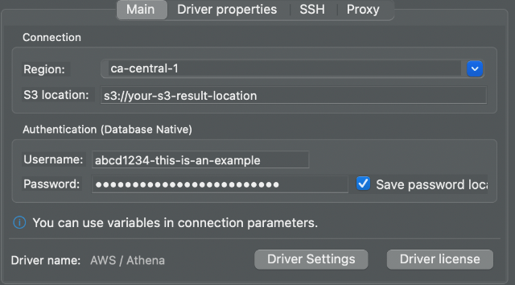

You can set up secure access to Amazon Athena using Teleport's support for the
[AWS CLI and Console](../cloud-apis/aws-console.mdx).

This guide will help you to:

- Install the Teleport Application Service.
- Set up AWS CLI and Console access.
- Connect to your Athena databases.

## Prerequisites

(!docs/pages/includes/application-access/aws-database-prerequisites.mdx database="Athena" !)

## Step 1/5. Create an IAM role for Athena access

(!docs/pages/includes/application-access/aws-database-create-iam-role.mdx database="Athena" iam-role="ExampleTeleportAthenaRole" managed-policy="AmazonAthenaFullAccess" !)

<Admonition type="note" title="Apply least-privilege permissions">
`AmazonAthenaFullAccess` may provide too much access for your intentions. To
use a different IAM policy to reduce permissions, see [Identity and access
management in
Athena](https://docs.aws.amazon.com/athena/latest/ug/security-iam-athena.html)
for more details.
</Admonition>

## Step 2/5. Configure the Teleport IAM role mapping

(!docs/pages/includes/application-access/aws-database-role-mapping.mdx role="aws-athena-access" iam-role="ExampleTeleportAthenaRole"!)

## Step 3/5. Install the Teleport Application Service

(!docs/pages/includes/application-access/aws-database-start-app-service.mdx!)

## Step 4/5. Give Teleport permissions to assume roles

(!docs/pages/includes/application-access/aws-database-agent-permission.mdx!)

## Step 5/5. Connect

Once the Application Service has started and joined the cluster, you can start
connecting to your Athena database.

### Using AWS Management Console

(!docs/pages/includes/application-access/aws-database-access-console.mdx iam-role="ExampleTeleportAthenaRole" !)

### Using AWS CLI

(!docs/pages/includes/application-access/aws-database-access-cli.mdx iam-role="ExampleTeleportAthenaRole" tsh-example="tsh aws athena list-work-groups"!)

### Using other Athena applications

First, log into the previously configured AWS app if you haven't already done
so:

```code
$ tsh apps login --aws-role ExampleTeleportAthenaRole aws
```

Connect to Athena with the ODBC or JDBC driver:

<Tabs>
  <TabItem label="Connect with ODBC">
  Start a local HTTPS proxy:
  ```code
  $ tsh proxy aws --port 8443 --format athena-odbc
  Started AWS proxy on http://127.0.0.1:8443.

  Set the following properties for the Athena ODBC data source:
  [Teleport AWS Athena Access]
  AuthenticationType = IAM Credentials
  UID = (=aws.aws_access_key=)
  PWD = (=aws.aws_secret_access_key=)
  UseProxy = 1;
  ProxyScheme = http;
  ProxyHost = 127.0.0.1;
  ProxyPort = 8443;
  TrustedCerts = <local-ca-bundle-path>

  Here is a sample connection string using the above credentials and proxy settings:
  DRIVER=Simba Amazon Athena ODBC Connector;AuthenticationType=IAM Credentials;UID=(=aws.aws_access_key=);PWD=(=aws.aws_secret_access_key=);UseProxy=1;ProxyScheme=http;ProxyHost=127.0.0.1;ProxyPort=8443;TrustedCerts=<local-ca-bundle-path>;AWSRegion=<region>;Workgroup=<workgroup>
  ```

  Use the provided connection string in your Athena application with ODBC
  driver.
  </TabItem>

  <TabItem label="Connect with JDBC">
  Start a local HTTPS proxy:
  ```code
  $ tsh proxy aws --port 8443 --format athena-jdbc
  Started AWS proxy on http://127.0.0.1:8443.

  First, add the following certificate to your keystore:
  <local-ca-bundle-path>

  For example, to import the certificate using "keytool":
  keytool -noprompt -importcert -alias teleport-aws -file <local-ca-bundle-path> -keystore <keystore>

  Then, set the following properties in the JDBC connection URL:
  User = (=aws.aws_access_key=)
  Password = (=aws.aws_secret_access_key=)
  ProxyHost = 127.0.0.1;
  ProxyPort = 8443;

  Here is a sample JDBC connection URL using the above credentials and proxy settings:
  jdbc:awsathena://User=(=aws.aws_access_key=);Password=(=aws.aws_secret_access_key=);ProxyHost=127.0.0.1;ProxyPort=8443;AwsRegion=<region>;Workgroup=<workgroup>
  ```

  Follow the printed instructions to add the local certificate to your Java
  Keystore. The default Java Keystore is usually located at:
  ```
  $ ls $(java -XshowSettings:properties -version 2>&1 | grep 'java.home' | awk '{print $3}')/lib/security/cacerts
  ```

  Then use the provided JDBC connection URL for your Athena application with
  JDBC driver.
  </TabItem>

  <TabItem label="Connect with DBeaver">
  Start a local HTTPS proxy:
  ```code
  $ tsh proxy aws --port 8443 --format athena-jdbc
  Started AWS proxy on http://127.0.0.1:8443.

  First, add the following certificate to your keystore:
  <local-ca-bundle-path>

  For example, to import the certificate using "keytool":
  keytool -noprompt -importcert -alias teleport-aws -file <local-ca-bundle-path> -keystore <keystore>

  Then, set the following properties in the JDBC connection URL:
  User = (=aws.aws_access_key=)
  Password = (=aws.aws_secret_access_key=)
  ProxyHost = 127.0.0.1;
  ProxyPort = 8443;

  Here is a sample JDBC connection URL using the above credentials and proxy settings:
  jdbc:awsathena://User=(=aws.aws_access_key=);Password=(=aws.aws_secret_access_key=);ProxyHost=127.0.0.1;ProxyPort=8443;AwsRegion=<region>;Workgroup=<workgroup>
  ```

  Note that DBeaver uses its own Java Keystore instead of the default one. For
  example, on macOS, the Keystore location is
  `/Applications/DBeaver.app/Contents/Eclipse/jre/Contents/Home/lib/security/cacerts`.

  Follow [Importing CA Certificates into
  DBeaver](https://dbeaver.com/docs/dbeaver/Managing-Truststore-Settings/#import-certificates)
  to setup the Keystore for DBeaver. Then follow the printed instruction from
  above `tsh proxy aws` command to add the local certificate to the Keystore.

  Start DBeaver and add an "Athena" connection. Enter the username (AWS access
  key) and password (AWS secret key) from the `tsh proxy aws` output:
  

  Then fill in the `ProxyHost` and `ProxyPort` settings in "Driver properties":
  

  Click "Finish". Now you can connect to your Athena database.

  </TabItem>
</Tabs>


<Admonition type="tip" title="useful environment variables">
By default, `tsh proxy aws` generates random AWS credentials for local
communication for best security and uses several placeholders in the generated
instructions. The following environment variables can be set to overwrite
those values:
- `TELEPORT_AWS_ACCESS_KEY_ID`: sets the local AWS access key.
- `TELEPORT_AWS_SECRET_ACCESS_KEY`: sets the local AWS secret key.
- `TELEPORT_AWS_REGION`: sets the AWS region.
- `TELEPORT_AWS_KEYSTORE`: sets the Java Keystore path.
- `TELEPORT_AWS_WORKGROUP`: sets the Athena workgroup name.
</Admonition>

<Admonition type="note" title="Expired local certificate">
`tsh proxy aws` generates a local certificate authority (CA) for local
communication. The local CA may expire after a new `tsh login` session and a
new CA will be generated. Make sure your Java Keystore is up-to-date by
deleting the alias from your Keystore and adding it again.
</Admonition>

To log out of the `aws` application and remove credentials:

```code
$ tsh apps logout aws
```

## Next steps
- More information on [AWS Management and API with Teleport Application Access](../../application-access/cloud-apis/aws-console.mdx).
- Learn more about [AWS service endpoints](https://docs.aws.amazon.com/general/latest/gr/rande.html).
