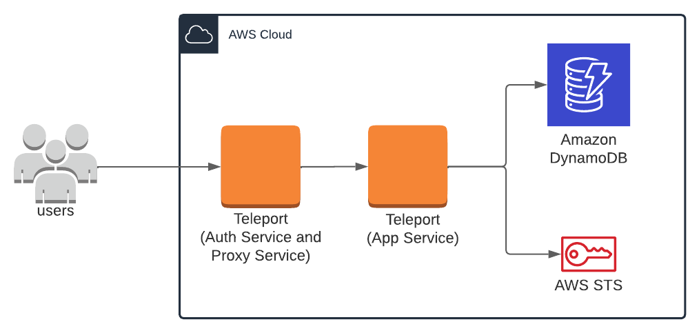
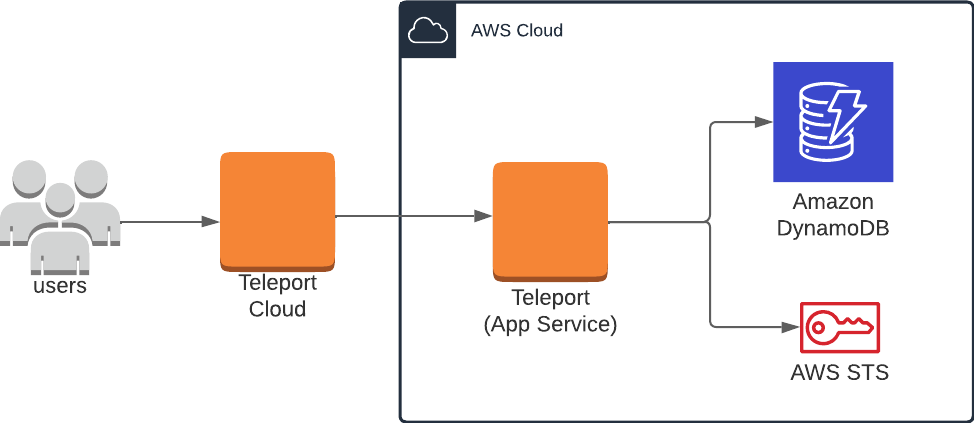

You can configure the Teleport Application Service to enable secure access to
Amazon DynamoDB.

This guide will help you to:

- Install the Teleport Application Service.
- Set up the Teleport Application Service to access the AWS Console and API.
- Connect to your DynamoDB databases through the Teleport Application Service.

<Tabs>
<TabItem scope={["oss", "enterprise"]} label="Self-Hosted">

</TabItem>
<TabItem scope={["cloud"]} label="Teleport Enterprise Cloud">

</TabItem>

</Tabs>

## How it works

The Teleport Application Service enables secure access to DynamoDB via its
[integration](../cloud-apis/aws-console.mdx) with the AWS management console and
API. This is an alternative to accessing DynamoDB through the Teleport Database
service, as described in our [Protect Amazon DynamoDB with
Teleport](../../database-access/enroll-aws-databases/aws-dynamodb.mdx) guide.

<Admonition type="warning">
The Application Service's integration with AWS is not designed specifically for
DynamoDB, while the Database Service has a purpose-built DynamoDB integration.
As a result, we recommend using the Database Service to enable secure access to
DynamoDB.

It is worth noting that the Database Service will allow you to connect with GUI
clients, whereas the Application Service does not. On the other hand, a single
Application Service configuration can access DynamoDB across regions, while
database resources must be configured for each region with DynamoDB databases.
</Admonition>

## Prerequisites

(!docs/pages/includes/application-access/aws-database-prerequisites.mdx database="DynamoDB" !)

## Step 1/5. Create an IAM role for DynamoDB access

(!docs/pages/includes/application-access/aws-database-create-iam-role.mdx database="DynamoDB" iam-role="ExampleTeleportDynamoDBRole" managed-policy="AmazonDynamoDBFullAccess" !)

<Admonition type="note" title="Apply least-privilege permissions">
`AmazonDynamoDBFullAccess` may provide too much access for your intentions. To
use a different IAM policy to reduce permissions, see [Managing access
permissions to your Amazon DynamoDB
Resources](https://docs.aws.amazon.com/amazondynamodb/latest/developerguide/access-control-overview.html) for more details.
</Admonition>

## Step 2/5. Configure the Teleport IAM role mapping

(!docs/pages/includes/application-access/aws-database-role-mapping.mdx role="aws-dynamodb-access" iam-role="ExampleTeleportDynamoDBRole"!)

## Step 3/5. Install the Teleport Application Service

(!docs/pages/includes/application-access/aws-database-start-app-service.mdx!)

## Step 4/5. Give Teleport permissions to assume roles

(!docs/pages/includes/application-access/aws-database-agent-permission.mdx!)

## Step 5/5. Connect

Once the Application Service has started and joined the cluster, you can start
connecting to your DynamoDB database.

### Using AWS Management Console

(!docs/pages/includes/application-access/aws-database-access-console.mdx iam-role="ExampleTeleportDynamoDBRole" !)

### Using AWS CLI

(!docs/pages/includes/application-access/aws-database-access-cli.mdx iam-role="ExampleTeleportDynamoDBRole" tsh-example="tsh aws dynamodb list-tables"!)

### Using other DynamoDB applications

First, log into the previously configured AWS app if you haven't already done
so:

```code
$ tsh apps login --aws-role ExampleTeleportDynamoDBRole aws
```

To connect your DynamoDB application, you can start either a local HTTPS proxy
or a local AWS Service Endpoint proxy.

<Tabs>
  <TabItem label="HTTPS proxy">
  By default, starting the AWS app proxy creates a local HTTPS proxy server
  that forwards AWS requests to the Teleport Proxy Service, enabling you to
  access AWS applications.

  Now, use the following command to start the proxy your applications will be
  connecting to:

  ```code
  $ tsh proxy aws -p 23456
  Started AWS proxy on http://127.0.0.1:23456.

  Use the following credentials and HTTPS proxy setting to connect to the proxy:
    AWS_ACCESS_KEY_ID=(=aws.aws_access_key=)
    AWS_SECRET_ACCESS_KEY=(=aws.aws_secret_access_key=)
    AWS_CA_BUNDLE=<local-ca-bundle-path>
    HTTPS_PROXY=http://127.0.0.1:23456
  ```

  Use the displayed AWS credentials and HTTPS proxy settings when configuring
  your application.

  For example, you can assign the AWS credentials and the HTTPS proxy address
  to environment variables for Python AWS SDK:

  ```code
  $ export AWS_ACCESS_KEY_ID=(=aws.aws_access_key=)
  $ export AWS_SECRET_ACCESS_KEY=(=aws.aws_secret_access_key=)
  $ export AWS_CA_BUNDLE=<local-ca-bundle-path>
  $ export HTTPS_PROXY=http://127.0.0.1:23456
  $ python3
  >>> import boto3
  >>> boto3.client('dynamodb').list_tables()
  {'TableNames': ['my-dynamodb-table'], 'ResponseMetadata': {...}}

  ```

  </TabItem>
  <TabItem label="AWS Service Endpoint proxy">
  If your application cannot use a HTTPS proxy, start the AWS app proxy with
  the `--endpoint-url` flag to create a local server that can be used as an
  AWS Service Endpoint.

  ```code
  $ tsh proxy aws --endpoint-url -p 23457
  Started AWS proxy which serves as an AWS endpoint URL at https://localhost:23457

  In addition to the endpoint URL, use the following credentials to connect to the proxy:
    AWS_ACCESS_KEY_ID=(=aws.aws_access_key=)
    AWS_SECRET_ACCESS_KEY=(=aws.aws_secret_access_key=)
    AWS_CA_BUNDLE=<local-ca-bundle-path>
  ```

  For example, to connect the GUI tool `dynamodb-admin` to the local AWS
  Service Endpoint proxy:
  ```code
  $ export AWS_ACCESS_KEY_ID=(=aws.aws_access_key=)
  $ export AWS_SECRET_ACCESS_KEY=(=aws.aws_secret_access_key=)
  $ export NODE_EXTRA_CA_CERTS=<local-ca-bundle-path>
  $ export DYNAMO_ENDPOINT=https://127.0.0.1:23457
  $ dynamodb-admin
  database endpoint:     https://127.0.0.1:23457
  region:                ca-central-1
  accessKey:             <access-key-id>

  dynamodb-admin listening on http://localhost:8001 (alternatively http://0.0.0.0:8001)
  ```

  </TabItem>
</Tabs>
To log out of the `aws` application and remove credentials:

```code
$ tsh apps logout aws
```

## Next steps
- More information on [protecting AWS Console with Teleport](../../application-access/cloud-apis/aws-console.mdx).
- Learn more about [AWS service endpoints](https://docs.aws.amazon.com/general/latest/gr/rande.html).

