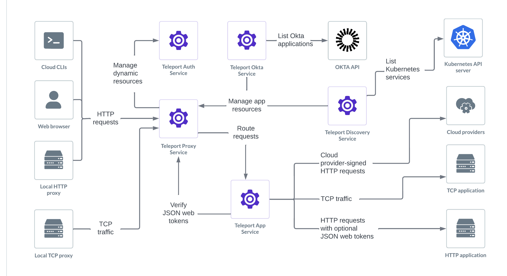

Teleport can provide secure access to applications and cloud provider APIs.

Examples include: 

- The AWS and GCP management consoles.
- The `aws`, `gcloud`, `gsutil`, and `az` CLIs.
- Applications configured for single sign-on through Okta.
- Internal control panels.
- Tools, such as wikis, that are available only when connected to a VPN.
- Infrastructure dashboards, such as Kubernetes or Grafana.
- Developer tools, such as Jenkins, GitLab, or Opsgenie.

If you are running applications on Kubernetes, you can [enroll them in your
Teleport cluster automatically](../auto-discovery/kubernetes-applications/kubernetes-applications.mdx).

Teleport protects applications through the Teleport Application Service, which
is a Teleport Agent service. For more information on agent services, read
[Teleport Agent Architecture](../../reference/architecture/agents.mdx). You can also learn
how to deploy a [pool of Teleport Agents](../agents/introduction.mdx) to run
multiple agent services.

## Getting started

Learn how to register an application with Teleport in our [getting started
guide](./getting-started.mdx).

## Cloud provider APIs

You can use Teleport to provide secure access to your cloud provider's APIs.
This means that you can prevent unauthorized usage of management consoles and
CLI tools with the same RBAC system you use to protect your infrastructure.

- [AWS Console and CLI Applications](./cloud-apis/aws-console.mdx): How to access
  AWS Management Console, AWS CLI, and AWS SDKs with Teleport.
- [Google Cloud Web Console](../../admin-guides/access-controls/idps/saml-gcp-workforce-identity-federation.mdx): How to access the Google Cloud web console with Teleport.
- [Google Cloud CLI Applications](./cloud-apis/google-cloud.mdx): How to access
  Google Cloud CLI applications and SDKs with Teleport.
- [Azure CLI Applications](./cloud-apis/azure.mdx): How to access Azure CLI
  applications and SDKs with Teleport.

## Internal applications

You can use Teleport to enable secure access to internal applications. For
example, a load balancer might display network telemetry through a control panel
but might lack the ability to authenticate with and be accessed by resources
outside your private network.

Teleport lets team members access these resources securely, even outside a
private network, with no shared secrets.

These guides explain how to protect internal applications with Teleport:

- [Web App Access](./guides/connecting-apps.mdx): How to access web apps with Teleport.
- [TCP App Access](./guides/tcp.mdx): How to access plain TCP apps with Teleport.
- [API Access](./guides/api-access.mdx): How to access REST APIs with Teleport.
- [Dynamic Registration](./guides/dynamic-registration.mdx): Register/unregister apps without restarting Teleport.
- [Interactive Lab](https://goteleport.com/labs/): Try Teleport using our guided Teleport application access lab.

## Teleport-signed JSON Web Tokens

These guides explain how web apps registered with Teleport can use
Teleport-signed JSON web tokens to implement authentication and authorization.

- [Introduction](./jwt/introduction.mdx): Introduction to JWT tokens with application access.
- [Elasticsearch](./jwt/elasticsearch.mdx): How to use JWT authentication with Elasticsearch.

## Okta applications

Teleport can import and grant access to Okta applications and user groups. Users
can access Okta applications through the Teleport Web UI and `tsh`, and
administrators can manage access to these applications by defining RBAC policies
in Teleport roles.

Learn more about the [Teleport Okta integration](okta/okta.mdx).
