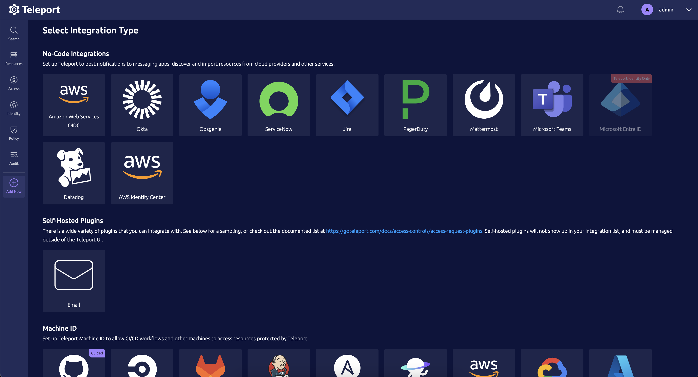
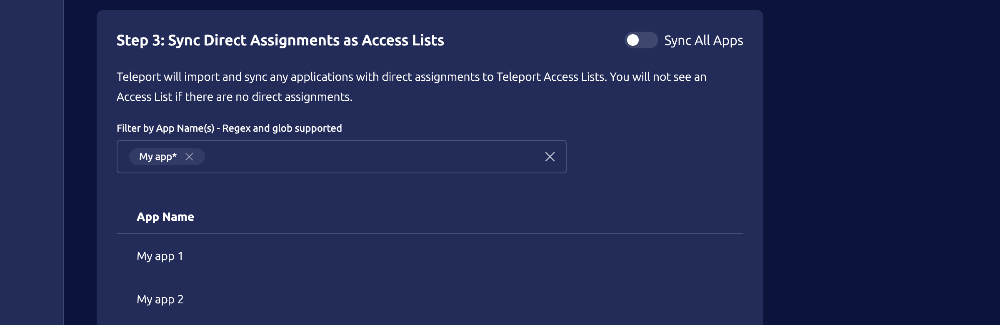
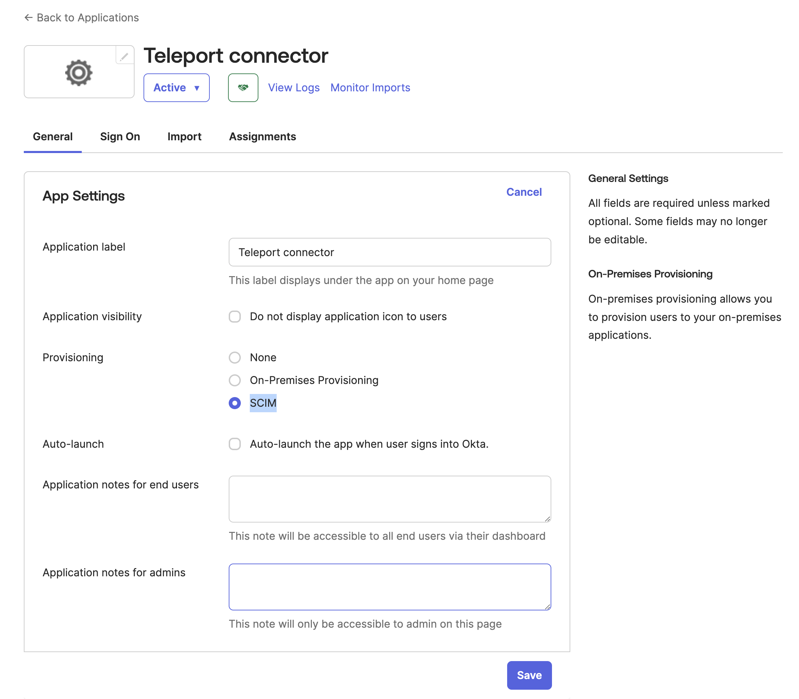
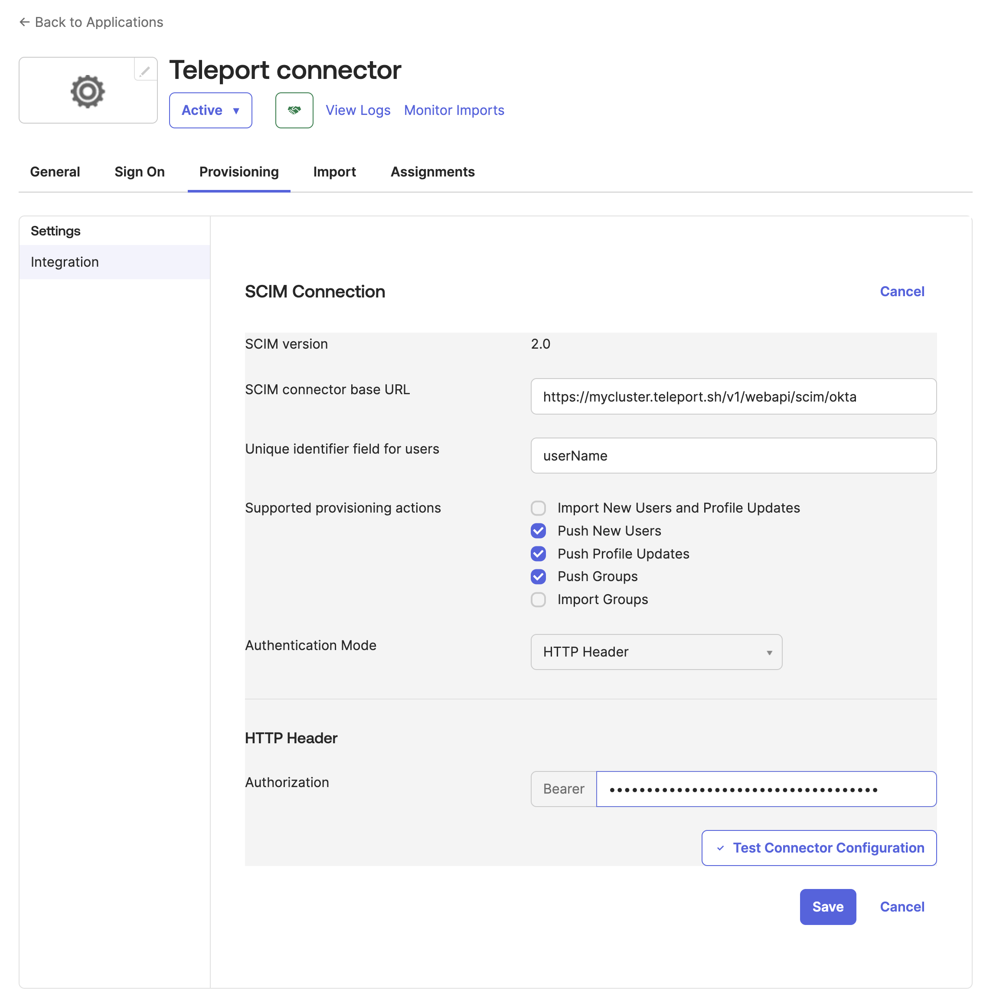
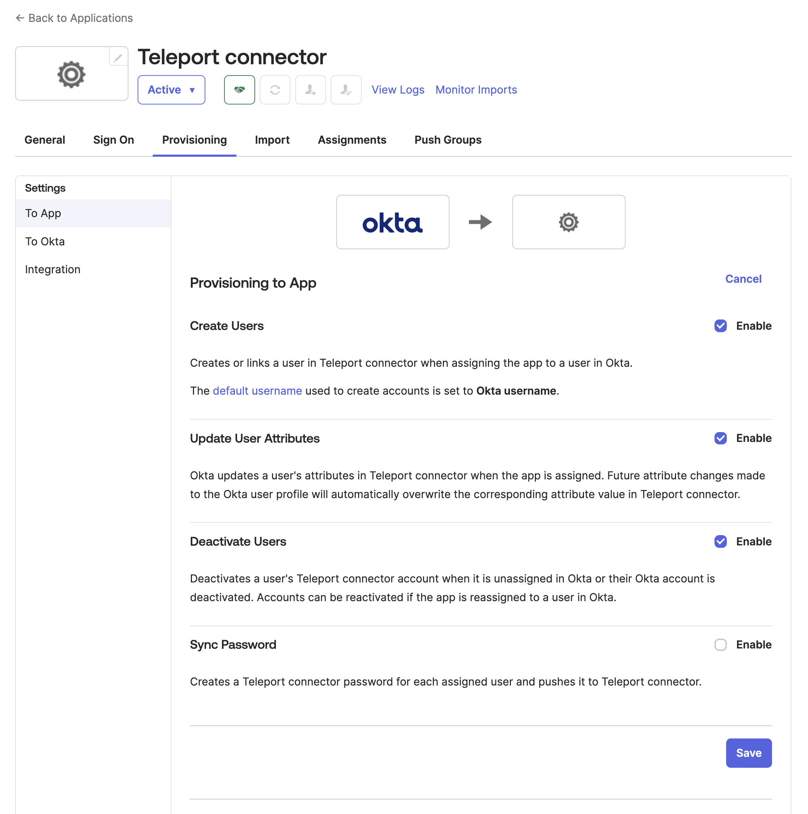

Teleport can import and grant access to resources from an Okta organizations, 
such as user profiles, groups and applications. Teleport can provision user
accounts based Okta users, Okta applications can be accessed through Teleport's 
application access UI, and access to these applications along with user groups
can be managed by Teleport's RBAC along with Access Requests.

This guide will help you set up the Okta Service as a Teleport hosted
integration.

<Admonition type="warning">
Enabling the Okta integration will make Teleport take ownership over app and group
assignments in Okta and can make changes within Okta based on Teleport RBAC
configuration.

Specifically, access to Okta apps is governed by Teleport roles' [app_labels](../controls.mdx#configuring-application-labels-in-roles)
so before enabling the integration make sure that your users do not have roles
with wildcard app labels, which otherwise will result into those users being
assigned to all Okta applications.

To limit the scope of the integration, you can constrain Okta access token to
a subset of apps and groups by using an [Okta resource set](https://help.okta.com/en-us/content/topics/security/custom-admin-role/create-resource-set.htm).

Teleport manages Okta application group assignments using a declarative state approach.
If an assignment is created via Teleport and subsequently removed via the Okta UI,
Teleport will re-evaluate and potentially overwrite Okta UI changes to align with the state defined by Teleport's RBAC configuration.
</Admonition>

## Prerequisites

(!docs/pages/includes/commercial-prereqs-tabs.mdx!)

- (!docs/pages/includes/tctl.mdx!)
- An Okta organization with an [Okta API token](https://developer.okta.com/docs/guides/create-an-api-token) created.

<Details title="Okta API token permissions">
(!docs/pages/includes/okta-permissions.mdx hosted="true"!)
</Details>

## Enrolling a hosted Okta integration

Hosted integrations run inside a Teleport instance, rather than as an external
process. This allows you to run integrations without having to provision and
manage a separate Teleport node yourself - Teleport itself manages the setup, 
configuration and teardown of the integrations internally.

This is both convenient for administrators, and allows for a greater degree of
automation than with self-hosted integrations.

In the case of Okta, running the integration in hosted mode allows it to support
provisioning users (and other resources) via [SCIM](https://scim.cloud/). SCIM
is a protocol for provisioning resources across systems, and running a SCIM
service allows Okta to provision user accounts in Teleport and push changes to
user profiles in near real time, rather than waiting for the Okta integration to
pull in the changes.

### The Enrollment Process

Enrolling the Okta hosted integration will automatically perform the following
actions:

 1. Create an Okta SAML Application called `Teleport $clustername` in the
    upstream Okta organization
 1. Assign the Okta `Everyone` group to the new SAML Application
 1. Download the IdP Metadata for the new SAML Application
 1. Create a new SAML Authentication Connector called `okta-integration` in the
    Teleport cluster
 1. Configure the Okta integration to draw its user pool from the Okta users
    assigned to the new `Teleport $clustername` Okta SAML application
 1. Start the hosted Okta integration, including the synchronization of Okta
    users, apps and groups into Teleport.

If Teleport Identity Governance is enabled, the enrollment process will also guide you
through the process of enabling SCIM provisioning for the Okta SAML application.

<Admonition type="note">
If a SAML connector called `okta-integration` already exists, the enrollment
process will attempt to adopt this connector and use the Okta SAML Application
it points to, rather than create a new one.

This adoption process will fail if the SAML connector was created with Teleport 
versions prior to 15.0.0, or was created manually. In this case, the best course
of action is to either delete or rename the existing SAML Connector and let the
integration enrollment create a new one.
</Admonition>

### How to enroll

Visit the Teleport Web UI and click **Access Management** on the menu bar at the
top of the screen. 

On the left sidebar, click **Enroll New Integration** to visit the 
"Enroll New Integration" page:



Select the Okta tile, and then Teleport will then ask for  
 - your Okta organization URL, and 
 - the OKta API token described above.
 
Click **Connect** to continue.

Once the initial enrollment has completed, and if Teleport Identity Governance
is enabled, the enrollment workflow will guide you through enabling SCIM
provisioning as well.

## Configure Access List Synchronization

If Teleport Identity Governance is enabled, the enrollment workflow will also guide you to configure syncing of
user groups and direct application assignments as Access Lists. This will ensure
that permissions in Okta are modeled properly in Teleport, allowing Teleport users
to see the same Okta applications that they would when viewing the Okta dashboard.

### Configuring Default Owners

The first step of setting up Okta Access List synchronization is defining default Access List owners. You can select
any number of default owners or manually enter the owners if they do not yet exist
in the system. These owners can be later changed and will not be overwritten by the
Okta Access List synchronization process.

### Importing Okta User Groups as Access Lists

After configuring default owners, you can customize which Okta user groups should
be imported. By default, all user groups will be imported. If you would like more
control, you can disable the "Import All User Groups" option at the top right of
the panel and configure multiple filters which will be matched against the group
names. For more information on filter syntax, refer to the Import Filters section
below.

<Admonition type="note">
Only Okta User Groups with assignments will be imported as an Access List. If an Okta User
Group has no assignments, it will not be imported until it has assignments. If the last
user is removed from the Access List, the Access List will be removed from Teleport on the
next sync.
</Admonition>

### Importing Okta Application Assignments as Access Lists

In addition to importing Okta User Groups, you can also import direct application
assignments within Okta as Access Lists as well. This behaves in exactly the same way
as user groups.

<Admonition type="note">
Only Okta Applications with assignments will be imported as an Access List. If an Okta
Application has no assignments, it will not be imported until it has assignments. If the
last user is removed from the Access List, the Access List will be removed from Teleport
on the next sync.
</Admonition>

### Import Filters

Filters are supported as glob syntax and regex syntax. Glob syntax are strings with
wildcards in them that represent arbitrary values where the wildcards go. For example,
a glob that matches names with a prefix of "app" and a suffix of "salesforce" would
look like `app*salesforce`.

You can also use raw regular expressions so long as the filter string is prefixed with `^`
and ends with `$`. This will support the [Google RE2](https://github.com/google/re2/wiki/Syntax) regular expression syntax.

When filters are added, the results of the user group or application list will update with
the results of your filter applied. This allows you to see what will be imported at this
particular time.



## Configuring SCIM provisioning

If Teleport Identity Governance is enabled, the enrollment workflow will now show you a
guide to configuring SCIM. Enabling SCIM allowed Okta to push user (and other
resource) updates to Teleport in near real time, without waiting for the Okta
integration to run a synchronization.

As a concrete example, when using SCIM a user deactivation in Okta will be
reflected in Teleport within seconds, rather than the tens of minutes it might
take when waiting for an Okta synchronization pass.

For more information, see the [Okta Synchronization and SCIM](./sync-scim.mdx) guide.

To recap the enrollment "Set Up SCIM" guide:

### Enable SCIM Provisioning
 1. In the Okta Admin Console, go to **Applications** and select the Teleport-
    created application, or use the link supplied by the Teleport "Set Up SCIM" 
    guide.
 1. Click **Edit** on the Okta **App Settings** page, check the box marked
    **Enable SCIM provisioning**, and click **Save**.



### Configure Okta SCIM Client
 1. Click on the new **Provisioning** tab and then click **Edit**.
 1. Copy the **SCIM connector base URL** from the Teleport **Set Up SCIM** guide
    and paste it into **SCIM connector base URL** field in the Okta provisioning
    page.
 1. Set the Okta **Unique identifier field for users** to `userName`.
 1. Under **Supported provisioning actions**, check the following boxes:
    1. Import New Users and Profile Updates
    1. Push New Users
    1. Push Profile Updates
 1. Set **Authentication Mode** to `HTTP Header`
 1. Copy the authorization **Bearer Token** from the Teleport **Set Up SCIM**
    guide and paste it into **Bearer Token** field in the Okta provisioning
    page.
 1. Click **Save**



### Configure Okta-To-App Provisioning
 1. Staying on the **Provisioning** tab, go to the new **To App** Okta
    application settings page and click **Edit**.
 1. Check the following checkboxes:
    1. Create Users
    1. Update User Attributes
    1. Deactivate Users
 1. Click **Save**



For more information about how the Okta integration manages Teleport resources,
see the [Synchronization with Okta and SCIM](./sync-scim.mdx) guide.

## Deleting a hosted Okta integration

### SAML Connector

The SAML connector created during the enrollment process is ***not*** deleted
when the hosted Okta integration is deleted, and will automatically be re-used
if the Okta integration is re-enrolled.

To permanently delete the SAML connector, navigate to the `Auth Connectors`
page in the Teleport UI and delete it from there.

### Access Lists

<Admonition type="warning">
If the hosted integration is still active, removing Okta sourced Access Lists
could revoke Okta access from users in your organization. Please exercise caution
when cleaning up Access Lists!
</Admonition>

All Access Lists imported by the hosted integration will remain until they
are deleted by a Teleport Administrator. That is, they will *not* be deleted
when the hosted integration is deleted.

The easiest way to clean these up is through the use of `tctl`. A batch command
like this will remove all Okta-sourced Access Lists in a system:

```
tctl get access_lists --format json | jq '.[] | select(.metadata.labels["teleport.dev/origin"] == "okta") | .metadata.name' -r | xargs -I{} tctl rm "access_list/{}"
```

### Users

All Teleport user accounts created by the hosted integration, either via the
synchronization process or via SCIM, will ***not*** be deleted when the hosted
integration is deleted.

The easiest way to clean up these users when deleting a hosted integration is to
un-assign all Okta users from the Okta SAML Application Teleport uses as 
its identity provider, and wait for the sync process and/or SCIM provisioning
to delete the corresponding Teleport accounts. Once the Teleport accounts have
been automatically deleted you can proceed to delete the integration.

Teleport user accounts can also be manually deleted with `tctl`. For more
information, see the Teleport [Local Users](../../../admin-guides/management/admin/users.mdx)
guide.

<Admonition type="note">
Any Teleport accounts deleted with `tctl` will be recreated on the next
synchronization pass unless they are also unassigned and/or disabled in the
upstream Okta organization.
</Admonition>
