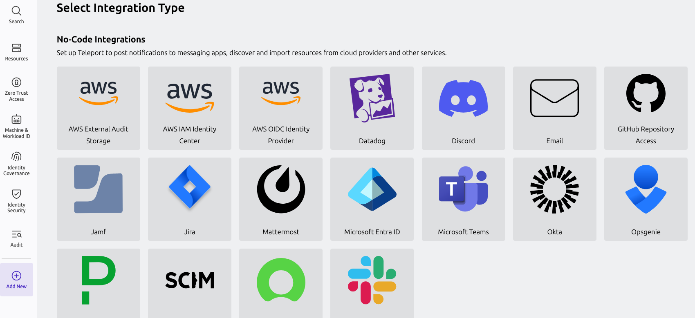
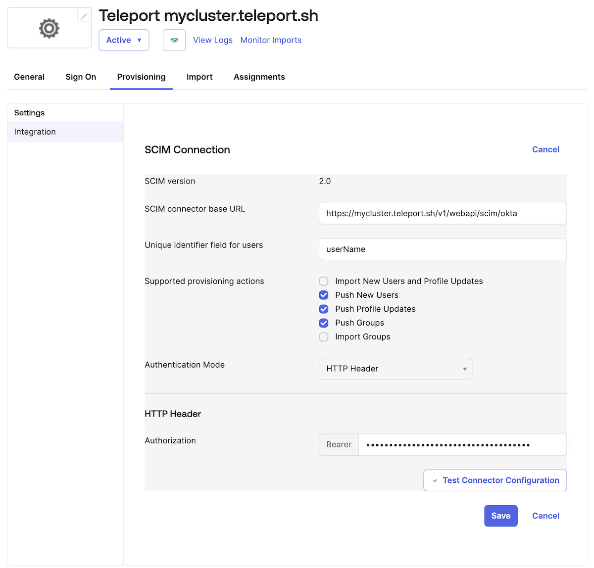
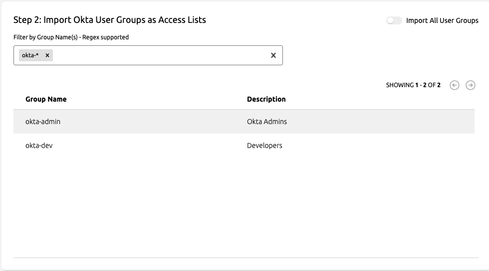
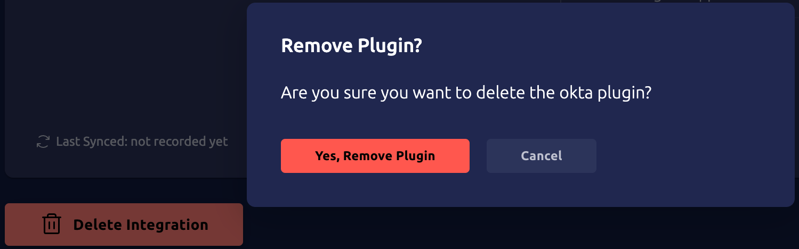

Teleport Okta integration can import and grant access to resources from an Okta organizations, 
such as user profiles, groups and applications. Teleport can provision user
accounts based Okta users, Okta applications can be accessed through Teleport's 
application access UI, and access to these applications along with user groups
can be managed by Teleport's RBAC along with access requests.

<Admonition type="warning">
Enabling the Okta integration will make Teleport take ownership over app and group
assignments in Okta and can make changes within Okta based on Teleport RBAC
configuration.

Specifically, access to Okta apps is governed by Teleport roles' [app_labels](../controls.mdx#configuring-application-labels-in-roles)
so before enabling the integration make sure that your users do not have roles
with wildcard app labels, which otherwise will result into those users being
assigned to all Okta applications.

To limit the scope of the integration, you can constrain Okta access token to a subset of apps and
groups by using an [Okta resource
set](https://help.okta.com/en-us/content/topics/security/custom-admin-role/create-resource-set.htm).
It is described in more detail in this guide.

Teleport manages Okta application group assignments using a declarative state approach.
If an assignment is created via Teleport and subsequently removed via the Okta UI,
Teleport will re-evaluate and potentially overwrite Okta UI changes to align with the state defined by Teleport's RBAC configuration.
</Admonition>

## Prerequisites

(!docs/pages/includes/commercial-prereqs-tabs.mdx!)

- (!docs/pages/includes/tctl.mdx!)
- An Okta organization with admin access.
- [Okta SAML 3.0 app](./appendix-a-okta-saml-app.mdx) for SSO and also acting as user synchronization source.
- (optional) [Okta API Services app](./appendix-b-okta-api-services-app.mdx) to allow Teleport access to Okta API using OAuth
  credentials.

## Enrollment

Enrolling the Okta integration is a guided process and it's divided into 4 levels:

1. SSO-only integration. This is the most basic integration allowing Teleport with
   Okta as an Identity Provider.
2. [SCIM](https://developer.okta.com/docs/concepts/scim/) integration allowing nearly instant
   provisioning of Okta users in Teleport. This is available only if Teleport Identity is enabled.
   This level can be skipped.
3. User Sync - a more robust user provisioning. It is usually slower than SCIM but is more reliable
   because it runs a continuous reconciliation loop. It also doesn't require publicly accessible
   Teleport cluster. Combined with SCIM provides both speed and reliability.
4. Apps ang Groups sync allows representing Okta Apps and Groups as Teleport Access Lists enabling:
   - JIT Access Requests to manage access to apps and user groups
   - Okta group and app assignments management via Teleport RBAC

To start the enrolment, visit the Teleport Web UI and click **Access** and then **Integrations** on
the menu bar at the left of the screen. Then click **Enroll New Integration** and select **Okta**
tile.



This will bring you to the [Level 1. SSO](#level-1-sso) integration configuration screen.

## Level 1. SSO

SSO integration allows using Okta as an IdP provider to access Teleport.

Depending on the presence of existing Okta Auth Connectors in the cluster you'll be asked to select
one, or you'll be asked to configure one providing the metadata URL of the Okta SAML 2.0 app
created earlier in this guide.

<Admonition type="note">
If one of your existing connectors is named "okta" you won't have the option to create a new
connector. That's because newly created connector is named "okta" and it's a fixed name. If you
have a connector named "okta" and you'd like to use a different one, you'll have to create your
connector manually following [these
instructions](../../../admin-guides/access-controls/sso/okta.mdx).
</Admonition>


<Tabs>
<TabItem label="Creating new Okta Auth Connector">

If you don't have any Teleport Auth Connectors for Okta in the cluster, or you selected *Create new
connector "okta"...* option you will be presented with the SSO connector configuration screen below.


### Step 1: Create and configure Okta SAML app

For the **Step 1** here you'll need to make sure you have created a [Okta SAML 2.0 app for your
connector as described in this guide](./appendix-a-okta-saml-app.mdx).

### Step 2: Copy SAML app metadata URL 

To complete **Step 2** you'll need to find the Okta SAML app metadata URL. In the Okta
administrator web UI, navigate to **Applications** -> **Applications** and find your app. Then go
to the **Sign On** tab and copy the *metadata URL.


Then paste it into the Step 2 of this form and click **Submit SSO Configuration**.

</TabItem>

<TabItem label="Using existing Okta Auth Connector">

If you are using an existing Teleport Auth Connector, then there is nothing else to do, and you
should be immediately transferred to the page below. Remember that, if you want to proceed *Level
2. SCIM* integration and/or *Level 3. User sync*, you will potentially need to make changes in the
Okta SAML app configuration for this connector. More on that later in this guide.

</TabItem>
</Tabs>

Congratulations! You have completed your Level 1. SSO integration.


Now you can stop here and click **See the Integration Status Page** or continue to [Level 2.
SCIM](#level-2-scim).  Remember, it is possible to unlock the new enroll the integration to a
higher level at any time from the [integration status page](./integration-status.mdx) at any time.

## Level 2. SCIM

If Teleport Identity is enabled, the enrollment workflow will now show you a
guide to configuring SCIM. Enabling SCIM allowed Okta to push user (and other
resource) updates to Teleport in near real time, without waiting for the Okta
integration to run a synchronization.

<Admonition type="note">
To learn more about Okta SCIM integration visit [this page](./scim-integration.mdx).
</Admonition>

As a concrete example, when using SCIM a user deactivation in Okta will be
reflected in Teleport within seconds, rather than the tens of minutes it might
take when waiting for an Okta synchronization pass.


Please note this step is optional and if you press **Skip** you will be taken to the [Level 3. User
sync](#level-3-user-sync) step. You can enable SCIM later, even if you skip it now, in the
[integration status page](./integration-status.mdx).

### Step 1: Enable SCIM in Okta

Following the instructions, make sure SCIM is enabled in your Okta SAML app for SSO:


Click **Save** and proceed to the Step 2 on the Teleport SCIM enrolment configuration screen.

### Step 2: Configure SCIM Details in Okta

Again, in you Okta SAML app created before, configure SCIM settings in the **Provisioning**
tab, copying the values provided in the Teleport SCIM enrolment configuration screen.




<Admonition type="note">
Before pressing **Test Connector Configuration** on the Okta side, make sure to click **Save SCIM
Configuration** in the Teleport SCIM enrolment page.
</Admonition>

Click **Test Connector Configuration** to confirm all of the details are set up correctly, and then
click **Save**.

### Step 3: Configure SCIM Provisioning Permissions in Okta

The final step is to configure **Provisioning to App** section:


Now, everything is configured, click **Continue** in the Teleport SCIM configuration page.


## Level 3. User sync

*User sync* is a slower than SCIM, but very reliable way to synchronizing your Users with Teleport.
It provides the same [features as SCIM](./scim-integration.mdx), but it is also a prerequisite for Apps
and Groups synchronization which enable powerful features such as Access Lists and Just-in-time
Access Requests, but more on that later. 

<Admonition type="note">
To learn more about Okta user sync visit [this page](./user-sync.mdx).
</Admonition>

<Admonition type="note">
*User sync* works best together with [SCIM enabled](#level-2-scim), providing the missing
reliability component of the SCIM protocol.
</Admonition>

After clicking on **Next - User Sync** or enabling *User Sync* from the [integration status
page](./integration-status.mdx) you will be brought to the User Sync configuration page. Here
you'll have to complete 4 steps described later in this guide. This process is quite involved
because Teleport will need an API access to Okta, which will be granted with *Okta API Services
app*. But don't worry this guide will describe how to do all of that.


### Step 1: Create Okta API Services app

This step is quite complicated so we devoted a whole page to it. Please make sure to follow [these
instructions](./appendix-b-okta-api-services-app.mdx) and continue with *Step 2* of this guide.

### Step 2: Configure API Services app public key

To allow Teleport access to Okta, the Okta API Services app created before must be able to verify
the JWT tokens issued by teleport. In order to do that Okta API Services app created in the
previous step has to configured with Teleport public key for Okta.

The procedure varies slightly depending on the Teleport cluster accessibility over internet.

<Tabs>
<TabItem label="Public Teleport cluster">

For public Teleport clusters copy the JWKS URL displayed in the integration enrollment screen:


Then Okta admin web UI, in **Applications** -> **Applications**, find your Okta API services app.
In the app settings, in the **General** tab, click on **Edit** on the top right corner in the
**Client Credentials** section and change Client authentication to "Public key / Private key".

In the same section in **PUBLIC KEYS** subsection there, select "Use a URL to fetch keys
dynamically" and paste the Teleport JWKS URL for Okta and click **Save**.


</TabItem>
<TabItem label="Private Teleport cluster">

For private Teleport clusters, click on **If your cluster is private** in the integration
enrollment screen, and it will show you a JSON containing the cluster's public key.


Copy the public key JSON:


Then Okta admin web UI, in **Applications** -> **Applications**, find your Okta API services app.
In the app settings, in the **General** tab, click on **Edit** on the top right corner in the
**Client Credentials** section and change Client authentication to "Public key / Private key".

In the same section in **PUBLIC KEYS** subsection there, select "Save keys in Okta", and click **Add key**.


Paste the public key JSON and click **Done**.


Then click **Save** in the previous screen. Don't worry about "Invalid DateTime", in the *Created*
column. It will become a valid date once you click **Save**.


</TabItem>
</Tabs>

### Step 3: Grant Okta API scopes

This step should be already done if you followed along [Okta API Services app setup instructions
instructions](./appendix-b-okta-api-services-app.mdx). So you can go to the next step.

### Step 4: Provide Client ID

Then Okta admin web UI, in **Applications** -> **Applications**, find your Okta API services app.
In the app settings in the **General** tab you will find the client ID.


Paste the client ID to the *App Sync* enrollment screen and click **Update**.


Clicking **Update** and that's it! You have configured *User sync* in your Okta integration.


## Level 4. App and Group Sync

If Teleport Identity is enabled, the enrollment workflow will also guide you to configure syncing
of user groups and direct application assignments as Access Lists. This will ensure that
permissions in Okta are modeled properly in Teleport, allowing Teleport users to see the same Okta
applications that they would when viewing the Okta dashboard.

<Admonition type="note">
To learn more about Okta apps and groups sync visit [this page](./app-and-group-sync.mdx).
</Admonition>


### Step 1: Set Default List Owner(s)

The first step of setting up Okta Access List synchronization is defining default Access List
owners. You can select any number of default owners or manually enter the owners if they do not yet
exist in the system. These owners can be later changed and will not be overwritten by the Okta
Access List synchronization process.


### Step 2: Importing Okta User Groups as Access Lists

After configuring default owners, you can customize which Okta user groups should
be imported. By default, all user groups will be imported.


If you would like more control, you can disable the "Import All User Groups" option at the top
right of the panel and configure multiple filters which will be matched against the group names.
For more information on filter syntax, refer to the [Import Filters section](#import-filters)
below.


<Admonition type="note">
Only Okta User Groups with assignments will be imported as an Access List. If an Okta User
Group has no assignments, it will not be imported until it has assignments. If the last
user is removed from the Access List, the Access List will be removed from Teleport on the
next sync.
</Admonition>

### Step 3: Sync Direct Assignments as Access Lists

In addition to importing Okta User Groups, you can also import direct application assignments
within Okta as Access Lists as well. This behaves in exactly the same way as [Importing Okta User
Groups as Access Lists](#step-2-importing-okta-user-groups-as-access-lists).

<Admonition type="note">
Only Okta Applications with assignments will be imported as an Access List. If an Okta
Application has no assignments, it will not be imported until it has assignments. If the
last user is removed from the Access List, the Access List will be removed from Teleport
on the next sync.
</Admonition>

### Import Filters

<Admonition type="note">
Filtering Okta apps and user groups can be also configured on the [Okta side using resource
sets](./appendix-b-okta-api-services-app.mdx#create-resource-set-for-the-app), but it doesn't
support globbing and regular expressions.
</Admonition>

Filters are supported as glob syntax and regex syntax. Glob syntax are strings with
wildcards in them that represent arbitrary values where the wildcards go. For example,
a glob that matches names with a prefix of "app" and a suffix of "salesforce" would
look like `app*salesforce`.

You can also use raw regular expressions so long as the filter string is prefixed with `^`
and ends with `$`. This will support the [Google RE2](https://github.com/google/re2/wiki/Syntax) regular expression syntax.

When filters are added, the results of the user group or application list will update with
the results of your filter applied. This allows you to see what will be imported at this
particular time.



## Deleting Okta integration

Deleting the Okta integration is as easy as clicking **Delete Integration** in the [integration
status page](./integration-status.mdx), but **it should be carefully planned** to avoid unwanted
leftovers in the Teleport cluster.




### Users

All Teleport user accounts created by the hosted integration, either via the
synchronization process or via SCIM, will ***not*** be deleted when the hosted
integration is deleted.

The easiest way to clean up these users when deleting a hosted integration is to
un-assign all Okta users from the Okta SAML Application Teleport uses as 
its identity provider, and wait for the sync process and/or SCIM provisioning
to delete the corresponding Teleport accounts. Once the Teleport accounts have
been automatically deleted you can proceed to delete the integration.

Teleport user accounts can also be manually deleted with `tctl`. For more information, see the
Teleport [Local Users](../../../admin-guides/management/admin/users.mdx) guide. The best time to
use `tctl` when deleting users is when the integration is already deleted. Otherwise there is a
chance the users can be synchronized back again.

### SAML Connector

The SAML connector created during the enrollment process is ***not*** deleted
when the hosted Okta integration is deleted, and will automatically be re-used
if the Okta integration is re-enrolled.

To permanently delete the SAML connector, navigate to the `Auth Connectors`
page in the Teleport UI and delete it from there.

### Access Lists

<Admonition type="warning">
If the Okta integration is still active, removing Okta sourced Access Lists
could revoke Okta access from users in your organization. Please exercise caution
when cleaning up Access Lists!
</Admonition>

All Access Lists imported by the Okta integration will remain until they
are deleted by a Teleport Administrator. That is, they will *not* be deleted
when the Okta integration is deleted.

The easiest way to clean these up is through the use of `tctl`:

```
tctl plugins cleanup okta
```
