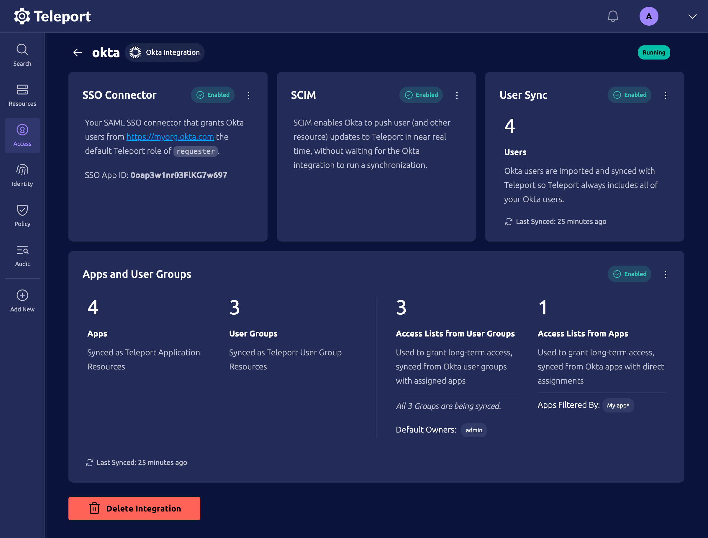
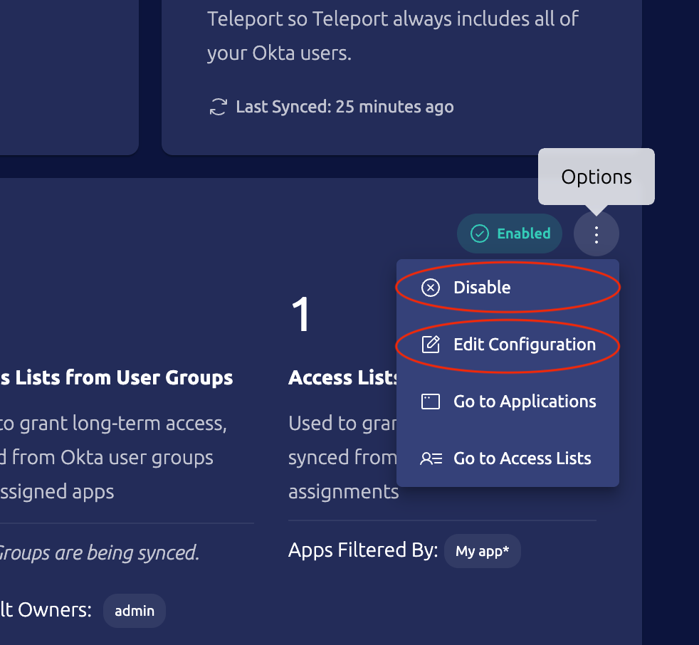

After successfully completing any level of [Okta integration enrollment](./integration-enrollment.mdx) you
will have access to the Okta integration status page. To open it, in the Teleport web UI navigate
to **Access** -> **Integrations** and click anywhere on the Okta integration row.

You will be presented with the Okta integration status page like below. Please note some tiles may
be marked as disabled depending on what integration level you are.

It is possible to enable/disable or edit any integration level by clicking on the three dots:

That will bring you to the same enrollment flow for the given level as described in [Okta
integration enrollment guide](./integration-enrollment.mdx).
