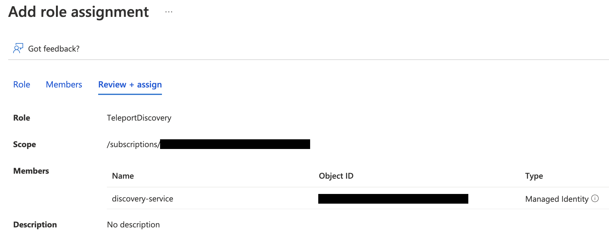

This guide shows you how to configure Teleport to automatically enroll Azure
virtual machines across multiple subscriptions using management groups.

If you only want to discover VMs in specific subscriptions, read
[Manual Azure VM Auto-Discovery](azure-vm-discovery-manual.mdx).

## How it works

The Teleport Discovery Service authenticates to Azure as a service principal
with permissions assigned at the management group scope. This allows it to list
all subscriptions under that management group and discover virtual machines in
each one.

For each discovered VM, the Discovery Service executes a script using the Azure
Run Command feature that installs Teleport, starts it and joins the cluster.

You can also enroll VMs across your entire Azure environment, including any
additional subscriptions and management groups added later, using the
[Tenant root
group](https://learn.microsoft.com/en-us/azure/governance/management-groups/overview#root-management-group-for-each-directory).
The Tenant root management group ID is the same as your Azure tenant ID.

<Admonition type="note">
Discovery for Azure using management groups is currently only supported for virtual
machines and virtual machine scale sets.
</Admonition>

## Prerequisites

(!docs/pages/includes/edition-prereqs-tabs.mdx!)

- Azure management group or tenant containing subscriptions for discovery.
- Permissions to create managed identities, custom role definitions, and role
  assignments at the management group scope.
- Azure virtual machines to join the Teleport cluster, running
  Ubuntu/Debian/RHEL if making use of the default Teleport install script. (For
  other Linux distributions, you can install Teleport manually.)
- (!docs/pages/includes/tctl.mdx!)

## Step 1/5. Create an Azure join token

When discovering Azure virtual machines, Teleport uses Azure join tokens for
authenticating joining SSH Service instances. Using an allow rule scoped to the
tenant allows VMs from any subscription in the tenant to join the cluster.

Create a file called `token.yaml`:

```yaml
# token.yaml
kind: token
version: v2
metadata:
  name: azure-discovery-token
  expires: "3000-01-01T00:00:00Z"
spec:
  roles: [Node]
  join_method: azure

  azure:
    allow:
    # specify the Azure tenant which Nodes may join from.
    # this allows joining from any subscription in the tenant.
    - tenant: "<Var name="tenant-id" />"
```

Assign <Var name="tenant-id" /> to your Azure tenant ID.

Add the token to the Teleport cluster with:

```code
$ tctl create -f token.yaml
```

## Step 2/5. Configure IAM permissions for Teleport

The Teleport Discovery Service needs Azure IAM permissions to discover and
register Azure virtual machines.

(!docs/pages/includes/auto-discovery/azure-vm-configure-service-principal.mdx!)

### Create a custom role

Teleport requires the following permissions to discover and enroll Azure VMs
across a management group:

- `Microsoft.Compute/virtualMachines/read`
- `Microsoft.Compute/virtualMachines/runCommands/write`
- `Microsoft.Compute/virtualMachines/runCommands/read`
- `Microsoft.Compute/virtualMachineScaleSets/read`
- `Microsoft.Compute/virtualMachineScaleSets/virtualMachines/read`
- `Microsoft.Compute/virtualMachineScaleSets/virtualMachines/runCommands/read`
- `Microsoft.Compute/virtualMachineScaleSets/virtualMachines/runCommands/write`
- `Microsoft.Resources/subscriptions/read`

The `Microsoft.Resources/subscriptions/read` permission is required so the
Discovery Service can list subscriptions under the management group when using a
wildcard subscription matcher.

Here is a sample role definition allowing Teleport to read and run commands on
Azure virtual machines at the management group scope:

```json
{
    "properties": {
        "roleName": "TeleportDiscovery",
        "description": "Allows Teleport to discover Azure virtual machines",
        "assignableScopes": [
            "/providers/Microsoft.Management/managementGroups/<management-group-id>"
        ],
        "permissions": [
            {
                "actions": [
                    "Microsoft.Compute/virtualMachines/read",
                    "Microsoft.Compute/virtualMachines/runCommands/write",
                    "Microsoft.Compute/virtualMachines/runCommands/read",
                    "Microsoft.Compute/virtualMachineScaleSets/read",
                    "Microsoft.Compute/virtualMachineScaleSets/virtualMachines/read",
                    "Microsoft.Compute/virtualMachineScaleSets/virtualMachines/runCommands/write",
                    "Microsoft.Compute/virtualMachineScaleSets/virtualMachines/runCommands/read",
                    "Microsoft.Resources/subscriptions/read"
                ],
                "notActions": [],
                "dataActions": [],
                "notDataActions": []
            }
        ]
    }
}
```

Replace `<management-group-id>` with your management group ID. The
`assignableScopes` field determines where the role can be assigned — set it to
the management group that contains the subscriptions you want to discover.

Azure allows [only one management group in
`assignableScopes`](https://learn.microsoft.com/en-us/azure/role-based-access-control/custom-roles#custom-role-limits). To
discover VMs across multiple management groups, set `assignableScopes` to a
management group at the top of your resource hierarchy and create a role
assignment for each management group you wish to discover.

To discover VMs across all subscriptions in the tenant, use the tenant ID as
the management group ID, which targets the
[Tenant root group](https://learn.microsoft.com/en-us/azure/governance/management-groups/overview#root-management-group-for-each-directory).

<Admonition type="warning">
Using the tenant ID as the management group ID targets the Tenant root group,
which requires
[elevated access](https://learn.microsoft.com/en-us/azure/role-based-access-control/elevate-access-global-admin).

If you have recently elevated privileges in the Azure CLI or Azure portal, you
may need to refresh your Azure CLI credentials before proceeding:

```code
$ az logout && az login
```

</Admonition>

Navigate to the [Management Groups](https://portal.azure.com/#view/Microsoft_Azure_ManagementGroups/ManagementGroupBrowseBlade)
page and select your management group. Click on *Access control (IAM)* and
select *Add > Add custom role*, then paste the JSON role definition above.

<Admonition type="tip">
Using the role definition above grants Teleport access to enroll VMs and VMs from Virtual Machine Scale Sets (VMSSs).

VMSSs have two orchestration modes: Uniform and, the recommended, [Flexible](https://learn.microsoft.com/en-us/azure/virtual-machine-scale-sets/virtual-machine-scale-sets-orchestration-modes#scale-sets-with-flexible-orchestration-recommended).
If you are not using or don't want to enroll VMSSs with Uniform orchestration mode, you can further limit the permissions granted to Teleport by removing the `Microsoft.Compute/virtualMachineScaleSets/*` permissions.

Navigate to the [Azure portal](https://portal.azure.com/#view/Microsoft_Azure_ComputeHub/ComputeHubMenuBlade/~/virtualMachineScaleSetsBrowse) and look for the Orchestration mode column to check the orchestration mode of your VMSSs and make sure to adjust the role permissions accordingly.
</Admonition>

### Create a role assignment for the Teleport Discovery Service principal

To grant Teleport permissions, the custom role you created must be assigned to
the Teleport service principal at the management group level.

Navigate to the
[Management Groups](https://portal.azure.com/#view/Microsoft_Azure_ManagementGroups/ManagementGroupBrowseBlade)
page, select your management group, and click *Access control (IAM)*. Select
*Add > Add role assignment*. Choose the custom role you created as the role and
the Teleport service principal as a member.



The Discovery Service will discover VMs in all subscriptions under the assigned
management group scope.

## Step 3/5. Set up an identity for discovered nodes

Every Azure VM to be discovered must have an identity assigned to it: either system assigned or user assigned managed identity.

(!docs/pages/includes/provision-token/azure-join-enable-identity.mdx!)

If the VMs to be discovered have no system-managed identity and more than one user-managed identity assigned to them,
copy the client ID of one of your user-managed identities for Step 5.

## Step 4/5. Install the Teleport Discovery Service

<Admonition type="tip">

If you plan on running the Discovery Service on a host that is already running
another Teleport service (Auth or Proxy, for example), you can skip this step.

</Admonition>

Install Teleport on the virtual machine that will run the Discovery Service:

(!docs/pages/includes/install-linux.mdx!)

## Step 5/5. Configure Teleport to discover Azure instances

(!docs/pages/includes/auto-discovery/azure-vm-configure-discovery-service.mdx!)

<Tabs>
<TabItem label="Dynamic configuration (recommended)">
  Create a Discovery Config resource, that has the same discovery group you configured earlier, to enable Azure VM discovery.

  Create a file named `discovery-azure-prod.yaml` with the following content:
  ```yaml
  kind: discovery_config
  version: v1
  metadata:
    name: example-discovery-config
  spec:
    discovery_group: <Var name="azure-prod" />
    azure:
      - types: ["vm"]
        # Only exact matches or wildcard (*) are supported.
        subscriptions: ["*"]
        regions: ["<region>"]
        tags:
          "env": "prod" # Match virtual machines where tag:env=prod
        install:
          azure:
            # Optional: If the VMs to discover have more than one managed
            # identity assigned to them, set the client ID here to the client
            # ID of the identity created in step 3.
            client_id: "<client-id>"
  ```
  Adjust the keys under `spec.azure` to match your Azure environment,
  specifically the regions and tags you want to associate with the Discovery Service.

  Create the Discovery Config by running the following command:
  ```code
  $ tctl create -f discovery-azure-prod.yaml
  ```

  Matching instances will be added to the Teleport cluster automatically.

  You can update the Discovery Config at any time, and the service will automatically re-apply the changes.
</TabItem>

<TabItem label="Static configuration">
  In order to enable Azure VM discovery the `discovery_service.azure` section
  of `teleport.yaml` must include at least one entry:

  ```yaml
  # teleport.yaml
  # ...
  discovery_service:
    enabled: true
    discovery_group: <Var name="azure-prod" />
    azure:
      - types: ["vm"]
        # Only exact matches or wildcard (*) are supported.
        subscriptions: ["*"]
        regions: ["<region>"]
        tags:
          "env": "prod" # Match virtual machines where tag:env=prod
        install:
          azure:
            # Optional: If the VMs to discover have more than one managed
            # identity assigned to them, set the client ID here to the client
            # ID of the identity created in step 3.
            client_id: "<client-id>"
  ```

  Adjust the keys under `discovery_service.azure` to match your Azure environment,
  specifically the regions and tags you want to associate with the Discovery Service.
</TabItem>

</Tabs>

<Admonition type="tip">
To configure Terraform for VM discovery across subscriptions in a management group, see
[Discover VMs in multiple subscriptions using management groups](azure-vm-discovery-terraform.mdx#discover-vms-in-multiple-subscriptions-using-management-groups)
in the Terraform Azure VM Auto-Discovery guide.
</Admonition>

(!docs/pages/includes/start-teleport.mdx service="the Discovery Service"!)

Once you have started the Discovery Service, Azure virtual machines matching the
tags you specified earlier will begin to be added to the Teleport cluster
automatically across all subscriptions under the management group.

## Auto-discovery labels

(!docs/pages/includes/auto-discovery/auto-discovery-labels.mdx!)

## Advanced configuration

(!docs/pages/includes/auto-discovery/azure-vm-advanced-config.mdx!)

## Troubleshooting

### No credential providers error

If you see the error `DefaultAzureCredential: failed to acquire a token.` in Discovery Service logs then Teleport
is not detecting the required credentials to connect to the Azure SDK. Check whether
the credentials have been applied in the machine running the Teleport Discovery Service and restart
the Teleport Discovery Service.
Refer to [Azure SDK Authorization](https://docs.microsoft.com/en-us/azure/developer/go/azure-sdk-authorization)
for more information.

(!docs/pages/includes/auto-discovery/azure-vm-troubleshooting.mdx!)

## Next steps

(!docs/pages/includes/auto-discovery/azure-vm-next-steps.mdx!)
