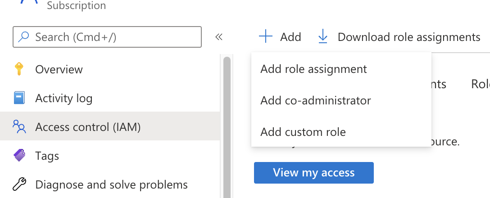
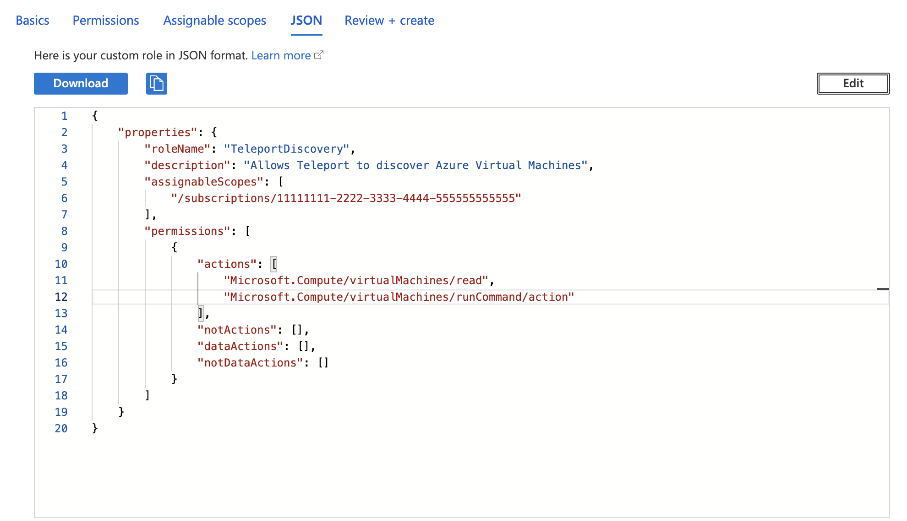

This guide shows you how to set up automatic server discovery for Azure virtual
machines.

## How it works

The Teleport Discovery Service can connect to Azure and automatically
discover and enroll virtual machines matching configured labels. It will then
execute a script on these discovered instances that will install Teleport,
start it and join the cluster.

To discover VMs across multiple subscriptions in a management group, see
[Management Group Azure VM Auto-Discovery](azure-vm-discovery-management-group.mdx).

## Prerequisites

(!docs/pages/includes/edition-prereqs-tabs.mdx!)

- Azure subscription with virtual machines and permissions to create and attach
managed identities.
- Azure virtual machines to join the Teleport cluster, running
Ubuntu/Debian/RHEL if making use of the default Teleport install script. (For
other Linux distributions, you can install Teleport manually.)
- (!docs/pages/includes/tctl.mdx!)

## Step 1/5. Create an Azure invite token

When discovering Azure virtual machines, Teleport makes use of Azure invite tokens for
authenticating joining SSH Service instances.

Create a file called `token.yaml`:

```yaml
# token.yaml
kind: token
version: v2
metadata:
  # the token name is not a secret because instances must prove that they are
  # running in your Azure subscription to use this token
  name: azure-discovery-token
  # set a long expiry time, as the default for tokens is only 30 minutes
  expires: "3000-01-01T00:00:00Z"
spec:
  # use the minimal set of roles required
  roles: [Node]

  # set the join method allowed for this token
  join_method: azure

  azure:
    allow:
    # specify the Azure subscription which Nodes may join from
    - subscription: "00000000-0000-0000-0000-000000000000"
```

Assign the `subscription` field to your Azure subscription ID.

Add the token to the Teleport cluster with:

```code
$ tctl create -f token.yaml
```

## Step 2/5. Configure IAM permissions for Teleport

The Teleport Discovery Service needs Azure IAM permissions to discover and register Azure virtual machines.

(!docs/pages/includes/auto-discovery/azure-vm-configure-service-principal.mdx!)

### Create a custom role

Teleport requires the following permissions to discover and enroll Azure VMs:

- `Microsoft.Compute/virtualMachines/read`
- `Microsoft.Compute/virtualMachines/runCommands/write`
- `Microsoft.Compute/virtualMachines/runCommands/read`
- `Microsoft.Compute/virtualMachineScaleSets/read`
- `Microsoft.Compute/virtualMachineScaleSets/virtualMachines/read`
- `Microsoft.Compute/virtualMachineScaleSets/virtualMachines/runCommands/read`
- `Microsoft.Compute/virtualMachineScaleSets/virtualMachines/runCommands/write`

Here is a sample role definition allowing Teleport to read and run commands on Azure
virtual machines:

```json
{
    "properties": {
        "roleName": "TeleportDiscovery",
        "description": "Allows Teleport to discover Azure virtual machines",
        "assignableScopes": [
            "/subscriptions/11111111-2222-3333-4444-555555555555"
        ],
        "permissions": [
            {
                "actions": [
                    "Microsoft.Compute/virtualMachines/read",
                    "Microsoft.Compute/virtualMachines/runCommands/write",
                    "Microsoft.Compute/virtualMachines/runCommands/read",
                    "Microsoft.Compute/virtualMachineScaleSets/read",
                    "Microsoft.Compute/virtualMachineScaleSets/virtualMachines/read",
                    "Microsoft.Compute/virtualMachineScaleSets/virtualMachines/runCommands/write",
                    "Microsoft.Compute/virtualMachineScaleSets/virtualMachines/runCommands/read"
                ],
                "notActions": [],
                "dataActions": [],
                "notDataActions": []
            }
        ]
    }
}
```

<Admonition type="tip">
Using the role definition above grants Teleport access to enroll VMs and VMs from Virtual Machine Scale Sets (VMSSs).

VMSSs have two orchestration modes: Uniform and, the recommended, [Flexible](https://learn.microsoft.com/en-us/azure/virtual-machine-scale-sets/virtual-machine-scale-sets-orchestration-modes#scale-sets-with-flexible-orchestration-recommended).
If you are not using or don't want to enroll VMSSs with Uniform orchestration mode, you can further limit the permissions granted to Teleport by removing the `Microsoft.Compute/virtualMachineScaleSets/*` permissions.

Navigate to the [Azure portal](https://portal.azure.com/#view/Microsoft_Azure_ComputeHub/ComputeHubMenuBlade/~/virtualMachineScaleSetsBrowse) and look for the Orchestration mode column to check the orchestration mode of your VMSSs and make sure to adjust the role permissions accordingly.
</Admonition>

The `assignableScopes` field above includes a subscription
`/subscriptions/<subscription>`, allowing the role to be assigned at any
resource scope within that subscription or the subscription scope itself. If
you want to further limit the `assignableScopes`, you can use a resource group
`/subscriptions/<subscription>/resourceGroups/<group>` or a management group
`/providers/Microsoft.Management/managementGroups/<group>` instead.

Now go to the [Subscriptions](https://portal.azure.com/#view/Microsoft_Azure_Billing/SubscriptionsBlade) page and select a subscription.

Click on *Access control (IAM)* in the subscription and select *Add > Add custom role*:


In the custom role creation page, click the *JSON* tab and click *Edit*, then paste the JSON example
and replace the subscription in `assignableScopes` with your own subscription id:


### Create a role assignment for the Teleport Discovery Service principal

(!docs/pages/includes/server-access/azure-assign-service-principal.mdx!)

## Step 3/5. Set up an identity for discovered nodes

Every Azure VM to be discovered must have an identity assigned to it: either system assigned or user assigned managed identity.

(!docs/pages/includes/provision-token/azure-join-enable-identity.mdx!)

If the VMs to be discovered have no system-managed identity and more than one user-managed identity assigned to them,
copy the client ID of one of your user-managed identities for Step 5.

## Step 4/5. Install the Teleport Discovery Service

<Admonition type="tip">

If you plan on running the Discovery Service on a host that is already running
another Teleport service (Auth or Proxy, for example), you can skip this step.

</Admonition>

Install Teleport on the virtual machine that will run the Discovery Service:

(!docs/pages/includes/install-linux.mdx!)

## Step 5/5. Configure Teleport to discover Azure instances

(!docs/pages/includes/auto-discovery/azure-vm-configure-discovery-service.mdx!)

<Tabs>
<TabItem label="Dynamic configuration (recommended)">
  Create a Discovery Config resource, that has the same discovery group you configured earlier, to enable Azure VM discovery.

  Create a file named `discovery-azure-prod.yaml` with the following content:
  ```yaml
  kind: discovery_config
  version: v1
  metadata:
    name: example-discovery-config
  spec:
    discovery_group: <Var name="azure-prod" />
    azure:
      - types: ["vm"]
        subscriptions: ["<subscription>"]
        resource_groups: ["<resource-group>"]
        regions: ["<region>"]
        tags:
          "env": "prod" # Match virtual machines where tag:env=prod
        install:
          azure:
            # Optional: If the VMs to discover have more than one managed
            # identity assigned to them, set the client ID here to the client
            # ID of the identity created in step 3.
            client_id: "<client-id>"
  ```
  Adjust the keys under `spec.azure` to match your Azure environment,
  specifically the resource groups, regions and tags you want to associate with the Discovery Service.

  Create the Discovery Config by running the following command:
  ```code
  $ tctl create -f discovery-azure-prod.yaml
  ```

  Matching instances will be added to the Teleport cluster automatically.

  You can update the Discovery Config at any time, and the service will automatically re-apply the changes.
</TabItem>

<TabItem label="Static configuration">
  In order to enable Azure VM discovery the `discovery_service.azure` section
  of `teleport.yaml` must include at least one entry:

  ```yaml
  # teleport.yaml
  # ...
  discovery_service:
    enabled: true
    discovery_group: <Var name="azure-prod" />
    azure:
      - types: ["vm"]
        subscriptions: ["<subscription>"]
        resource_groups: ["<resource-group>"]
        regions: ["<region>"]
        tags:
          "env": "prod" # Match virtual machines where tag:env=prod
        install:
          azure:
            # Optional: If the VMs to discover have more than one managed
            # identity assigned to them, set the client ID here to the client
            # ID of the identity created in step 3.
            client_id: "<client-id>"
  ```
  
  Adjust the keys under `discovery_service.azure` to match your Azure environment, 
  specifically the regions and tags you want to associate with the Discovery Service.
</TabItem>

</Tabs>

## Auto-discovery labels

(!docs/pages/includes/auto-discovery/auto-discovery-labels.mdx!)

## Advanced configuration

(!docs/pages/includes/auto-discovery/azure-vm-advanced-config.mdx!)

## Troubleshooting

### No credential providers error

If you see the error `DefaultAzureCredential: failed to acquire a token.` in Discovery Service logs then Teleport
is not detecting the required credentials to connect to the Azure SDK. Check whether
the credentials have been applied in the machine running the Teleport Discovery Service and restart
the Teleport Discovery Service.
Refer to [Azure SDK Authorization](https://docs.microsoft.com/en-us/azure/developer/go/azure-sdk-authorization)
for more information.

(!docs/pages/includes/auto-discovery/azure-vm-troubleshooting.mdx!)

## Next steps

(!docs/pages/includes/auto-discovery/azure-vm-next-steps.mdx!)
