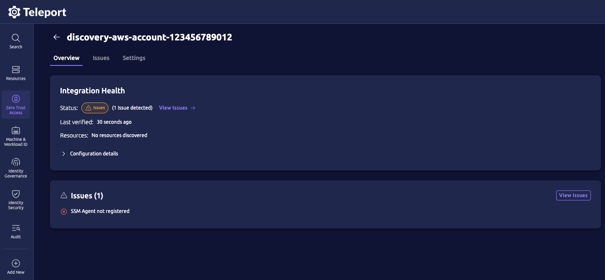
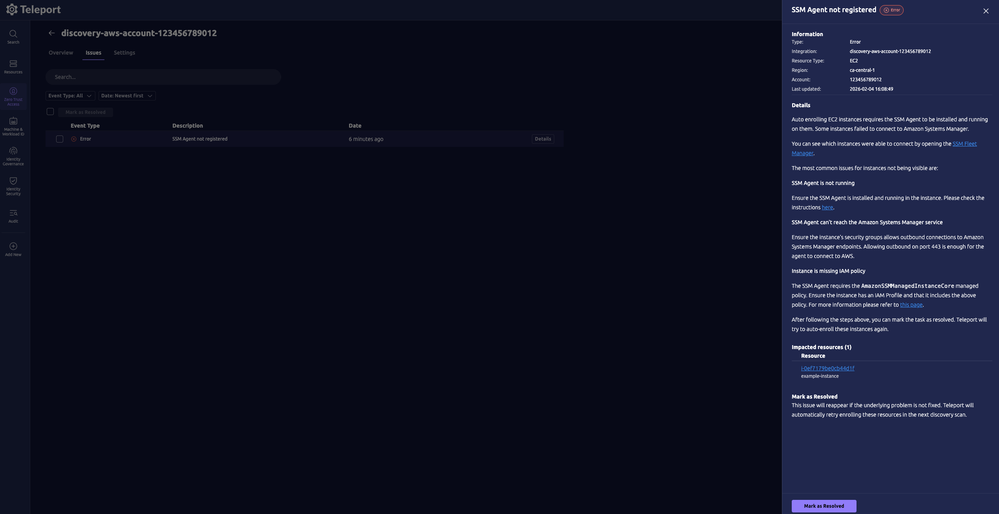
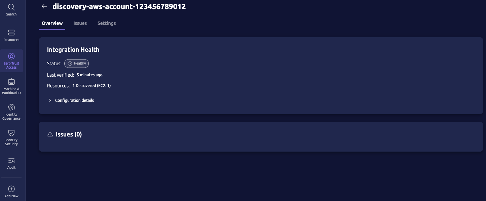

This guide shows you how to use Terraform to configure Teleport and AWS to automatically enroll EC2 instances from your AWS organization into your Teleport cluster.

## How it works

The [`teleport-discovery-aws`](../../../../reference/infrastructure-as-code/terraform-modules/teleport-discovery-aws/teleport-discovery-aws.mdx) Terraform module creates resources in your Teleport cluster and AWS organization to enable Teleport EC2 auto-discovery.

The Teleport Discovery Service queries the AWS API to list matching Accounts, and EC2 instances in each account.
For each EC2 instance that it discovers, the Discovery Service uses AWS Systems Manager (SSM) to install Teleport on the instance and join it to the cluster as a Teleport-protected server.

## Prerequisites

(!docs/pages/includes/edition-prereqs-tabs.mdx!)

- EC2 instances running Ubuntu/Debian/RHEL/Amazon Linux 2/Amazon Linux 2023 and SSM Agent version 3.1 or greater
- (!docs/pages/includes/tctl.mdx!)
- Access to the management account or a member account that is a delegated administrator.
- AWS Terraform provider configured with credentials from the management account or a member account that is a delegated administrator.
- Teleport Terraform provider configured using one of the methods described in [Using the Teleport Terraform Provider](../../../../configuration/terraform-provider/terraform-provider.mdx).

<Admonition type="note">

All EC2 instances added to the Teleport cluster by the Discovery Service must
include the `AmazonSSMManagedInstanceCore` IAM policy in order to receive
commands from the Discovery Service. For a list of permissions included in the
policy, see the [AWS
documentation](https://docs.aws.amazon.com/aws-managed-policy/latest/reference/AmazonSSMManagedInstanceCore.html).

<details>
<summary>AWS IAM permissions required for AWS Terraform provider</summary>

The AWS Terraform provider will need the following AWS IAM permissions to manage AWS resources created by the `teleport-discovery-aws` module:

```json
{
  "Version": "2012-10-17",
  "Statement": [
    {
      "Sid": "TerraformIdentity",
      "Effect": "Allow",
      "Action": "sts:GetCallerIdentity",
      "Resource": "*"
    },
    {
      "Sid": "ManageIamRole",
      "Effect": "Allow",
      "Action": [
        "iam:CreateRole",
        "iam:DeleteRole",
        "iam:GetRole",
        "iam:ListInstanceProfilesForRole",
        "iam:ListRolePolicies",
        "iam:ListRoles",
        "iam:ListRoleTags",
        "iam:TagRole",
        "iam:UntagRole",
        "iam:UpdateAssumeRolePolicy"
      ],
      "Resource": "*"
    },
    {
      "Sid": "ManageIamPolicy",
      "Effect": "Allow",
      "Action": [
        "iam:CreatePolicy",
        "iam:CreatePolicyVersion",
        "iam:DeletePolicy",
        "iam:DeletePolicyVersion",
        "iam:GetPolicy",
        "iam:GetPolicyVersion",
        "iam:ListPolicies",
        "iam:ListPolicyTags",
        "iam:ListPolicyVersions",
        "iam:TagPolicy",
        "iam:UntagPolicy"
      ],
      "Resource": "*"
    },
    {
      "Sid": "ManageRolePolicyAttachments",
      "Effect": "Allow",
      "Action": [
        "iam:AttachRolePolicy",
        "iam:DetachRolePolicy",
        "iam:ListAttachedRolePolicies"
      ],
      "Resource": "*"
    },
    {
      "Sid": "ManageOidcProvider",
      "Effect": "Allow",
      "Action": [
        "iam:CreateOpenIDConnectProvider",
        "iam:DeleteOpenIDConnectProvider",
        "iam:GetOpenIDConnectProvider",
        "iam:ListOpenIDConnectProviders",
        "iam:TagOpenIDConnectProvider",
        "iam:UntagOpenIDConnectProvider",
        "iam:UpdateOpenIDConnectProviderThumbprint"
      ],
      "Resource": "*"
    },
    {
      "Sid": "Organization",
      "Effect": "Allow",
      "Action": [
        "organizations:ListAccounts",
        "organizations:ListRoots",
        "organizations:ListAWSServiceAccessForOrganization",
        "organizations:DescribeOrganization"
      ],
      "Resource": "*"
    }
  ]
}
```

</details>
</Admonition>

## Step 1/7. Install Teleport to run the Discovery Service

<Admonition type="tip">

If you already have a running Discovery Service instance, then assign its `discovery_group` to <Var name="discovery-group-name" /> and proceed to [step 4: Configure AWS Terraform provider](#step-47-configure-the-terraform-module-inputs).

All Teleport Cloud clusters run the Discovery Service for you, so Teleport Cloud subscribers can also skip all of these installation steps.

</Admonition>

If you plan on running the Discovery Service on the same host already running
another Teleport service (Auth or Proxy, for example), then you can skip this step.

Install Teleport on a host instance that will run the Discovery Service:

(!docs/pages/includes/install-linux.mdx!)

## Step 2/7. Configure the Discovery Service

If you are running the Discovery Service on its own host, the service requires a
valid invite token to connect to the cluster. Generate one by running the
following command against your Teleport Auth Service:

```code
$ tctl tokens add --type=discovery
```

Save the generated token in `/tmp/token` on the Teleport Agent instance that will run the Discovery Service.

(!docs/pages/includes/discovery/discovery-group.mdx!)

Assign <Var name="teleport.example.com:443" /> to the host and port of the Teleport Proxy Service in your cluster,
and <Var name="discovery-group-name" /> to a name that identifies a group of resources that you will enroll:

```yaml
# teleport.yaml
version: v3
teleport:
  join_params:
    # token_name can be a literal token string or a path to a file.
    # File path is preferable to avoid including a secret in the config file.
    token_name: "/tmp/token"
    method: token
  proxy_server: "<Var name="teleport.example.com:443" />"
auth_service:
  enabled: false
proxy_service:
  enabled: false
ssh_service:
  enabled: false
discovery_service:
  enabled: true
  discovery_group: "<Var name="discovery-group-name" />"
```

## Step 3/7. Start Teleport Discovery Service

(!docs/pages/includes/aws-credentials.mdx service="the Discovery Service"!)

(!docs/pages/includes/start-teleport.mdx service="the Discovery Service"!)

## Step 4/7. Configure the Terraform module inputs

Add the `teleport-discovery-aws` module to your Terraform configuration.

<Tabs>

<TabItem label="Teleport Cloud">
```hcl
module "aws_discovery" {
  source = "terraform.releases.teleport.dev/teleport/discovery/aws"
  version = "~> (=cloud.major_version=).0"

  # Required inputs:
  # Assign <Var name="example.teleport.sh:443" /> to the public address of the Teleport Proxy Service in your cluster in host:port form.
  teleport_proxy_public_addr = "<Var name="example.teleport.sh:443" />"
  # teleport_discovery_group_name must match the discovery group name in your Discovery Service config file.
  # Teleport Cloud clusters run the Discovery Service in the group name "cloud-discovery-group".
  # Do not modify this input unless you intend to run your own Discovery Service.
  teleport_discovery_group_name = "cloud-discovery-group"

  # Enable AWS Organization discovery.
  aws_organization_discovery = {
    organizational_units = {
      # The wildcard "*" matches all organizational units.
      # You can also specify a list of organizational unit IDs to match (eg, "ou-1a2b-rg12qq2b")
      include = ["*"]

      # You can also specify a list of organizational unit IDs to exclude from discovery.
      # exclude = ["ou-1a2b-rg12qq2b"]
      # Excluded organizational units will not be discovered, even if they are included in the "include" list.
    }
  }

  # Each child account in the organization must have an IAM role with this name.
  # This role is assumed by the Discovery Service to enroll resources from that account.
  # The required trust relationship and permissions for this role can be found in the module outputs and documentation.
  aws_child_account_iam_role_name = "teleport-organization-discovery-child-account-role"

  # Optional inputs:
  # Apply the additional AWS tag "origin=example" to all AWS resources created by this module
  apply_aws_tags = { origin = "example" }
  # Apply the additional Teleport label "origin=example" to all Teleport resources created by this module
  apply_teleport_resource_labels = { origin = "example" }

  # Discover EC2 instances using matching rules.
  # Accepts "*" to discover across all enabled regions.
  # The module adds account:ListRegions to the IAM policy automatically when "*" is used.
  aws_matchers = [
    {
      types = ["ec2"]
      # EC2 discovery supports a wildcard to find instances in all regions.
      regions = ["*"]
      tags = {
        env = ["prod"]
      }
    }
  ]
}
```
</TabItem>

<TabItem label="Self-hosted">

```hcl
module "aws_discovery" {
  source = "terraform.releases.teleport.dev/teleport/discovery/aws"
  version = "~> (=teleport.major_version=).0"

  # Required inputs:
  # Edit this input to the host and port of the Teleport Proxy Service in your cluster
  teleport_proxy_public_addr    = "<Var name="teleport.example.com:443" />"
  # Edit this input to match the discovery group name in your Discovery Service config file
  teleport_discovery_group_name = "<Var name="discovery-group-name" />"

  # Enable AWS Organization discovery.
  aws_organization_discovery = {
    organizational_units = {
      # The wildcard "*" matches all organizational units.
      # You can also specify a list of organizational unit IDs to match (eg, "ou-1a2b-rg12qq2b")
      include = ["*"]

      # You can also specify a list of organizational unit IDs to exclude from discovery.
      # exclude = ["ou-1a2b-rg12qq2b"]
      # Excluded organizational units will not be discovered, even if they are included in the "include" list.
    }
  }

  # Each child account in the organization must have an IAM role with this name.
  # This role is assumed by the Discovery Service to enroll resources from that account.
  # The required trust relationship and permissions for this role can be found in the module outputs and documentation.
  aws_child_account_iam_role_name = "teleport-organization-discovery-child-account-role"

  # Discover EC2 instances using matching rules.
  # Accepts "*" to discover across all enabled regions.
  # The module adds account:ListRegions to the IAM policy automatically when "*" is used.
  aws_matchers = [
    {
      types = ["ec2"]
      # EC2 discovery supports a wildcard to find instances in all regions.
      regions = ["*"]
      tags = {
        env = ["prod"]
      }
    }
  ]
}
```

<Admonition type="note">

By default, the `teleport-discovery-aws` Terraform module configures an AWS OIDC integration for discovery and enrollment of EC2 instances.
However, this requires the Teleport Proxy Service to be reachable on the public internet.

If your cluster is running in a private network and the Proxy Service is not reachable on the public internet, you can disable the OIDC integration and assign the necessary IAM permissions for discovering and enrolling EC2 instances.

You can disable the AWS OIDC integration by setting the following:
```hcl
  discovery_service_iam_credential_source = {
    use_oidc_integration = false
  }
  # This role must be created manually and be assigned to the Discovery Service.
  aws_organization_discovery_iam_principal_arn = "arn:aws:iam::<root-account-id>:role/teleport-organization-account-enumeration"
```

After applying the terraform module, run `terraform output` to obtain the IAM role templates for the Discovery Service and Auth Service:

```hcl
aws_discovery = {
  # ...
  "teleport_organization_account_enumeration_iam_role_template" = {
    "policy" = <<-EOT
    {
      "Version": "2012-10-17",
      "Statement": [
        {
          "Effect": "Allow",
          "Action": [
            "organizations:ListRoots",
            "organizations:ListChildren",
            "organizations:ListAccountsForParent"
          ],
          "Resource": "*"
        },
        {
          "Effect": "Allow",
          "Action": "sts:AssumeRole",
          "Resource": "arn:aws:iam::*:role/teleport-organization-discovery-child-account-role",
          "Condition": {
            "StringEquals": {
              "aws:ResourceOrgID": "<aws-organization-id>"
            }
          }
        }
      ]
    }
    EOT
    "role_name" = "teleport-organization-account-enumeration"
  }
  "teleport_organization_join_validation_iam_role_template" = {
    "policy" = <<-EOT
    {
      "Version": "2012-10-17",
      "Statement": [
        {
          "Effect": "Allow",
          "Action": "organizations:DescribeAccount",
          "Resource": "*"
        }
      ]
    }
    EOT
    "role_name" = "teleport-organization-join-validation"
  }
}
```
The IAM role attached to the Discovery Service must have the policy defined in `teleport_organization_account_enumeration_iam_role_template`.
The role attached to the Auth Service must have the policy defined in `teleport_organization_join_validation_iam_role_template`.

In setups where the Discovery Service and Auth Service are running from the same process, you can combine the two policies into a single IAM role and attach it to the instance that is running the services.

</Admonition>

</TabItem>

</Tabs>

Add a Terraform output for the module so that Terraform will display its outputs:

```hcl
output "aws_discovery" {
  value = module.aws_discovery
}
```

See the [`teleport-discovery-aws` reference](../../../../reference/infrastructure-as-code/terraform-modules/teleport-discovery-aws/teleport-discovery-aws.mdx) for a complete description of the module inputs and outputs.

## Step 5/7. Apply the Terraform module

```code
$ terraform init
$ terraform apply
```

Terraform should plan to create the following resources:
- AWS IAM role for Teleport Discovery Service to assume
- AWS IAM policy that grants the AWS permissions necessary for Teleport to enumerate AWS accounts and assume roles in other accounts within the AWS Organization
- AWS IAM policy attachment to attach the IAM policy to the Discovery Service IAM role
- AWS OIDC Provider for Teleport Discovery Service to assume an IAM role using OIDC.
- Teleport `discovery_config` cluster resource that configures Teleport for AWS resource discovery.
- Teleport `integration` cluster resource for AWS OIDC
- Teleport `token` cluster resource that allows Teleport nodes to use AWS IAM credentials to join the cluster

Review the Terraform plan and confirm the plan actions.

After Terraform finishes applying the plan, it should display the module outputs:

```
aws_discovery = {
  "aws_child_account_iam_role_template" = {
    "assume_role_policy" = <<-EOT
    {
      "Version": "2012-10-17",
      "Statement": [
        {
          "Effect": "Allow",
          "Action": "sts:AssumeRole",
          "Principal": {
            "AWS": "arn:aws:iam::<root-account-id>:role/teleport-discovery-<random-id>"
          },
          "Condition": {
            "StringEquals": {
              "aws:PrincipalOrgID": "<aws-organization-id>"
            }
          }
        }
      ]
    }
    EOT
    "policy" = <<-EOT
    {
      "Version": "2012-10-17",
      "Statement": [
        {
          "Effect": "Allow",
          "Action": [
            "ssm:SendCommand",
            "ssm:ListCommandInvocations",
            "ssm:GetCommandInvocation",
            "ssm:DescribeInstanceInformation",
            "ec2:DescribeInstances",
            "account:ListRegions"
          ],
          "Resource": "*"
        }
      ]
    }
    EOT
    "role_name" = "teleport-organization-discovery-child-account-role"
  }
  "aws_oidc_provider_arn" = "arn:aws:iam::<root-account-id>:oidc-provider/example.teleport.sh"
  "teleport_discovery_config_name" = "discovery-aws-organization-<aws-organization-id>"
  "teleport_discovery_service_iam_policy_arn" = null
  "teleport_discovery_service_iam_role_arn" = "arn:aws:iam::<root-account-id>:role/teleport-discovery-<random-id>"
  "teleport_integration_name" = "discovery-aws-organization-<aws-organization-id>"
  "teleport_organization_account_enumeration_iam_policy_arn" = "arn:aws:iam::<root-account-id>:policy/teleport-organization-account-enumeration-<random-id>"
  "teleport_organization_account_enumeration_iam_role_template" = null /* object */
  "teleport_organization_join_validation_iam_policy_arn" = "arn:aws:iam::<root-account-id>:policy/teleport-organization-join-validation-<random-id>"
  "teleport_organization_join_validation_iam_role_template" = null /* object */
  "teleport_provision_token_name" = "discovery-aws-organization-<aws-organization-id>"
}
```

The AWS resources should have the following tags:
- `origin=example`
- `teleport.dev/cluster=<cluster-name>`
- `teleport.dev/integration=discovery-aws-organization-<aws-organization-id>`
- `teleport.dev/iac-tool=terraform`

The Teleport resources should have the following labels:
- `origin=example`
- `teleport.dev/iac-tool=terraform`

## Step 6/7. Configure child accounts

Each AWS account within the organization must have an IAM role which will be assumed by the Teleport Discovery Service to discover and enroll EC2 instances in that account.

Run the following command to obtain the IAM role name, trust relationship policy and permissions policy:

```code
$ terraform output
```

You will obtain the following output:
```
$ terraform output
aws_discovery = {
  "aws_child_account_iam_role_template" = {
    "assume_role_policy" = <<-EOT
    {
      "Version": "2012-10-17",
      "Statement": [
        {
          "Effect": "Allow",
          "Action": "sts:AssumeRole",
          "Principal": {
            "AWS": "arn:aws:iam::<root-account-id>:role/teleport-discovery-<random-id>"
          },
          "Condition": {
            "StringEquals": {
              "aws:PrincipalOrgID": "<aws-organization-id>"
            }
          }
        }
      ]
    }
    EOT
    "policy" = <<-EOT
    {
      "Version": "2012-10-17",
      "Statement": [
        {
          "Effect": "Allow",
          "Action": [
            "ssm:SendCommand",
            "ssm:ListCommandInvocations",
            "ssm:GetCommandInvocation",
            "ssm:DescribeInstanceInformation",
            "ec2:DescribeInstances",
            "account:ListRegions"
          ],
          "Resource": "*"
        }
      ]
    }
    EOT
    "role_name" = "teleport-organization-discovery-child-account-role"
  }
  // ...
}
```

Create an IAM role in each target account using the `role_name`, `assume_role_policy` and `policy` from the Terraform output `aws_child_account_iam_role_template` variable.

## Step 7/7. Check discovery status

After applying the Terraform module and creating the IAM role in each child account, the Teleport Discovery Service should start to discover EC2 instances in your AWS organization and enroll them in your cluster as protected resources.

<Admonition type="note">

It may take a few minutes for EC2 instances to be discovered and enrolled.

</Admonition>

Navigate to the Teleport Web UI and select `Zero Trust Access > Integrations`.
By default, the integration created by the `teleport-discovery-aws` Terraform module is named `discovery-aws-organization-<aws-organization-id>`.

Click on the integration for your AWS organization
 to review the discovery status.

The integration page provides an overview of how many EC2 instances have been discovered and any issues encountered during the discovery process.



In the example above we can see there was an issue with the AWS SSM agent on the instance.

If we navigate to the "issues" tab and click on "Details" we can see more information about the issue:



In this case the issue is that the EC2 instance does not have an IAM role with the `AmazonSSMManagedInstanceCore` IAM policy attached to it, so the instance cannot receive SSM commands.

We can fix this by attaching the `AmazonSSMManagedInstanceCore` IAM policy to the EC2 instance's role and waiting for the Discovery Service to reattempt the installation with SSM. It may take several minutes for the next discovery scan to run and install Teleport on the instance.

When all of the discovered EC2 instances have successfully joined the Teleport cluster, the overview page will display a healthy status:



## Updating module configuration

The module inputs can be changed and re-applied to adjust the AWS discovery integration.

For example, if you had previously used specific AWS regions (rather than the wildcard default for all regions), then you can adjust `regions` (within `aws_matchers`) to include additional regions for EC2 discovery and re-apply the module to start enrolling instances in those regions as well.


```diff
-regions = ["us-west-1"]
+regions = ["us-west-1", "us-east-1"]
```

Apply Terraform again:

```code
$ terraform apply
```

Review the Terraform plan before confirming the changes.

After Terraform finishes applying its plan, the Discovery Service will pick up the change to the dynamic `discovery_config` and begin to enroll EC2 instances in `us-east-1` as well.

## Troubleshooting

(!docs/pages/includes/auto-discovery/ec2-troubleshooting.mdx!)

## Next steps

(!docs/pages/includes/auto-discovery/ec2-next-steps.mdx!)
