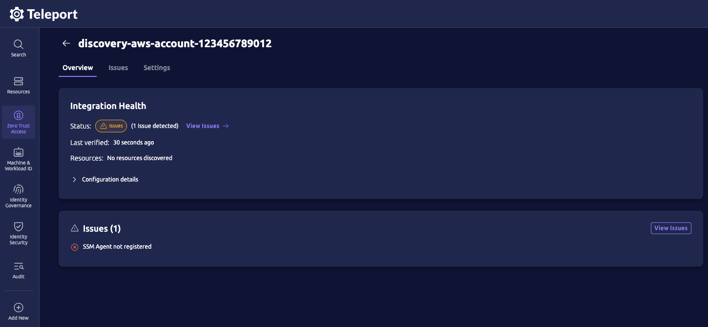
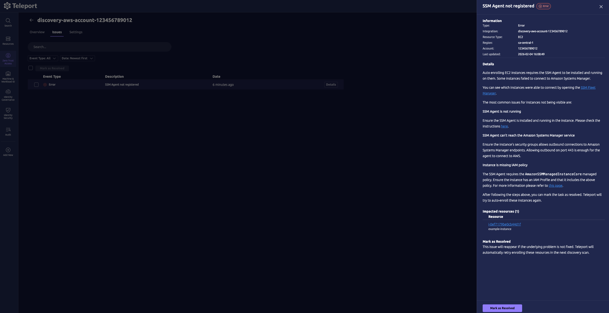
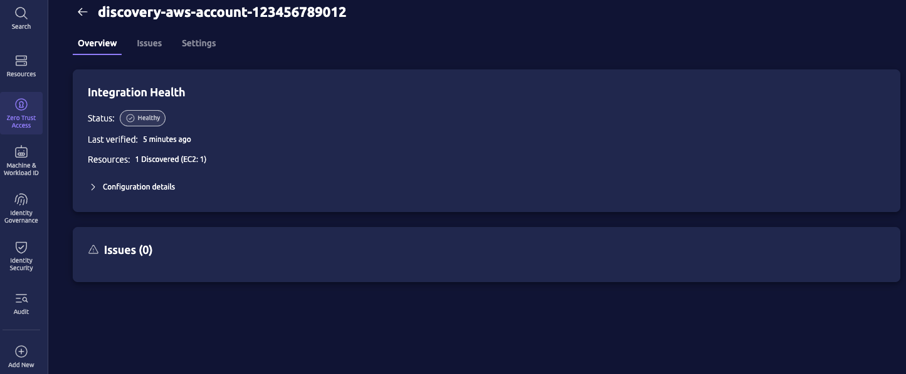

This guide shows you how to use Terraform to configure Teleport and AWS to automatically enroll EC2 instances in your cluster.

## How it works

The [`teleport-discovery-aws`](../../../../reference/infrastructure-as-code/terraform-modules/teleport-discovery-aws/teleport-discovery-aws.mdx) Terraform module creates resources in your Teleport cluster and AWS account to enable Teleport EC2 auto-discovery.

The Teleport Discovery Service queries the AWS API to list EC2 instances in your account.
For each EC2 instance that it discovers, the Discovery Service uses AWS Systems Manager (SSM) to install Teleport on the instance and join it to the cluster as a Teleport-protected server.

## Prerequisites

(!docs/pages/includes/edition-prereqs-tabs.mdx!)

- EC2 instances running Ubuntu/Debian/RHEL/Amazon Linux 2/Amazon Linux 2023 and
SSM Agent version 3.1 or greater
- (!docs/pages/includes/tctl.mdx!)

<Admonition type="note">

All EC2 instances added to the Teleport cluster by the Discovery Service must
include the `AmazonSSMManagedInstanceCore` IAM policy in order to receive
commands from the Discovery Service. For a list of permissions included in the
policy, see the [AWS
documentation](https://docs.aws.amazon.com/aws-managed-policy/latest/reference/AmazonSSMManagedInstanceCore.html).

</Admonition>

## Install Teleport to run the Discovery Service

<Admonition type="tip">

If you already have a running Discovery Service instance, then assign its `discovery_group` to <Var name="discovery-group-name" /> and proceed to [use the `teleport-discovery-aws` Terraform module](#use-the-teleport-discovery-aws-terraform-module).

All Teleport Cloud clusters run the Discovery Service for you, so Teleport Cloud subscribers can also skip all of these installation steps.

</Admonition>

### Step 1/3. Install Teleport

If you plan on running the Discovery Service on the same host already running
another Teleport service (Auth or Proxy, for example), then you can skip this step.

Install Teleport on a host instance that will run the Discovery Service:

(!docs/pages/includes/install-linux.mdx!)

### Step 2/3. Configure the Discovery Service

If you are running the Discovery Service on its own host, the service requires a
valid invite token to connect to the cluster. Generate one by running the
following command against your Teleport Auth Service:

```code
$ tctl tokens add --type=discovery
```

Save the generated token in `/tmp/token` on the Node (EC2 instance) that will
run the Discovery Service.

(!docs/pages/includes/discovery/discovery-group.mdx!)

Assign <Var name="teleport.example.com:443" /> to the host and port of the Teleport Proxy Service in your cluster,
and <Var name="discovery-group-name" /> to a name that identifies a group of resources that you will enroll:

```yaml
# teleport.yaml
version: v3
teleport:
  join_params:
    # token_name can be a literal token string or a path to a file.
    # File path is preferable to avoid including a secret in the config file.
    token_name: "/tmp/token"
    method: token
  proxy_server: "<Var name="teleport.example.com:443" />"
auth_service:
  enabled: false
proxy_service:
  enabled: false
ssh_service:
  enabled: false
discovery_service:
  enabled: true
  discovery_group: "<Var name="discovery-group-name" />"
```

### Step 3/3. Start Teleport

(!docs/pages/includes/aws-credentials.mdx service="the Discovery Service"!)

(!docs/pages/includes/start-teleport.mdx service="the Discovery Service"!)

## Use the `teleport-discovery-aws` Terraform module

### Step 1/5. Configure AWS Terraform provider

Configure the [AWS Terraform provider](https://registry.terraform.io/providers/hashicorp/aws/latest/docs) and AWS IAM permissions for Terraform to manage AWS resources.

<details>
<summary>AWS IAM permissions required for AWS Terraform provider</summary>

The AWS Terraform provider will need the following AWS IAM permissions to manage AWS resources created by the `teleport-discovery-aws` module:

```json
{
  "Version": "2012-10-17",
  "Statement": [
    {
      "Sid": "TerraformIdentity",
      "Effect": "Allow",
      "Action": "sts:GetCallerIdentity",
      "Resource": "*"
    },
    {
      "Sid": "ManageIamRole",
      "Effect": "Allow",
      "Action": [
        "iam:CreateRole",
        "iam:DeleteRole",
        "iam:GetRole",
        "iam:ListInstanceProfilesForRole",
        "iam:ListRolePolicies",
        "iam:ListRoles",
        "iam:ListRoleTags",
        "iam:TagRole",
        "iam:UntagRole",
        "iam:UpdateAssumeRolePolicy"
      ],
      "Resource": "*"
    },
    {
      "Sid": "ManageIamPolicy",
      "Effect": "Allow",
      "Action": [
        "iam:CreatePolicy",
        "iam:CreatePolicyVersion",
        "iam:DeletePolicy",
        "iam:DeletePolicyVersion",
        "iam:GetPolicy",
        "iam:GetPolicyVersion",
        "iam:ListPolicies",
        "iam:ListPolicyTags",
        "iam:ListPolicyVersions",
        "iam:TagPolicy",
        "iam:UntagPolicy"
      ],
      "Resource": "*"
    },
    {
      "Sid": "ManageRolePolicyAttachments",
      "Effect": "Allow",
      "Action": [
        "iam:AttachRolePolicy",
        "iam:DetachRolePolicy",
        "iam:ListAttachedRolePolicies"
      ],
      "Resource": "*"
    },
    {
      "Sid": "ManageOidcProvider",
      "Effect": "Allow",
      "Action": [
        "iam:CreateOpenIDConnectProvider",
        "iam:DeleteOpenIDConnectProvider",
        "iam:GetOpenIDConnectProvider",
        "iam:ListOpenIDConnectProviders",
        "iam:TagOpenIDConnectProvider",
        "iam:UntagOpenIDConnectProvider",
        "iam:UpdateOpenIDConnectProviderThumbprint"
      ],
      "Resource": "*"
    }
  ]
}
```

</details>


### Step 2/5. Configure Teleport Terraform provider

There are several ways to configure the Teleport Terraform provider depending on how you intend to run Terraform, for example in CI, Spacelift, or some other remote environment, but for a quick start, see the [Local Demo](../../../../zero-trust-access/infrastructure-as-code/terraform-provider/local.mdx) guide.

The local demo guide walks through configuring the Teleport Terraform provider with local Teleport credentials, which is typically as simple as logging in with `tsh` and running a `tctl` command from the same shell that you use to run `terraform` commands:

```code
$ tsh login
$ eval "$(tctl terraform env)"
```

If you are running Terraform in a remote environment, such as a cloud VM, an on-prem server, or CI/CD pipelines, refer to [Using the Teleport Terraform Provider](../../../../zero-trust-access/infrastructure-as-code/terraform-provider/terraform-provider.mdx) to find the appropriate guide for your use case.

### Step 3/5. Configure the Terraform module inputs

Add the `teleport-discovery-aws` module to your Terraform configuration.

<Tabs>

<TabItem label="cloud">
```hcl
module "aws_discovery" {
  source = "terraform.releases.teleport.dev/teleport/discovery/aws"
  version = "~> (=cloud.major_version=).0"

  # Required inputs:
  # Assign <Var name="example.teleport.sh:443" /> to your Teleport cluster's proxy public address in host:port form.
  teleport_proxy_public_addr = "https://<Var name="example.teleport.sh:443" />"
  # teleport_discovery_group_name must match the discovery group name in your Discovery Service config file.
  # Teleport Cloud clusters run the Discovery Service in the group name "cloud-discovery-group".
  # Do not modify this input unless you intend to run your own Discovery Service.
  teleport_discovery_group_name = "cloud-discovery-group"
  # Discover EC2 instances
  match_aws_resource_types = ["ec2"]

  # Optional inputs:
  # Apply the additional AWS tag "origin=example" to all AWS resources created by this module
  apply_aws_tags = { origin = "example" }
  # Apply the additional Teleport label "origin=example" to all Teleport resources created by this module
  apply_teleport_resource_labels = { origin = "example" }
  # match_aws_regions is a list of regions in which the Discovery Service will match and discover EC2 instances.
  # The wildcard "*" is the default and matches all regions.
  match_aws_regions = ["*"]
  # match_aws_tags are AWS tags to match when discovering EC2 instances.
  # Only EC2 instances with matching tags will be discovered.
  # The wildcard {"*" : ["*"]} is the default and matches all tags.
  match_aws_tags = { "*" : ["*"] }
}
```
</TabItem>

<TabItem label="self-hosted">
```hcl
module "aws_discovery" {
  source = "terraform.releases.teleport.dev/teleport/discovery/aws"
  version = "~> (=teleport.major_version=).0"

  # Required inputs:
  # Edit this input to the host and port of the Teleport Proxy Service in your cluster
  teleport_proxy_public_addr    = "https://<Var name="teleport.example.com:443" />"
  # Edit this input to match the discovery group name in your Discovery Service config file
  teleport_discovery_group_name = "<Var name="discovery-group-name" />"
  # Discover EC2 instances
  match_aws_resource_types = ["ec2"]

  # Optional inputs:
  # Apply the additional AWS tag "origin=example" to all AWS resources created by this module
  apply_aws_tags = { origin = "example" }
  # Apply the additional Teleport label "origin=example" to all Teleport resources created by this module
  apply_teleport_resource_labels = { origin = "example" }
  # match_aws_regions is a list of regions in which the Discovery Service will match and discover EC2 instances.
  # The wildcard "*" is the default and matches all regions.
  match_aws_regions = ["*"]
  # match_aws_tags are AWS tags to match when discovering EC2 instances.
  # Only EC2 instances with matching tags will be discovered.
  # The wildcard {"*" : ["*"]} is the default and matches all tags.
  match_aws_tags = { "*" : ["*"] }
}
```
</TabItem>

{/*
TODO(gavin): add instructions for the scenario where a self-hosted Teleport cluster cannot be reached on the public internet.
In this case, they need to use a different IAM credential source because OIDC federation will not work. 
The discovery team has not yet come to a consensus on how we want to approach this use-case, so it is currently out of scope.
*/}

</Tabs>

Add a Terraform output for the module so that Terraform will display its outputs:

```hcl
output "aws_discovery" {
  value = module.aws_discovery
}
```

See the [`teleport-discovery-aws` reference](../../../../reference/infrastructure-as-code/terraform-modules/teleport-discovery-aws/teleport-discovery-aws.mdx) for a complete description of the module inputs and outputs.

### Step 4/5. Apply the Terraform module

```code
$ terraform init
$ terraform apply
```

Terraform should plan to create the following resources:
- AWS IAM role for Teleport Discovery Service to assume
- AWS IAM policy that grants the AWS permissions necessary for Teleport to discover resources in AWS
- AWS IAM policy attachment to attach the IAM policy to the Discovery Service IAM role
- AWS OIDC Provider for Teleport Discovery Service to assume an IAM role using OIDC.
- Teleport `discovery_config` cluster resource that configures Teleport for AWS resource discovery.
- Teleport `integration` cluster resource for AWS OIDC
- Teleport `token` cluster resource that allows Teleport nodes to use AWS IAM credentials to join the cluster

Review the Terraform plan and confirm the plan actions.

After Terraform finishes applying the plan, it should display the module outputs:

```
aws_discovery = {
  "aws_oidc_provider_arn" = "arn:aws:iam::123456789012:oidc-provider/example.teleport.sh"
  "teleport_discovery_config_name" = "discovery-aws-account-123456789012"
  "teleport_discovery_service_iam_policy_arn" = "arn:aws:iam::123456789012:policy/teleport-discovery-<timestamp>"
  "teleport_discovery_service_iam_role_arn" = "arn:aws:iam::123456789012:role/teleport-discovery-<timestamp>"
  "teleport_integration_name" = "discovery-aws-account-123456789012"
  "teleport_provision_token_name" = "discovery-aws-account-123456789012"
}
```

The AWS resources should have the following tags:
- `origin=example`
- `teleport.dev/cluster=<cluster-name>`
- `teleport.dev/integration=discovery-aws-account-<account-id>`
- `teleport.dev/iac-tool=terraform`

The Teleport resources should have the following labels:
- `origin=example`
- `teleport.dev/iac-tool=terraform`

### Step 5/5. Check discovery status

After applying the Terraform module, the Teleport Discovery Service should start to discover EC2 instances in your AWS account and enroll them in your cluster as protected resources.

<Admonition type="note">

It may take a few minutes for EC2 instances to be discovered and enrolled.

</Admonition>

Navigate to the Teleport Web UI and select `Zero Trust Access > Integrations`.
By default, the integration created by the `teleport-discovery-aws` Terraform module is named `discovery-aws-account-<aws-account-id>`.

Click on the integration for your AWS account to review the discovery status.

The integration page provides an overview of how many EC2 instances have been discovered and any issues encountered during the discovery process.



In the example above we can see there was an issue with the AWS SSM agent on the instance.

If we navigate to the "issues" tab and click on "Details" we can see more information about the issue:



In this case the issue is that the EC2 instance does not have an IAM role with the `AmazonSSMManagedInstanceCore` IAM policy attached to it, so the instance cannot receive SSM commands.

We can fix this by attaching the `AmazonSSMManagedInstanceCore` IAM policy to the EC2 instance's role and waiting for the Discovery Service to reattempt the installation with SSM. It may take several minutes for the next discovery scan to run and install Teleport on the instance.

When all of the discovered EC2 instances have successfully joined the Teleport cluster, the overview page will display a healthy status:



## Updating module configuration

The module inputs can be changed and re-applied to adjust the AWS discovery integration.

For example, if you had previously used specific AWS regions (rather than the wildcard default for all regions), then you can adjust `match_aws_regions` to include additional regions for EC2 discovery and re-apply the module to start enrolling instances in those regions as well.


```diff
-match_aws_regions = ["us-west-1"]
+match_aws_regions = ["us-west-1", "us-east-1"]
```

Apply Terraform again:

```code
$ terraform apply
```

Review the Terraform plan before confirming the changes.

After Terraform finishes applying its plan, the Discovery Service will pick up the change to the dynamic `discovery_config` and begin to enroll EC2 instances in `us-east-1` as well.

## Troubleshooting

(!docs/pages/includes/auto-discovery/ec2-troubleshooting.mdx!)

## Next steps

(!docs/pages/includes/auto-discovery/ec2-next-steps.mdx!)
