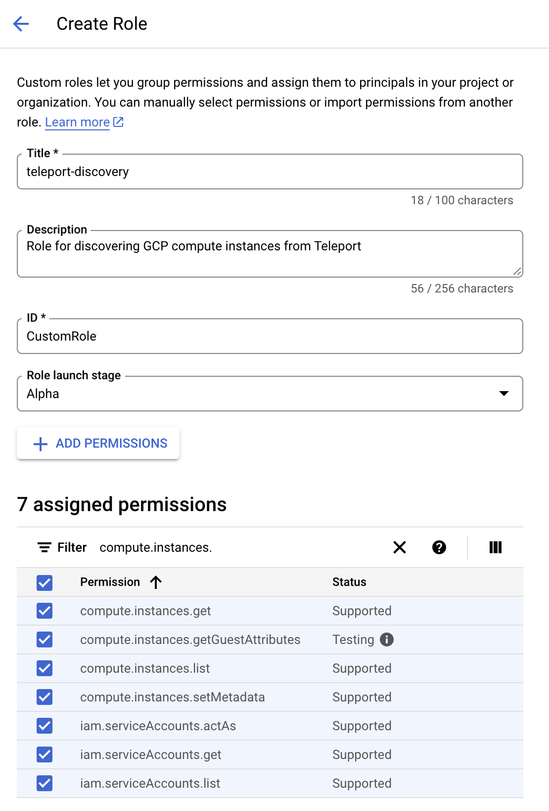
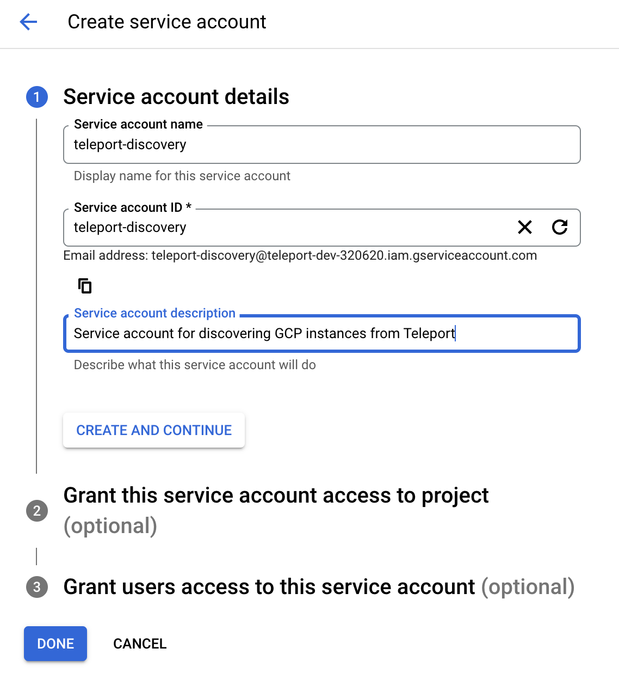
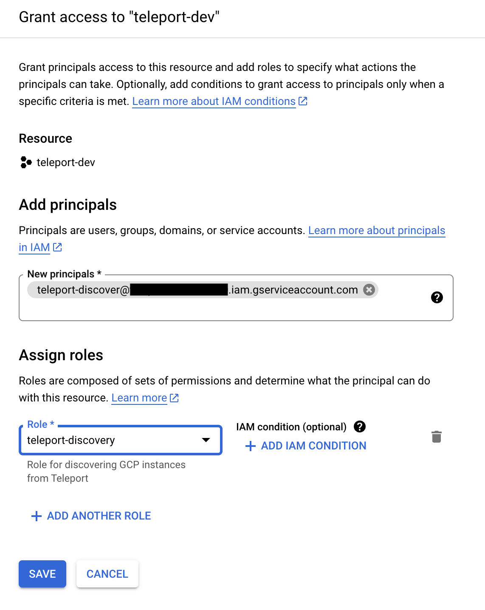
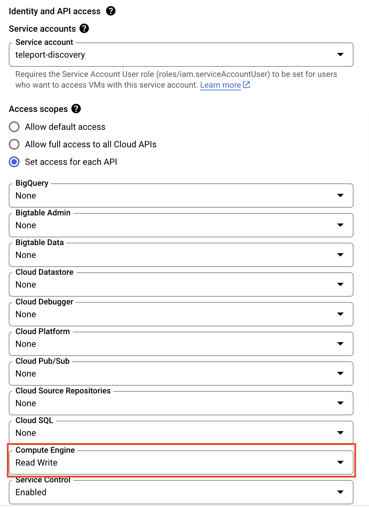

The Teleport Discovery Service can connect to GCP and automatically
discover and enroll GCP Compute Engine instances matching configured labels. It will then
execute a script on these discovered instances that will install Teleport,
start it and join the cluster.

## Prerequisites

(!docs/pages/includes/edition-prereqs-tabs.mdx!)

- A GCP compute instance to run the Discovery Service on.
- GCP compute instances to join the Teleport cluster, running
Ubuntu/Debian/RHEL if making use of the default Teleport install script. (For
other Linux distributions, you can install Teleport manually.)
- (!docs/pages/includes/tctl.mdx!)

## Step 1/6. Create a GCP invite token

When discovering GCP compute instances, Teleport makes use of GCP invite tokens for
authenticating joining SSH Service instances.

Create a file called `token.yaml`:

```yaml
# token.yaml
kind: token
version: v2
metadata:
  # the token name is not a secret because instances must prove that they are
  # running in your GCP project to use this token
  name: gcp-discovery-token
spec:
  # use the minimal set of roles required (e.g. Node, Proxy, App, Kube, DB, WindowsDesktop)
  roles: [Node]

  # set the join method allowed for this token
  join_method: gcp

  gcp:
    allow:
      # The GCP project ID(s) that VMs can join from.
      - project_ids: []
        # (Optional) The locations that VMs can join from. Note: both regions and
        # zones are accepted.
        locations: []
        # (Optional) The email addresses of service accounts that VMs can join
        # with.
        service_accounts: []
```

Add your instance's project ID(s) to the `project_ids` field.
Add the token to the Teleport cluster with:

```code
$ tctl create -f token.yaml
```

## Step 2/6. Configure IAM permissions for Teleport

Create a service account that will give Teleport IAM permissions needed to
discover instances.

<Tabs>
<TabItem label="Console">
  Go to [IAM > Roles](https://console.cloud.google.com/iam-admin/roles)
  in the GCP console and click *+ Create Role*.
  Pick a name for the role (e.g. `teleport-discovery`) and give it the following permissions:
  - `compute.instances.get`
  - `compute.instances.getGuestAttributes`
  - `compute.instances.list`
  - `compute.instances.setMetadata`
  - `iam.serviceAccounts.actAs`
  - `iam.serviceAccounts.get`
  - `iam.serviceAccounts.list`

  

  Click *Create*.

  Go to [IAM > Service accounts](https://console.cloud.google.com/iam-admin/serviceaccounts)
  and click *+ Create Service Account*. Pick a name for the service account
  (e.g. `teleport-discovery`) and copy its email address to your clipboard.
  Click *Create and Continue*.

  

  Go to [IAM](https://console.cloud.google.com/iam-admin/iam) and click *Grant Access*.
  Paste the service account's email into the *New principals* field and select
  your custom role. Click *Save*.

  

  If the Discovery Service will run in a GCP compute instance, edit the instance and
  assign the service account to the instance and set its access scopes to include 
  Read Write access to the Compute API.

  
</TabItem>
<TabItem label="gcloud">
  Copy the following and paste it into a file called `teleport-discovery-role.yaml`:
  ```yaml
  # teleport-discovery-role.yaml
  title: "teleport-discovery"
  description: "A role to enable Teleport to discover GCP compute instances"
  stage: "ALPHA"
  includedPermissions:
  - compute.instances.get
  - compute.instances.getGuestAttributes
  - compute.instances.list
  - compute.instances.setMetadata
  - iam.serviceAccounts.actAs
  - iam.serviceAccounts.get
  - iam.serviceAccounts.list
  ```

  Then run the following command to create the role:
  ```code
  $ gcloud iam roles create teleport_discovery \
  --project=<Var name="project_id" description="GCP project ID" /> \
  --file=teleport-discovery-role.yaml
  ```

  Run the following command to create the service account:
  ```code
  $ gcloud iam service-accounts create teleport-discovery \
  --description="A service account to enable Teleport to discover GCP compute instances" \
  --display-name="teleport-discovery"
  ```

  Run the following command to add the new role to the new service account:
  ```code
  $ gcloud projects add-iam-policy-binding <Var name="project_id" description="GCP project ID" /> \
  --member="serviceAccount:teleport-discovery@<Var name="project_id" />.iam.gserviceaccount.com" \
  --role="projects/<Var name="project_id" />/roles/teleport_discovery"
  ```

  If the Discovery Service will run in a GCP compute instance, run the following
  command to add the service account to the instance, replacing <Var
  name="discovery_service_vm_name" /> with the name of the Discovery Service VM:

  ```code
  $ gcloud compute instances set-service-account <Var name="discovery_service_vm_name" description="Name of the instance running the Discovery Service" /> \
  --service-account=teleport-discovery@<Var name="project_id" />.iam.gserviceaccount.com \
  --scopes=default,compute-rw
  ```
</TabItem>
</Tabs>

## Step 3/6. Configure instances to be discovered

Ensure that each instance to be discovered has a service account assigned to
it. No permissions are required on the service account. To check if an instance
has a service account, run the following command and confirm that there is
at least one entry under `serviceAccounts`:

```code
$ gcloud compute instances describe --format="yaml(name,serviceAccounts)" <Var name="instance_name" description="Instance name" />
```

### Enable guest attributes on instances

Guest attributes (a subset of custom metadata used for infrequently updated data)
must be enabled on instances to be discovered so Teleport can access their SSH
host keys. Enable guest attributes by setting `enable-guest-attributes` to
`TRUE` in the instance's metadata.

```code
$ gcloud compute instances add-metadata <Var name="instance_name" description="Instance name" /> \
--metadata=enable-guest-attributes=True
```

If guest attributes are enabled during instance creation, the guest attributes
will automatically be populated with the instance's host keys. If guest
attributes were enabled after the instance was created, you can manually add
the host keys to the guest attributes below:

<Tabs>
<TabItem label="Startup script">
  Create a file named `add-host-keys.sh` and copy the following into it:
  ```sh
  #!/usr/bin/env bash
  for file in /etc/ssh/ssh_host_*_key.pub; do
    read -r KEY_TYPE KEY _ <"$file"
    curl -X PUT --data "$KEY" "http://metadata.google.internal/computeMetadata/v1/instance/guest-attributes/hostkeys/$KEY_TYPE" -H "Metadata-Flavor: Google"
  done
  ```

  Run the following command to add the host keys as part of a startup script:
  ```code
  $ gcloud compute instances add-metadata <Var name="instance_name" description="Instance name" /> \
  --metadata-from-file=startup-script="add-host-keys.sh"
  ```
</TabItem>
<TabItem label="SSH">
  Run the following command to add the host keys over SSH:
  ```code
  $ gcloud compute ssh <Var name="instance_name" description="Instance name" /> \
  --command='for file in /etc/ssh/ssh_host_*_key.pub; do KEY_TYPE=$(awk '\''{print $1}'\'' $file); KEY=$(awk '\''{print $2}'\''  $file); curl -X PUT --data "$KEY" "http://metadata.google.internal/computeMetadata/v1/instance/guest-attributes/hostkeys/$KEY_TYPE" -H "Metadata-Flavor: Google"; done'
  ```
</TabItem>
</Tabs>

## Step 4/6. Install the Teleport Discovery Service

<Admonition type="tip">

If you plan on running the Discovery Service on a host that is already running
another Teleport service (Auth or Proxy, for example), you can skip this step.

</Admonition>

Install Teleport on the virtual machine that will run the Discovery Service.

(!docs/pages/includes/install-linux.mdx!)

## Step 5/6. Configure Teleport to discover GCP compute instances

If you are running the Discovery Service on its own host, the service requires a
valid invite token to connect to the cluster. Generate one by running the
following command against your Teleport Auth Service:

```code
$ tctl tokens add --type=discovery
```

Save the generated token in `/tmp/token` on the virtual machine that will run
the Discovery Service.

In order to enable GCP instance discovery the `discovery_service.gcp` section
of `teleport.yaml` must include at least one entry:

(!docs/pages/includes/discovery/discovery-group.mdx!)

```yaml
version: v3
teleport:
  join_params:
    token_name: "/tmp/token"
    method: token
  proxy_server: "<Var name="teleport.example.com" />:443"
auth_service:
  enabled: off
proxy_service:
  enabled: off
ssh_service:
  enabled: off
discovery_service:
  enabled: "yes"
  discovery_group: "gcp-prod"
  gcp:
    - types: ["gce"]
      # The IDs of GCP projects that VMs can join from.
      project_ids: []
      # (Optional) The locations that VMs can join from. Note: both regions and
      # zones are accepted.
      locations: []
      # (Optional) The email addresses of service accounts that VMs can join
      # with.
      service_accounts: []
      # (Optional) Labels that joining VMs must have.
      labels:
        "env": "prod" # Match virtual machines where label:env=prod
      install:
        public_proxy_addr: "<Var name="teleport.example.com" />:443"
```

- Edit the `teleport.auth_server` or `teleport.proxy_server` key to match your Auth Service or Proxy Service's domain name
  and port, respectively.
- Adjust the keys under `discovery_service.gcp` to match your GCP environment,
  specifically the projects, locations, service accounts, and tags you want to associate with the Discovery
  Service.

### GCP credentials

The Teleport Discovery Service must have the credentials of the
`teleport-discovery` GCP service account we created above in order to be able
to log in.

The easiest way to ensure that is to run the Discovery Service on a GCP
instance and assign the service account to that instance. Refer to
[Set Up Application Default Credentials](https://cloud.google.com/docs/authentication/provide-credentials-adc)
for details on alternate methods.

## Step 6/6. [Optional] Customize the default installer script

(!docs/pages/includes/server-access/custom-installer.mdx cloud="GCP" matcher="gcp" matchTypes="[\"gce\"]"!)

## Next steps

- Read [Joining Services via GCP](../../../enroll-resources/agents/join-services-to-your-cluster/gcp.mdx)
  for more information on GCP tokens.
- Full documentation on GCP discovery configuration can be found through the [
  config file reference documentation](../../../reference/config.mdx).
