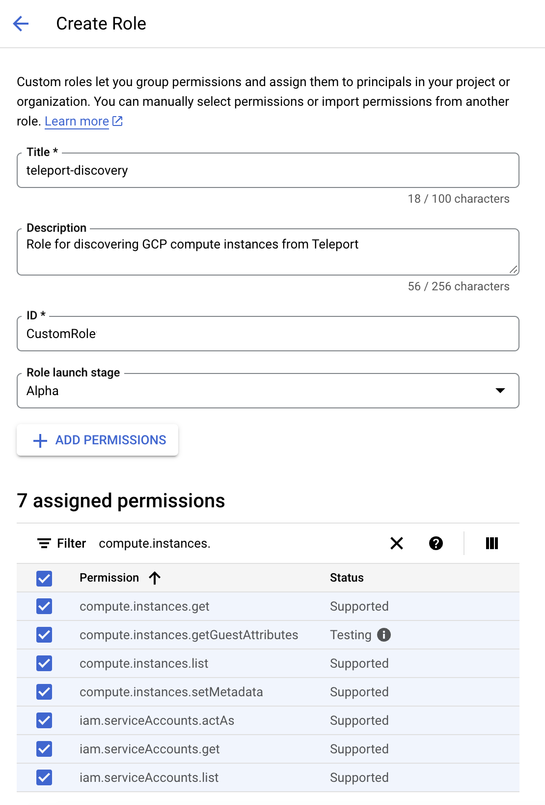
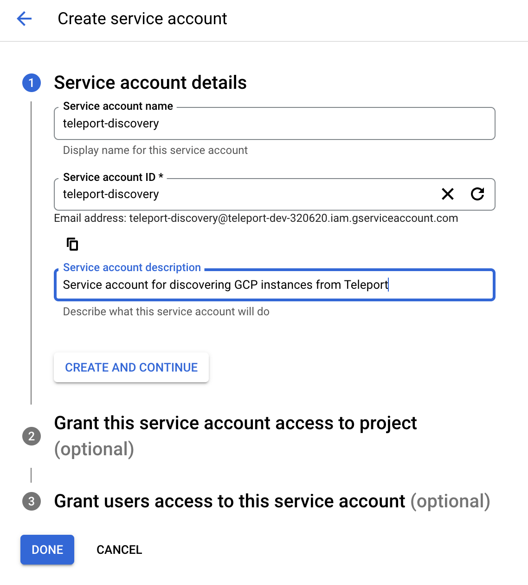
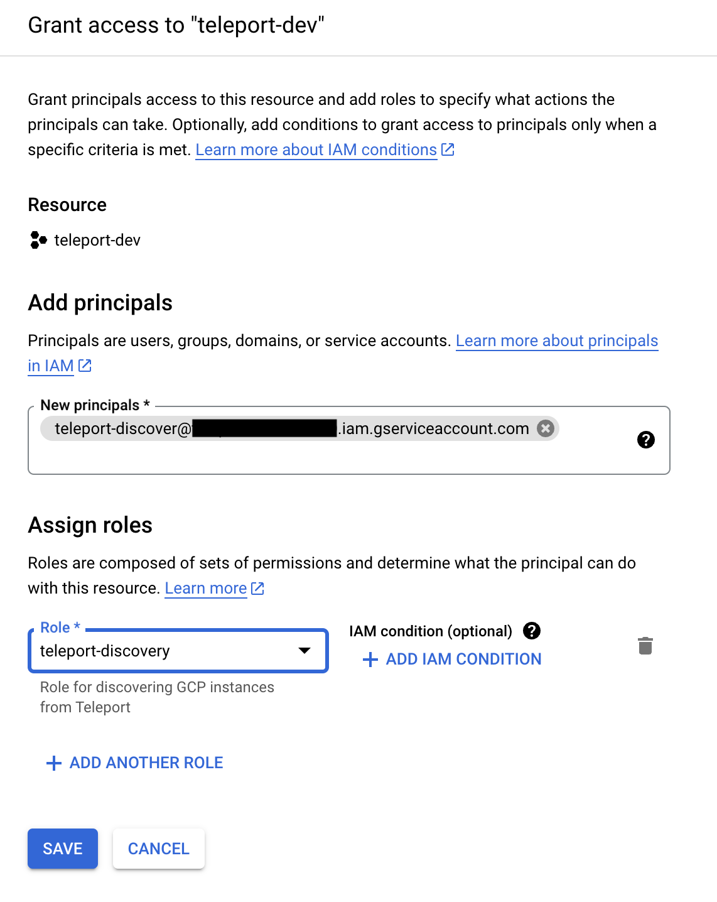
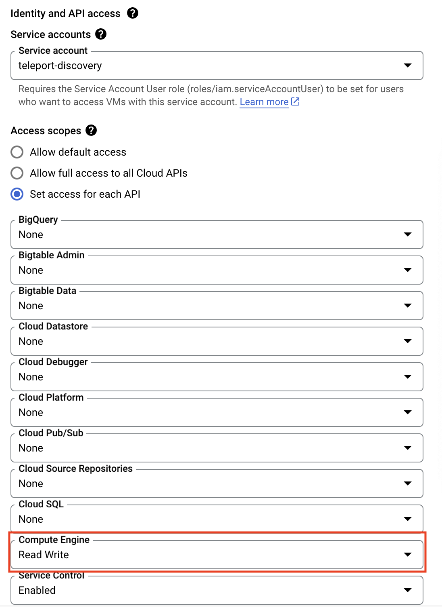

This guide shows you how to set up automatic server discovery for Google Compute
Engine virtual machines.

## How it works

The Teleport Discovery Service can connect to GCP and automatically
discover and enroll GCP Compute Engine instances matching configured labels. It will then
execute a script on these discovered instances that will install Teleport,
start it and join the cluster.

## Prerequisites

(!docs/pages/includes/edition-prereqs-tabs.mdx!)

- A GCP compute instance to run the Discovery Service on.
- GCP compute instances to join the Teleport cluster, running
Ubuntu/Debian/RHEL if making use of the default Teleport install script. (For
other Linux distributions, you can install Teleport manually.)
- (!docs/pages/includes/tctl.mdx!)

## Step 1/5. Create a GCP invite token

When discovering GCP compute instances, Teleport makes use of GCP invite tokens for
authenticating joining SSH Service instances.

First, discover your project ID and the zones where your instances run:

```code
$ gcloud config get-value project
$ gcloud compute instances list --format="table(name,zone,status,serviceAccounts.email)"
```

Create a file called `token.yaml`:

```yaml
# token.yaml
kind: token
version: v2
metadata:
  # the token name is not a secret because instances must prove that they are
  # running in your GCP project to use this token
  name: gcp-discovery-token
spec:
  # use the minimal set of roles required (e.g. Node, Proxy, App, Kube, DB, WindowsDesktop)
  roles: [Node]

  # set the join method allowed for this token
  join_method: gcp

  gcp:
    allow:
      # The GCP project ID(s) that VMs can join from.
      - project_ids: ["my-project-id"]
        # (Optional) The locations that VMs can join from. Note: both regions and
        # zones are accepted.
        locations: ["us-central1-a", "us-east1-b"]
        # (Optional) The email addresses of service accounts that VMs can join
        # with.
        service_accounts: ["my-sa@my-project-id.iam.gserviceaccount.com"]
```

<Admonition type="tip">

To discover the values needed for this token configuration:

```code
# Get your project ID
$ gcloud config get-value project

# List zones where your instances run
$ gcloud compute instances list --format="value(zone)" | sort -u

# List service accounts attached to your instances
$ gcloud compute instances list --format="value(serviceAccounts[0].email)" | sort -u
```

</Admonition>

Add your instance's project ID(s) to the `project_ids` field.
Add the token to the Teleport cluster with:

```code
$ tctl create -f token.yaml
```

## Step 2/5. Configure IAM permissions for Teleport

Create a service account that will give Teleport IAM permissions needed to
discover instances.

<Tabs>
<TabItem label="Console">
  Go to [IAM > Roles](https://console.cloud.google.com/iam-admin/roles)
  in the GCP console and click *+ Create Role*.
  Pick a name for the role (e.g. `teleport-discovery`) and give it the following permissions:
  - `compute.instances.get`
  - `compute.instances.getGuestAttributes`
  - `compute.instances.list`
  - `compute.instances.setMetadata`
  - `iam.serviceAccounts.actAs`
  - `iam.serviceAccounts.get`
  - `iam.serviceAccounts.list`

  

  Click *Create*.

  Go to [IAM > Service accounts](https://console.cloud.google.com/iam-admin/serviceaccounts)
  and click *+ Create Service Account*. Pick a name for the service account
  (e.g. `teleport-discovery`) and copy its email address to your clipboard.
  Click *Create and Continue*.

  

  Go to [IAM](https://console.cloud.google.com/iam-admin/iam) and click *Grant Access*.
  Paste the service account's email into the *New principals* field and select
  your custom role. Click *Save*.

  

  If the Discovery Service will run in a GCP compute instance, edit the instance and
  assign the service account to the instance and set its access scopes to include 
  Read Write access to the Compute API.

  
</TabItem>
<TabItem label="gcloud">
  Copy the following and paste it into a file called `teleport-discovery-role.yaml`:
  ```yaml
  # teleport-discovery-role.yaml
  title: "teleport-discovery"
  description: "A role to enable Teleport to discover GCP compute instances"
  stage: "ALPHA"
  includedPermissions:
  - compute.instances.get
  - compute.instances.getGuestAttributes
  - compute.instances.list
  - compute.instances.setMetadata
  - iam.serviceAccounts.actAs
  - iam.serviceAccounts.get
  - iam.serviceAccounts.list
  ```

  Then run the following command to create the role:
  ```code
  $ gcloud iam roles create teleport_discovery \
  --project=<Var name="project_id" description="GCP project ID" /> \
  --file=teleport-discovery-role.yaml
  ```

  Run the following command to create the service account:
  ```code
  $ gcloud iam service-accounts create teleport-discovery \
  --description="A service account to enable Teleport to discover GCP compute instances" \
  --display-name="teleport-discovery"
  ```

  Run the following command to add the new role to the new service account:
  ```code
  $ gcloud projects add-iam-policy-binding <Var name="project_id" description="GCP project ID" /> \
  --member="serviceAccount:teleport-discovery@<Var name="project_id" />.iam.gserviceaccount.com" \
  --role="projects/<Var name="project_id" />/roles/teleport_discovery"
  ```

  If the Discovery Service will run in a GCP compute instance, run the following
  command to add the service account to the instance, replacing <Var
  name="discovery_service_vm_name" /> with the name of the Discovery Service VM:

  ```code
  $ gcloud compute instances set-service-account <Var name="discovery_service_vm_name" description="Name of the instance running the Discovery Service" /> \
  --service-account=teleport-discovery@<Var name="project_id" />.iam.gserviceaccount.com \
  --scopes=default,compute-rw
  ```
</TabItem>
</Tabs>

## Step 3/5. Configure instances to be discovered

Ensure that each instance to be discovered has a service account assigned to
it. No permissions are required on the service account. To check if an instance
has a service account, run the following command and confirm that there is
at least one entry under `serviceAccounts`:

```code
$ gcloud compute instances describe --format="yaml(name,serviceAccounts)" <Var name="instance_name" description="Instance name" />
```

<Admonition type="tip">

To check all instances in your project at once for service account attachment:

```code
$ gcloud compute instances list \
  --format="table(name,zone,serviceAccounts[0].email:label=SERVICE_ACCOUNT)" \
  --filter="labels.env=prod"
```

Instances without a service account will show an empty `SERVICE_ACCOUNT` column
and cannot be discovered by Teleport.

</Admonition>

### Enable guest attributes on instances

Guest attributes (a subset of custom metadata used for infrequently updated data)
must be enabled on instances to be discovered so Teleport can access their SSH
host keys. Enable guest attributes by setting `enable-guest-attributes` to
`TRUE` in the instance's metadata.

You can enable guest attributes for a single instance:

```code
$ gcloud compute instances add-metadata <Var name="instance_name" description="Instance name" /> \
--metadata=enable-guest-attributes=True
```

To enable guest attributes project-wide so all current and future instances
inherit the setting:

```code
$ gcloud compute project-info add-metadata \
--metadata=enable-guest-attributes=True
```

To enable guest attributes in batch for all instances matching a label filter:

```code
$ for INSTANCE in $(gcloud compute instances list --filter="labels.env=prod" --format="value(name,zone)" | tr '\t' ','); do
  NAME=$(echo $INSTANCE | cut -d',' -f1)
  ZONE=$(echo $INSTANCE | cut -d',' -f2)
  gcloud compute instances add-metadata $NAME --zone=$ZONE --metadata=enable-guest-attributes=True
done
```

<Checkpoint>
Verify that guest attributes are enabled on your target instances.

Check an individual instance:

```code
$ gcloud compute instances describe <Var name="instance_name" /> \
  --format="value(metadata.items[enable-guest-attributes])"
```

The output should be `True`.

Check the project-wide setting (if you applied it project-wide):

```code
$ gcloud compute project-info describe \
  --format="value(commonInstanceMetadata.items[enable-guest-attributes])"
```

</Checkpoint>

### Populate host keys in guest attributes

If guest attributes are enabled during instance creation, the guest attributes
will automatically be populated with the instance's host keys. If guest
attributes were enabled after the instance was created, you must manually add
the host keys to the guest attributes.

<Admonition type="note">

This is a one-time operation per instance. Once host keys are written to guest
attributes, they persist across reboots. If you enabled guest attributes
project-wide before creating instances, new instances will automatically
populate their host keys and no manual action is needed.

</Admonition>

<Tabs>
<TabItem label="Batch (all instances)">
  Use the following script to populate host keys on all instances matching a
  label filter. Run this from a machine with `gcloud` access:

  ```code
  $ for INSTANCE in $(gcloud compute instances list --filter="labels.env=prod" --format="value(name,zone)" | tr '\t' ','); do
    NAME=$(echo $INSTANCE | cut -d',' -f1)
    ZONE=$(echo $INSTANCE | cut -d',' -f2)
    gcloud compute ssh $NAME --zone=$ZONE --command='for file in /etc/ssh/ssh_host_*_key.pub; do KEY_TYPE=$(awk '\''{print $1}'\'' $file); KEY=$(awk '\''{print $2}'\'' $file); curl -sX PUT --data "$KEY" "http://metadata.google.internal/computeMetadata/v1/instance/guest-attributes/hostkeys/$KEY_TYPE" -H "Metadata-Flavor: Google"; done'
  done
  ```
</TabItem>
<TabItem label="Startup script (single instance)">
  Create a file named `add-host-keys.sh` and copy the following into it:
  ```sh
  #!/usr/bin/env bash
  for file in /etc/ssh/ssh_host_*_key.pub; do
    read -r KEY_TYPE KEY _ <"$file"
    curl -X PUT --data "$KEY" "http://metadata.google.internal/computeMetadata/v1/instance/guest-attributes/hostkeys/$KEY_TYPE" -H "Metadata-Flavor: Google"
  done
  ```

  Run the following command to add the host keys as part of a startup script:
  ```code
  $ gcloud compute instances add-metadata <Var name="instance_name" description="Instance name" /> \
  --metadata-from-file=startup-script="add-host-keys.sh"
  ```

  <Admonition type="note">
  The startup script runs on each boot. After the host keys have been
  populated, you can remove it or leave it in place (it is idempotent).
  </Admonition>
</TabItem>
<TabItem label="SSH (single instance)">
  Run the following command to add the host keys over SSH:
  ```code
  $ gcloud compute ssh <Var name="instance_name" description="Instance name" /> \
  --command='for file in /etc/ssh/ssh_host_*_key.pub; do KEY_TYPE=$(awk '\''{print $1}'\'' $file); KEY=$(awk '\''{print $2}'\'' $file); curl -X PUT --data "$KEY" "http://metadata.google.internal/computeMetadata/v1/instance/guest-attributes/hostkeys/$KEY_TYPE" -H "Metadata-Flavor: Google"; done'
  ```
</TabItem>
</Tabs>

Verify that host keys are populated in guest attributes:

```code
$ gcloud compute instances get-guest-attributes <Var name="instance_name" /> \
  --query-path="hostkeys/"
```

The output should list one or more entries (e.g., `ssh-rsa`, `ecdsa-sha2-nistp256`, `ssh-ed25519`).

## Step 4/5. Install the Teleport Discovery Service

<Admonition type="tip">

If you plan on running the Discovery Service on a host that is already running
another Teleport service (Auth or Proxy, for example), you can skip this step.

</Admonition>

Install Teleport on the virtual machine that will run the Discovery Service.

(!docs/pages/includes/install-linux.mdx!)

## Step 5/5. Configure Teleport to discover GCP compute instances

If you are running the Discovery Service on its own host, the service requires a
valid invite token to connect to the cluster. Generate one by running the
following command against your Teleport Auth Service:

```code
$ tctl tokens add --type=discovery
```

Save the generated token in `/tmp/token` on the virtual machine that will run
the Discovery Service.

(!docs/pages/includes/discovery/discovery-group.mdx!)

Assign <Var name="teleport.example.com:443" /> to the host and port of the Teleport Proxy Service in your cluster,
and <Var name="gcp-prod" /> to a name that identifies a group of resources that you will enroll:

```yaml
# teleport.yaml
version: v3
teleport:
  join_params:
    token_name: "/tmp/token"
    method: token
  proxy_server: "<Var name="teleport.example.com:443" />"
auth_service:
  enabled: false
proxy_service:
  enabled: false
ssh_service:
  enabled: false
discovery_service:
  enabled: true
  discovery_group: <Var name="gcp-prod" />
```

Create a matcher for the resources you want to enroll.

<Admonition type="tip">
Dynamic configuration uses Discovery Configs which can be managed using Terraform.
See the [Terraform `discovery_config` reference](../../../reference/infrastructure-as-code/terraform-provider/resources/discovery_config.mdx) for more information.

Static configuration while simpler at first, has less flexibility because enrollment changes require edits to `teleport.yaml` and the restart of the Discovery Service.
</Admonition>

<Tabs>
<TabItem label="Dynamic configuration (recommended)">
  Create a Discovery Config resource, that has the same discovery group you configured earlier, to enable GCP VM discovery.

  Create a file named `discovery-gcp-prod.yaml` with the following content:
  ```yaml
  kind: discovery_config
  version: v1
  metadata:
    name: example-discovery-config
  spec:
    discovery_group: <Var name="gcp-prod" />
    gcp:
      - types: ["gce"]
        # The IDs of GCP projects that VMs can join from.
        project_ids: ["my-project-id"]
        # (Optional) The locations that VMs can join from. Note: both regions and
        # zones are accepted.
        locations: ["us-central1-a", "us-east1-b"]
        # (Optional) The email addresses of service accounts that VMs can join
        # with.
        service_accounts: ["my-sa@my-project-id.iam.gserviceaccount.com"]
        # (Optional) Labels that joining VMs must have.
        labels:
          "env": "prod" # Match virtual machines where label:env=prod
  ```

  <Admonition type="tip">

  To discover the values needed for the matcher configuration:

  ```code
  # Get your project ID
  $ gcloud config get-value project

  # List zones where your target instances run
  $ gcloud compute instances list --filter="labels.env=prod" --format="value(zone)" | sort -u

  # List service accounts attached to target instances
  $ gcloud compute instances list --filter="labels.env=prod" --format="value(serviceAccounts[0].email)" | sort -u
  ```

  </Admonition>

  Adjust the keys under `spec.gcp` to match your GCP environment,
  specifically the project IDs, locations, service accounts and labels you want to associate with the Discovery Service.

  Create the Discovery Config by running the following command:
  ```code
  $ tctl create -f discovery-gcp-prod.yaml
  ```

  Matching instances will be added to the Teleport cluster automatically.

  You can update the Discovery Config at any time, and the service will automatically re-apply the changes.
</TabItem>

<TabItem label="Static configuration">
  In order to enable GCP VM discovery the `discovery_service.gcp` section
  of `teleport.yaml` must include at least one entry:

  ```yaml
  # teleport.yaml
  # ...
  discovery_service:
    enabled: true
    discovery_group: <Var name="gcp-prod" />
    gcp:
      - types: ["gce"]
        # The IDs of GCP projects that VMs can join from.
        project_ids: ["my-project-id"]
        # (Optional) The locations that VMs can join from. Note: both regions and
        # zones are accepted.
        locations: ["us-central1-a", "us-east1-b"]
        # (Optional) The email addresses of service accounts that VMs can join
        # with.
        service_accounts: ["my-sa@my-project-id.iam.gserviceaccount.com"]
        # (Optional) Labels that joining VMs must have.
        labels:
          "env": "prod" # Match virtual machines where label:env=prod
  ```
  Adjust the keys under `discovery_service.gcp` to match your GCP environment,
  specifically the projects, locations, service accounts, and tags you want to associate with the Discovery
  Service.

</TabItem>
</Tabs>

### GCP credentials

The Teleport Discovery Service must have the credentials of the
`teleport-discovery` GCP service account we created above in order to be able
to log in.

The easiest way to ensure that is to run the Discovery Service on a GCP
instance and assign the service account to that instance. Refer to
[Set Up Application Default Credentials](https://cloud.google.com/docs/authentication/provide-credentials-adc)
for details on alternate methods.

### Start and verify the Discovery Service

Start the Discovery Service:

```code
$ sudo systemctl start teleport
```

<Checkpoint>
Verify that the Discovery Service is running and discovering instances.

Check the service status:

```code
$ sudo systemctl status teleport
```

After a few moments, verify that discovered nodes appear in the cluster:

```code
$ tctl get nodes --format=json | jq '.[].metadata.name'
```

If no nodes appear after a few minutes, check the Discovery Service logs for
errors:

```code
$ sudo journalctl -u teleport --grep "discovery\|gcp" --since "5 minutes ago" --no-pager
```

Common issues:
- Missing guest attributes: the instance host keys have not been written.
- No service account on target instance: the instance cannot authenticate via
  the GCP join method.
- Permission denied: the Discovery Service service account is missing required
  IAM permissions.
</Checkpoint>

## Auto-discovery labels

(!docs/pages/includes/auto-discovery/auto-discovery-labels.mdx!)

## Advanced configuration

(!docs/pages/includes/auto-discovery/gcp-vm-advanced-config.mdx!)

## Next steps

- Read [Joining Services via GCP](../../../installation/agents/gcp.mdx)
  for more information on GCP tokens.
- Full documentation on GCP discovery configuration can be found through the [
  config file reference documentation](../../../reference/deployment/config.mdx).
