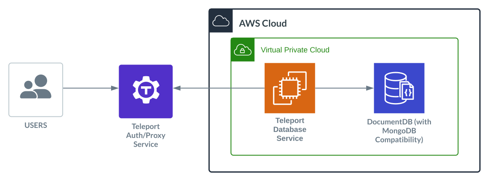
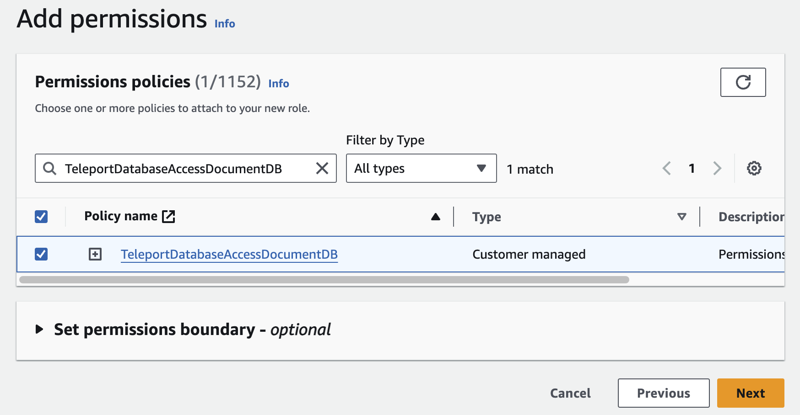
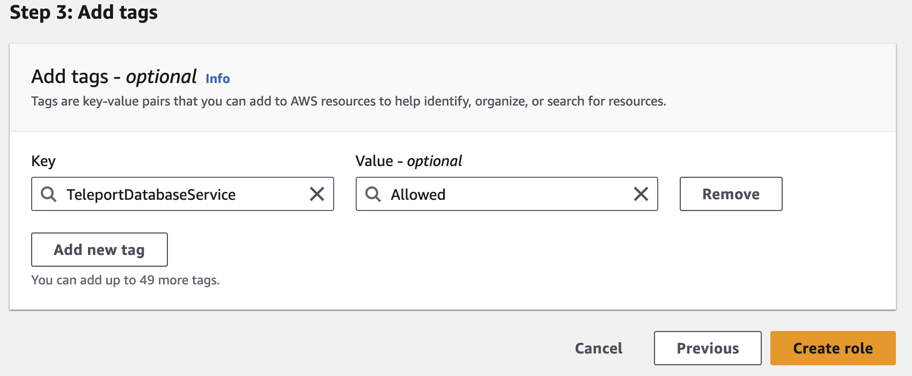

(!docs/pages/includes/database-access/db-introduction.mdx dbType="Amazon DocumentDB" dbConfigure="with IAM authentication"!)

## How it works

(!docs/pages/includes/database-access/how-it-works/iam.mdx db="Amazon DocumentDB" cloud="AWS"!)

<Tabs>
<TabItem label="Self-Hosted">

</TabItem>
<TabItem label="Cloud-Hosted">

</TabItem>

</Tabs>

(!docs/pages/includes/database-access/auto-discovery-tip.mdx dbType="Amazon DocumentDB cluster" providerType="AWS"!)

## Prerequisites

(!docs/pages/includes/edition-prereqs-tabs.mdx!)

- AWS account with a DocumentDB cluster.
  <Admonition type="warning" title="IAM authentication and TLS">
  Teleport uses IAM authentication to connect users to DocumentDB, which is
  only supported for DocumentDB 5.0 or higher.

  In addition, the DocumentDB cluster must have Transport Layer Security (TLS)
  enabled. TLS is enabled by default when using the default parameter group.
  </Admonition>
- Command-line client `mongosh` or `mongo` installed and added to your
  system's `PATH` environment variable.
- A host, e.g., an EC2 instance, where you will run the Teleport Database
  Service.
- (!docs/pages/includes/tctl.mdx!)

## Step 1/6. Create a Teleport user

(!docs/pages/includes/database-access/create-user.mdx!)

## Step 2/6. Create a Database Service configuration

(!docs/pages/includes/tctl-token.mdx serviceName="Database" tokenType="db" tokenFile="/tmp/token"!)

(!docs/pages/includes/database-access/alternative-methods-join.mdx!)

(!docs/pages/includes/install-linux.mdx!)

On the node that is running the Database Service, create a configuration file.
Use your DocumentDB cluster endpoint and port as the URI, replacing 
<Var name="my-docdb.cluster-abcdefghijklm.us-east-1.docdb.amazonaws.com:27017"/>:

```code
$ sudo teleport db configure create \
   -o file \
   --name="my-docdb" \
   --proxy=<Var name="example.teleport.sh:443" /> \
   --protocol=mongodb \
   --token=/tmp/token \
   --uri="<Var name="my-docdb.cluster-abcdefghijklm.us-east-1.docdb.amazonaws.com:27017"/>"
```

The command will generate a Database Service configuration to proxy your AWS
DocumentDB cluster and save the configuration to `/etc/teleport.yaml`.

## Step 3/6. Create an IAM role for the Database Service

First, visit the [IAM > Policies
page](https://console.aws.amazon.com/iamv2/home#/policies) of the AWS Console,
then press "Create policy".

Use the **JSON** option for Policy editor and paste in the following policy:
```json
{
    "Version": "2012-10-17",
    "Statement": [
        {
            "Effect": "Allow",
            "Action": [
                "rds:DescribeDBClusters"
            ],
            "Resource": "*"
        },
        {
            "Effect": "Allow",
            "Action": [
                "sts:AssumeRole"
            ],
            "Resource": "*",
            "Condition": {
                "StringEquals": {"iam:ResourceTag/TeleportDatabaseService": "Allowed"}
            }
        }
    ]
}
```

This policy allows Teleport Database Service to retrieve DocumentDB cluster
metadata and assume IAM roles to authenticate as DocumentDB users. Note that
the `sts:AssumeRole` has a resource tag condition to limit the IAM roles the
Teleport Database Service can assume.

Click **Next** and give the policy a name. In this guide, we will use the example
name `TeleportDatabaseAccessDocumentDB`.

Now visit the [IAM > Roles
page](https://console.aws.amazon.com/iamv2/home#/roles) of the AWS Console,
then press "Create Role". Under **Trusted entity type** select "AWS service".
Under **Use case** select "EC2" or the intended use case, then click **Next**.


On the "Add Permissions" page, find and select the
`TeleportDatabaseAccessDocumentDB` policy that is created in the previous step.



Click "Next" and give the role a name. In this guide,  we will use the example
name `TeleportDatabaseService` for this role. Once you have chosen a name,
click **Create Role** to complete the process.

## Step 4/6. Start the Database Service

(!docs/pages/includes/start-teleport.mdx service="the Database Service"!)

The Database Service will proxy the Amazon DocumentDB cluster with the URI you
specified earlier. Keep in mind that AWS IAM changes may not propagate
immediately and can take a few minutes to come into effect.

## Step 5/6. Create an IAM role for a DocumentDB user

In this step, we will create an IAM role that the Teleport Database Service can
assume to authenticate to DocumentDB on behalf of a Teleport user.

### Create an IAM role

Navigate back to the Roles page on the AWS Web Console and create a new role.
Select the "AWS account" option, which creates a default trust policy to allow
other entities in this account to assume this role:


Skip the "Add Permissions" page by clicking "Next", and give the role a name.
In this guide, we will use the example "teleport-docdb-user" for this role.

Now click **Add new tag** at Step 3, use `TeleportDatabaseService` for the key
and `Allowed` for the value. Then click **Create Role** to complete the process.



### Create a DocumentDB user

Log in to your DocumentDB cluster with your master username and password from a
machine that has network access to the DocumentDB cluster. Create a DocumentDB
user with the IAM role ARN as username and specify `MONGODB-AWS` in the
mechanisms for authentication. Replace 
<Var name="arn:aws:iam::(=aws.aws_account_id=):role/teleport-docdb-user"/> with
the ARN of your DocumentDB user:

```code
use $external;
db.createUser(
    {
        user: "<Var name="arn:aws:iam::(=aws.aws_account_id=):role/teleport-docdb-user"/>",
        mechanisms: ["MONGODB-AWS"],
        roles: [ { role: "root", db: "admin" },  ]
    }
);
```

This example creates a DocumentDB IAM user with root privileges. You can adjust
the privileges as required.

<Admonition type="tip" title="Avoid password authentication">
This step is a one-time setup that must use password authentication. However,
after creating the first IAM user, you can skip password authentication by
accessing DocumentDB through Teleport and creating more DocumentDB IAM users
using the first IAM user.
</Admonition>

## Step 6/6 Connect

Once the Database Service has started and joined the cluster, log in to see the
registered databases:

```code
$ tsh login --proxy=<Var name="example.teleport.sh:443" /> --user=alice
$ tsh db ls
# Name     Description Labels
# -------- ----------- --------
# my-docdb             env=dev
```

Retrieve credentials for the database and connect to it as the `teleport-docdb-user` user:

```code
$ tsh db connect --db-user=teleport-docdb-user --db-name=test my-docdb
```

Log out of the database and remove credentials:

```code
$ tsh db logout rds-example
```

## Troubleshooting

(!docs/pages/includes/database-access/aws-troubleshooting.mdx!)

### Unable to authenticate using mechanism "MONGODB-AWS" error

You may encounter the following error when IAM authentication fails:

```code
$ tsh db connect --db-user=teleport-docdb-user --db-name=test my-docdb
...
MongoServerSelectionError: error connecting to the database
	connection() error occurred during connection handshake: auth error: sasl conversation error: unable to authenticate using mechanism "MONGODB-AWS":  Authentication failed.
ERROR: exit status 1
```

Make sure the IAM role exists as a DocumentDB user in the "$external" database
of the target DocumentDB cluster and the DocumentDB user is configured with
`MONGODB-AWS` mechanisms for authentication.

See [Authentication using IAM
identity](https://docs.aws.amazon.com/documentdb/latest/developerguide/iam-identity-auth.html)
for more details.

## Next steps

(!docs/pages/includes/database-access/guides-next-steps.mdx!)

- Learn more about [Authentication using IAM identity for
  DocumentDB](https://docs.aws.amazon.com/documentdb/latest/developerguide/iam-identity-auth.html)
  for more details.
