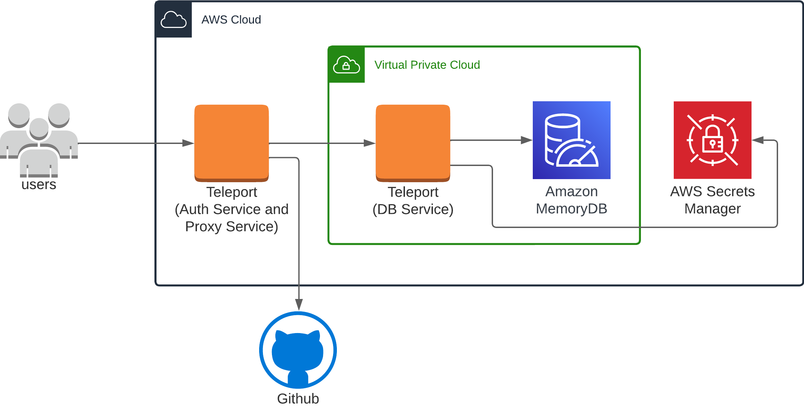
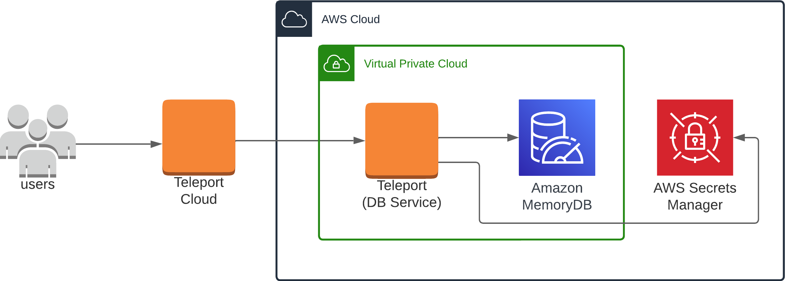

(!docs/pages/includes/database-access/db-introduction.mdx dbType="Amazon MemoryDB for Redis and Valkey" dbConfigure="with IAM authentication"!)

## How it works

(!docs/pages/includes/database-access/aws-redis-how-it-works.mdx dbType="Amazon MemoryDB"!)

<Tabs>
<TabItem scope={["oss", "enterprise"]} label="Self-Hosted">

</TabItem>
<TabItem scope={["cloud","team"]} label="Teleport Cloud">

</TabItem>

</Tabs>

(!docs/pages/includes/database-access/auto-discovery-tip.mdx dbType="Amazon MemoryDB" providerType="AWS"!)

## Prerequisites

(!docs/pages/includes/edition-prereqs-tabs.mdx!)

- AWS account with an MemoryDB for Redis or Valkey cluster.
  **In-transit encryption via (TLS) must be enabled**.
- Permissions to create and attach IAM policies.
- `redis-cli` version `6.2` or newer installed and added to your system's `PATH` environment variable.
- A host, e.g., an EC2 instance, where you will run the Teleport Database
  Service.
- [ACL](https://docs.aws.amazon.com/memorydb/latest/devguide/clusters.acls.html) enabled for your
  MemoryDB cluster.
- (!docs/pages/includes/database-access/aws-auto-discovery-prerequisite.mdx!)
- (!docs/pages/includes/tctl.mdx!)

## Step 1/6. Create a Teleport user

(!docs/pages/includes/database-access/create-user.mdx!)

## Step 2/6. Create a Database Service configuration

(!docs/pages/includes/tctl-token.mdx serviceName="Database" tokenType="db" tokenFile="/tmp/token"!)

(!docs/pages/includes/database-access/alternative-methods-join.mdx!)

(!docs/pages/includes/install-linux.mdx!)

Create the Database Service configuration:
```code
$ MEMORYDB_URI=""
$ sudo teleport db configure create \
   -o file \
   --name="memorydb" \
   --proxy=example.teleport.sh:443 \
   --protocol="redis" \ \
   --uri=${MEMORYDB_URI} \
   --token=/tmp/token
```

Change `example.teleport.sh:443` to the host and port of your Teleport Proxy
Service. Set `MEMORYDB_URI` to the domain name and port of your MemoryDB
database.

The command will generate a Database Service configuration and place it at the
`/etc/teleport.yaml` location.

## Step 3/6. Create an IAM role for Teleport

(!docs/pages/includes/database-access/create-iam-role-step-description.mdx accessFor="MemoryDB databases" !)

### Create an IAM role for Teleport

(!docs/pages/includes/aws-credentials.mdx service="the Database Service"!)

### Grant permissions

(!docs/pages/includes/database-access/reference/aws-iam/memorydb/access-policy.mdx!)

## Step 4/6. Start the Database Service

(!docs/pages/includes/start-teleport.mdx service="the Database Service"!)

## Step 5/6. Configure authentication for MemoryDB users

Configure authentication for your MemoryDB database. The steps to follow
depend on whether you want to enable the Teleport Database Service to use IAM
authentication with MemoryDB, or authentication based on managing passwords
via AWS Secrets Manager:

<Tabs>
<TabItem label="MemoryDB IAM user">

It is highly recommended to use a different ACL than the preset `open-access`
ACL which allows all access using the `default` user.

If you do not have another MemoryDB ACL yet, create one:
```code
$ aws memorydb create-acl --acl-name my-acl
```

Make sure the ACL is attached to your MemoryDB cluster:
```code
$ aws memorydb update-cluster --cluster-name my-memorydb --acl-name my-acl
```

Now create an MemoryDB IAM-enabled user:
```code
$ aws memorydb create-user \
  --user-name iam-user-01 \
  --authentication-mode Type=iam \
  --access-string "on ~* +@all"
```

<Admonition type="note" title="Access Strings">
The above example creates a MemoryDB user with the access string `on ~* +@all`
that represents an active user with access to all available keys and commands.

You may prefer a less permissive access string for your MemoryDB users. For
more information about access strings, please see: [Specifying Permissions
Using an Access
String](https://docs.aws.amazon.com/memorydb/latest/devguide/clusters.acls.html#access-string).
</Admonition>

Then add this user to the ACL attached to your MemoryDB cluster:
```code
$ aws memorydb update-acl --user-names-to-add iam-user-01 --acl-name my-acl
```

</TabItem>
<TabItem label="Teleport-managed user">

To enable ACL, please see [Authenticating users with Access Control Lists for
MemoryDB](https://docs.aws.amazon.com/memorydb/latest/devguide/clusters.acls.html).

Once an MemoryDB user is created with the desired access, add an AWS resource
tag `teleport.dev/managed` with the value `true` to this user:


The Database Service will automatically discover this user if it is associated
with a registered database. Keep in mind that it may take the Database Service
some time (up to 20 minutes) to discover this user once the tag is added.

</TabItem>
</Tabs>

(!docs/pages/includes/database-access/aws-redis-no-auth.mdx dbType="MemoryDB"!)

## Step 6/6. Connect

Once the Database Service has started and joined the cluster, log in to see the
registered databases:

<Tabs>
<TabItem scope={["oss", "enterprise"]} label="Self-Hosted">
```code
$ tsh login --proxy=teleport.example.com --user=alice
$ tsh db ls
# Name        Description Labels
# ----------- ----------- --------
# my-memorydb             ...
```

</TabItem>
<TabItem scope={["cloud"]} label="Teleport Enterprise Cloud">

```code
$ tsh login --proxy=mytenant.teleport.sh --user=alice
$ tsh db ls
# Name        Description Labels
# ----------- ----------- --------
# my-memorydb             ...
```

</TabItem>

</Tabs>

To retrieve credentials for a database and connect to it:

```code
$ tsh db connect --db-user=my-database-user my-memorydb
```

(!docs/pages/includes/database-access/aws-redis-tsh-db-user-auth.mdx!)

To log out of the database and remove credentials:

```code
# Remove credentials for a particular database instance.
$ tsh db logout my-memorydb
# Remove credentials for all database instances.
$ tsh db logout
```

## Troubleshooting

(!docs/pages/includes/database-access/aws-troubleshooting.mdx!)

## Next steps

(!docs/pages/includes/database-access/guides-next-steps.mdx!)

