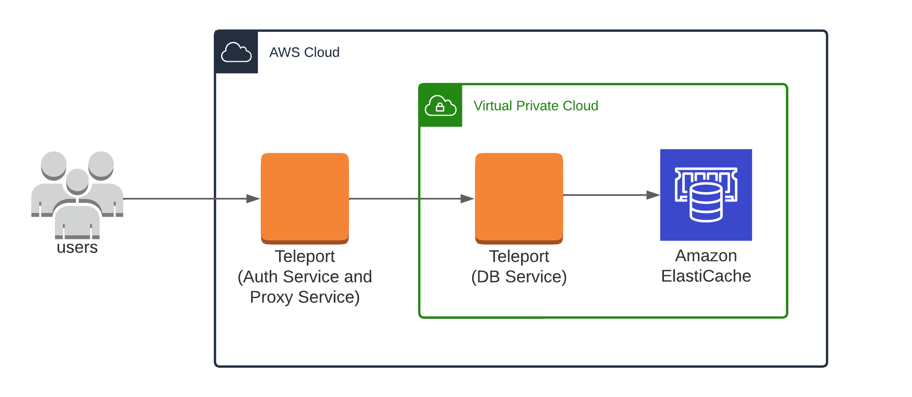
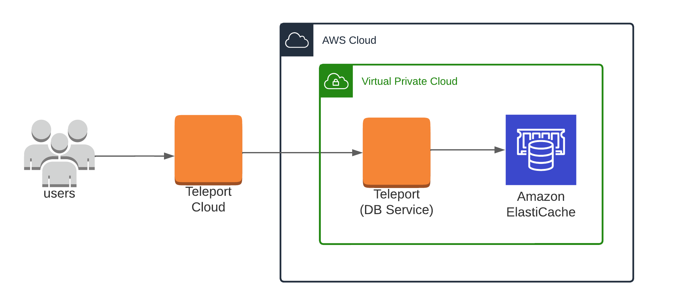

(!docs/pages/includes/database-access/db-introduction.mdx dbType="Amazon ElastiCache Serverless" dbConfigure="with IAM authentication"!)

## How it works

The Teleport Database Service connects on user behalf using IAM authentication and proxies traffic from users to Amazon ElastiCache Serverless.

<Tabs>
<TabItem scope={["oss", "enterprise"]} label="Self-Hosted">

</TabItem>
<TabItem scope={["cloud","team"]} label="Teleport Cloud">

</TabItem>

</Tabs>

(!docs/pages/includes/database-access/auto-discovery-tip.mdx dbType="Amazon Elasticache Serverless cache" providerType="AWS"!)

## Prerequisites

(!docs/pages/includes/edition-prereqs-tabs.mdx!)

- AWS account with an ElastiCache Serverless for Redis or Valkey cache.
- Permissions to create and attach IAM policies.
- `redis-cli` version `6.2` or newer installed and added to your system's `PATH` environment variable.
- A host, e.g., an EC2 instance, where you will run the Teleport Database
  Service.
- (!docs/pages/includes/database-access/aws-auto-discovery-prerequisite.mdx!)
- (!docs/pages/includes/tctl.mdx!)

## Step 1/6. Create a Teleport user

(!docs/pages/includes/database-access/create-user.mdx!)

## Step 2/6. Create a Database Service configuration

(!docs/pages/includes/tctl-token.mdx serviceName="Database" tokenType="db" tokenFile="/tmp/token"!)

(!docs/pages/includes/database-access/alternative-methods-join.mdx!)

(!docs/pages/includes/install-linux.mdx!)

Create the Database Service configuration:
```code
$ ELASTICACHE_SERVERLESS_URI=""
$ sudo teleport db configure create \
   -o file \
   --name="elasticache-serverless" \
   --proxy=example.teleport.sh:443 \
   --protocol="redis" \
   --uri=${ELASTICACHE_SERVERLESS_URI?} \
   --token=/tmp/token
```

Change `example.teleport.sh:443` to the host and port of your Teleport Proxy
Service. Set `ELASTICACHE_SERVERLESS_URI` to the domain name and port of your ElastiCache
database.

The command will generate a Database Service configuration and place it at the
`/etc/teleport.yaml` location.

## Step 3/6. Create an IAM role for Teleport

(!docs/pages/includes/database-access/create-iam-role-step-description.mdx accessFor="ElastiCache Serverless caches" !)

### Create an IAM role for Teleport

(!docs/pages/includes/aws-credentials.mdx service="the Database Service"!)

### Grant permissions

(!docs/pages/includes/database-access/reference/aws-iam/elasticache-serverless/access-policy.mdx!)

## Step 4/6. Start the Database Service

(!docs/pages/includes/start-teleport.mdx service="the Database Service"!)

## Step 5/6. Configure authentication for ElastiCache users

Configure authentication for your ElastiCache Serverless database.

To enable ACL, please see [Authenticating users with Role-Based Access
Control for
ElastiCache](https://docs.aws.amazon.com/AmazonElastiCache/latest/dg/Clusters.RBAC.html).

<Admonition type="warning">
ElastiCache Serverless Redis OSS will automatically create a default user with no password.
We strongly recommend that you take steps to disable the default user.
The automatically created default user cannot be modified or deleted and you cannot remove the default user name from an ElastiCache Redis OSS user group.
To disable the default user:
1. create a new user with the user name "default" and a unique (i.e., not "default") user ID.
2. *replace* the default user in your ElastiCache user group with the new default user.

We recommend setting a strong password on your customized default user (IAM authentication is not possible for the default user) and using an access string that is not permissive.
For example, the access string `off -@all` will disable logins and deny all Redis privileges to the default user.

See [Applying RBAC](https://docs.aws.amazon.com/AmazonElastiCache/latest/dg/Clusters.RBAC.html#rbac-using) for more information.
</Admonition>

Some additional limitations apply when using IAM authentication - for more
information, see:
[ElastiCache Auth IAM Limits](https://docs.aws.amazon.com/AmazonElastiCache/latest/red-ug/auth-iam.html#auth-iam-limits).

There are a few requirements for configuring an ElastiCache IAM-enabled user:
- the user must have identical username and user id properties.
- the user must have authentication mode set to "IAM".
- the user must be attached to an ElastiCache user group.

Create an ElastiCache IAM-enabled user.
The following example creates an ElastiCache user with the access string
`on ~* +@all` that represents an active user with access to all available keys
and commands:
```code
$ aws elasticache create-user \
  --user-name iam-user-01 \
  --user-id iam-user-01 \
  --authentication-mode Type=iam \
  --engine redis \
  --access-string "on ~* +@all"
```

<Admonition type="note" title="Access Strings">
You may prefer a less permissive access string for your ElastiCache users.
For more information about ElastiCache access strings, please see:
[ElastiCache Cluster RBAC Access String](https://docs.aws.amazon.com/AmazonElastiCache/latest/red-ug/Clusters.RBAC.html#Access-string).
</Admonition>

Create an ElastiCache user group and attach it to your ElastiCache Serverless cache:
```code
$ aws elasticache create-user-group \
  --user-group-id iam-user-group-01 \
  --engine redis \
  --user-ids default iam-user-01
$ aws elasticache modify-serverless-cache \
    --serverless-cache-name serverless-cache-1 \
    --user-group-id "iam-user-group-01"
```

Once the ElastiCache user has been created, verify that the user is configured
to satisfy the requirements for IAM authentication:


(!docs/pages/includes/database-access/aws-redis-no-auth.mdx dbType="ElastiCache Serverless"!)

## Step 6/6. Connect

Once the Database Service has started and joined the cluster, log in to see the
registered databases:

<Tabs>
<TabItem scope={["oss", "enterprise"]} label="Self-Hosted">
```code
$ tsh login --proxy=teleport.example.com --user=alice
$ tsh db ls
Name                Description Allowed Users Labels
------------------- ----------- ------------- -----------------------
my-serverless-cache             [*]           account_id=123456789012
```

</TabItem>
<TabItem scope={["cloud"]} label="Teleport Enterprise Cloud">

```code
$ tsh login --proxy=mytenant.teleport.sh --user=alice
$ tsh db ls
Name                Description Allowed Users Labels
------------------- ----------- ------------- -----------------------
my-serverless-cache             [*]           account_id=123456789012
```

</TabItem>

</Tabs>

To retrieve credentials for a database and connect to it:

```code
$ tsh db connect --db-user=my-database-user my-serverless-cache
```

(!docs/pages/includes/database-access/aws-redis-tsh-db-user-auth.mdx!)

To log out of the database and remove credentials:

```code
# Remove credentials for a particular database instance.
$ tsh db logout my-serverless-cache
# Remove credentials for all database instances.
$ tsh db logout
```

## Troubleshooting

(!docs/pages/includes/database-access/aws-troubleshooting.mdx!)

## Next steps

(!docs/pages/includes/database-access/guides-next-steps.mdx!)
