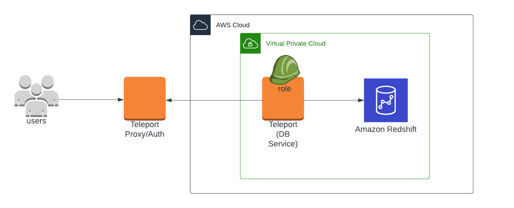
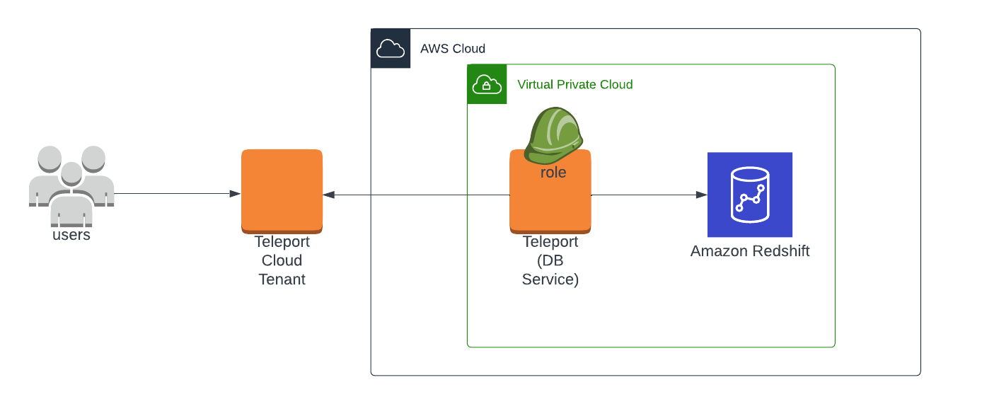
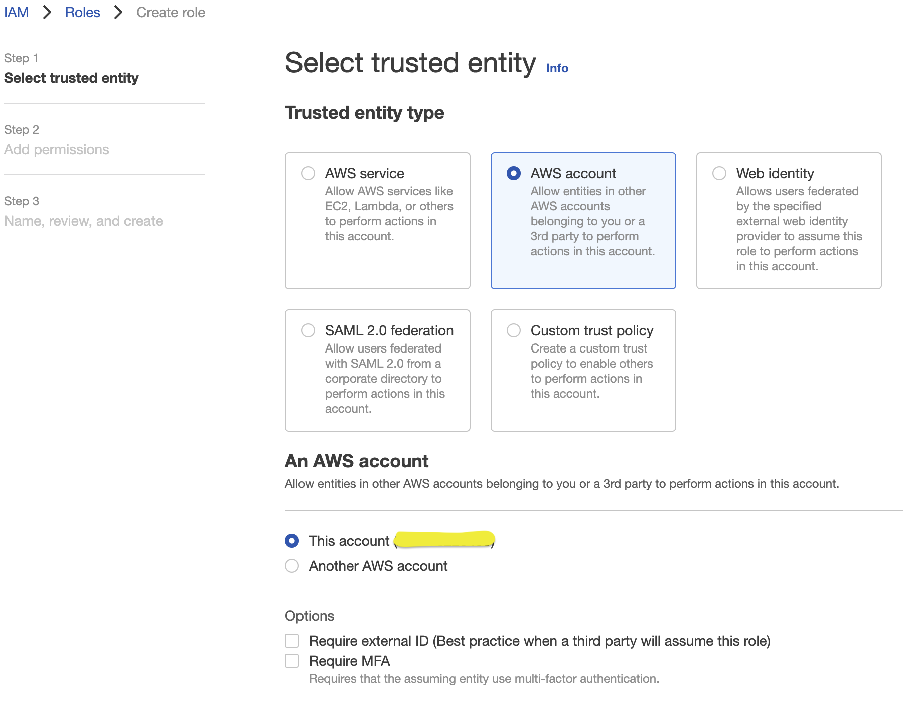
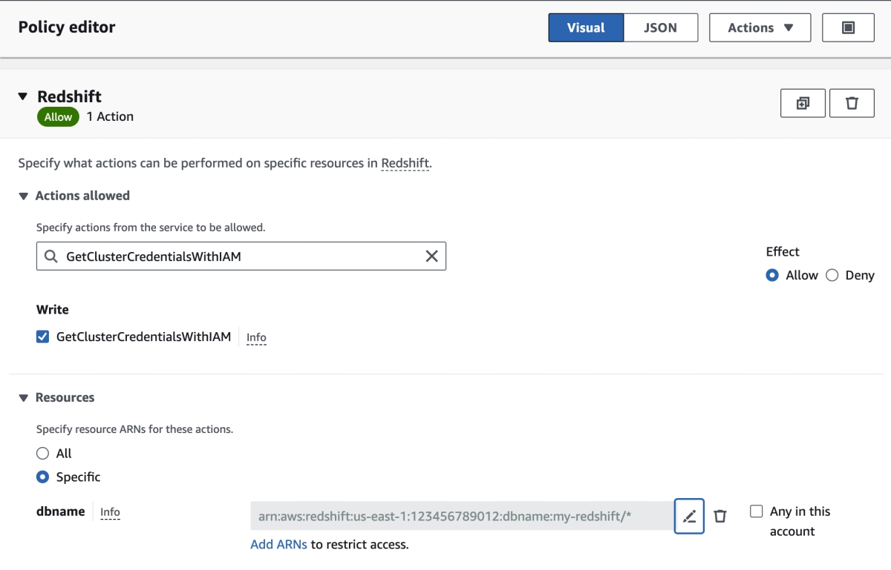

(!docs/pages/includes/database-access/db-introduction.mdx dbType="Amazon Redshift" dbConfigure="with IAM authentication"!)

## How it works

(!docs/pages/includes/database-access/how-it-works/iam.mdx db="Amazon Redshift" cloud="AWS"!)

<Tabs>
<TabItem scope={["oss", "enterprise"]} label="Self-Hosted">

</TabItem>
<TabItem scope={["cloud"]} label="Teleport Enterprise Cloud">

</TabItem>

</Tabs>

(!docs/pages/includes/database-access/auto-discovery-tip.mdx dbType="Amazon Redshift cluster" providerType="AWS"!)

## Prerequisites

(!docs/pages/includes/edition-prereqs-tabs.mdx!)

- AWS account with a Redshift cluster and permissions to create and attach IAM
  policies.
- Command-line client `psql` installed and added to your system's `PATH` environment variable.
- A host, e.g., an EC2 instance, where you will run the Teleport Database
  Service.
- (!docs/pages/includes/tctl.mdx!)

## Step 1/6. Create a Teleport user

(!docs/pages/includes/database-access/create-user.mdx!)

## Step 2/6. Create a Database Service configuration

(!docs/pages/includes/tctl-token.mdx serviceName="Database" tokenType="db" tokenFile="/tmp/token"!)

(!docs/pages/includes/database-access/alternative-methods-join.mdx!)

(!docs/pages/includes/install-linux.mdx!)

On the node that is running the Database Service, create a configuration file.
Assign `CLUSTER_URI` to the domain name and port of the cluster:

<Tabs>
<TabItem scope={["oss", "enterprise"]} label="Self-Hosted">

```code
$ sudo teleport db configure create \
   -o file \
   --name="redshift-postgres" \
   --proxy=teleport.example.com:443 \
   --protocol=postgres \
   --token=/tmp/token \
   --uri=${CLUSTER_URI?}
```

</TabItem>
<TabItem scope={["cloud"]} label="Teleport Enterprise Cloud">

```code
$ sudo teleport db configure create \
   -o file \
   --name="redshift-postgres" \
   --proxy=mytenant.teleport.sh:443 \
   --protocol=postgres \
   --token=/tmp/token \
   --uri=${CLUSTER_URI?}
```

</TabItem>

</Tabs>

The command will generate a Database Service configuration to proxy your AWS
Redshift cluster place it at the `/etc/teleport.yaml` location.

## Step 3/6. Create an IAM Role for user access (optional) 

Redshift supports two methods of IAM authentication, both of which Teleport
also supports.

First is IAM authentication as a database user. In this method, the Teleport
Database Service generates a temporary IAM authentication token for a database
user that already exists in the Redshift database. If you choose to use this
method, you can skip this step as no additional IAM roles are required.

The second method is to authenticate as an IAM role. In this case, the Teleport
Database Service assumes an IAM role to authenticate with Redshift. Redshift
then maps that IAM role to a database username and creates that database user
if it doesn't already exist in the database.

If you choose the second method, create the AWS IAM role to provide user access
to the Redshift database. Go to IAM -> Access Management ->
[Roles](https://console.aws.amazon.com/iamv2/home#/roles), and click "Create Role".



Skip "Add permissions" for now, enter a role name, and press "Create role".

Once the role is created, find the role, and add the following inline policy to
the IAM role:


Or in JSON format:
```json
{
	"Version": "2012-10-17",
	"Statement": [
		{
			"Effect": "Allow",
			"Action": "redshift:GetClusterCredentialsWithIAM",
			"Resource": "arn:aws:redshift:us-east-1:123456789012:dbname:my-redshift/*"
		}
	]
}
```

Replace `123456789012` and `my-redshift` with your AWS account ID and your
Redshift database's cluster ID. 

## Step 4/6. Configure IAM permissions for the Database Service

(!docs/pages/includes/database-access/create-iam-role-step-description.mdx accessFor="Redshift databases" !)

### Create an IAM role for Teleport

(!docs/pages/includes/aws-credentials.mdx service="the Database Service"!)

### Grant permissions

Attach the following AWS IAM permissions to the Database Service IAM role:

(!docs/pages/includes/database-access/reference/aws-iam/redshift/access-policy.mdx dbUserRole="example-iam-role" !)

## Step 5/6. Start the Database Service

(!docs/pages/includes/start-teleport.mdx service="the Database Service"!)

The Database Service will proxy the Amazon Redshift cluster with the ID you
specified earlier. Keep in mind that AWS IAM changes may not propagate
immediately and can take a few minutes to come into effect.

## Step 6/6. Connect

<Tabs>
<TabItem scope={["oss", "enterprise"]} label="Self-Hosted">

Once the Database Service has started and joined the cluster, log in to see the
registered databases. Replace `--proxy` with the address of your Teleport Proxy
Service.

```code
$ tsh login --proxy=teleport.example.com --user=alice
$ tsh db ls
# Name        Description                    Labels
# ----------- ------------------------------ --------
# my-redshift                                ...
```

</TabItem>
<TabItem scope={["cloud"]} label="Teleport Enterprise Cloud">

Once the Database Service has started and joined the cluster, log in to see the
registered databases. Replace `--proxy` with the address of your Teleport Cloud
tenant.

```code
$ tsh login --proxy=mytenant.teleport.sh --user=alice
$ tsh db ls
# Name        Description                    Labels
# ----------- ------------------------------ --------
# my-redshift                                ...
```

</TabItem>

</Tabs>

To retrieve credentials for a database and connect to it:

<Tabs>
<TabItem label="Authenticate as database users">
```code
$ tsh db connect --db-user=alice --db-name=dev my-redshift
```

<Admonition type="note" title="Database users must exist">
  Teleport does not currently use the auto-create option when generating
  tokens for Redshift databases. Users must exist in the database.
</Admonition>
</TabItem>

<TabItem label="Authenticate as IAM roles">

```code
$ tsh db connect --db-user=role/example-iam-role --db-name=dev my-redshift
```
</TabItem>
</Tabs>

(!docs/pages/includes/database-access/pg-access-webui.mdx!)

To log out of the database and remove credentials:

```code
$ tsh db logout my-redshift
```

## Troubleshooting

(!docs/pages/includes/database-access/aws-troubleshooting.mdx!)

(!docs/pages/includes/database-access/aws-troubleshooting-max-policy-size.mdx!)

(!docs/pages/includes/database-access/pg-cancel-request-limitation.mdx PIDQuery="SELECT pid,starttime,duration,trim(user_name) AS user,trim(query) AS query FROM stv_recents WHERE status = 'Running';"!)

(!docs/pages/includes/database-access/psql-ssl-syscall-error.mdx!)

## Next steps

- Learn more about [using IAM authentication to generate database user
  credentials](https://docs.aws.amazon.com/redshift/latest/mgmt/generating-user-credentials.html) for Amazon Redshift.
- Learn how to [restrict access](../rbac.mdx) to certain users and databases.
- View the [High Availability (HA)](../guides/ha.mdx) guide.
- Take a look at the YAML configuration [reference](../../../reference/agent-services/database-access-reference/configuration.mdx).

