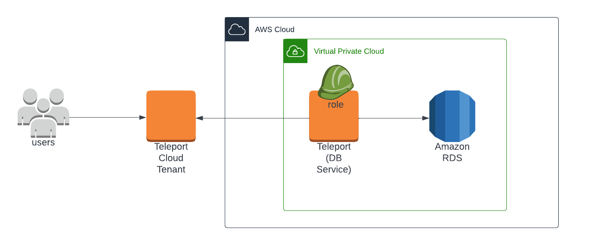

(!docs/pages/includes/database-access/db-introduction.mdx dbType="Amazon RDS or Aurora" dbConfigure="with IAM authentication"!)

## How it works

(!docs/pages/includes/database-access/how-it-works/iam.mdx db="RDS" cloud="AWS"!)

<Tabs>
<TabItem label="Self-Hosted">

</TabItem>
<TabItem label="Cloud-Hosted">

</TabItem>

</Tabs>

<Admonition type="note" title="Supported versions">

The following products are not compatible with Teleport as they don't support
IAM authentication:

    - Aurora Serverless v1.
    - RDS MariaDB versions lower than 10.6.

We recommend upgrading Aurora Serverless v1 to [Aurora Serverless
v2](https://docs.aws.amazon.com/AmazonRDS/latest/AuroraUserGuide/aurora-serverless-v2.html),
which supports IAM authentication.

</Admonition>

(!docs/pages/includes/database-access/auto-discovery-tip.mdx dbType="RDS" providerType="AWS" !)

## Prerequisites

(!docs/pages/includes/edition-prereqs-tabs.mdx!)

- AWS account with RDS and Aurora databases and permissions to create and attach
  IAM policies.
  <Admonition type="warning" title="IAM authentication">
  Your RDS and Aurora databases must have password and IAM authentication
  enabled.

  If IAM authentication is not enabled on the target RDS and Aurora databases,
  the Database Service will attempt to enable IAM authentication by modifying
  them using respective APIs.
  </Admonition>
- A Linux host or Amazon Elastic Kubernetes Service cluster where you will run
  the Teleport Database Service, which proxies connections to your RDS
  databases. 
- (!docs/pages/includes/tctl.mdx!)

If you plan to run the Teleport Database Service on Kubernetes, you will need
the following:

 - The `aws` CLI in your PATH. Install it by following the [AWS
   documentation](https://aws.amazon.com/cli/).

 - An IAM OIDC provider running in your Kubernetes cluster. See the [AWS
   documentation](https://docs.aws.amazon.com/eks/latest/userguide/enable-iam-roles-for-service-accounts.html)
   for how to create an IAM OIDC provider.

   To check whether you have an IAM OIDC provider running in your cluster, run
   the following `aws` command, assigning <Var name="eks-region" /> to the
   region where your EKS cluster is running and <Var name="cluster-name" /> to
   the name of your Kubernetes cluster:

   ```code
   $ aws --region=<Var name="eks-region" /> eks describe-cluster --name <Var name="cluster-name"/> --query "cluster.identity.oidc.issuer" --output text
   ```

   If you have an IAM OIDC provider associated with your cluster, this command
   will print its ID.

 - The [`jq` CLI tool](https://jqlang.github.io/jq/), which we use to process
   JSON data in this guide.

## Step 1/6. Create a Teleport user

(!docs/pages/includes/database-access/create-user.mdx!)

## Step 2/6. Create a Database Service configuration

In this section, you will configure the Teleport Database Service. To do so, you
will:

- Create a join token for the service to demonstrate trust with your Teleport
  cluster.
- Set up your package manager so you can install and run the Database Service.
- Generate a configuration for the Database Service.

### Create a join token

Establish trust between the Teleport Database Service and your Teleport cluster
by creating a join token.

Generate a join token by running the following command on your workstation: 

```code
$ tctl tokens add --type=db
```

The next step depends on how you plan to run the Teleport Database Service:

<Tabs>
<TabItem label="Linux Server">

Save the token in a file called `/tmp/token` on the host that will run the
Database Service.

</TabItem>
<TabItem label="Kubernetes Cluster">

Later in this guide, you will use this join token when configuring the Teleport
Database Service.

</TabItem>
</Tabs>

(!docs/pages/includes/database-access/alternative-methods-join.mdx!)

### Prepare your environment

Next, get your environment ready to run the Teleport Database Service:

<Tabs>
<TabItem label="Linux Host">

(!docs/pages/includes/install-linux.mdx!)

Provide the following information and then generate a configuration file for the
Teleport Database Service:
- <Var name="example.teleport.sh:443" /> The host **and port** of your Teleport
Proxy Service or cloud-hosted Teleport Enterprise site
- <Var name="protocol" /> The protocol of the database you want to proxy, either
`mysql` or `postgres`
- <Var name="endpoint:port" /> The endpoint **and port** of the database - the
cluster endpoint for Aurora or the instance endpoint for an RDS instance, e.g.
`myrds.us-east-1.rds.amazonaws.com:5432`

```code
$ sudo teleport db configure create \
   -o file \
   --name=rds-example \
   --proxy=<Var name="example.teleport.sh:443" />  \
   --protocol=<Var name="protocol" /> \
   --uri=<Var name="endpoint:port" /> \
   --labels=env=dev \
   --token=/tmp/token
```

The command will generate a Teleport Database Service configuration file and
place it at the `/etc/teleport.yaml` location.

</TabItem>
<TabItem label="Kubernetes Cluster">

(!docs/pages/includes/kubernetes-access/helm/helm-repo-add.mdx!)

</TabItem>
</Tabs>

## Step 3/6. Create IAM policies for Teleport

(!docs/pages/includes/database-access/create-iam-role-step-description.mdx accessFor="RDS instances and Aurora clusters" !)

### Create an IAM role for Teleport

(!docs/pages/includes/aws-credentials.mdx service="the Database Service"!)

### Grant permissions

Attach the following AWS IAM permissions to the Database Service IAM role:

(!docs/pages/includes/database-access/reference/aws-iam/rds/access-policy.mdx!)

## Step 4/6. Start the Database Service

Start the Teleport Database Service in your environment:

<Tabs>
<TabItem label="Linux Host">

(!docs/pages/includes/start-teleport.mdx service="the Database Service"!)

</TabItem>
<TabItem label="Kubernetes Cluster">

Retrieve the join token you created earlier in this guide by running the
following command and copying a token with the `Db` type:

```code
$ tctl tokens ls
Token                            Type Labels Expiry Time (UTC)
-------------------------------- ---- ------ ----------------------------
(=presets.tokens.first=) Db          14 Jun 23 21:21 UTC (20m15s)
```

Create a Helm values file called `values.yaml`, assigning <Var name="token" />
to the value of the join token you retrieved above, <Var
name="example.teleport.sh:443" /> to the host **and port** of your Teleport
Proxy Service, and <Var name="endpoint:port" /> to the host **and port** of your
RDS database (e.g., `myrds.us-east-1.rds.amazonaws.com:5432`). Assign <Var
name="aws-account" /> to your AWS account ID. Set `enterprise` to false if you
are using Teleport Community Edition:

```yaml
authToken: <Var name="token" />
proxyAddr: <Var name="example.teleport.sh:443" />
roles: db
enterprise: true
databases:
- name: example
  uri: "<Var name="endpoint:port" />"
  protocol: <Var name="protocol" />
  static_labels:
    env: dev
annotations:
  serviceAccount:
    eks.amazonaws.com/role-arn: arn:aws:iam::<Var name="aws-account" />:role/teleport-rds-role
```

Get the version of Teleport to install. If you have automatic agent updates enabled in your cluster, query the latest Teleport version that is compatible with the updater:

```code
$ TELEPORT_VERSION="$(curl https://<Var name="example.teleport.sh:443" />/v1/webapi/automaticupgrades/channel/default/version | sed 's/v//')"
```

Otherwise, get the version of your Teleport cluster:

```code
$ TELEPORT_VERSION="$(curl https://<Var name="example.teleport.sh:443" />/v1/webapi/ping | jq -r '.server_version')"
```


Install the Helm chart for Teleport Agent services, `teleport-kube-agent`:

```code
$ helm -n teleport-agent install teleport-kube-agent teleport/teleport-kube-agent \
  --values values.yaml --create-namespace --version $TELEPORT_VERSION
```

Make sure that the Teleport Agent pod is running. You should see one
`teleport-kube-agent` pod with a single ready container:

```code
$ kubectl -n teleport-agent get pods
NAME                    READY   STATUS    RESTARTS   AGE
teleport-kube-agent-0   1/1     Running   0          32s
```

</TabItem>
</Tabs>

## Step 5/6. Create a database IAM user

Database users must allow IAM authentication in order to be used with Database
Access for RDS. See below how to enable it for the user `alice` on your database
engine. In the next step, we will authenticate to the database as the `alice`
user via the user's Teleport account.

<Tabs>
  <TabItem label="PostgreSQL">
  PostgreSQL users must have a `rds_iam` role:

  ```sql
  CREATE USER alice;
  GRANT rds_iam TO alice;
  ```
  </TabItem>
  <TabItem label="MySQL/MariaDB">
  MySQL and MariaDB users must have the RDS authentication plugin enabled:

  ```sql
  CREATE USER alice IDENTIFIED WITH AWSAuthenticationPlugin AS 'RDS';
  ```

  Created user may not have access to anything by default so let's grant it
  some permissions:

  ```sql
  GRANT ALL ON `%`.* TO 'alice'@'%';
  ```
  </TabItem>
</Tabs>

See [Creating a database account using IAM authentication](https://docs.aws.amazon.com/AmazonRDS/latest/AuroraUserGuide/UsingWithRDS.IAMDBAuth.DBAccounts.html)
for more information.

## Step 6/6. Connect

Once the Database Service has started and joined the cluster, log in as the
`alice` user you created earlier to see the registered databases:

```code
$ tsh login --proxy=<Var name="example.teleport.sh:443" /> --user=alice
$ tsh db ls
# Name        Description Labels
# ----------- ----------- --------
# rds-example             env=dev
```

Retrieve credentials for the database and connect to it as the `alice` user:

```code
$ tsh db connect --db-user=alice --db-name=postgres rds-example
```

(!docs/pages/includes/database-access/pg-access-webui.mdx!)

<Admonition type="note" title="Note">
  The appropriate database command-line client (`psql`, `mysql`, `mariadb`) should be
  available in `PATH` in order to be able to connect.
</Admonition>

Log out of the database and remove credentials:

```code
$ tsh db logout rds-example
```

## Troubleshooting

(!docs/pages/includes/database-access/aws-troubleshooting.mdx!)

(!docs/pages/includes/database-access/aws-troubleshooting-max-policy-size.mdx!)

(!docs/pages/includes/database-access/pg-cancel-request-limitation.mdx!)

(!docs/pages/includes/database-access/psql-ssl-syscall-error.mdx!)

## Next steps

(!docs/pages/includes/database-access/guides-next-steps.mdx!)
- Set up [automatic database user provisioning](../auto-user-provisioning/auto-user-provisioning.mdx).

