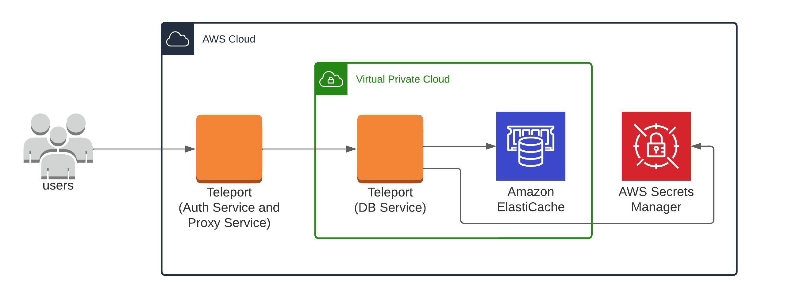

(!docs/pages/includes/database-access/db-introduction.mdx dbType="Amazon ElastiCache" dbConfigure="with IAM authentication"!)

## How it works

(!docs/pages/includes/database-access/aws-redis-how-it-works.mdx dbType="Amazon ElastiCache"!)

<Tabs>
<TabItem scope={["oss", "enterprise"]} label="Self-Hosted">

</TabItem>
<TabItem scope={["cloud","team"]} label="Teleport Cloud">

</TabItem>
</Tabs>

(!docs/pages/includes/database-access/auto-discovery-tip.mdx dbType="Amazon Elasticache cluster" providerType="AWS"!)

## Prerequisites

(!docs/pages/includes/edition-prereqs-tabs.mdx!)

- AWS account with an ElastiCache for Redis or Valkey cluster.
  **In-transit encryption via (TLS) must be enabled**.
- Permissions to create and attach IAM policies.
- `redis-cli` version `6.2` or newer installed and added to your system's `PATH` environment variable.
- A host, e.g., an EC2 instance, where you will run the Teleport Database
  Service.
- [ACL](https://docs.aws.amazon.com/AmazonElastiCache/latest/dg/Clusters.RBAC.html) enabled for your
  ElastiCache cluster.
- (!docs/pages/includes/database-access/aws-auto-discovery-prerequisite.mdx!)
- (!docs/pages/includes/tctl.mdx!)

## Step 1/6. Create a Teleport user

(!docs/pages/includes/database-access/create-user.mdx!)

## Step 2/6. Create a Database Service configuration

(!docs/pages/includes/tctl-token.mdx serviceName="Database" tokenType="db" tokenFile="/tmp/token"!)

(!docs/pages/includes/database-access/alternative-methods-join.mdx!)

(!docs/pages/includes/install-linux.mdx!)

Create the Database Service configuration:
```code
$ ELASTICACHE_URI=""
$ sudo teleport db configure create \
   -o file \
   --name="elasticache" \
   --proxy=example.teleport.sh:443 \
   --protocol="redis" \
   --uri=${ELASTICACHE_URI?} \
   --token=/tmp/token
```

Change `example.teleport.sh:443` to the host and port of your Teleport Proxy
Service. Set `ELASTICACHE_URI` to the domain name and port of your ElastiCache
database.

The command will generate a Database Service configuration and place it at the
`/etc/teleport.yaml` location.

## Step 3/6. Create an IAM role for Teleport

(!docs/pages/includes/database-access/create-iam-role-step-description.mdx accessFor="ElastiCache databases" !)

### Create an IAM role for Teleport

(!docs/pages/includes/aws-credentials.mdx service="the Database Service"!)

### Grant permissions

(!docs/pages/includes/database-access/reference/aws-iam/elasticache/access-policy.mdx!)

## Step 4/6. Start the Database Service

(!docs/pages/includes/start-teleport.mdx service="the Database Service"!)

## Step 5/6. Configure authentication for ElastiCache users

Configure authentication for your ElastiCache database. The steps to follow
depend on whether you want to enable the Teleport Database Service to use IAM
authentication with ElastiCache, or authentication based on managing passwords
via AWS Secrets Manager:

<Tabs>
<TabItem label="ElastiCache IAM user">

To enable ACL, please see [Authenticating users with Role-Based Access
Control for
ElastiCache](https://docs.aws.amazon.com/AmazonElastiCache/latest/dg/Clusters.RBAC.html).

Some additional limitations apply when using IAM authentication - for more
information, see:
[ElastiCache Auth IAM Limits](https://docs.aws.amazon.com/AmazonElastiCache/latest/red-ug/auth-iam.html#auth-iam-limits).

There are a few requirements for configuring an ElastiCache IAM-enabled user:
- the user must have identical username and user id properties.
- the user must have authentication mode set to "IAM".
- the user must be attached to an ElastiCache user group.

Create an ElastiCache IAM-enabled user.
The following example creates an ElastiCache user with the access string
`on ~* +@all` that represents an active user with access to all available keys
and commands:
```code
$ aws elasticache create-user \
  --user-name iam-user-01 \
  --user-id iam-user-01 \
  --authentication-mode Type=iam \
  --engine redis \
  --access-string "on ~* +@all"
```

<Admonition type="note" title="Access Strings">
You may prefer a less permissive access string for your ElastiCache users.
For more information about ElastiCache access strings, please see:
[ElastiCache Cluster RBAC Access String](https://docs.aws.amazon.com/AmazonElastiCache/latest/red-ug/Clusters.RBAC.html#Access-string).
</Admonition>

Create an ElastiCache user group and attach it to your ElastiCache replication
group:
```code
$ aws elasticache create-user-group \
  --user-group-id iam-user-group-01 \
  --engine redis \
  --user-ids default iam-user-01
$ aws elasticache modify-replication-group \
  --replication-group-id replication-group-01 \
  --user-group-ids-to-add iam-user-group-01
```

Once the ElastiCache user has been created, verify that the user is configured
to satisfy the requirements for IAM authentication:


</TabItem>

<TabItem label="Teleport-managed user">

To enable ACL, please see [Authenticating users with Role-Based Access
Control for
ElastiCache](https://docs.aws.amazon.com/AmazonElastiCache/latest/dg/Clusters.RBAC.html).

Once an ElastiCache user is created with the desired access, add an AWS resource
tag `teleport.dev/managed` with the value `true` to this user:


The Database Service will automatically discover this user if it is associated
with a registered database. Keep in mind that it may take the Database Service
some time (up to 20 minutes) to discover this user once the tag is added.

</TabItem>
</Tabs>

(!docs/pages/includes/database-access/aws-redis-no-auth.mdx dbType="ElastiCache"!)

## Step 6/6. Connect

Once the Database Service has started and joined the cluster, log in to see the
registered databases:

<Tabs>
<TabItem scope={["oss", "enterprise"]} label="Self-Hosted">
```code
$ tsh login --proxy=teleport.example.com --user=alice
$ tsh db ls
# Name                        Description Labels
# --------------------------- ----------- --------
# my-cluster-mode-elasticache             ...
# my-elasticache                          ...
# my-elasticache-reader                   ...
```

</TabItem>
<TabItem scope={["cloud"]} label="Teleport Enterprise Cloud">

```code
$ tsh login --proxy=mytenant.teleport.sh --user=alice
$ tsh db ls
# Name                        Description Labels
# --------------------------- ----------- --------
# my-cluster-mode-elasticache             ...
# my-elasticache                          ...
# my-elasticache-reader                   ...
```

</TabItem>

</Tabs>

To retrieve credentials for a database and connect to it:

```code
$ tsh db connect --db-user=my-database-user my-elasticache
```

(!docs/pages/includes/database-access/aws-redis-tsh-db-user-auth.mdx!)

To log out of the database and remove credentials:

```code
# Remove credentials for a particular database instance.
$ tsh db logout my-elasticache
# Remove credentials for all database instances.
$ tsh db logout
```

## Troubleshooting

(!docs/pages/includes/database-access/aws-troubleshooting.mdx!)

## Next steps

(!docs/pages/includes/database-access/guides-next-steps.mdx!)

