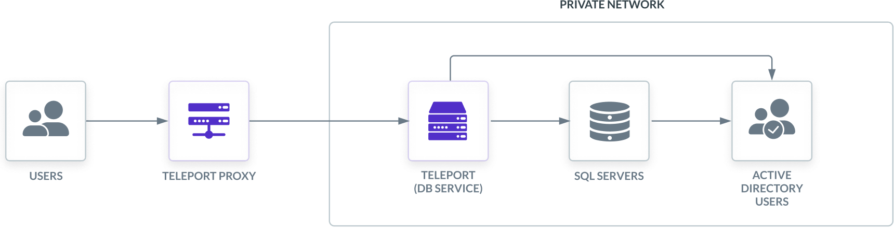
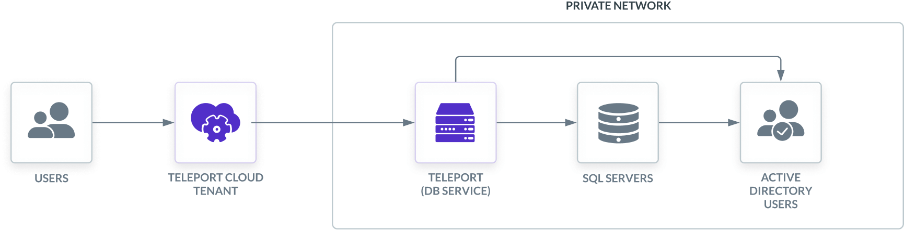
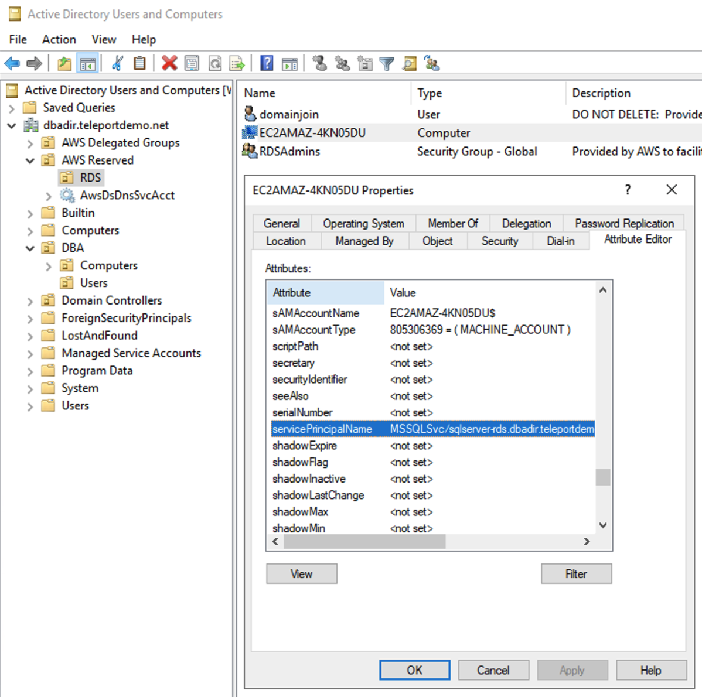

(!docs/pages/includes/database-access/db-introduction.mdx dbType="Microsoft SQL Server" dbConfigure="with Active Directory authentication"!)

This guide will focus on Amazon RDS for SQL Server using AWS-managed Active
Directory authentication.

## How it works

The Teleport Database Service joins the same Active Directory domain as the SQL
Server database and uses the Kerberos protocol to authenticate with SQL Server.
When a user connects to SQL Server via Teleport, the Database Service obtains a
service ticket from Active Directory, then uses a long-term key for the database
user to decrypt the ticket and connect to SQL Server. At that point, the
Database Service forwards user traffic to the database.

<Tabs>
<TabItem scope={["oss", "enterprise"]} label="Self-Hosted">

</TabItem>
<TabItem scope={["cloud"]} label="Teleport Enterprise Cloud">

</TabItem>
</Tabs>

## Prerequisites

(!docs/pages/includes/edition-prereqs-tabs.mdx!)

- A SQL Server database with Active Directory authentication enabled.
- A SQL Server network listener configured with a Certificate using Subject Alternative Names
- A Windows machine joined to the same Active Directory domain as the database.
- A Linux node joined to the same Active Directory domain as the database. This
  guide will walk you through the joining steps if you don't have one.
- (!docs/pages/includes/tctl.mdx!)

## Step 1/7. Create a Teleport user

(!docs/pages/includes/database-access/create-user.mdx!)

## Step 2/7. Join the Linux node to Active Directory

<Admonition type="note">
  You can skip this step if you already have a Linux node joined to the same
  Active Directory domain as your SQL Server instance.
</Admonition>

The Linux node where the Database Service will run must be joined to the same
Active Directory domain as the SQL Server database.

Note that in order to be able to join, the Linux node must be able to resolve
your Active Directory fully-qualified domain name. For example, for AWS-managed
AD, use nameservers provided under "Networking details" on the directory's
overview page.

Install necessary packages:

<Tabs>
  <TabItem label="Ubuntu">
    ```code
    $ sudo apt-get update
    $ sudo apt-get -y install sssd realmd krb5-user samba-common packagekit adcli
    ```
  </TabItem>
  <TabItem label="RHEL / CentOS 7">
    ```code
    $ sudo yum -y update
    $ sudo yum -y install sssd realmd krb5-workstation samba-common-tools
    ```
  </TabItem>
</Tabs>

Edit `/etc/krb5.conf` to disable reverse DNS resolution and set the default
realm. Make sure that the `[realms]` section contains your domain definition
and has `admin_server` and `kdc` fields set pointing to the domain controllers:

```ini
[libdefaults]
default_realm = EXAMPLE.COM
rdns = false

[realms]
  EXAMPLE.COM = {
    kdc = example.com
    admin_server = example.com
  }
```

Join the realm:

```code
$ sudo realm join -v -U admin@EXAMPLE.COM example.com
...
 * Successfully enrolled machine in realm
```

<Admonition type="warning">
  Note that the realm name in `admin@EXAMPLE.COM` **must** be capital case,
  otherwise the node might not be able to join.
</Admonition>

To confirm the node has joined the realm, use the `realm list` command:

```code
$ sudo realm list
example.com
  type: kerberos
  realm-name: EXAMPLE.COM
  domain-name: example.com
  configured: kerberos-member
  server-software: active-directory
  client-software: sssd
  ...
```

## Step 3/7. Create keytab file

Teleport requires a keytab file to obtain Kerberos service tickets from your
Active Directory for authentication with SQL Server. The easiest way to generate
it is to use the `adutil` Linux CLI utility.

Install `adutil` on the Linux node you have joined to your Active Directory
domain:

<Tabs>
  <TabItem label="Ubuntu 18.04">
    ```code
    $ curl https://packages.microsoft.com/keys/microsoft.asc | sudo tee /etc/apt/trusted.gpg.d/microsoft.asc
    $ curl https://packages.microsoft.com/config/ubuntu/18.04/prod.list | sudo tee /etc/apt/sources.list.d/msprod.list
    $ sudo apt-get update
    $ sudo ACCEPT_EULA=Y apt-get install -y adutil
    ```
  </TabItem>
  <TabItem label="Ubuntu 20.04">
    ```code
    $ curl https://packages.microsoft.com/keys/microsoft.asc | sudo tee /etc/apt/trusted.gpg.d/microsoft.asc
    $ curl https://packages.microsoft.com/config/ubuntu/20.04/prod.list | sudo tee /etc/apt/sources.list.d/msprod.list
    $ sudo apt-get update
    $ sudo ACCEPT_EULA=Y apt-get install -y adutil
    ```
  </TabItem>
  <TabItem label="Ubuntu 22.04">
    ```code
    $ curl https://packages.microsoft.com/keys/microsoft.asc | sudo tee /etc/apt/trusted.gpg.d/microsoft.asc
    $ curl https://packages.microsoft.com/config/ubuntu/22.04/prod.list | sudo tee /etc/apt/sources.list.d/msprod.list
    $ sudo apt-get update
    $ sudo ACCEPT_EULA=Y apt-get install -y adutil
    ```
  </TabItem>
  <TabItem label="RHEL 8">
    ```code
    $ sudo curl -o /etc/yum.repos.d/msprod.repo https://packages.microsoft.com/config/rhel/8/prod.repo
    $ sudo ACCEPT_EULA=Y yum install -y adutil
    ```
  </TabItem>
  <TabItem label="RHEL 9">
    ```code
    $ sudo curl -o /etc/yum.repos.d/msprod.repo https://packages.microsoft.com/config/rhel/9/prod.repo
    $ sudo ACCEPT_EULA=Y yum install -y adutil
    ```
  </TabItem>
</Tabs>

Log in to Active Directory using the `kinit` command:

```code
$ kinit admin@EXAMPLE.COM
```

Use the `adutil keytab create` command to generate keytab entries for each
Active Directory user that will be connecting to the SQL Server database:

```code
$ adutil keytab create teleport.keytab alice
$ adutil keytab create teleport.keytab bob
```

You will be prompted to enter each user's password. All keytab entries will
be merged into the same `teleport.keytab` file.

<Admonition type="note" title="Assign Service Principal Names">
  For the `adutil keytab create` command to work, each user account must be
  assigned a Service Principal Name, otherwise the command will not be able
  to determine its `kvno` (key version number).

  To check if the user has any SPNs assigned, run the following command on the
  Windows machine joined to your Active Directory domain:

  ```code
  $ setspn -L alice
  ```

  To assign an SPN to a user account, use the following command:

  ```code
  $ setspn -s user/alice alice
  ```
</Admonition>

You can verify entries in the keytab file using `klist` command:

```code
$ klist -ke teleport.keytab
Keytab name: FILE:teleport.keytab
KVNO Principal
---- --------------------------------------------------------------------------
   5 alice@EXAMPLE.COM (aes256-cts-hmac-sha1-96)
   2 bob@EXAMPLE.COM (aes256-cts-hmac-sha1-96)
```

<Admonition type="warning">
  You must update the keytab file after updating a user's password to avoid
  authentication failures.
</Admonition>

## Step 4/7. Set up the Teleport Database Service

(!docs/pages/includes/tctl-token.mdx serviceName="Database" tokenType="db" tokenFile="/tmp/token"!)

(!docs/pages/includes/install-linux.mdx!)

<Admonition type="note">
  Teleport Database Service must run on a Linux server joined to the same
  Active Directory domain as the SQL Server.
</Admonition>

<Tabs>
<TabItem scope={["oss", "enterprise"]} label="Self-Hosted">

Configure the Teleport Database Service. Make sure to update `--proxy` to
point to your Teleport Proxy Service address and `--uri` to the SQL Server
endpoint.

  ```code
  $ sudo teleport db configure create \
    -o file \
    --token=/tmp/token \
    --proxy=teleport.example.com:443 \
    --name=sqlserver \
    --protocol=sqlserver \
    --uri=sqlserver.example.com:1433 \
    --ad-keytab-file=/path/to/teleport.keytab \
    --ad-domain=EXAMPLE.COM \
    --ad-spn=MSSQLSvc/sqlserver.example.com:1433 \
    --labels=env=dev
  ```
  
</TabItem>
<TabItem scope={["cloud"]} label="Teleport Enterprise Cloud">

Configure the Teleport Database Service. Make sure to update `--proxy` to
point to your Teleport Cloud tenant address and `--uri` to the SQL Server
endpoint.

  ```code
  $ sudo teleport db configure create \
    -o file \
    --token=/tmp/token \
    --proxy=mytenant.teleport.sh:443 \
    --name=sqlserver \
    --protocol=sqlserver \
    --uri=sqlserver.example.com:1433 \
    --ad-keytab-file=/path/to/teleport.keytab \
    --ad-domain=EXAMPLE.COM \
    --ad-spn=MSSQLSvc/sqlserver.example.com:1433 \
    --labels=env=dev
  ```

</TabItem>

</Tabs>

Provide Active Directory parameters:

| Flag | Description |
| ---- | ----------- |
| `--ad-keytab-file` | Path to Kerberos keytab file generated above. |
| `--ad-domain` | Active Directory domain (Kerberos realm) that SQL Server is joined. |
| `--ad-spn` | Service Principal Name for SQL Server to fetch Kerberos tickets for. |

### Service Principal Name

You can use `ldapsearch` command to see the SPNs registered for your SQL
Server. Typically, they take a form of `MSSQLSvc/<name>.<ad-domain>:<port>`.

For example, an AWS RDS SQL Server named `sqlserver` and joined to an AWS managed
Active Directory domain `EXAMPLE.COM` will have the following SPNs registered:

```code
$ ldapsearch -x -h example.com -D admin -W -b DC=example,DC=com servicePrincipalName
...
# EC2AMAZ-4KN05DU, RDS, AWS Reserved, example.com
dn: CN=EC2AMAZ-4KN05DU,OU=RDS,OU=AWS Reserved,DC=example,DC=com
servicePrincipalName: MSSQLSvc/sqlserver-rds.example.com:1433
servicePrincipalName: MSSQLSvc/EC2AMAZ-4KN05DU.example.com:1433
servicePrincipalName: MSSQLSvc/EC2AMAZ-4KN05DU.example.com
...
```

Alternatively, you can look SPNs up in the Attribute Editor of the Active Directory
Users and Computers dialog on your AD-joined Windows machine. The RDS SQL Server
object typically resides under the AWS Reserved / RDS path:



<Admonition type="tip">
  If you don't see Attribute Editor tab, make sure that "View > Advanced Features"
  toggle is enabled.
</Admonition>

## Step 5/7. Start the Database Service

(!docs/pages/includes/start-teleport.mdx service="the Teleport Database Service"!)

## Step 6/7. Create SQL Server AD users

<Admonition type="note">
  You can skip this step if you already have Active Directory logins in your
  SQL Server.
</Admonition>

Connect to your SQL Server as an administrative account (e.g. `sa`) and create
logins that will use Active Directory authentication:

```sql
master> CREATE LOGIN [EXAMPLE\alice] FROM WINDOWS WITH DEFAULT_DATABASE = [master], DEFAULT_LANGUAGE = [us_english];
```

## Step 7/7. Connect

Log in to your Teleport cluster. Your SQL Server database should appear in the
list of available databases:

<Tabs>
<TabItem scope={["oss", "enterprise"]} label="Self-Hosted">

```code
$ tsh login --proxy=teleport.example.com --user=alice
$ tsh db ls
# Name      Description         Labels
# --------- ------------------- -------
# sqlserver                     env=dev
```

</TabItem>
<TabItem scope={["cloud"]} label="Teleport Enterprise Cloud">

```code
$ tsh login --proxy=mytenant.teleport.sh --user=alice
$ tsh db ls
# Name      Description         Labels
# --------- ------------------- -------
# sqlserver                     env=dev
```

</TabItem>

</Tabs>

To retrieve credentials for a database and connect to it:

```code
$ tsh db connect --db-user=teleport sqlserver
```

(!docs/pages/includes/database-access/sql-server-connect-note.mdx!)

To log out of the database and remove credentials:

```code
$ tsh db logout sqlserver
```

## Troubleshooting

### Certificate error

If your `tsh db connect` error includes the following text, the certificate used by SQL Server is not a known Certificate Authority.

```code
Error message: TLS Handshake failed: x509: certificate signed by unknown authority
```

To solve this, you can add the CA configuration to the database like the
following:

```diff
  databases:
  - name: sqlserver
    protocol: sqlserver
    uri: sqlserver.example.com:1433
    ad:
      keytab_file: /path/to/teleport.keytab
      domain: EXAMPLE.COM
      spn: MSSQLSvc/sqlserver.example.com:1433
    static_labels:
      "env": "dev"
+   tls:
+     # Point it to your Database CA PEM certificate.
+     ca_cert_file: "rdsca.pem"
+     # If your database certificate has an empty CN filed, you must change
+     # the TLS mode to only verify the CA.
+     mode: verify-ca
```

If you’re unable to acquire the database CA, you can skip TLS verification by
providing the configuration `tls.mode: "insecure"`. However, we do not recommend
skipping TLS verification in production environments.

## Next steps

(!docs/pages/includes/database-access/guides-next-steps.mdx!)

## Further reading

- [Manually join a Linux instance](https://docs.aws.amazon.com/directoryservice/latest/admin-guide/join_linux_instance.html) in the AWS documentation.
- [Introduction to `adutil`](https://docs.microsoft.com/en-us/sql/linux/sql-server-linux-ad-auth-adutil-introduction) in the Microsoft documentation.

