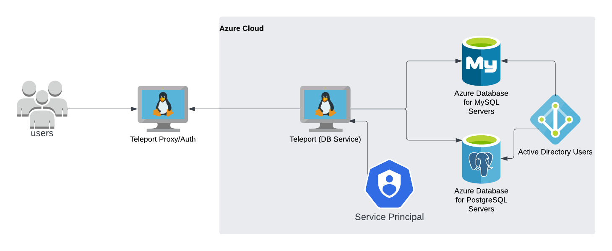
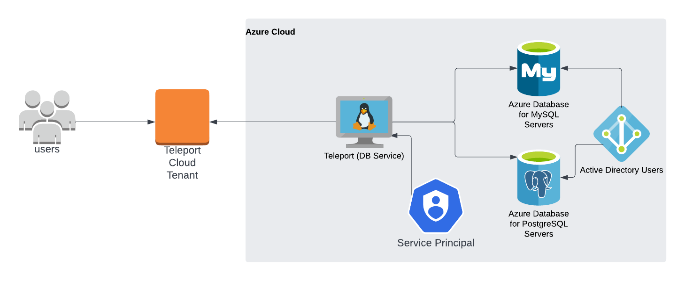
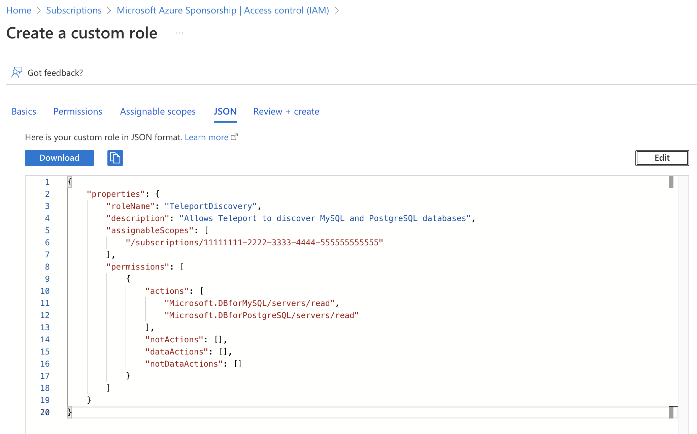
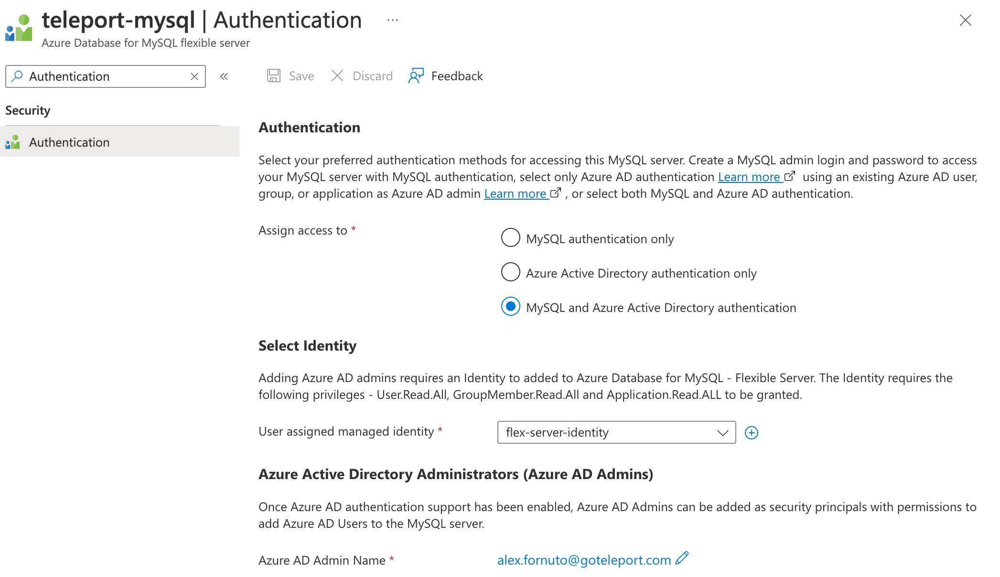
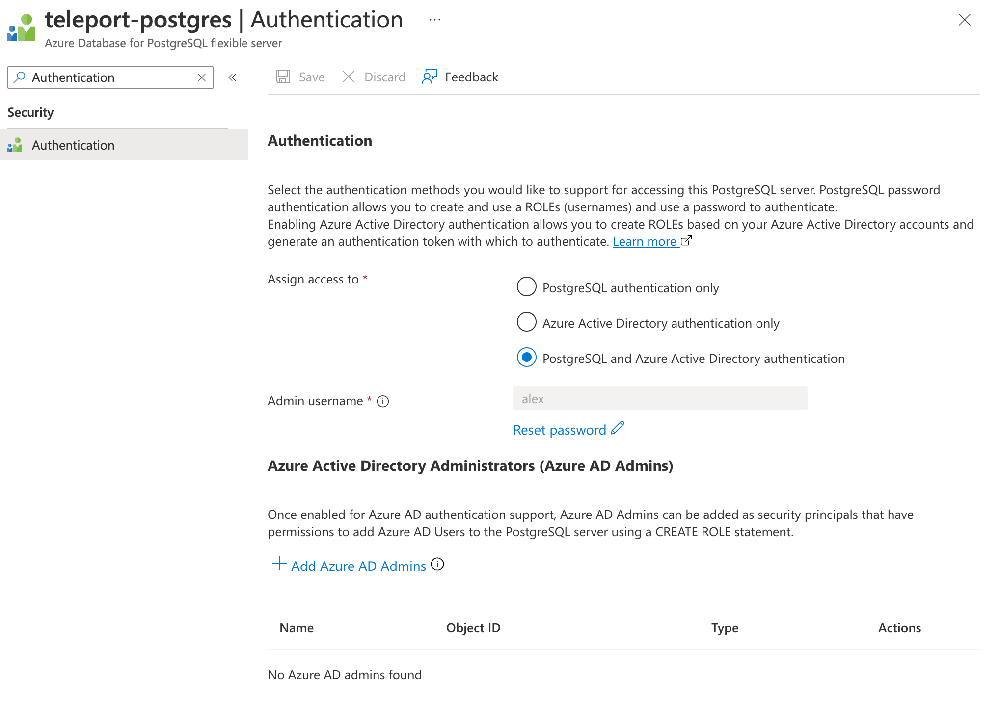
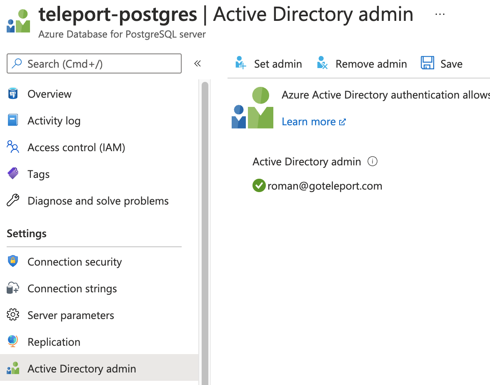

(!docs/pages/includes/database-access/db-introduction.mdx dbType="Azure PostgreSQL or MySQL" dbConfigure="with Microsoft Entra ID-based authentication"!)

Database auto-discovery for Azure PostgreSQL/MySQL flexible servers is available starting from
Teleport `12.0`.

## How it works

The Teleport Database Service proxies traffic between Teleport users and Azure
PostgreSQL and MySQL. When a user connects to the database via Teleport, the
Database Service obtains an access token from Microsoft Entra ID (formerly Azure
AD) and authenticates to Azure as a principal with permissions to manage the
database.

<Tabs>
<TabItem scope={["oss", "enterprise"]} label="Self-Hosted">

</TabItem>
<TabItem scope={["cloud"]} label="Teleport Enterprise Cloud">

</TabItem>
</Tabs>

## Prerequisites

(!docs/pages/includes/edition-prereqs-tabs.mdx!)

- Deployed Azure Database for PostgreSQL or MySQL server.
- Azure Active Directory administrative privileges.
- A host, e.g., an Azure VM instance, where you will run the Teleport Database
  Service.
- (!docs/pages/includes/tctl.mdx!)


## Step 1/5. Configure Azure service principal

To authenticate with PostgreSQL or MySQL databases, Teleport Database Service
needs to obtain access tokens from Azure AD.

(!docs/pages/includes/database-access/azure-configure-service-principal.mdx!)

## Step 2/5. Configure IAM permissions for Teleport

### Create a custom role

Teleport needs Azure IAM permissions to discover and register MySQL and PostgreSQL databases.
Create a role with assignable scope(s) that include all databases that Teleport should discover. For example:

```json
{
    "properties": {
        "roleName": "TeleportDiscovery",
        "description": "Allows Teleport to discover MySQL and PostgreSQL databases",
        "assignableScopes": [
            "/subscriptions/11111111-2222-3333-4444-555555555555"
        ],
        "permissions": [
            {
                "actions": [
                    "Microsoft.DBforMySQL/servers/read",
                    "Microsoft.DBforPostgreSQL/servers/read",
                    "Microsoft.DBforMySQL/flexibleServers/read",
                    "Microsoft.DBforPostgreSQL/flexibleServers/read"
                ],
                "notActions": [],
                "dataActions": [],
                "notDataActions": []
            }
        ]
    }
}
```

This role definition allows Teleport to discover MySQL and PostgreSQL databases, but Teleport only needs
permissions for the database types you have. The assignable scopes include a subscription, so
the role can be assigned at any resource scope within that subscription, or assigned using the
subscription scope itself.

<Admonition type="note" title="Custom role assignable scope">
Custom roles, unlike
[Azure built-in roles](https://docs.microsoft.com/en-us/azure/role-based-access-control/built-in-roles),
can not have a root assignable scope. The highest assignable scope that
can be used in a custom role is subscription scope. Using a management group scope is currently an Azure
preview feature, and only allows for a single management group in the "assignableScopes" of a role
definition.
See [Azure RBAC custom roles](https://docs.microsoft.com/en-us/azure/role-based-access-control/custom-roles) for
more information.
</Admonition>

Go to the [Subscriptions](https://portal.azure.com/#view/Microsoft_Azure_Billing/SubscriptionsBlade) page and select a subscription.

Click on *Access control (IAM)* in the subscription and select *Add > Add custom role*:


In the custom role creation page, click the *JSON* tab and click *Edit*, then paste the JSON example
and replace the subscription in "assignableScopes" with your own subscription id:


### Create a role assignment for the Teleport Database Service principal

(!docs/pages/includes/database-access/azure-assign-service-principal.mdx!)

## Step 3/5. Create Azure database users

To let Teleport connect to your Azure database authenticating as a service
principal, you need to create Azure AD users authenticated by that principal in the database.

### Assign Azure AD administrator

Only the Azure AD administrator for the database can connect to it and create
Azure AD users.

<Tabs>
<TabItem label="MySQL Flexible">
Go to your database's **Authentication** page and set the AD
admin using the edit button:



</TabItem>
<TabItem label="PostgreSQL Flexible">
Go to your database's **Authentication** page and set the AD
admin by selecting **+ Add Azure AD Admins**:



</TabItem>
<TabItem label="Single server">
Go to your database's *Active Directory admin* page
and set the AD admin using the *Set admin* button:



</TabItem>
</Tabs>

<Admonition type="note" title="Azure AD Admin">
Only one Azure user (or group) can be set as an Azure AD admin for the database.
If the Azure AD admin is removed from the server, all Azure AD logins will be disabled for the server.
Adding a new Azure AD admin from the same tenant will re-enable Azure AD logins.
Refer to [Use Azure Active Directory for authenticating with PostgreSQL](https://docs.microsoft.com/en-us/azure/postgresql/single-server/concepts-azure-ad-authentication)
for more information.
</Admonition>

### Connect to the database as an AD admin

Next, you need to connect to your database as the AD admin user.

Use the Azure `az` CLI utility to log in as the user that you set as the AD admin,
fetch the access token and use it as a password when connecting to the database:

<Tabs>
<TabItem label="PostgreSQL Flexible">

```code
$ az login -u ad@example.com
$ TOKEN=`az account get-access-token --resource-type oss-rdbms --output tsv --query accessToken`
$ PGPASSWORD=$TOKEN psql "host=example.postgres.database.azure.com user=ad@example.com sslmode=require dbname=postgres"
```

</TabItem>
<TabItem label="PostgreSQL">

```code
$ az login -u ad@example.com
$ TOKEN=`az account get-access-token --resource-type oss-rdbms --output tsv --query accessToken`
$ PGPASSWORD=$TOKEN psql "host=example.postgres.database.azure.com user=ad@example.com@instance-name sslmode=require dbname=postgres"
```

</TabItem>
<TabItem label="MySQL Flexible">

```code
$ az login -u ad-admin@example.com
$ TOKEN=`az account get-access-token --resource-type oss-rdbms --output tsv --query accessToken`
$ mysql -h example.mysql.database.azure.com -P 3306 -u ad@example.com --enable-cleartext-plugin --password=$TOKEN
```

</TabItem>
<TabItem label="MySQL">

```code
$ az login -u ad-admin@example.com
$ TOKEN=`az account get-access-token --resource-type oss-rdbms --output tsv --query accessToken`
$ mysql -h example.mysql.database.azure.com -P 3306 -u ad@example.com@instance-name --enable-cleartext-plugin --password=$TOKEN
```

</TabItem>
</Tabs>

Note that the database username must include `@instance-name` suffix with the
name of the Azure database instance you're connecting to.

### Create AD users

Once connected to the database as AD admin, create database users for the
service principal that Teleport Database Service will be using. Use `Client ID`
when using managed identities and `Application (client) ID` when using app
registrations:

<Tabs>
<TabItem label="PostgreSQL">

```sql
postgres=> SET aad_validate_oids_in_tenant = off;
SET
postgres=> CREATE ROLE teleport WITH LOGIN PASSWORD '11111111-2222-3333-4444-555555555555' IN ROLE azure_ad_user;
CREATE ROLE
```

</TabItem>
<TabItem label="PostgreSQL Flexible">

```sql
postgres=> SELECT * FROM pgaadauth_create_principal_with_oid('teleport', '11111111-2222-3333-4444-555555555555', 'service', false, false);
-------------------------------------
 Created role for teleport
(1 row)
```

</TabItem>
<TabItem label="MySQL">

```sql
mysql> SET aad_auth_validate_oids_in_tenant = OFF;
mysql> CREATE AADUSER 'teleport' IDENTIFIED BY '11111111-2222-3333-4444-555555555555';
Query OK, 0 rows affected (0.92 sec)
```

The created user may not have access to anything by default so let's grant it
some permissions:

```sql
GRANT ALL ON `%`.* TO 'teleport'@'%';
```

</TabItem>
</Tabs>

You can create multiple database users identified by the same service principal.

## Step 4/5. Install the Teleport Database Service

(!docs/pages/includes/tctl-token.mdx serviceName="Database" tokenType="db" tokenFile="/tmp/token"!)

Install Teleport on the host where you will run the Teleport Database Service:

(!docs/pages/includes/install-linux.mdx!)

Create the Database Service configuration.

<Tabs>
<TabItem label="PostgreSQL">

- Specify the region for your database(s) in `--azure-postgres-discovery`.

- Replace the `--proxy` value with your Teleport Proxy Service address or Teleport Enterprise (Cloud)
  URI (e.g. `example.teleport.sh:443`):

  ```code
  $ sudo teleport db configure create \
    -o file \
    --proxy=teleport.example.com:443 \
    --token=/tmp/token \
    --azure-postgres-discovery=eastus
  ```

</TabItem>
<TabItem label="MySQL">

- Specify the region for your database(s) in `--azure-mysql-discovery`.

- Replace the `--proxy` value with your Teleport Proxy Service address or Teleport Enterprise (Cloud)
  URI (e.g. `example.teleport.sh:443`):

  ```code
  $ sudo teleport db configure create \
    -o file \
    --proxy=teleport.example.com:443 \
    --token=/tmp/token \
    --azure-mysql-discovery=eastus
  ```

</TabItem>

<TabItem label="PostgreSQL and MySQL">

Run the following command on your Database Service host:

  ```code
  $ sudo teleport db configure create \
    -o file \
    --proxy=teleport.example.com:443 \
    --token=/tmp/token \
    --azure-mysql-discovery=eastus \
    --azure-postgres-discovery=eastus
  ```

This will create two `types` entities in `teleport.yaml`, one for each database
type. This is useful if you want different regions, tags, or labels for each
database type.

Alternatively, you can edit `teleport.yaml` to include both database types in a
single entry:

```yaml
db_service:
  azure:
  - types: ["mysql", "postgres"]
  ...
```

</TabItem>

</Tabs>

This command will generate a Database Service configuration with Azure MySQL/Postgres
database auto-discovery enabled in the `eastus` region and place it at the
`/etc/teleport.yaml` location.

### Create a Teleport role

On your workstation logged in to your Teleport cluster with `tsh`, define a new
role to provide access to your Azure database. Create a file called `azure-database-role.yaml` with the following content:

```yaml
version: v7
kind: role
metadata:
  name: azure-database-access
spec:
  allow:
    db_labels:
      'engine':
        - "Microsoft.DBforMySQL/servers"
        - "Microsoft.DBforMySQL/flexibleServers"
        - "Microsoft.DBforPostgreSQL/servers"
        - "Microsoft.DBforPostgreSQL/flexibleServers"
    db_names:
    - '*'
    db_users:
    - teleport
```

| Flag                       | Description                                                                                                                              |
|----------------------------|------------------------------------------------------------------------------------------------------------------------------------------|
| `--db-users` | List of database usernames the user will be allowed to use when connecting to the databases. A wildcard allows any user.                 |
| `--db-names` | List of logical databases (aka schemas) the user will be allowed to connect to within a database server. A wildcard allows any database. |
| `--db-labels` | List of labels assigned to the database the user will be able to access. A wildcard entry allows any database.                           |

Save this file and apply it to your Teleport cluster:

```code
$ tctl create -f azure-database-role.yaml
role 'azure-database-role.yaml' has been created
```

(\!docs/pages/includes/add-role-to-user.mdx role="azure-database-access" \!)

### Start Teleport Database Service

(!docs/pages/includes/start-teleport.mdx service="the Teleport Database Service"!)

<Admonition
  type="tip"
  title="Tip"
>
  A single Teleport process can run multiple different services, for example
  multiple Database Service agents as well as the SSH Service or Application
  Service.
</Admonition>

## Step 5/5. Connect

Log in to your Teleport cluster. Your Azure database should appear in the list of
available databases:

<Tabs>
<TabItem scope={["oss", "enterprise"]} label="Self-Hosted">

```code
$ tsh login --proxy=teleport.example.com --user=alice
$ tsh db ls
# Name     Description         Labels
# -------- ------------------- -------
# azure-db                     env=dev
```

</TabItem>
<TabItem scope={["cloud"]} label="Teleport Enterprise Cloud">

```code
$ tsh login --proxy=mytenant.teleport.sh --user=alice
$ tsh db ls
# Name     Description         Labels
# -------- ------------------- -------
# azure-db                     env=dev
```

</TabItem>

</Tabs>

To retrieve credentials for a database and connect to it:

<Tabs>
<TabItem label="MySQL">

```code
$ tsh db connect --db-user=teleport azure-db
```

</TabItem>
<TabItem label="PostgreSQL">

```code
$ tsh db connect --db-user=teleport --db-name=postgres azure-db
```

</TabItem>
</Tabs>

<Admonition type="note">
The appropriate database command-line client (`psql`, `mysql`) should be
available in the `PATH` of the machine you're running `tsh db connect` from.
</Admonition>

To log out of the database and remove credentials:

```code
$ tsh db logout azure-db
```

## Troubleshooting

(!docs/pages/includes/database-access/azure-troubleshooting.mdx!)

(!docs/pages/includes/database-access/pg-cancel-request-limitation.mdx!)

(!docs/pages/includes/database-access/psql-ssl-syscall-error.mdx!)

## Next steps

(!docs/pages/includes/database-access/guides-next-steps.mdx!)

