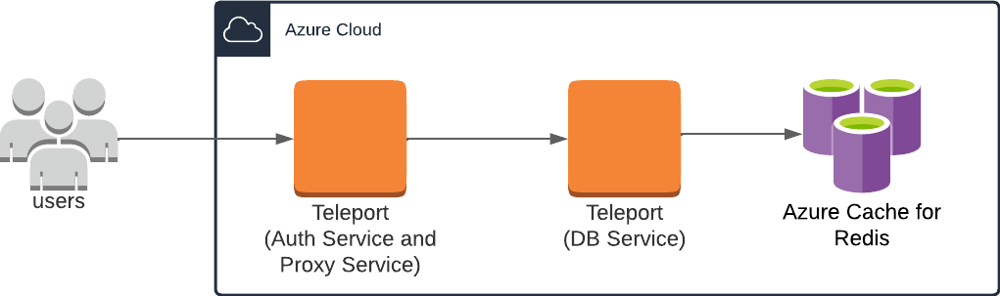
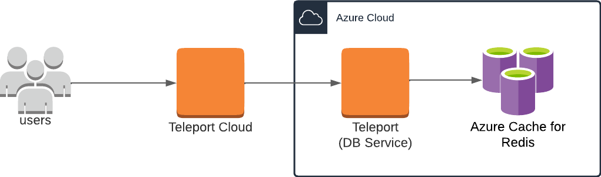
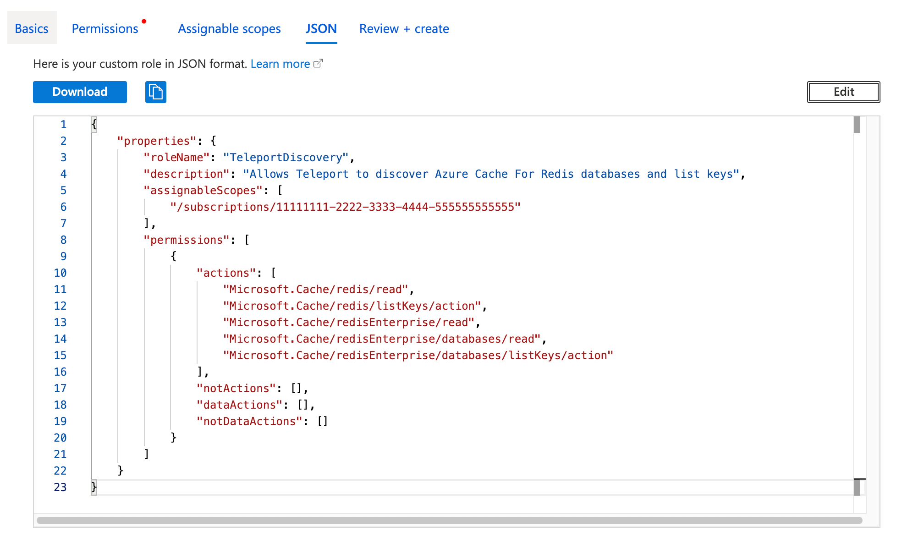

(!docs/pages/includes/database-access/db-introduction.mdx dbType="Azure Cache for Redis" dbConfigure="with Microsoft Entra ID-based authentication"!)

## How it works

The Teleport Database Service proxies traffic between Teleport users and Azure
Cache for Redis. When a user connects to the database via Teleport, the Database
Service obtains an access token from Microsoft Entra ID (formerly Azure AD) and
authenticates to Azure as a principal with permissions to manage the database.

<Tabs>
<TabItem scope={["oss", "enterprise"]} label="Self-Hosted">

</TabItem>

<TabItem scope={["cloud"]} label="Teleport Enterprise Cloud">

</TabItem>

</Tabs>

## Prerequisites

(!docs/pages/includes/edition-prereqs-tabs.mdx!)

- Deployed Azure Redis server or Azure Redis Enterprise cluster.
- Azure administrative privileges to manage service principals and access
  controls.
- A host, e.g., an Azure VM instance, where you will run the Teleport Database
  Service.
- `redis-cli` version `6.2` or newer installed and added to your system's
  `PATH` environment variable.
- (!docs/pages/includes/tctl.mdx!)

## Step 1/5. Create a Teleport user

(!docs/pages/includes/database-access/create-user.mdx!)

## Step 2/5. Create a Database Service configuration

Install Teleport on the host where you will run the Teleport Database Service:

(!docs/pages/includes/install-linux.mdx!)

Create the Database Service configuration, specifying a region like this:

<Tabs>
<TabItem scope={["oss", "enterprise"]} label="Self-Hosted">

```code
$ sudo teleport db configure create \
  -o file \
  --proxy=tele.example.com:443 \
  --token=/tmp/token \
  --azure-redis-discovery=eastus
```
</TabItem>
<TabItem scope={["cloud"]} label="Teleport Enterprise Cloud">

```code
$ sudo teleport db configure create \
  -o file \
  --proxy=teleport.example.com:443 \
  --token=/tmp/token \
  --azure-redis-discovery=eastus
```
</TabItem>

</Tabs>

The command will generate a Database Service configuration with Azure Cache for
Redis auto-discovery enabled in the `eastus` region and place it at the
`/etc/teleport.yaml` location.

<Admonition type="tip">
Use `--azure-redis-discovery=*` to discover databases in all regions. In
addition to the region, you can optionally specify
`--azure-resource-group=<resource-group-name>`,
`--azure-subscription=<subscription-id>`, or `--labels=<key>=<value>` to
further customize the scopes of the auto-discovery.
</Admonition>

## Step 3/5. Configure IAM permissions for Teleport

The Teleport Database Service needs Azure IAM permissions to:

- Discover and register Azure Cache for Redis databases. 
- Retrieve Redis access keys to authenticate with the databases.

### Configure an Azure service principal

(!docs/pages/includes/database-access/azure-configure-service-principal.mdx!)

### Create a custom role

Teleport requires `<resource-type>/read` permissions for discovery and
`<resource-type>/listKeys/action` permissions for authentication with the
Redis servers, but Teleport only needs permissions for the resource types
you have.

Here is a sample role definition allowing Teleport to read and list keys
for both Azure Redis and Azure Redis Enterprise:
```json
{
    "properties": {
        "roleName": "TeleportDiscovery",
        "description": "Allows Teleport to discover Azure Cache For Redis databases and list keys",
        "assignableScopes": [
            "/subscriptions/11111111-2222-3333-4444-555555555555"
        ],
        "permissions": [
            {
                "actions": [
                    "Microsoft.Cache/redis/read",
                    "Microsoft.Cache/redis/listKeys/action",
                    "Microsoft.Cache/redisEnterprise/read",
                    "Microsoft.Cache/redisEnterprise/databases/read",
                    "Microsoft.Cache/redisEnterprise/databases/listKeys/action"
                ],
                "notActions": [],
                "dataActions": [],
                "notDataActions": []
            }
        ]
    }
}
```
The `assignableScopes` field above includes a subscription
`/subscriptions/<subscription>`, allowing the role to be assigned at any
resource scope within that subscription or the subscription scope itself. If
you want to further limit the `assignableScopes`, you can use a resource group
`/subscriptions/<subscription>/resourceGroups/<group>` or a management group
`/providers/Microsoft.Management/managementGroups/<group>` instead.

Now go to the [Subscriptions](https://portal.azure.com/#view/Microsoft_Azure_Billing/SubscriptionsBlade) page and select a subscription.

Click on *Access control (IAM)* in the subscription and select *Add > Add custom role*:


In the custom role creation page, click the *JSON* tab and click *Edit*, then paste the JSON example
and replace the subscription in `assignableScopes` with your own subscription id:


### Create a role assignment for the Teleport Database Service principal

(!docs/pages/includes/database-access/azure-assign-service-principal.mdx!)

## Step 4/5. Start the Database Service

(!docs/pages/includes/start-teleport.mdx service="the Teleport Database Service"!)

## Step 5/5. Connect

Log in to your Teleport cluster. Your Azure Cache for Redis databases should
appear in the list of available databases:

<Tabs>
<TabItem scope={["oss", "enterprise"]} label="Self-Hosted">

```code
$ tsh login --proxy=teleport.example.com --user=alice
$ tsh db ls
Name                      Description                              Allowed Users Labels  Connect 
------------------------- ---------------------------------------- ------------- ------- ------- 
my-azure-redis            Azure Redis server in East US            [*]           ...
my-azure-redis-enterprise Azure Redis Enterprise server in East US [*]           ...
```

</TabItem>

<TabItem scope={["cloud"]} label="Teleport Enterprise Cloud">

```code
$ tsh login --proxy=mytenant.teleport.sh --user=alice
$ tsh db ls
Name                      Description                              Allowed Users Labels  Connect 
------------------------- ---------------------------------------- ------------- ------- ------- 
my-azure-redis            Azure Redis server in East US            [*]           ...
my-azure-redis-enterprise Azure Redis Enterprise server in East US [*]           ...
```

</TabItem>

</Tabs>

<Admonition type="note" title="Override default database name">
By default, Teleport uses the name of the Azure Cache for Redis resource as the
database name. You can override the database name by applying the
`TeleportDatabaseName` Azure tag to the resource. The value of the tag will be
used as the database name.
</Admonition>

To retrieve credentials for a database and connect to it:

```code
$ tsh db connect my-azure-redis
```

Note that the Teleport Database Service will retrieve the access key and
authenticate with the Redis server on the backend automatically. Therefore,
the `AUTH <access-key>` command is **not required** here once connected.

To log out of the database and remove credentials:

```code
$ tsh db logout my-azure-redis
```

## Troubleshooting

(!docs/pages/includes/database-access/azure-troubleshooting.mdx!)

## Next steps

(!docs/pages/includes/database-access/guides-next-steps.mdx!)

## Further reading
- [Understand Azure Role Definitions - AssignableScopes](https://learn.microsoft.com/en-us/azure/role-based-access-control/role-definitions#assignablescopes)
- [Azure RBAC custom roles](https://docs.microsoft.com/en-us/azure/role-based-access-control/custom-roles)

