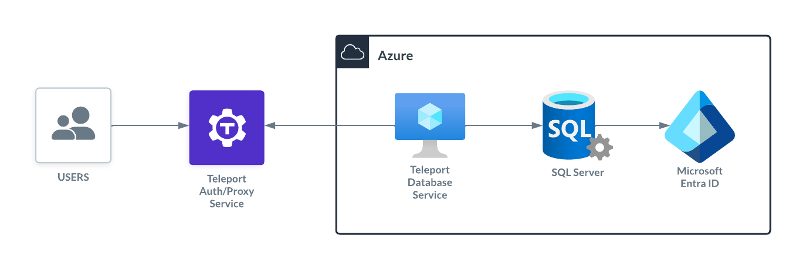
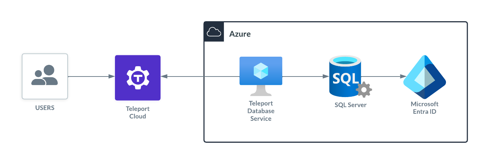
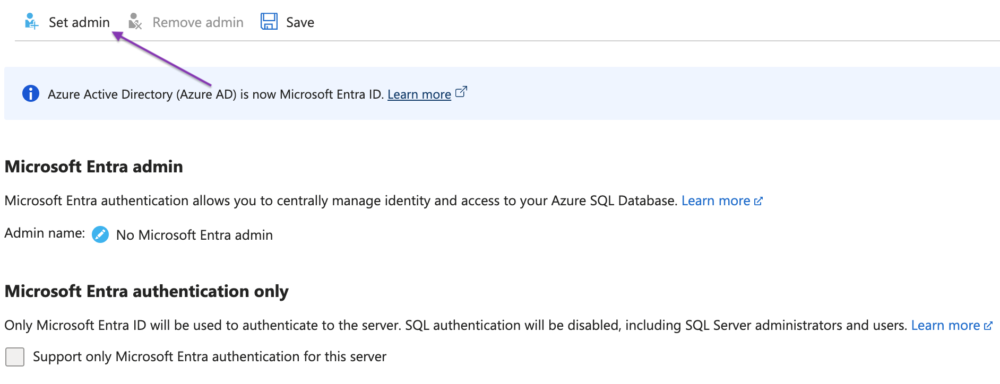
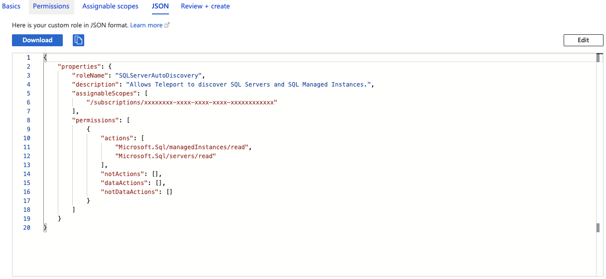
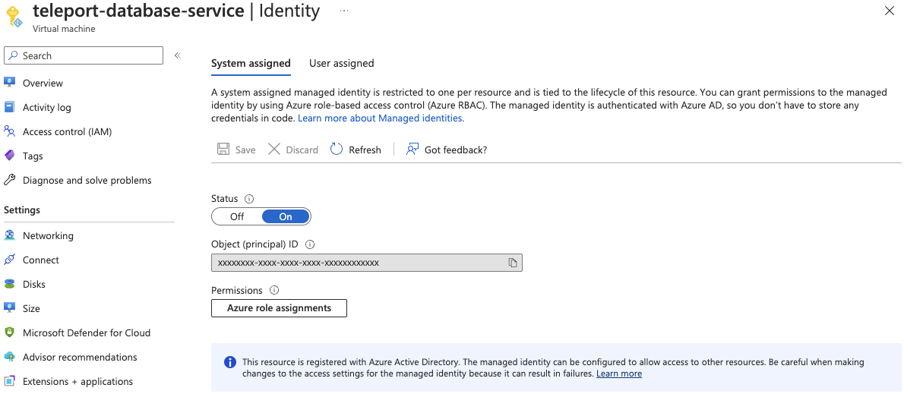
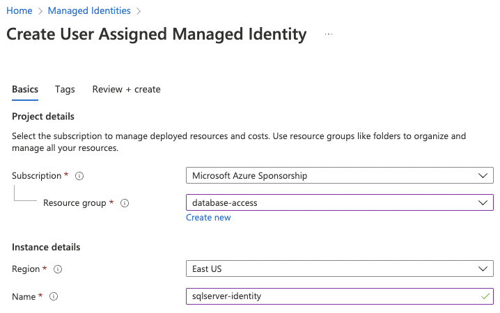
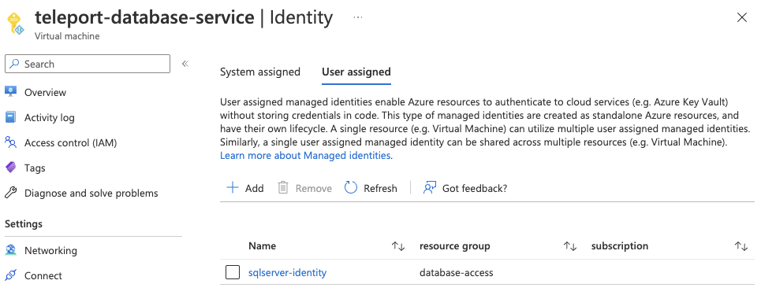

(!docs/pages/includes/database-access/db-introduction.mdx dbType="Azure SQL Server" dbConfigure="with Microsoft Entra ID-based authentication"!)

## How it works

The Teleport Database Service runs on an Azure virtual machine with an attached
Azure identity with permissions to retrieve authentication tokens from
Microsoft Entra ID. When a user connects to SQL Server with Teleport, the Teleport
Database service authenticates with Azure AD, then uses an authentication token
to connect to SQL Server. The Database Service then forwards user traffic to the
database.

<Tabs>
<TabItem scope={["oss", "enterprise"]} label="Self-Hosted">

</TabItem>
<TabItem scope={["cloud"]} label="Teleport Enterprise Cloud">

</TabItem>

</Tabs>

## Prerequisites

(!docs/pages/includes/edition-prereqs-tabs.mdx!)

- SQL Server running on Azure.
- The Teleport Database Service running on an Azure virtual instance.
- (!docs/pages/includes/tctl.mdx!)

## Step 1/8. Create a Teleport user

(!docs/pages/includes/database-access/create-user.mdx!)

## Step 2/8. Enable the Microsoft Entra authentication

If you have it enabled, you can go to the next step.

Go to the [Azure Portal](https://portal.azure.com/), select **Database
servers**, and select the database you wish to enable the Microsoft Entra
authentication.

Select **Microsoft Entra ID** under "Settings" in the left-hand column.

Select **Set Admin**, and choose an account that will be added as an admin
login to SQL Server.



## Step 3/8. Configure IAM permissions for Teleport

The Teleport Database Service needs Azure IAM permissions to:
- Discover and register SQL Server instances.
- Fetch virtual machine managed identities used for login.

### Configure an Azure service principal

Teleport requires the following permissions:
- `<resource-type>/read` permissions for discovery, but only for the resource
  types you have. For example, `Microsoft.Sql/managedInstances/read`.
- `Microsoft.Compute/virtualMachines/read`.

Here is a sample role definition allowing Teleport to read **Azure SQL Servers**
and **Azure SQL Managed Instances**:

```json
{
    "properties": {
        "roleName": "SQLServerAutoDiscovery",
        "description": "Allows Teleport to discover SQL Servers and SQL Managed Instances.",
        "assignableScopes": [
            "/subscriptions/xxxxxxxx-xxxx-xxxx-xxxx-xxxxxxxxxxxx"
        ],
        "permissions": [
            {
                "actions": [
                    "Microsoft.Sql/managedInstances/read",
                    "Microsoft.Sql/servers/read",
                    "Microsoft.Compute/virtualMachines/read"
                ],
                "notActions": [],
                "dataActions": [],
                "notDataActions": []
            }
        ]
    }
}
```

The `assignableScopes` field above includes a subscription
(`/subscriptions/<subscription>`), allowing the role to be assigned at any
resource scope within that subscription or the subscription scope itself.
If you want to further limit the `assignableScopes`, you can use a resource
group (`/subscriptions/<subscription>/resourceGroups/<group>`) or a management
group (`/providers/Microsoft.Management/managementGroups/<group>`) instead.

Go to the [Subscriptions](https://portal.azure.com/#view/Microsoft_Azure_Billing/SubscriptionsBlade)
page and select a subscription.

Click on **Access control (IAM)** in the subscription and select **Add** >
**Add custom role**:


In the custom role creation page, click the **JSON** tab and click **Edit**,
then paste the JSON example and replace the subscription in `assignableScopes`
with your own subscription id:



## Step 4/8. Configure virtual machine identities

In the Teleport Database Service virtual machine's **Identity**
section, enable the system assigned identity. This is used by Teleport to access
Azure APIs.



To grant Teleport permissions, the custom role you created must be assigned to
the virtual machine system assigned identity. On the same page, click on the **Azure
role assignments**, then on **Add role assignment**. Select the custom role and
save.

<Admonition type="note" title="Azure Role Assignments">
The role assignment should be at a high enough scope to allow the Teleport Database Service to discover
all matching databases. See
[Identify the needed scope](https://docs.microsoft.com/en-us/azure/role-based-access-control/role-assignments-steps#step-3-identify-the-needed-scope)
for more information about Azure scopes and creating role assignments.
</Admonition>

### Login identities

The Teleport Database Service needs access tokens from Azure AD to authenticate with
SQL Server databases.

It uses the managed identities attached to its Virtual Machine to fetch the
authentication token.

To create a new user-assigned managed identity, go to the **Managed Identities**
page in your [Azure Portal](https://portal.azure.com/#view/HubsExtension/BrowseResource/resourceType/Microsoft.ManagedIdentity%2FuserAssignedIdentities)
and click on *Create*. Choose a name and resource group for it and create:



Next, go to the **Teleport Database Service virtual machine instance**,
**Identity** section, select **User assigned**, and add the identity we just
created:



## Step 5/8. Enable managed identities login on SQL Server

Azure AD SQL Server integration uses database-level authentication (contained
users), meaning we must create a user for our identities on each database we
want to access.

To create contained users for the identities, connect to your SQL server using
its Activity Directory Admin and execute the query:

```sql
USE MyDatabase;
CREATE USER [sqlserver-identity] FROM EXTERNAL PROVIDER;
```

The newly created user will be attached to the public role, which might not
have enough permissions to perform queries. Consider granting individual
permissions to the user or assigning it to an existing role. For example, add
the user as a member of the `db_datareader` role:

```sql
ALTER ROLE db_datareader ADD MEMBER [sqlserver-identity];
```

## Step 6/8. Create a Database Service configuration

Install Teleport on the host where you will run the Teleport Database Service:

(!docs/pages/includes/install-linux.mdx!)

Generate a configuration file at `/etc/teleport.yaml` for the Database Service.
Set the `--proxy` command-line option to the address for your Teleport cluster
and the `--azure-sqlserver-discovery` to the appropriate region:

```code
$ sudo teleport db configure create \
   -o file \
   --token=/tmp/token \
   --proxy=<Var name="teleport.example.com" />:443 \
   --azure-sqlserver-discovery=eastus
```

The command will generate a Database Service configuration with Azure SQL
Server auto-discovery enabled in the `eastus` region and place it at the
`/etc/teleport.yaml` location.

## Step 7/8. Start Teleport Database Service

(!docs/pages/includes/start-teleport.mdx service="the Teleport Database Service"!)

<Admonition
  type="tip"
  title="Tip"
>
  A single Teleport process can run multiple different services, for example
  multiple Database Service agents as well as the SSH Service or Application
  Service.
</Admonition>

## Step 8/8. Connect

Log in to your Teleport cluster. Your database should appear in the list of
available databases:

```code
$ tsh login --proxy=<Var name="teleport.example.com" /> --user=alice
$ tsh db ls
Name                Description                       Allowed Users Labels Connect
------------------ ---------------------------------- ------------- ------ -------
sqlserver          Azure SQL Server in westeurope     [*]           ...
sqlserver-managed  Azure Managed SQL Server in eastus [*]           ...
```

To retrieve credentials for a database and connect to it:

```code
$ tsh db connect --db-user=sqlserver-identity --db-name=master sqlserver
```

Where `--db-user` is the managed identity name.

(!docs/pages/includes/database-access/sql-server-connect-note.mdx!)

## Troubleshooting

### Could not find identity

If you see the error `could not find identity "my-identity" attached to the
instance` when connecting to your database, then the identity you’re trying to
connect with is not attached to the Teleport Database Service virtual machine.
You can navigate to the [Virtual Machines](https://portal.azure.com/#view/HubsExtension/BrowseResource/resourceType/Microsoft.Compute%2FVirtualMachines) page within Azure Portal,
open the **Teleport instance**, **Identity** section, and choose **User
assigned** to see all identities you can connect with. If you don’t see your
identity check [Step 4](#login-identities) to see how
to add it.

### Login failed for the user

When connecting to your database, and you see the error `mssql: login error: Login
failed for user '<token-identified principal>'`, it means your managed identity
login is not present on the SQL database. You’ll need to create their users as
described in [Step 6](#step-58-enable-managed-identities-login-on-sql-server).
Remember: you must create the users on all databases you want to connect.

### Timeout connecting to the database

If you receive the error `i/o timeout issue` when connecting to your database,
please check if the Teleport Database service can reach the database on
Azure.

In case your database is public, you can enable it to receive connections
from Azure services without creating firewall rules: Go to your database page,
**Network** tab, and at the bottom of the page in the **Exceptions** section
check the option "Allow Azure services and resources to access this server" and
save.

If your database is not public and it is using private endpoints, ensure that
they're on the same VPC, or if the Teleport VM VPC is peering with the database
one.

To check if the VM has access, you can do the following on the VM:
- Using `netcat`: `nc -v yourdatabase.database.windows.net 1433`
- Using `telnet`: `telnet yourdatabase.database.windows.net 1433`

## Next steps

(!docs/pages/includes/database-access/guides-next-steps.mdx!)

## Further reading
- [Microsoft Entra authentication for Azure SQL](https://learn.microsoft.com/en-us/azure/azure-sql/database/authentication-aad-overview?view=azuresql)
