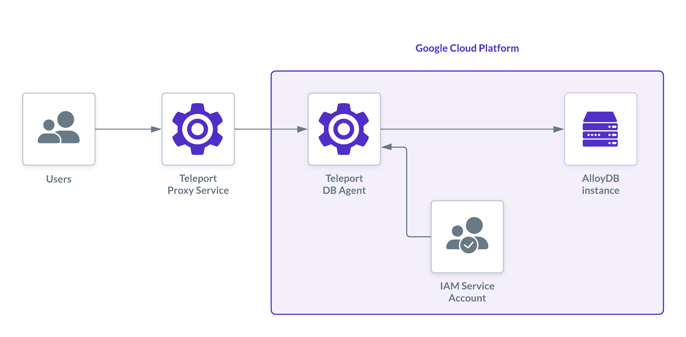
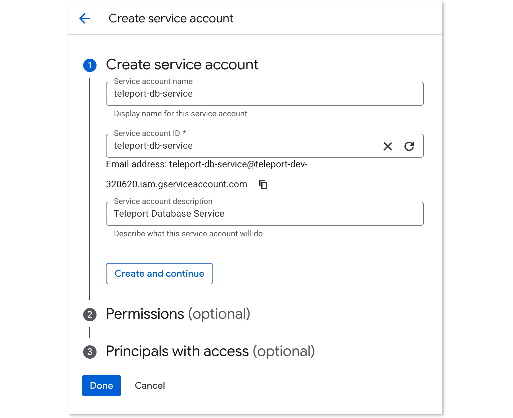
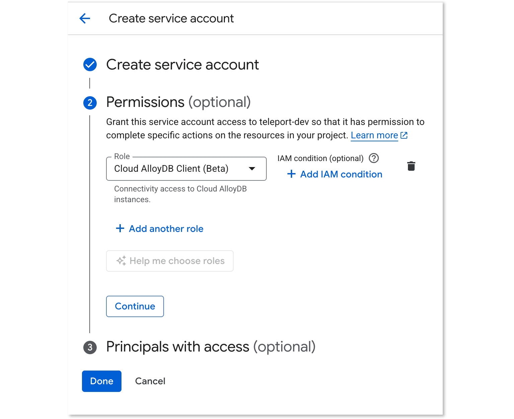
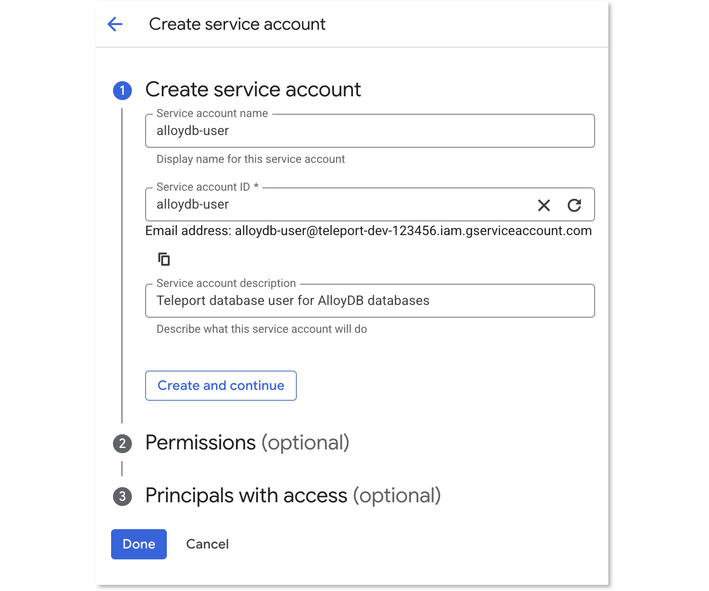
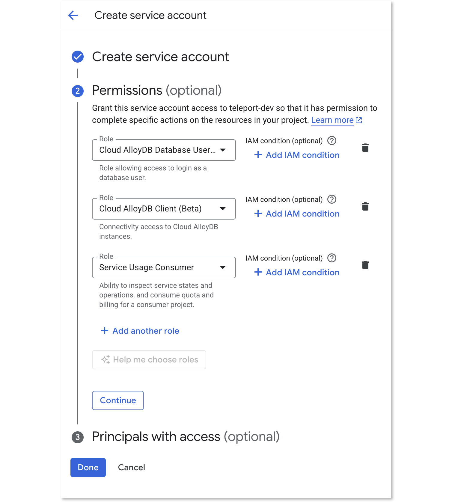
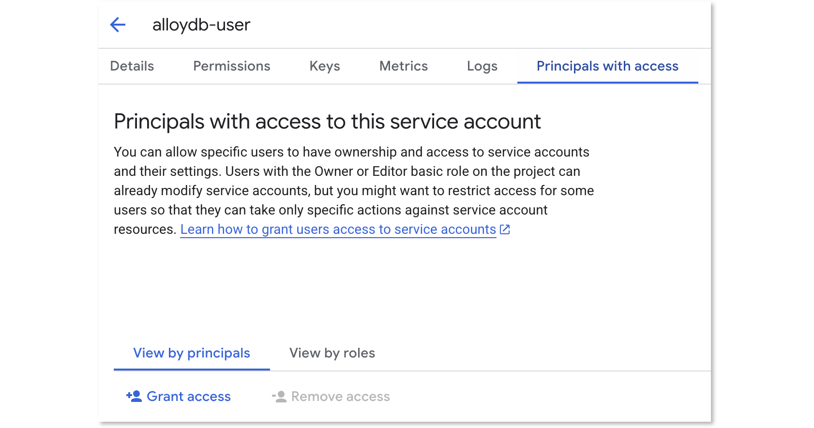
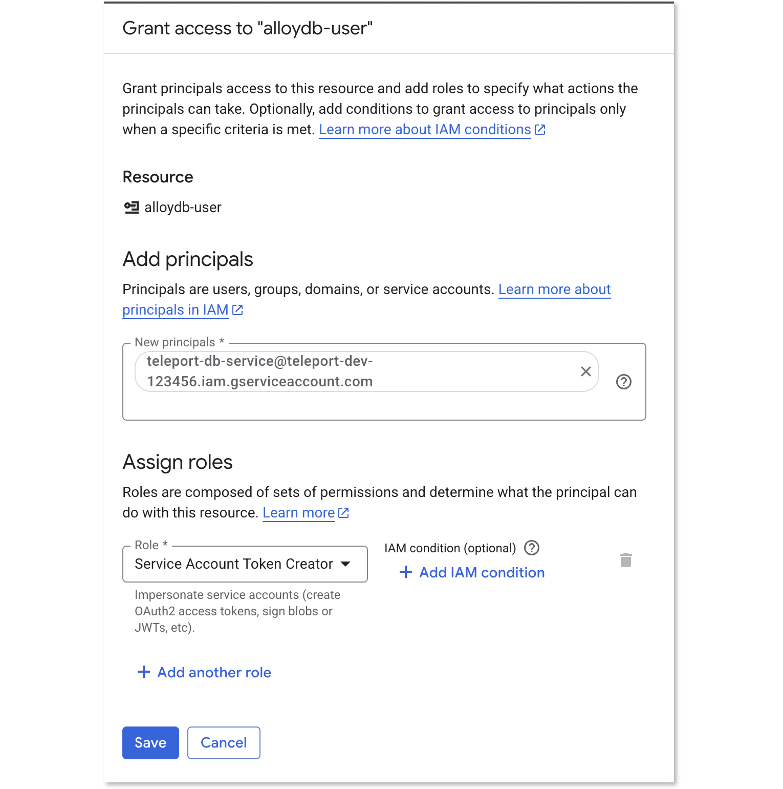
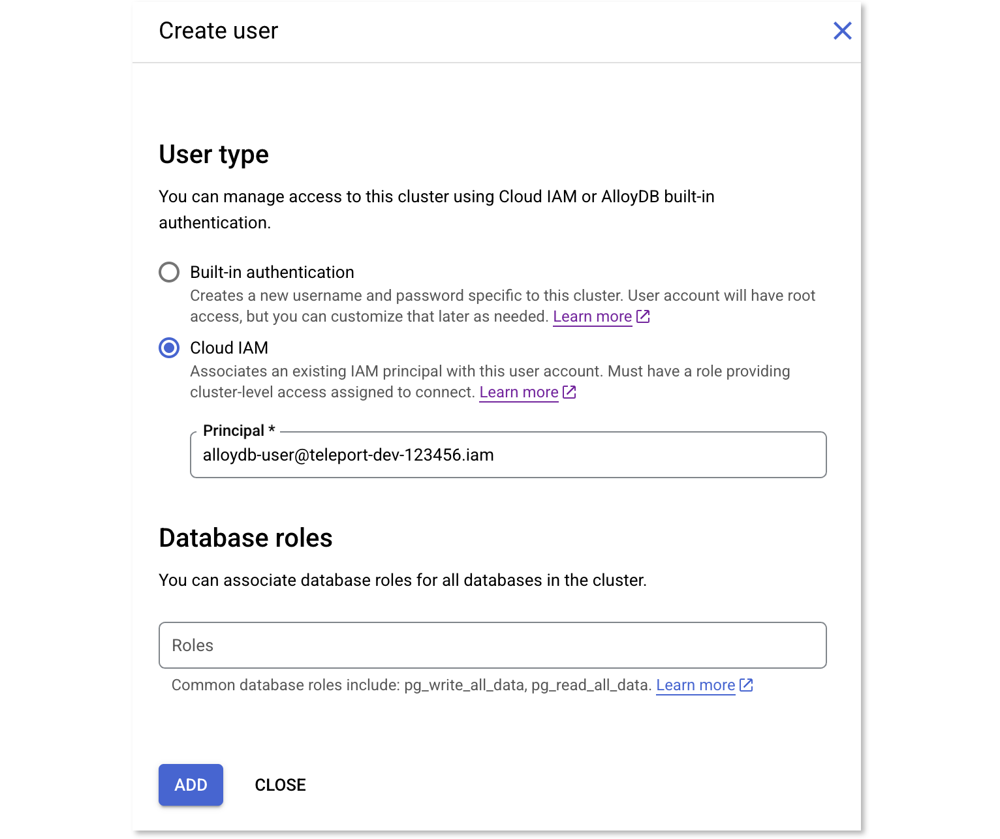
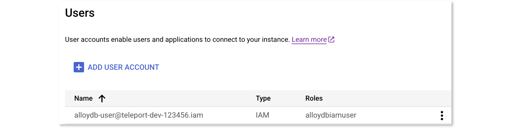
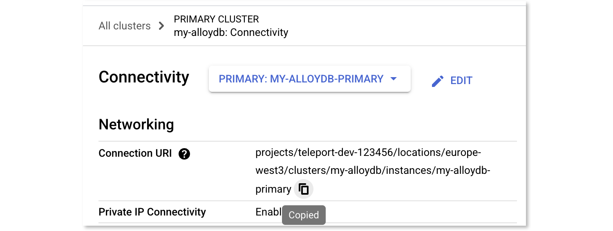

(!docs/pages/includes/database-access/db-introduction.mdx dbType="AlloyDB" dbConfigure="with a service account"!)

## How it works

(!docs/pages/includes/database-access/how-it-works/iam.mdx db="AlloyDB" cloud="Google Cloud"!)



## Prerequisites

(!docs/pages/includes/edition-prereqs-tabs.mdx!)

- Google Cloud account with an AlloyDB cluster and instance deployed. Ensure that your instance is configured to use [IAM database authentication](https://cloud.google.com/alloydb/docs/database-users/manage-iam-auth).
- Command-line client `psql` installed and added to your system's `PATH` environment variable.
- A host, e.g., a Compute Engine instance, where you will run the Teleport Database Service.
- (!docs/pages/includes/tctl.mdx!)

## Step 1/5: Configure GCP IAM 
### IAM setup: roles for the database user and database service

To grant Teleport access to your AlloyDB instances, you need to create two service accounts:
- `teleport-db-service`: for the Teleport Database Service to access AlloyDB metadata.
- `alloydb-user`: for end-users to authenticate to the database.

### Create a service account for the Teleport Database Service

A GCP service account will be used by the Teleport Database Service to create
ephemeral access tokens for *other* GCP service accounts when it's acting on the
behalf of authorized Teleport users.

Go to the [Service Accounts](https://console.cloud.google.com/iam-admin/serviceaccounts)
page and create a service account:



The Teleport Database Service needs permissions to call Google Cloud APIs to fetch
database connection information and generate client certificates.

Assign the predefined
[`roles/alloydb.client` (Cloud AlloyDB Client)](https://cloud.google.com/alloydb/docs/reference/iam-roles-permissions)
role to the `teleport-db-service` service account. This role grants the
necessary permissions.



### Create a service account for a database user

<Admonition type="note">
  If you already have a standard GCP service account for database access, you can use it instead of creating a new one. Ensure it has the required permissions listed below.
</Admonition>

Teleport uses service accounts to connect to AlloyDB databases.

Go to the IAM & Admin [Service Accounts](https://console.cloud.google.com/iam-admin/serviceaccounts)
page and create a new service account named `alloydb-user`:



Click "Create and continue".

Assign the following [predefined roles](https://cloud.google.com/alloydb/docs/reference/iam-roles-permissions) to the `alloydb-user` service account:

* Cloud AlloyDB Database User (`roles/alloydb.databaseUser`)
* Cloud AlloyDB Client (`roles/alloydb.client`)
* [Service Usage Consumer (`roles/serviceusage.serviceUsageConsumer`)](https://cloud.google.com/service-usage/docs/access-control#serviceusage.serviceUsageConsumer)



### Grant access to the service account

The Teleport Database Service must be able to impersonate this service account.
Navigate to the `alloydb-user` service account overview page and select the
"Principals with Access" tab:



Click "Grant Access" and add the `teleport-db-service` principal ID.
Select the "Service Account Token Creator" role and save the change:




## Step 2/5: Database configuration

<details>
  <summary>Enabling IAM Authentication</summary>

Teleport uses [IAM database authentication](https://cloud.google.com/alloydb/docs/database-users/manage-iam-auth)
with AlloyDB instances.

Ensure that your instance is configured to use IAM authentication. Navigate to your instance settings and check 
the presence of the `alloydb.iam_authentication` flag under Advanced Configuration Options section.


</details>

### Create a database user

<Admonition type="note">
  If your AlloyDB instance already has an IAM user configured for your designated service account, you can skip this step.
</Admonition>

Go to the Users page of your AlloyDB instance and add a new user
account. In the sidebar, choose "Cloud IAM" authentication type and add the
`alloydb-user` service account that you created earlier.



Press "Add" and your Users table should look similar to this:



## Step 3/5: Create a host for the Database Service

<Admonition type="note">
  If you already have a host running the Teleport Database Service, you can skip this step. Just ensure that the host is configured with the `teleport-db-service` service account's credentials, either by attaching the service account (for GCE) or through workload identity.
</Admonition>

Create a Google Compute Engine (GCE) instance where you will run the Teleport Database Service.

When creating the instance, in the "Security" section, attach the `teleport-db-service` service account you created earlier. This allows the Teleport Database Service to authenticate with Google Cloud APIs.

<details>
  <summary>Attaching a service account to an existing GCE instance</summary>
<Tabs>
<TabItem label="Google Cloud Console">

If you have an existing GCE instance, you can attach the service account through the Google Cloud Console.

1. Navigate to the [VM instances](https://console.cloud.google.com/compute/instances) page and open your instance.
2. Stop the instance. Wait for it to fully stop.
3. Edit the instance details. 
4. Find the **Service account** dropdown in the **Identity and API access** section.
5. Select the `teleport-db-service` service account. 
6. Save the changes and restart the instance.

</TabItem>
<TabItem label="gcloud CLI">

If you have an existing GCE instance, you can attach the service account using the `gcloud` command-line tool.

Set the variables: 
- <Var name="instance-name" /> instance name
- <Var name="zone" /> instance zone
- <Var name="project-id" /> GCP project ID


First, stop the instance:
```code
$ gcloud compute instances stop <Var name="instance-name" /> --zone=<Var name="zone" />
```

Then, set the service account:
```code
$ gcloud compute instances set-service-account <Var name="instance-name" />                 \
    --service-account=teleport-db-service@<Var name="project-id" />.iam.gserviceaccount.com \
    --zone=<Var name="zone" />
```

Restart the instance:
```code
$ gcloud compute instances start <Var name="instance-name" /> --zone=<Var name="zone" />
```

Verify the instance is now running with the specified service account:
```code
$ gcloud compute instances describe <Var name="instance-name" /> --zone=<Var name="zone" /> \
   --format="yaml(status,serviceAccounts)"
```

</TabItem>
</Tabs>
</details>

If you are running the Teleport Database Service on a different host, you will need to provide credentials to the service. We recommend using [workload identity](https://cloud.google.com/iam/docs/workload-identity-federation).

<details>
  <summary>Using service account keys (insecure)</summary>

Alternatively, go to that service account's Keys tab and create a new key.

Make sure to choose JSON format.

Save the file. Set the `GOOGLE_APPLICATION_CREDENTIALS` environment variable to
point to the JSON credentials file you downloaded earlier. For example, if you
use `systemd` to start `teleport`, then you should edit the service's
`EnvironmentFile` to include the env var:
```code
$ echo 'GOOGLE_APPLICATION_CREDENTIALS=/path/to/credentials.json' | sudo tee -a /etc/default/teleport
```

<Admonition type="warning">
A service account key can be a security risk - we only describe using a key in
this guide for simplicity.
We do not recommend using service account keys in production.
See [authentication](https://cloud.google.com/docs/authentication#service-accounts)
in the Google Cloud documentation for more information about service account
authentication methods.
</Admonition>
</details>

## Step 4/5: Configure Teleport
### Install the Teleport Database Service

(!docs/pages/includes/install-linux.mdx!)

### Create a join token

(!docs/pages/includes/tctl-token.mdx serviceName="Database" tokenType="db" tokenFile="/tmp/token"!)

### Configure and start the Database Service

In the command below, replace `<Var name="teleport.example.com:443" />` with the
host and port of your Teleport Proxy Service or Enterprise Cloud site, and
replace `<Var name="connection-uri" />` with your AlloyDB connection URI.

The connection URI has the format `projects/PROJECT/locations/REGION/clusters/CLUSTER/instances/INSTANCE`.
You can copy it from the AlloyDB instance details page in the Google Cloud
console.



Run the command as follows. Make sure to include the mandatory `alloydb://` prefix in the specified URI.

```code
$ sudo teleport db configure create \
   -o file \
   --name=alloydb \
   --protocol=postgres \
   --labels=env=dev \
   --token=/tmp/token \
   --proxy=<Var name="teleport.example.com:443" />  \
   --uri=alloydb://<Var name="connection-uri" />
```

This command will generate a Teleport Database Service configuration file and
save it to `/etc/teleport.yaml`.

<Admonition title="Choose how Teleport connects to AlloyDB">
By default, Teleport uses [_private_](https://cloud.google.com/alloydb/docs/about-private-services-access) AlloyDB endpoint. To change this to either [public](https://cloud.google.com/alloydb/docs/connect-public-ip) or [PSC](https://cloud.google.com/alloydb/docs/about-private-service-connect) endpoints, update the `endpoint_type` field:

```yaml
db_service:
  resources:
    - name: alloydb
      protocol: postgres
      uri: alloydb://projects/PROJECT/locations/REGION/clusters/CLUSTER/instances/INSTANCE
      gcp:
        alloydb:
          # one of: private | public | psc (default: private)
          endpoint_type: private
      static_labels:
        env: dev
```
</Admonition>

<details>
<summary>Dynamic resource</summary>

As an alternative to configuring the database in `teleport.yaml`, you can create a dynamic database resource. This allows you to add or update databases without restarting the Database Service.

Create a file named `alloydb.yaml` with the following content:

```yaml
kind: db
version: v3
metadata:
  name: alloydb-dynamic
  labels:
    env: dev
spec:
  protocol: "postgres"
  uri: "alloydb://<Var name="connection-uri" />"
  gcp:
    alloydb:
      # one of: private | public | psc (default: private)
      endpoint_type: private
```

Replace `<Var name="connection-uri" />` with your AlloyDB connection URI.

Create the resource:

```code
$ tctl create -f alloydb.yaml
```

</details>

Finally, start the Teleport Database Service:

(!docs/pages/includes/start-teleport.mdx service="the Teleport Database Service"!)

## Step 5/5: Connect to your database
### Grant access to the database

<Admonition type="note">
  The following commands create a new Teleport user and role. If you have an existing Teleport user and a role that grants access to resources with the `env: dev` label, you can skip these steps.
</Admonition>

(!docs/pages/includes/database-access/create-user.mdx!)

### Connect

Once the Database Service has joined the cluster, log in to see the available
databases:

```code
$ tsh login --proxy=teleport.example.com --user=alice
$ tsh db ls
# Name    Description Labels
# ------- ----------- -------
# alloydb GCP AlloyDB env=dev
```

<Admonition
  type="note"
>
You will only be able to see databases that your Teleport role has
access to. See our [RBAC](../rbac.mdx) guide for more details.
</Admonition>

When connecting to the database, use the name of the database's service account
that you added as an IAM database user earlier,
minus the `.gserviceaccount.com` suffix. The database user name is shown on
the Users page of your AlloyDB instance.

In the command below, replace `<Var name="project-id" />` with your Google Cloud
project ID. Retrieve credentials for the `alloydb` example database and connect
to it:

```code
$ tsh db connect --db-user=alloydb-user@<Var name="project-id"/>.iam --db-name=postgres alloydb
```

<Admonition type="tip" title="Tip">
  Starting from version `17.1`, you can now [access your PostgreSQL databases using the Web UI.](../../../connect-your-client/web-ui.mdx#starting-a-database-session)
</Admonition>

To log out of the database and remove credentials:

```code
# Remove credentials for a particular database instance:
$ tsh db logout alloydb
# Or remove credentials for all databases:
$ tsh db logout
```

## Optional: least-privilege access

When possible, enforce least-privilege by defining custom IAM roles that grant only the required permissions.

### Custom role for the Teleport Database Service

The Teleport Database Service, running as the `teleport-db-service` service account, needs permissions to access the AlloyDB instance.

Create a custom role with the following permissions:

```ini
# Used to generate client certificate
alloydb.clusters.generateClientCertificate
# Used to fetch connection information
alloydb.instances.connect
```

For impersonating the `alloydb-user` service account, the built-in "Service Account Token Creator" IAM role
is broader than necessary. To restrict permissions for that service account, create a custom role 
that includes only:

```ini
iam.serviceAccounts.getAccessToken
```

### Custom role for the database user

The `alloydb-user` service account used for database access requires permissions to connect 
to the instance and authenticate as a database user. Create a custom role with:

```ini
alloydb.instances.connect
alloydb.users.login
serviceusage.services.use
```

## Troubleshooting

(!docs/pages/includes/database-access/gcp-troubleshooting.mdx!)

(!docs/pages/includes/database-access/pg-cancel-request-limitation.mdx!)

(!docs/pages/includes/database-access/psql-ssl-syscall-error.mdx!)

## Next steps

(!docs/pages/includes/database-access/guides-next-steps.mdx!)

{/* lint ignore list-item-spacing remark-lint */}
- Learn more about [managing IAM authentication](https://cloud.google.com/alloydb/docs/database-users/manage-iam-auth) for AlloyDB.

{/* lint ignore list-item-spacing remark-lint */}
- Learn more about [authenticating as a service
  account](https://cloud.google.com/docs/authentication#service-accounts) in
  Google Cloud.

{/* lint ignore list-item-spacing remark-lint */}
- Learn more about AlloyDB [Auth Proxy](https://cloud.google.com/alloydb/docs/auth-proxy/connect#required-iam-permissions).
