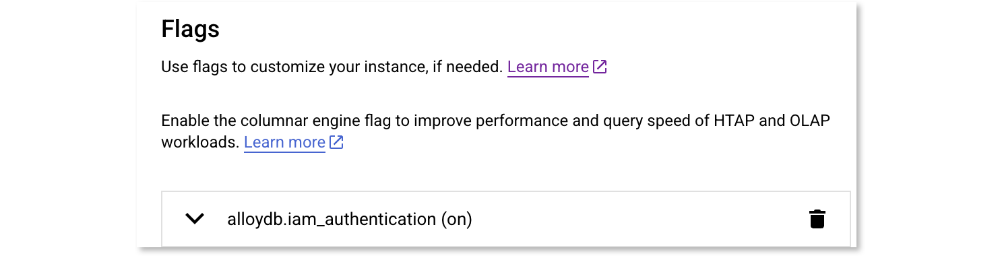

(!docs/pages/includes/database-access/db-introduction.mdx dbType="AlloyDB" dbConfigure="with a service account"!)

## How it works

(!docs/pages/includes/database-access/how-it-works/iam.mdx db="AlloyDB" cloud="Google Cloud"!)


## Prerequisites

(!docs/pages/includes/edition-prereqs-tabs.mdx!)

- Google Cloud account
- Command-line client `psql` installed and added to your system's `PATH` environment variable.
- A host, e.g., a Compute Engine instance, where you will run the Teleport Database
  Service
- (!docs/pages/includes/tctl.mdx!)

## Step 1/9. Create a service account for the Teleport Database Service

(!docs/pages/includes/database-access/gcp-create-service-account-for-db-service.mdx!)

### Grant permissions

The Teleport Database Service needs the following permissions to call appropriate Google Cloud APIs:

```ini
# Used to generate client certificate
alloydb.clusters.generateClientCertificate
# Used to fetch connection information
alloydb.instances.connect
```

You can create a custom IAM role with these permissions or use the predefined role 
[`roles/alloydb.client` (Cloud AlloyDB Client)](https://cloud.google.com/alloydb/docs/reference/iam-roles-permissions), 
which comes with some additional permissions.

## Step 2/9. Create a service account for a database user

Teleport uses service accounts to connect to AlloyDB databases.

### Create a service account

Go to the IAM & Admin [Service Accounts](https://console.cloud.google.com/iam-admin/serviceaccounts)
page and create a new service account named "alloydb-user":


Click "Create and continue".

### Grant permissions

The service account needs these permissions:

```ini
alloydb.instances.connect
alloydb.users.login
serviceusage.services.use
```

For least privilege, create and assign a custom IAM role containing exactly the permissions above. Alternatively, you may grant these [predefined roles](https://cloud.google.com/alloydb/docs/reference/iam-roles-permissions):

* Cloud AlloyDB Database User (`roles/alloydb.databaseUser`)
* Cloud AlloyDB Client (`roles/alloydb.client`)
* [Service Usage Consumer (`roles/serviceusage.serviceUsageConsumer`)](https://cloud.google.com/service-usage/docs/access-control#serviceusage.serviceUsageConsumer)


Click "Done".

### Grant access to the service account

The Teleport Database Service must be able to impersonate this service account.
Navigate to the "alloydb-user" service account overview page and select the
"Principals with Access" tab:


Click "Grant Access" and add the "teleport-db-service" principal ID.
Select the "Service Account Token Creator" role and save the change:


<Admonition type="note" title="Service account permissions">
  The "Service Account Token Creator" IAM role includes more permissions than
  the Teleport Database Service needs. To further restrict the service 
  account, you can create a role that includes only the following permission:
  ```ini
  # Used to generate IAM auth tokens when connecting to a database instance.
  iam.serviceAccounts.getAccessToken
  ```
</Admonition>

## Step 3/9. Configure your AlloyDB database

Teleport uses [IAM database authentication](https://cloud.google.com/alloydb/docs/database-users/manage-iam-auth)
with AlloyDB instances.

Navigate to your instance settings and enable the `alloydb.iam_authentication` flag under Advanced Configuration Options section.



### Create a database user

Now go back to the Users page of your AlloyDB instance and add a new user
account. In the sidebar, choose "Cloud IAM" authentication type and add the
"alloydb-user" service account that you created in
[the second step](#step-29-create-a-service-account-for-a-database-user):


Press "Add" and your Users table should look similar to this:


See [Manage IAM authentication](https://cloud.google.com/alloydb/docs/database-users/manage-iam-auth)
in Google Cloud documentation for more info.

## Step 4/9. Install Teleport

(!docs/pages/includes/install-linux.mdx!)

## Step 5/9. Configure the Teleport Database Service

### Create a join token

(!docs/pages/includes/tctl-token.mdx serviceName="Database" tokenType="db" tokenFile="/tmp/token"!)

### Generate Teleport config

Provide the following information and then generate a configuration file for the
Teleport Database Service:

- <Var name="example.teleport.sh:443" /> The host and port of your Teleport
  Proxy Service or Enterprise Cloud site.
- <Var name="connection-uri" /> The AlloyDB connection URI for your instance in the form:
  `projects/PROJECT/locations/REGION/clusters/CLUSTER/instances/INSTANCE`. 
  
  
You can copy the connection URI from the AlloyDB instance details page.


Run the command as follows. Make sure to include the mandatory `alloydb://` prefix in the specified URI.

```code
$ sudo teleport db configure create \
   -o file \
   --name=alloydb \
   --protocol=postgres \
   --labels=env=dev \
   --token=/tmp/token \
   --proxy=<Var name="example.teleport.sh:443" />  \
   --uri=alloydb://<Var name="full-instance-name" />
```

This command will generate a Teleport Database Service configuration file and
save it to `/etc/teleport.yaml`.

<Admonition title="Choose how Teleport connects to AlloyDB">
By default, Teleport uses [_private_](https://cloud.google.com/alloydb/docs/about-private-services-access) AlloyDB endpoint. To change this to either [public](https://cloud.google.com/alloydb/docs/connect-public-ip) or [PSC](https://cloud.google.com/alloydb/docs/about-private-service-connect) endpoints, update the `endpoint_type` field:

```yaml
db_service:
  resources:
    - name: alloydb
      protocol: postgres
      uri: alloydb://projects/PROJECT/locations/REGION/clusters/CLUSTER/instances/INSTANCE
      gcp:
        alloydb:
          # one of: private | public | psc (default: private)
          endpoint_type: private
```
</Admonition>

## Step 6/9. Configure GCP credentials

The Teleport Database Service must have credentials for the
`teleport-db-service` GCP service account.

If the Teleport Database Service is hosted on a GCE instance, you can
[change the attached service account](https://cloud.google.com/compute/docs/instances/change-service-account).
For non-GCE deployments of Teleport, we recommend using
[workload identity](https://cloud.google.com/iam/docs/workload-identity-federation).

<details>
  <summary>Using service account keys (insecure)</summary>

Alternatively, go to that service account's Keys tab and create a new key:


Make sure to choose JSON format:


Save the file. Set the `GOOGLE_APPLICATION_CREDENTIALS` environment variable to
point to the JSON credentials file you downloaded earlier. For example, if you
use `systemd` to start `teleport`, then you should edit the service's
`EnvironmentFile` to include the env var:
```code
$ echo 'GOOGLE_APPLICATION_CREDENTIALS=/path/to/credentials.json' | sudo tee -a /etc/default/teleport
```

<Admonition type="warning">
A service account key can be a security risk - we only describe using a key in
this guide for simplicity.
We do not recommend using service account keys in production.
See [authentication](https://cloud.google.com/docs/authentication#service-accounts)
in the Google Cloud documentation for more information about service account
authentication methods.
</Admonition>
</details>

## Step 7/9. Start the Teleport Database Service

(!docs/pages/includes/start-teleport.mdx service="the Teleport Database Service"!)

## Step 8/9. Create a Teleport user

(!docs/pages/includes/database-access/create-user.mdx!)

## Step 9/9. Connect

Once the Database Service has joined the cluster, log in to see the available
databases:

<Tabs>
<TabItem label="Self-Hosted">

```code
$ tsh login --proxy=teleport.example.com --user=alice
$ tsh db ls
# Name    Description Labels
# ------- ----------- -------
# alloydb GCP AlloyDB env=dev
```

</TabItem>
<TabItem label="Teleport Enterprise (cloud-hosted)">

```code
$ tsh login --proxy=mytenant.teleport.sh --user=alice
$ tsh db ls
# Name    Description Labels
# ------- ----------- -------
# alloydb GCP AlloyDB env=dev
```

</TabItem>

</Tabs>

<Admonition
  type="note"
>
You will only be able to see databases that your Teleport role has
access to. See our [RBAC](../rbac.mdx) guide for more details.
</Admonition>

When connecting to the database, use the name of the database's service account
that you added as an IAM database user
[above](#step-29-create-a-service-account-for-a-database-user),
minus the ".gserviceaccount.com" suffix. The database user name is shown on
the Users page of your AlloyDB instance.
Retrieve credentials for the "alloydb" example database and connect to it,
assigning <Var name="project-id" /> to your Google Cloud project ID:

```code
$ tsh db connect --db-user=alloydb-user@<Var name="project-id"/>.iam --db-name=postgres alloydb
```

(!docs/pages/includes/database-access/pg-access-webui.mdx!)

To log out of the database and remove credentials:

```code
# Remove credentials for a particular database instance:
$ tsh db logout alloydb
# Or remove credentials for all databases:
$ tsh db logout
```

## Troubleshooting

(!docs/pages/includes/database-access/gcp-troubleshooting.mdx!)

(!docs/pages/includes/database-access/pg-cancel-request-limitation.mdx!)

(!docs/pages/includes/database-access/psql-ssl-syscall-error.mdx!)

## Next steps

(!docs/pages/includes/database-access/guides-next-steps.mdx!)

- Learn more about [authenticating as a service
  account](https://cloud.google.com/docs/authentication#service-accounts) in
  Google Cloud.
