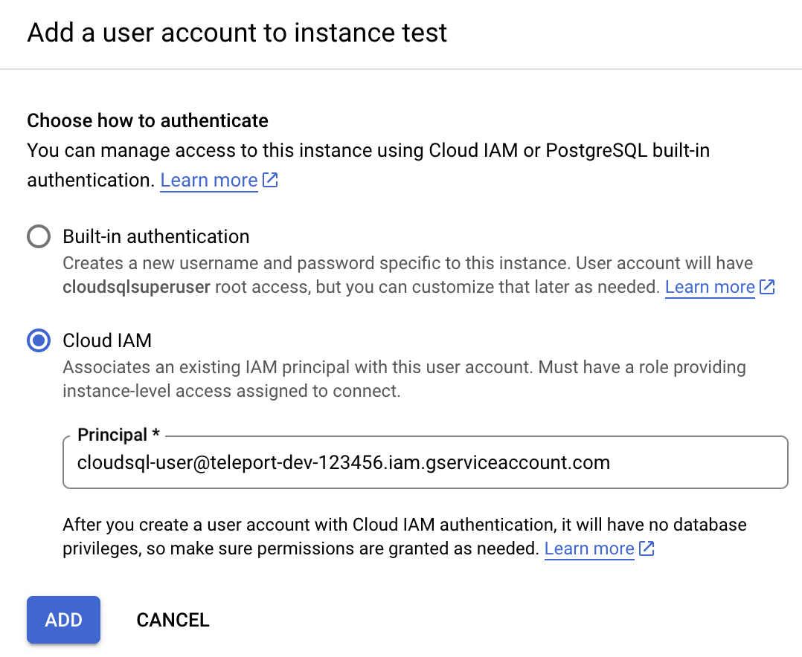
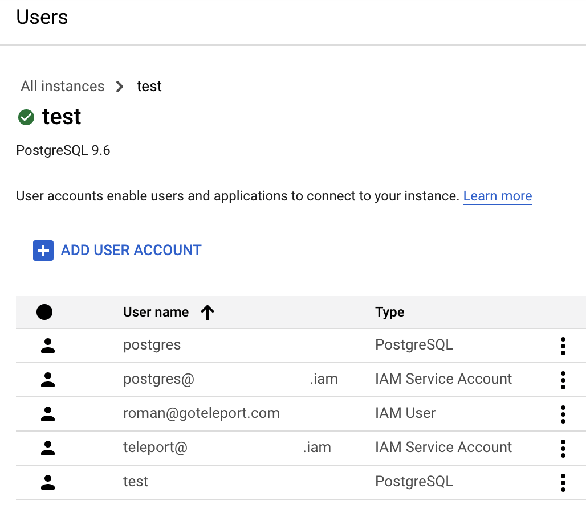

(!docs/pages/includes/database-access/db-introduction.mdx dbType="PostgreSQL on Google Cloud SQL" dbConfigure="with a service account"!)

## How it works

(!docs/pages/includes/database-access/how-it-works/iam.mdx db="PostgreSQL" cloud="Google Cloud"!)

<Tabs>
<TabItem label="Self-Hosted">

</TabItem>
<TabItem label="Cloud-Hosted">

</TabItem>
</Tabs>

## Prerequisites

(!docs/pages/includes/edition-prereqs-tabs.mdx!)

- Google Cloud account
- Command-line client `psql` installed and added to your system's `PATH` environment variable.
- A host, e.g., a Compute Engine instance, where you will run the Teleport Database
  Service
- (!docs/pages/includes/tctl.mdx!)

## Step 1/9. Create a service account for the Teleport Database Service

(!docs/pages/includes/database-access/cloudsql-create-service-account-for-db-service.mdx!)

### (Optional) Grant permissions

(!docs/pages/includes/database-access/cloudsql_grant_db_service_account.mdx!)

## Step 2/9. Create a service account for a database user

Teleport uses service accounts to connect to Cloud SQL databases.

(!docs/pages/includes/database-access/cloudsql_create_db_user_account.mdx!)

(!docs/pages/includes/database-access/cloudsql_grant_db_user.mdx!)

(!docs/pages/includes/database-access/cloudsql-grant-impersonation.mdx!)

## Step 3/9. Configure your Cloud SQL database

Teleport uses [IAM database authentication](https://cloud.google.com/sql/docs/postgres/authentication)
with Cloud SQL PostgreSQL instances.

(!docs/pages/includes/database-access/cloudsql_enable_iam_auth.mdx type="PostgreSQL"!)

### Create a database user

Now go back to the Users page of your Cloud SQL instance and add a new user
account. In the sidebar, choose "Cloud IAM" authentication type and add the
"cloudsql-user" service account that you created in
[the second step](#step-29-create-a-service-account-for-a-database-user):



Press "Add" and your Users table should look similar to this:



See [Creating and managing IAM users](https://cloud.google.com/sql/docs/postgres/create-manage-iam-users)
in Google Cloud documentation for more info.

## Step 4/9. Install Teleport

(!docs/pages/includes/install-linux.mdx!)

## Step 5/9. Configure the Teleport Database Service

### Create a join token

(!docs/pages/includes/tctl-token.mdx serviceName="Database" tokenType="db" tokenFile="/tmp/token"!)

### (Optional) Download the Cloud SQL CA certificate

(!docs/pages/includes/database-access/cloudsql_download_root_ca.mdx!)

### Generate Teleport config

(!docs/pages/includes/database-access/cloudsql-configure-create.mdx dbPort="5432" dbProtocol="postgres" token="/tmp/token"!)

## Step 6/9. Configure GCP credentials

(!docs/pages/includes/database-access/cloudsql_service_credentials.mdx serviceAccount="teleport-db-service"!)

## Step 7/9. Start the Teleport Database Service

(!docs/pages/includes/start-teleport.mdx service="the Teleport Database Service"!)

## Step 8/9. Create a Teleport user

(!docs/pages/includes/database-access/create-user.mdx!)

## Step 9/9. Connect

Once the Database Service has joined the cluster, log in to see the available
databases:

<Tabs>
<TabItem label="Self-Hosted">

```code
$ tsh login --proxy=teleport.example.com --user=alice
$ tsh db ls
# Name     Description              Labels
# -------- ------------------------ --------
# cloudsql GCP Cloud SQL PostgreSQL env=dev
```

</TabItem>
<TabItem label="Teleport Enterprise (cloud-hosted)">

```code
$ tsh login --proxy=mytenant.teleport.sh --user=alice
$ tsh db ls
# Name     Description              Labels
# -------- ------------------------ --------
# cloudsql GCP Cloud SQL PostgreSQL env=dev
```

</TabItem>

</Tabs>

<Admonition
  type="note"
>
You will only be able to see databases that your Teleport role has
access to. See our [RBAC](../rbac.mdx) guide for more details.
</Admonition>

When connecting to the database, use the name of the database's service account
that you added as an IAM database user
[above](#step-29-create-a-service-account-for-a-database-user),
minus the ".gserviceaccount.com" suffix. The database user name is shown on
the Users page of your Cloud SQL instance.
Retrieve credentials for the "cloudsql" example database and connect to it:

```code
$ tsh db connect --db-user=cloudsql-user@<Var name="project-id"/>.iam --db-name=postgres cloudsql
```

To log out of the database and remove credentials:

```code
# Remove credentials for a particular database instance:
$ tsh db logout cloudsql
# Or remove credentials for all databases:
$ tsh db logout
```

## Troubleshooting

(!docs/pages/includes/database-access/gcp-troubleshooting.mdx!)

(!docs/pages/includes/database-access/pg-cancel-request-limitation.mdx!)

(!docs/pages/includes/database-access/psql-ssl-syscall-error.mdx!)

## Next steps

(!docs/pages/includes/database-access/guides-next-steps.mdx!)

- Learn more about [authenticating as a service
  account](https://cloud.google.com/docs/authentication#service-accounts) in
  Google Cloud.
