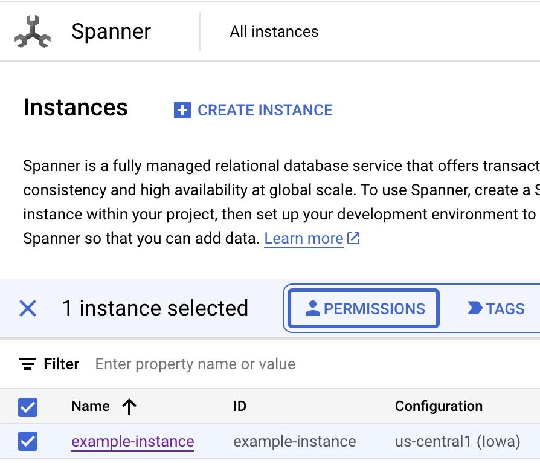

(!docs/pages/includes/database-access/db-introduction.mdx dbType="Cloud Spanner" dbConfigure="with a service account"!)

## How it works

(!docs/pages/includes/database-access/how-it-works/iam.mdx db="Spanner" cloud="Google Cloud"!)

<Tabs>

<TabItem label="Self-Hosted">

</TabItem>

<TabItem label="Cloud-Hosted">

</TabItem>

</Tabs>

## Prerequisites

(!docs/pages/includes/edition-prereqs-tabs.mdx!)

- Google Cloud account
- Google Cloud Spanner database.
- A host where you will run the Teleport Database Service, e.g. a Compute Engine
  instance.
- (!docs/pages/includes/tctl.mdx!)

## Step 1/8. Create a service account for the Teleport Database Service

(!docs/pages/includes/database-access/cloudsql-create-service-account-for-db-service.mdx !)

Ignore the optional steps - click "Done".
We will grant permissions to this service account later in this guide.

## Step 2/8. Create a service account for a database user

When a user connects to Spanner via Teleport, they will specify a service
account name as the database user and the Teleport Database service will
impersonate that service account to authenticate to GCP.

You can create multiple service accounts to provide different access levels to
Teleport users, but for this guide we will just create one. 

### Create a service account

Go to the IAM & Admin [Service Accounts](https://console.cloud.google.com/iam-admin/serviceaccounts)
page and create a new service account named "spanner-user":


Ignore the optional steps - just click "Done".
Rather than granting access at the project level, we will grant this service
account permissions to just the databases it will be used to access.

### Grant permissions

Navigate to the
[Spanner instance overview page](https://console.cloud.google.com/spanner/instances)
and check the box of your Spanner instance, then click "Permissions".



In the permissions blade, click "Add Principal" then add the "spanner-user" service
account as a principal and assign it the "Cloud Spanner Database User" role:


Click "Save".

<Notice type="note">
[Cloud Spanner Database User](https://cloud.google.com/spanner/docs/iam#spanner.databaseUser)
is a pre-defined role.
You can use a different pre-defined role or create and customize your own role
permissions with
[custom IAM roles](https://cloud.google.com/spanner/docs/iam#custom-roles).
</Notice>

### Grant access to the service account

The Teleport Database Service must be able to impersonate this service account.
Navigate to the "spanner-user" service account overview page and select the
"permissions" tab:


Click "Grant Access" and add the "teleport-db-service" principal ID.
Select the "Service Account Token Creator" role and save the change:


<Admonition type="note" title="Service account permissions">
  The "Service Account Token Creator" IAM role includes more permissions than
  the Database Service needs. To further restrict the service account, you can
  create a role that includes only the following permission:
  ```ini
  # Used to generate IAM auth tokens when connecting to a database instance.
  iam.serviceAccounts.getAccessToken
  ```
</Admonition>

## Step 3/8. Install Teleport

(!docs/pages/includes/install-linux.mdx!)

## Step 4/8. Configure the Teleport Database Service

(!docs/pages/includes/tctl-token.mdx serviceName="Database" tokenType="db" tokenFile="/tmp/token" !)

Provide the following information and then generate a configuration file for the
Teleport Database Service:
- <Var name="example.teleport.sh:443" /> The host **and port** of your Teleport
Proxy Service or cloud-hosted Teleport Enterprise site
- <Var name="project-id"/> The GCP project ID. You can normally see it in the
organization view at the top of the GCP dashboard.
- <Var name="instance-id"/> The name of your Cloud SQL instance.

```code
$ sudo teleport db configure create \
   -o file \
   --name=spanner-example \
   --protocol=spanner \
   --labels=env=dev \
   --token=/tmp/token \
   --uri=spanner.googleapis.com:443 \
   --proxy=<Var name="example.teleport.sh:443" />  \
   --gcp-project-id=<Var name="project-id" /> \
   --gcp-instance-id=<Var name="instance-id" /> 
```

## Step 5/8. Configure GCP credentials

(!docs/pages/includes/database-access/cloudsql_service_credentials.mdx serviceAccount="teleport-db-service"!)

## Step 6/8. Start the Teleport Database Service

(!docs/pages/includes/start-teleport.mdx service="the Teleport Database Service"!)

## Step 7/8. Create a Teleport user

(!docs/pages/includes/database-access/create-user.mdx!)


## Step 8/8. Connect

Once the Teleport Database Service has joined the cluster, log in to see the
available databases:

<Tabs>
<TabItem label="Self-Hosted">

```code
$ tsh login --proxy=teleport.example.com --user=<Var name="example-user" />
$ tsh db ls
Name            Description       Allowed Users Labels  Connect 
--------------- ----------------- ------------- ------- ------- 
spanner-example GCP Cloud Spanner [*]           env=dev
```

</TabItem>
<TabItem label="Cloud-Hosted">

```code
$ tsh login --proxy=mytenant.teleport.sh --user=<Var name="example-user" />
$ tsh db ls
Name            Description       Allowed Users Labels  Connect 
--------------- ----------------- ------------- ------- ------- 
spanner-example GCP Cloud Spanner [*]           env=dev
```

</TabItem>

</Tabs>

<Notice
  type="note"
>
You will only be able to see databases that your Teleport role has
access to. See our [RBAC](../rbac.mdx) guide for more details.
</Notice>

When connecting to the database, use the name of the service account
that you created for a database user 
[above](#step-28-create-a-service-account-for-a-database-user),
(minus the "@project-id.iam.gserviceaccount.com" suffix).
Retrieve credentials for a database in the Cloud Spanner instance and connect to
it:

```code
$ tsh db connect --db-user=spanner-user --db-name=example-db spanner-example
```

To log out of the database and remove credentials:

```code
# Remove credentials for a particular database instance:
$ tsh db logout spanner-example
# Or remove credentials for all databases:
$ tsh db logout
```

## Troubleshooting

(!docs/pages/includes/database-access/gcp-troubleshooting.mdx!)

## Next steps

(!docs/pages/includes/database-access/guides-next-steps.mdx!)

- Learn how to [connect with a GUI client](../../../connect-your-client/gui-clients.mdx#cloud-spanner-datagrip).
- Learn more about [authenticating as a service
  account](https://cloud.google.com/docs/authentication#service-accounts) in
  Google Cloud.
