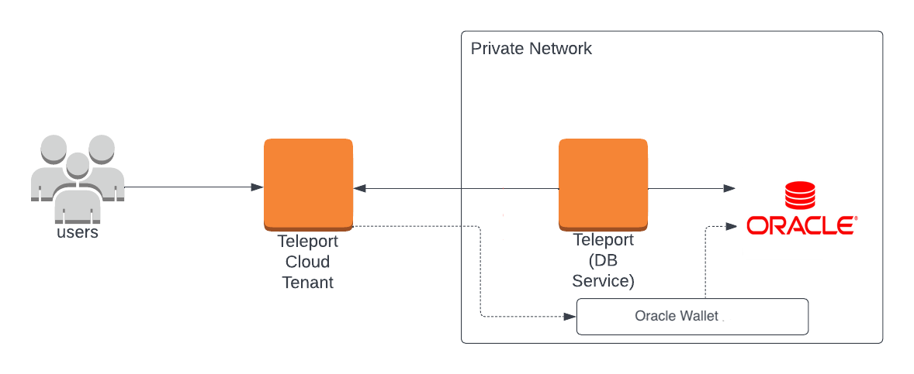

(!docs/pages/includes/database-access/db-introduction.mdx dbType="Oracle Exadata" dbConfigure="with mTLS authentication"!)

## How it works

(!docs/pages/includes/database-access/how-it-works/mtls.mdx db="Oracle"!)

<Tabs>
<TabItem scope={["enterprise"]} label="Teleport Enterprise (Self-Hosted)">

</TabItem>
<TabItem scope={["cloud"]} label="Teleport Enterprise (Cloud)">

</TabItem>
</Tabs>

## Prerequisites

(!docs/pages/includes/commercial-prereqs-tabs.mdx!)
- Oracle Exadata server instance 19c or later.
- The `sqlcl` [Oracle client](https://www.oracle.com/pl/database/sqldeveloper/technologies/sqlcl/) installed and added to your system's `PATH` environment variable or any GUI client that supports JDBC
  Oracle thin client.
- (!docs/pages/includes/tctl.mdx!)


## Step 1/6. Configure Oracle Exadata

<Admonition type="note">

This guide assumes default configuration of the Oracle Exadata system. In particular:
- Preconfigured TCPS listener.
- An existing database certificate in the grid wallet.
- A single Oracle Exadata VM is accessible to the `opc` user through SSH with a hostname `<Var name="demodb-vm" />`. Repeat the steps to configure additional VMs.
- The SCAN DNS name is `<Var name="demodb-vm-scan.exadatadomain.oke.oraclevcn.com" />`.

Adjust the commands to match your configuration.

</Admonition>

### Update per-database configuration

Connect to the Oracle Exadata VM by logging in as the `opc` user and then switch to the `oracle` user:

```code
$ ssh opc@<Var name="demodb-vm" />
$ sudo su - oracle
```

For each database-specific Oracle home, update the `$ORACLE_HOME/network/admin/sqlnet.ora` file with the following entries:

```
SSL_CLIENT_AUTHENTICATION = TRUE
SQLNET.AUTHENTICATION_SERVICES = (ALL)
```

For example, if there is a database named `spark`, the `oracle` user should have access to the automatically generated `/home/oracle/spark.env` file, which contains database-specific environment variables. After sourcing this file, the path `$ORACLE_HOME/network/admin/sqlnet.ora` will point to the `sqlnet.ora` file for the `spark` database and its associated Oracle home.

```code
# Load environment variables for the 'spark' database
$ . spark.env 

# Edit the configuration file at $ORACLE_HOME/network/admin/sqlnet.ora
...
```

Repeat these steps for each additional database or database home as required.

### Configure Oracle user account

Your Oracle user accounts must be configured to require a valid client certificate.

<Tabs>
<TabItem label="New user">
Create new user:
```sql
CREATE USER alice IDENTIFIED EXTERNALLY AS 'CN=alice';
GRANT CREATE SESSION TO alice;
```
</TabItem>
<TabItem label="Existing user">
Alter existing user:
```sql
ALTER USER alice IDENTIFIED EXTERNALLY AS 'CN=alice';
```
<Admonition type="warning">
This operation will void existing authentication methods like password. The certificate-based auth will become the sole method of authentication for this user.
</Admonition>
</TabItem>
</Tabs>


### Trust Teleport Database Client CA

Teleport uses mutual TLS authentication with Oracle Exadata. It must be configured with Teleport's certificate authority to be able to verify client certificates.

Export the Teleport Database Client CA on your local machine and copy it to target Oracle Exadata VM.

```code
# Export Teleport's database client certificate authority
$ tctl auth export --type=db-client > teleport-db-client-ca.crt
# Copy the CA to the Oracle Exadata VM
$ scp teleport-db-client-ca.crt opc@<Var name="demodb-vm" />:/tmp/teleport-db-client-ca.crt
```

As the `grid` user, update the grid TCPS wallet to trust the Teleport User Database CA.

```code
# Read the wallet password
$ mkstore -wrl /u01/app/oracle/admin/cprops/cprops_wallet -nologo -viewEntry grid_tcps_wallet_passwd
grid_tcps_wallet_passwd = <wallet password>
# Update the grid TCPS wallet; provide the password when prompted
$ orapki wallet add -wallet "/var/opt/oracle/dbaas_acfs/grid/tcps_wallets" -trusted_cert -cert /tmp/teleport-db-client-ca.crt
```

### Enable TLS auth for grid listener

Adjust your grid listener configuration at `$ORACLE_HOME/network/admin/listener.ora` to enable TLS auth with the following entry:

```
SSL_CLIENT_AUTHENTICATION = TRUE
```

### Restart the listener

Once finished, restart the listener.

```code
$ lsnrctl stop
$ lsnrctl start
```

## Step 2/6. Collect database configuration data

Export the built-in database certificate from Oracle. Teleport will use this certificate to verify the database connection.

```code
# Export the database certificate. Update the "-dn" parameter to match your actual setup.
$ orapki wallet export -wallet "/var/opt/oracle/dbaas_acfs/grid/tcps_wallets" -dn "CN=<Var name="demodb-vm-scan.exadatadomain.oke.oraclevcn.com" />" -cert /tmp/oracle-server-certificate.crt
```

Save the `/tmp/oracle-server-certificate.crt` file to a temporary location. The final location depends on the Teleport installation method, which will be detailed in the next step.

Check the TCPS address of the local listener. This address will be used by Teleport for the connection. In the example below, the address is `<Var name="10.20.30.40:2484" />`.

```code
$ sqlplus / as sysdba
# ...
# SQL> SHOW PARAMETER local_listener;
# 
# . NAME           TYPE   VALUE
# . -------------- ------ ------------------------------
# . local_listener string (ADDRESS=(PROTOCOL=TCP)(HOST=10.20.30.40)(PORT=1521)),
# .                       (ADDRESS=(PROTOCOL=TCPS)(HOST=10.20.30.40)(PORT=2484))
```

## Step 3/6. Configure and Start the Database Service

### Create Teleport join token

(!docs/pages/includes/tctl-token.mdx serviceName="Database" tokenType="db" tokenFile="/tmp/token"!)

### Teleport Database Service

Install and configure Teleport where you will run the Teleport Database Service:

<Tabs>
<TabItem label="Linux Server">

(!docs/pages/includes/install-linux-enterprise.mdx!)

On the host where you will run the Teleport Database Service, start Teleport
with the appropriate configuration.

Note that a single Teleport process can run multiple different services, for
example multiple Database Service agents as well as the SSH Service or Application
Service. The step below will overwrite an existing configuration file, so if
you're running multiple services add `--output=stdout` to print the config in
your terminal, and manually adjust `/etc/teleport.yaml`.

Copy the Oracle Database certificate and make it available at
   `/var/lib/teleport/oracle-server-certificate.crt` on the Teleport Database Service host.

Run the following command to generate a configuration file at
`/etc/teleport.yaml` for the Database Service. Update 
<Var name="example.teleport.sh" /> to use the domain name of the Teleport Proxy
Service:

```code
$ sudo teleport db configure create \
   -o file \
   --token=/tmp/token \
   --proxy=<Var name="example.teleport.sh" />:443 \
   --name="<Var name="oracle" />" \
   --protocol=oracle \
   --uri="<Var name="10.20.30.40:2484" />" \
   --ca-cert-file="/var/lib/teleport/oracle-server-certificate.crt" \
   --labels=env=dev
```

Manually edit the generated config file to include `tls.mode: verify-ca`.

The final entry for the `<Var name="oracle" />` database will look similar to this:

```yaml
db_service:
  enabled: true
  databases:
  - name: <Var name="oracle" />
    uri: "<Var name="10.20.30.40:2484" />"
    protocol: oracle
    tls:
      mode: verify-ca
      ca_cert_file: /var/lib/teleport/oracle-server-certificate.crt
```

(!docs/pages/includes/start-teleport.mdx service="the Teleport Database Service"!)

</TabItem>
<TabItem label="Kubernetes Cluster">
Create a secret containing the database CA certificate in the same namespace
as Teleport using the following command:

```code
$ kubectl create secret generic db-ca --from-file=ca.pem=/path/to/oracle-server-certificate.crt
```

Create a file called `values.yaml` with the following content. Update 
<Var name="JOIN_TOKEN" /> to the join token you created earlier using the `tctl
tokens add` command:

```yaml
roles: db
proxyAddr: <Var name="example.teleport.sh" />:443
enterprise: true
authToken: "<Var name="JOIN_TOKEN" />"
databases:
  - name: <Var name="oracle" />
    uri: "<Var name="10.20.30.40:2484" />"
    protocol: oracle
    static_labels:
      env: dev
    tls:
      mode: verify-ca
      ca_cert_file: /etc/teleport-tls-db/db-ca/ca.pem
extraVolumes:
  - name: db-ca
    secret:
      secretName: db-ca
extraVolumeMounts:
  - name: db-ca
    mountPath: /etc/teleport-tls-db/db-ca
    readOnly: true
```

Teleport provides Helm charts for installing the Teleport Database Service in Kubernetes Clusters.

(!docs/pages/includes/kubernetes-access/helm/helm-repo-add.mdx!)

Install the chart:

   ```code
   $ helm install teleport-kube-agent teleport/teleport-kube-agent \
     --create-namespace \
     --namespace teleport-agent \
     --version (=teleport.version=) \
     -f values.yaml
   ```

Make sure that the Teleport agent pod is running. You should see one
`teleport-kube-agent` pod with a single ready container:

   ```code
   $ kubectl -n teleport-agent get pods
   NAME                    READY   STATUS    RESTARTS   AGE
   teleport-kube-agent-0   1/1     Running   0          32s
   ```

</TabItem>
</Tabs>


## Step 4/6. (Optional) Configure Teleport to pull audit logs from Oracle Audit Trail

Teleport can pull audit logs from Oracle Audit Trail.
In order to enable this feature, you will need to configure Oracle Audit Trail and create a dedicated Teleport
user that will be used to fetch audit events from Oracle Audit Trail.

Create an internal Oracle `teleport` user that will fetch
audit events from Oracle Audit Trail:

```sql
CREATE USER teleport IDENTIFIED EXTERNALLY AS 'CN=teleport';
GRANT CREATE SESSION TO teleport;
GRANT SELECT ON dba_audit_trail TO teleport;
GRANT SELECT ON V_$SESSION TO teleport;
```

Enable the table in Oracle Audit Trail:
```sql
ALTER system SET audit_trail=db,extended scope=spfile;
```

Restart your Oracle instance to propagate audit trail changes.

Enable Oracle auditing for the `alice` user:
```sql
AUDIT ALL STATEMENTS by alice BY access;
```

You must enable auditing for each Teleport user that will be used to connect to Oracle.
Additionally you can create a different audit policy for each user.

Configure the Teleport Database Service to pull audit logs from Oracle Audit Trail:


```yaml
db_service:
  enabled: "yes"
  databases:
  - name: <Var name="oracle" />
    protocol: "oracle"
    uri: "<Var name="10.20.30.40:2484" />"
    oracle:
      audit_user: "teleport"
    tls:
      mode: verify-ca
      ca_cert_file: /var/lib/teleport/oracle-server-certificate.crt
```

Teleport doesn't clean up audit trail events from Oracle Audit Trail.
Make sure to configure an Oracle Audit Trail cleanup policy to avoid running out of disk space.

## Step 5/6. Create a Teleport user

(!docs/pages/includes/database-access/create-user.mdx!)

## Step 6/6. Connect

Once the Database Service has joined the cluster, log in to see the available
databases:

```code
$ tsh login --proxy=<Var name="example.teleport.sh" /> --user=alice
$ tsh db ls
# Name   Description    Allowed Users Labels  Connect
# ------ -------------- ------------- ------- -------
<Var name="oracle" />         [*]                   env=dev
```

Connect to the `"<Var name="oracle" />"` database. Pass the correct service name as the `--db-name` parameter.

You can check the service names by inspecting the database configuration on the Oracle Exadata VM.

```code
> lsnrctl services | grep paas
Service "spark_PDB1.paas.oracle.com" has 1 instance(s).
```

```code
$ tsh db connect --db-user alice --db-name spark_PDB1.paas.oracle.com <Var name="oracle" />
# SQLcl: Release 24.2 Production on Fri Aug 09 15:29:41 2024
# 
# Copyright (c) 1982, 2024, Oracle.  All rights reserved.
# 
# Connected to:
# Oracle Database 19c EE Extreme Perf Release 19.0.0.0.0 - Production
# Version 19.24.0.0.0
# 
# SQL> select user from dual;
# 
# USER     
# ________ 
# ALICE    
# 
# SQL>
```

To log out of the database and remove credentials:

```code
# Remove credentials for a particular database instance.
$ tsh db logout oracle
# Remove credentials for all database instances.
$ tsh db logout
```

## Next steps

(!docs/pages/includes/database-access/guides-next-steps.mdx!)

Read the documentation about:
- [Oracle Audit Trail](https://docs.oracle.com/en/database/oracle/oracle-database/19/sqlrf/AUDIT-Traditional-Auditing.html#GUID-ADF45B07-547A-4096-8144-50241FA2D8DD)
- [`sqlnet.ora`](https://docs.oracle.com/en/database/oracle/oracle-database/18/netrf/parameters-for-the-sqlnet-ora-file.html#GUID-28040885-6832-4FFC-9258-0EF19FE9A3AC) and [`listener.ora`](https://docs.oracle.com/en/database/oracle/oracle-database/18/netrf/Oracle-Net-Listener-parameters-in-listener-ora-file.html#GUID-F9FA0DF5-2FAF-45CA-B6A1-F0166C7BFE54) configuration
- [Oracle Exadata](https://docs.oracle.com/en/engineered-systems/exadata-database-machine/)
- [Oracle Real Application Clusters (RAC)](https://docs.oracle.com/en/database/oracle/oracle-database/19/racad/index.html)
