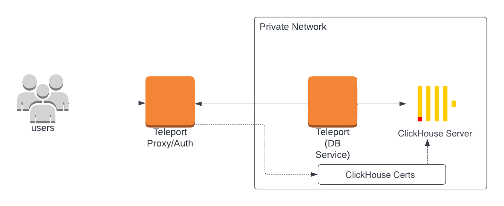
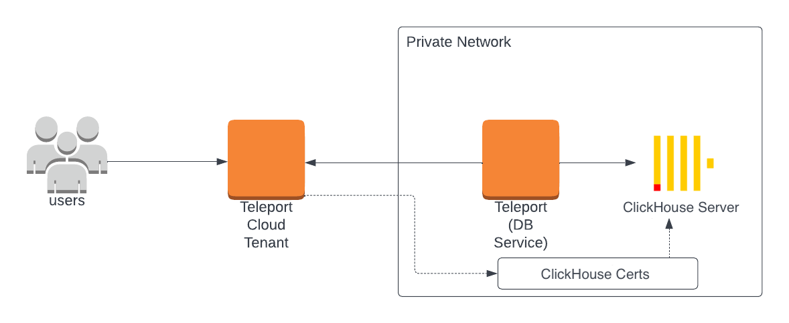

The Teleport Clickhouse integration allows you to enroll ClickHouse databases
with Teleport.

This guide will help you to:

- Install and configure a Teleport database agent.
- Set up Teleport to access your self-hosted ClickHouse database.
- Connect to your database through Teleport.

## How it works

The Teleport Database Service authenticates to ClickHouse using x509
certificates, which are available for the ClickHouse HTTP and Native (TCP)
[interfaces](https://clickhouse.com/docs/en/interfaces/overview). The Teleport
Database Service can communicate in both the ClickHouse Native (TCP) and HTTP protocols,
and you can select which protocol to use when configuring the Teleport Database
Service.

Teleport audit logs for query activity are only supported for the ClickHouse
HTTP interface. Teleport support for ClickHouse's native interfaces does not
include audit logs for database query activity.

<Tabs>
<TabItem label="Self-Hosted">

</TabItem>
<TabItem label="Teleport Cloud">

</TabItem>
</Tabs>

## Prerequisites

(!docs/pages/includes/edition-prereqs-tabs.mdx!)

- Either a Linux host or Kubernetes cluster where you will run the Teleport Database Service.

You will also need the following, depending on the ClickHouse protocol you
choose:

<Tabs>
<TabItem label="HTTP">
- A self-hosted deployment of ClickHouse Server v22.3 or later.
</TabItem>
<TabItem label="Native (TCP)">
- A self-hosted deployment of ClickHouse Server v23.3 or later.
- The [clickhouse-client](https://clickhouse.com/docs/en/interfaces/cli) installed and added to your user's `PATH` environment variable.
</TabItem>
</Tabs>

- Optional: a certificate authority that issues certificates for
  your self-hosted database.

## Step 1/5. Create a Teleport token and user

(!docs/pages/includes/tctl-token.mdx serviceName="Database" tokenType="db" tokenFile="/tmp/token"!)

(!docs/pages/includes/database-access/create-user.mdx!)

## Step 2/5. Create a certificate/key pair

(!docs/pages/includes/database-access/tctl-auth-sign-3-files.mdx dbname="Clickhouse" !)

## Step 3/5. Configure ClickHouse

Use the generated secrets to enable mutual TLS in your `clickhouse-server/config.xml` configuration file:

```xml
<openSSL>
    <server>
       <privateKeyFile>/path/to/server.key</privateKeyFile>
       <caConfig>/path/to/server.cas</caConfig>
       <certificateFile>/path/to/server.crt</certificateFile>
       <verificationMode>strict</verificationMode>
    </server>
</openSSL>
```

Restart the ClickHouse Server to enable this configuration.
Additionally, your ClickHouse database user accounts must be configured to require a valid client certificate:

```sql
CREATE USER alice IDENTIFIED WITH ssl_certificate CN 'alice';
```

By default, the created user may not have access to anything and won't be able to connect, so let's grant it some permissions:

```sql
GRANT ALL ON *.* TO alice;
```

## Step 4/5. Configure and start the Database Service

Install and configure Teleport on the host or Kubernetes cluster where you will
run the Teleport Database Service. Assign <Var name="protocol" /> to
`clickhouse-http` for the HTTP protocol and `clickhouse` for the native
ClickHouse protocol:

<Tabs>
<TabItem label="Linux Server">

(!docs/pages/includes/install-linux.mdx!)

<Admonition type="note">
The step below will overwrite an existing configuration file, so if
you're running multiple services add `--output=stdout` to print the config in
your terminal, and manually adjust `/etc/teleport.yaml`.
</Admonition>

{/* Inlining docs/pages/includes/database-access/self-hosted-config-start.mdx
so we can use the Var component for the protocol.*/}

On the host where you will run the Teleport Database Service, start Teleport
with the appropriate configuration.

Note that a single Teleport process can run multiple different services, for
example multiple Database Service agents as well as the SSH Service or Application
Service. The step below will overwrite an existing configuration file, so if
you're running multiple services add `--output=stdout` to print the config in
your terminal, and manually adjust `/etc/teleport.yaml`.

Run the following command to generate a configuration file at
`/etc/teleport.yaml` for the Database Service. Update 
<Var name="teleport.example.com:443" /> to use the host and port of the Teleport Proxy
Service:

```code
$ sudo teleport db configure create \
   -o file \
   --token=/tmp/token \
   --proxy=<Var name="teleport.example.com:443" /> \
   --name=example-clickhouse \
   --protocol=<Var name="protocol" /> \
   --uri=clickhouse.example.com:8443 \
   --labels=env=dev 
```

To configure the Teleport Database Service to trust a custom CA:

1. Export a CA certificate for the custom CA and make it available at
   `/var/lib/teleport/db.ca` on the Teleport Database Service host.

1. Run a variation of the command above that uses the `--ca-cert-file`
   flag. This configures the Teleport Database Service to use the CA certificate
   at `db.ca` to verify traffic from the database:

   ```code
   $ sudo teleport db configure create \
      -o file \
      --token=/tmp/token \
      --proxy=<Var name="teleport.example.com:443" /> \
      --name=example-clickhouse \
      --protocol=<Var name="protocol" /> \
      --uri=clickhouse.example.com:8443 \
      --ca-cert-file="/var/lib/teleport/db.ca" \
      --labels=env=dev
   ```

(!docs/pages/includes/start-teleport.mdx service="the Teleport Database Service"!)

</TabItem>
<TabItem label="Kubernetes Cluster">

Teleport provides Helm charts for installing the Teleport Database Service in
Kubernetes Clusters.

(!docs/pages/includes/kubernetes-access/helm/helm-repo-add.mdx!)

{/* Inlining docs/pages/includes/database-access/self-hosted-db-helm-install.mdx
so we can use the Var component for the protocol*/}

Install a Teleport agent into your Kubernetes Cluster with the Teleport Database
Service configuration. 

Create a file called `values.yaml` with the following content. Update <Var
name="teleport.example.com:443" /> to use the host and port of the Teleport Proxy
Service and <Var name="JOIN_TOKEN" /> to the join token you created earlier:

```yaml
roles: db
proxyAddr: <Var name="teleport.example.com:443" />
# Set to false if using Teleport Community Edition
enterprise: true
authToken: <Var name="JOIN_TOKEN" />
databases:
  - name: example-clickhouse
    uri: clickhouse.example.com:8443
    protocol: <Var name="protocol" />
labels:
  env: dev
```

To configure the Teleport Database Service to trust a custom CA:

1. Export a CA certificate for the custom CA and make it available at `db.ca` on
   your workstation.

1. Create a secret containing the database CA certificate in the same namespace
   as Teleport using the following command:

   ```code
   $ kubectl create secret generic db-ca --from-file=ca.pem=/path/to/db.ca
   ```

1. Add the following to `values.yaml`:

  ```diff
    roles: db
    proxyAddr: teleport.example.com:443
    # Set to false if using Teleport Community Edition
    enterprise: true
    authToken: JOIN_TOKEN
    databases:
      - name: example-clickhouse
        uri: clickhouse.example.com:8443
        protocol: <protocol>
  +     tls:
  +       ca_cert_file: "/etc/teleport-tls-db/db-ca/ca.pem"
        static_labels:
          env: dev
  + extraVolumes:
  +   - name: db-ca
  +     secret:
  +       secretName: db-ca
  + extraVolumeMounts:
  +   - name: db-ca
  +     mountPath: /etc/teleport-tls-db/db-ca
  +     readOnly: true
  ```

Install the chart:

```code
$ helm install teleport-kube-agent teleport/teleport-kube-agent \
  --create-namespace \
  --namespace teleport-agent \
  --version (=teleport.version=) \
  -f values.yaml
```

Make sure that the Teleport agent pod is running. You should see one
`teleport-kube-agent` pod with a single ready container:

```code
$ kubectl -n teleport-agent get pods
NAME                    READY   STATUS    RESTARTS   AGE
teleport-kube-agent-0   1/1     Running   0          32s
```

</TabItem>
</Tabs>

(!docs/pages/includes/database-access/multiple-instances-tip.mdx !)

## Step 5/5. Connect

Once the Database Service has joined the cluster, log in to see the available
databases:


<Tabs>
  <TabItem label="HTTP">

Log in to Teleport and list the databases you can connect to. You should see the
ClickHouse database you enrolled earlier:

```code
$ tsh login --proxy=<Var name="teleport.example.com" /> --user=alice
$ tsh db ls
# Name                      Description Allowed Users Labels  Connect
# ------------------------- ----------- ------------- ------- -------
# example-clickhouse-http               [*]           env=dev
```

Create an authenticated proxy tunnel so you can connect to ClickHouse via a GUI
database client, or send a request via `curl`:

```code
$ tsh proxy db --db-user=alice --tunnel example-clickhouse-http
# Started authenticated tunnel for the Clickhouse (HTTP) database "clickhouse-http" in cluster "teleport.example.com" on 127.0.0.1:59215.
# To avoid port randomization, you can choose the listening port using the --port flag.
#
# Use the following command to connect to the database or to the address above using other database GUI/CLI clients:
#   $ curl http://localhost:59215/
```

To test the connection you can run the following command:

```code
$ echo 'select currentUser();' | curl http://localhost:59215/  --data-binary @-
# alice
```

To log out of the database and remove credentials:

```code
# Remove credentials for a particular database instance.
$ tsh db logout example-clickhouse-http
# Remove credentials for all database instances.
$ tsh db logout
```

  </TabItem>
  <TabItem label="Native (TCP)">

Log in to Teleport and list the databases you can connect to. You should see the
ClickHouse database you enrolled earlier:

```code
$ tsh login --proxy=<Var name="teleport.example.com" /> --user=alice
$ tsh db ls
# Name                    Description Allowed Users Labels  Connect
# ----------------------- ----------- ------------- ------- -------
# example-clickhouse                  [*]           env=dev
```

Connect to the database:

```code
$ tsh db connect --db-user=alice example-clickhouse
# ClickHouse client version 22.7.2.1.
# Connecting to localhost:59502 as user default.
# Connected to ClickHouse server version 23.4.2 revision 54462.
#
# 350ddafd1941 :) select 1;
#
# SELECT 1
#
# Query id: 327cfd34-2fec-4e04-a185-79fc840aa5cf
#
# ┌─1─┐
# │ 1 │
# └───┘
# ↓ Progress: 1.00 rows, 1.00 B (208.59 rows/s., 208.59 B/s.)                                                                                                                                                            (0.0 CPU, 9.19 KB RAM)
# 1 row in set. Elapsed: 0.005 sec.
#
# 350ddafd1941 :)
```

To log out of the database and remove credentials:

```code
# Remove credentials for a particular database instance.
$ tsh db logout example-clickhouse
# Remove credentials for all database instances.
$ tsh db logout
```

  </TabItem>
</Tabs>

## Next steps

(!docs/pages/includes/database-access/guides-next-steps.mdx!)
