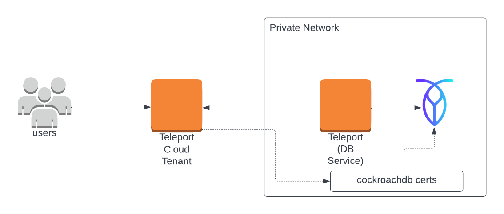

(!docs/pages/includes/database-access/self-hosted-introduction.mdx dbType="CockroachDB"!)

## How it works

(!docs/pages/includes/database-access/how-it-works/mtls.mdx db="CockroachDB"!)

<Tabs>
<TabItem scope={["oss", "enterprise"]} label="Self-Hosted">

</TabItem>
<TabItem scope={["cloud"]} label="Teleport Enterprise Cloud">

</TabItem>

</Tabs>

## Prerequisites

(!docs/pages/includes/edition-prereqs-tabs.mdx!)

- CockroachDB cluster.

- A host, e.g., an Amazon EC2 instance, where you will run the Teleport Database
  Service.

- (!docs/pages/includes/tctl.mdx!)

- A certificate authority to issue CockroachDB certificates for nodes in your 
  CockroachDB cluster.

  (!docs/pages/includes/database-access/split-db-ca-details.mdx db="CockroachDB"!)

## Step 1/4. Set up the Teleport Database Service

(!docs/pages/includes/tctl-token.mdx serviceName="Database" tokenType="db" tokenFile="/tmp/token"!)

Install and configure Teleport where you will run the Teleport Database Service:

<Tabs>
<TabItem label="Linux Server">

(!docs/pages/includes/install-linux.mdx!)

(!docs/pages/includes/database-access/db-configure-start.mdx dbName="roach" "dbProtocol="cockroachdb"  databaseAddress="roach.example.com:26257" !)

</TabItem>
<TabItem label="Kubernetes Cluster">
  Teleport provides Helm charts for installing the Teleport Database Service in Kubernetes Clusters.

  (!docs/pages/includes/kubernetes-access/helm/helm-repo-add.mdx!)

  (!docs/pages/includes/database-access/db-helm-install.mdx dbName="roach" dbProtocol="cockroachdb" databaseAddress="roach.example.com:26257" !)
</TabItem>
</Tabs>

(!docs/pages/includes/database-access/multiple-instances-tip.mdx !)

## Step 2/4. Create a Teleport user

(!docs/pages/includes/database-access/create-user.mdx!)

## Step 3/4. Configure CockroachDB

### Create a CockroachDB user

Teleport uses mutual TLS authentication with CockroachDB. Client certificate authentication is available to all CockroachDB users. If you
don't have one, connect to your Cockroach cluster and create it:

```sql
CREATE USER alice WITH PASSWORD NULL;
```

The `WITH PASSWORD NULL` clause prevents the user from using password auth and
mandates client certificate auth.

Make sure to assign the user proper permissions within the database cluster.
Refer to [Create User](https://www.cockroachlabs.com/docs/stable/create-user.html)
in the CockroachDB documentation for more information.

### Set up mutual TLS

To set up mutual TLS authentication, you need to make sure that:

- Teleport trusts certificates presented by CockroachDB nodes.
- CockroachDB nodes trust client certificates signed by both your CockroachDB CA
  and your Teleport cluster's `db_client` CA.

CockroachDB nodes need to trust the Teleport `db_client` CA so that Teleport 
users can authenticate to your CockroachDB cluster as clients.

The CockroachDB CA needs to be trusted by each CockroachDB node so that nodes 
can authenticate themselves as clients to other nodes in the CockroachDB 
cluster. This is because CockroachDB uses mTLS for node-to-node communication.

<Tabs>
<TabItem label="Nodes serving your CockroachDB CA certs">
In this configuration, your CockroachDB CA will be used to issue the server cert
`node.crt` for each CockroachDB node. 

This configuration is simpler to set up, because an existing CockroachDB cluster 
already has `node.crt` issued for each node and you only need to configure the 
CockroachDB nodes to trust your Teleport `db_client` CA.
Another benefit is that your CockroachDB nodes will continue to serve the same
CockroachDB CA-issued cert, rather than serving a new cert signed by Teleport's
`db` CA, so you don't have to configure other clients to trust a new CA.

Copy your CockroachDB CA cert to `ca-client.crt` in the certs directory of
each CockroachDB node:

```code
$ CERTS_DIR=<Var name="/path/to/cockroachdb/certs/dir" />
$ cp "${CERTS_DIR}/ca.crt" "${CERTS_DIR}/ca-client.crt"
```

Next, for each CockroachDB node, export Teleport's `db_client` CA using `tctl` 
(or export it once and copy it to each node) and append the certificate to 
`ca-client.crt`:

```code
$ tctl auth export --type=db-client >> <Var name="/path/to/cockroachdb/certs/dir" />/ca-client.crt
```

(!docs/pages/includes/database-access/custom-db-ca.mdx db="CockroachDB" protocol="cockroachdb" port="26257"!)
</TabItem>
<TabItem label="Nodes serving your Teleport CA certs">
In this configuration, Teleport's CA will be used to issue the server cert, 
`node.crt`, and your own custom CA will be used to issue the client certificate,
`client.node.crt`, for each CockroachDB node.

(!docs/pages/includes/database-access/tctl-auth-sign.mdx!)

Generate secrets for a CockroachDB node using `tctl`:

```code
$ tctl auth sign \
    --format=cockroachdb \
    --host=roach.example.com \
    --out=<Var name="/path/to/cockroachdb/certs/dir" /> \
    --ttl=2190h
```

(!docs/pages/includes/database-access/ttl-note.mdx!)

The command will produce 4 files:
- `ca.crt` with Teleport's `db` certificate authority
- `ca-client.crt` with Teleport's `db_client` certificate authority
- `node.crt` / `node.key` with the node's certificate and key.

<Admonition type="note">
You can specify multiple comma-separated addresses e.g. 
`--host=roach,node-1,192.168.1.1`.
However, you must include the hostname that Teleport will use to connect to the
database.
</Admonition>

Do not rename these files as this is how CockroachDB expects them to be named.
See [Node key and certificates](https://www.cockroachlabs.com/docs/v21.1/create-security-certificates-custom-ca#node-key-and-certificates)
for details.

Prepend your CockroachDB CA's certificate to `ca-client.crt`.
Now issue a client certificate for the node using your CockroachDB CA:

```code
$ cockroach cert create-client node \
  --certs-dir=<Var name="/path/to/cockroachdb/certs/dir" /> \
  --ca-key=ca-secrets/ca-client.key
```

<details>
<summary>Seeing an error message about TLS key mismatch?</summary>
If you see an error message like: `tls: private key does not match public key`,
it likely means you did not prepend your CockroachDB CA cert to `ca-client.crt`
earlier.

`cockroach cert create-client` expects the first certificate in `ca-client.crt`
(in the `--certs-dir` specified) to be the certificate signed by `--ca-key`.
Ensure that your CockroachDB CA certificate is the first certificate in
`ca-client.crt`.
</details>

Now copy `<Var name="/path/to/cockroachdb/certs/dir" />` to the CockroachDB
node and repeat these steps for all of your other CockroachDB nodes.
</TabItem>
</Tabs>

Restart your CockroachDB nodes, passing them the directory with generated secrets
via the `--certs-dir` flag:

```code
$ cockroach start \
    --certs-dir=<Var name="/path/to/cockroachdb/certs/dir" /> \
    # other flags...
```

Alternatively, if the nodes were already started with 
`--certs-dir=<Var name="/path/to/cockroachdb/certs/dir" />`, you can send a
`SIGHUP` signal to the `cockroach` process to reload certificates without 
restarting the node. You must send `SIGHUP` as the same user that started the
`cockroach` process:

```code
$ pkill -SIGHUP -x cockroach
```

## Step 4/4. Connect

Log in to your Teleport cluster. Your CockroachDB cluster should appear in the
list of available databases:

<Tabs>
<TabItem scope={["enterprise", "oss"]} label="Self-Hosted">
```code
$ tsh login --proxy=teleport.example.com --user=alice
$ tsh db ls
# Name  Description         Labels
# ----- ------------------- -------
# roach Example CockroachDB env=dev
```
</TabItem>
<TabItem scope={["cloud"]} label="Cloud">
```code
$ tsh login --proxy=mytenant.teleport.sh --user=alice
$ tsh db ls
# Name  Description         Labels
# ----- ------------------- -------
# roach Example CockroachDB env=dev
```
</TabItem>
</Tabs>

To retrieve credentials for a database and connect to it:

```code
$ tsh db connect roach
```

You can optionally specify the database name and the user to use by default
when connecting to the database server:

```code
$ tsh db connect --db-user=alice roach
```

<Admonition type="note">
  Either the `cockroach` or `psql` command-line client should be available in `PATH`
  in order to be able to connect.
</Admonition>

To log out of the database and remove credentials:

```code
$ tsh db logout roach
```

## Troubleshooting

### Unimplemented client encoding error

You may encounter the `unimplemented client encoding: "sqlascii"` error when
connecting to your CockroachDB database if your `psql` uses SQL_ASCII encoding.

CockroachDB supports only UTF8 client encoding. To enforce the encoding, set
the following environment variable in the shell running `tsh db connect`:
```code
export PGCLIENTENCODING='utf-8'
```

If you are connecting the CockroachDB database with Teleport Connect, add the
environment variable to your shell startup scripts and restart the Teleport
Connect app.

(!docs/pages/includes/database-access/pg-cancel-request-limitation.mdx!)

## Next steps

(!docs/pages/includes/database-access/guides-next-steps.mdx!)
- [CockroachDB client authentication](https://www.cockroachlabs.com/docs/stable/authentication.html#client-authentication)
- [CockroachDB using split CA certificates](https://www.cockroachlabs.com/docs/stable/authentication#using-split-ca-certificates)

