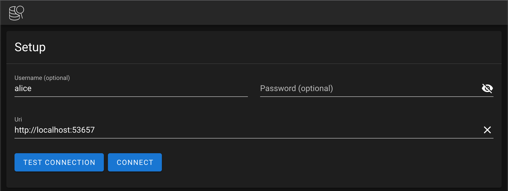

(!docs/pages/includes/database-access/self-hosted-introduction.mdx dbType="Elasticsearch"!)

## How it works

(!docs/pages/includes/database-access/how-it-works/mtls.mdx db="Elasticsearch"!)

## Prerequisites

(!docs/pages/includes/edition-prereqs-tabs.mdx!)

- A self-hosted Elasticsearch database. Elastic Cloud [does not support client certificates](https://www.elastic.co/guide/en/cloud/current/ec-restrictions.html#ec-restrictions-security), which are required for setting up the Database Service.

- A host where you will run the Teleport Database Service.

  See [Installation](../../../installation.mdx) for details.

- Optional: a certificate authority that issues certificates for
  your self-hosted database.

- (!docs/pages/includes/tctl.mdx!)

## Step 1/5. Set up the Teleport Database Service

(!docs/pages/includes/tctl-token.mdx serviceName="Database" tokenType="db" tokenFile="/tmp/token"!)

Install and configure Teleport where you will run the Teleport Database Service:

<Tabs>
<TabItem label="Linux Server">

(!docs/pages/includes/install-linux.mdx!)

(!docs/pages/includes/database-access/self-hosted-config-start.mdx dbName="myelastic" dbProtocol="elastic" databaseAddress="elasticsearch.example.com:9200" !)

</TabItem>
<TabItem label="Kubernetes Cluster">
  Teleport provides Helm charts for installing the Teleport Database Service in Kubernetes Clusters.

  (!docs/pages/includes/kubernetes-access/helm/helm-repo-add.mdx!)

  (!docs/pages/includes/database-access/self-hosted-db-helm-install.mdx dbName="myelastic" dbProtocol="elastic" databaseAddress="elasticsearch.example.com:9200" !)
</TabItem>
</Tabs>

(!docs/pages/includes/database-access/multiple-instances-tip.mdx !)

## Step 2/5. Create a Teleport user

(!docs/pages/includes/database-access/create-user.mdx!)

## Step 3/5. Create a role mapping

Define a role mapping in Elasticsearch to assign your Teleport user(s) or role(s) to an Elasticsearch role.
The example below maps the Teleport user `alice` to the `user` role in Elasticsearch.

```code
$ curl -u elastic:your_elasticsearch_password -X POST "https://elasticsearch.example.com:9200/_security/role_mapping/mapping1?pretty" -H 'Content-Type: application/json' -d'
{
  "roles": [ "user"],
  "enabled": true,
  "rules": {
    "field" : { "username" : "alice" }
  },
  "metadata" : {
    "version" : 1
  }
}
'
```

<Details title="Role Mapping with wildcards">

In a scenario where Teleport is using [single sign-on](../../../admin-guides/access-controls/sso/sso.mdx) you may want to define a mapping for all users to a role:

```code
$ curl -u elastic:your_elasticsearch_password -X POST "https://elasticsearch.example.com:9200/_security/role_mapping/mapping1?pretty" -H 'Content-Type: application/json' -d'
{
  "roles": [ "monitoring"],
  "enabled": true,
  "rules": {
    "field" : { "username" : "*@example.com" }
  },
  "metadata" : {
    "version" : 1
  }
}
'
```

</Details>

## Step 4/5. Set up mutual TLS

(!docs/pages/includes/database-access/tctl-auth-sign-3-files.mdx format="elasticsearch" dbname="Elasticsearch" !)

Use the generated secrets to enable mutual TLS in your `elasticsearch.yml` configuration
file:

```yml
xpack.security.http.ssl:
  certificate_authorities: /path/to/server.cas
  certificate: /path/to/server.crt
  key: /path/to/server.key
  enabled: true
  client_authentication: required
  verification_mode: certificate

xpack.security.authc.realms.pki.pki1:
  order: 1
  enabled: true
  certificate_authorities: /path/to/server.cas
```

Restart Elasticsearch to enable this configuration. Once mutual TLS has been enabled, you will no
longer be able to connect to the cluster without providing a valid client certificate. You can set
`xpack.security.http.ssl.client_authentication` to `optional` to allow connections from clients
that do not present a certificate, using other methods like username and password.

## Step 5/5. Connect

Log into your Teleport cluster and see available databases:

<Tabs>
  <TabItem label="Self-Hosted">
    ```code
    $ tsh login --proxy=teleport.example.com --user=alice
    $ tsh db ls
    Name                        Description Allowed Users Labels  Connect
    --------------------------- ----------- ------------- ------- ------------------------
    > myelastic (user: elastic)             [*]           env=dev tsh db connect myelastic
    ```
  </TabItem>
  <TabItem label="Teleport Cloud">
    ```code
    $ tsh login --proxy=mytennant.teleport.sh --user=alice
    $ tsh db ls
    Name                        Description Allowed Users Labels  Connect
    --------------------------- ----------- ------------- ------- ------------------------
    > myelastic (user: elastic)             [*]           env=dev tsh db connect myelastic
    ```
  </TabItem>
</Tabs>

To connect to a particular database instance:

```code
$ tsh db connect myelastic --db-user=alice
```

To log out of the database and remove credentials:

```code
#Remove credentials for a particular database instance.
$ tsh db logout myelastic
#Remove credentials for all database instances.
$ tsh db logout
```

## Tunneled connection example

We can create a tunneled connection to Elasticsearch to use with GUI applications like Elasticvue:

```code
$ tsh proxy db myelastic --db-user=alice --tunnel
Started authenticated tunnel for the Elasticsearch database "myelastic" in cluster "teleport.example.com" on 127.0.0.1:53657.

Use one of the following commands to connect to the database:

  * interactive SQL connection: 

  $ elasticsearch-sql-cli http://localhost:53657/

  * run single request with curl: 

  $ curl http://localhost:53657/
```

Note the assigned port, and provide it to your GUI client:



## Next steps

(!docs/pages/includes/database-access/guides-next-steps.mdx!)
- For more information on configuring security settings in Elasticsearch, see:
[Security settings in Elasticsearch](https://www.elastic.co/guide/en/elasticsearch/reference/current/security-settings.html)
