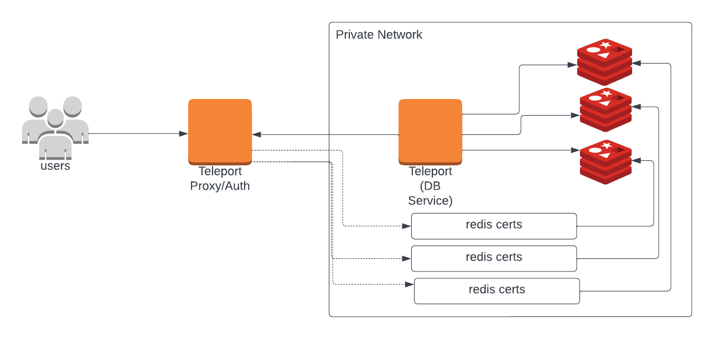

If you want to configure Redis Standalone, please read [Database Access with Redis](redis.mdx).

(!docs/pages/includes/database-access/self-hosted-introduction.mdx dbType="Redis cluster"!)

## How it works

(!docs/pages/includes/database-access/how-it-works/mtls.mdx db="Redis cluster"!)

<Tabs>
<TabItem scope={["oss", "enterprise"]} label="Self-Hosted">

</TabItem>
<TabItem scope={["cloud","team"]} label="Teleport Cloud">

</TabItem>

</Tabs>

## Prerequisites

(!docs/pages/includes/edition-prereqs-tabs.mdx!)

- Redis version `6.0` or newer.

  <Admonition type="note" title="Note">
  RESP3 (REdis Serialization Protocol) is currently not supported.
  </Admonition>

- `redis-cli` version `6.2` or newer installed and added to your system's `PATH` environment variable.

- A host where you will run the Teleport Database Service.

- A certificate authority to issue server certificates for nodes in your Redis
  Cluster.

  (!docs/pages/includes/database-access/split-db-ca-details.mdx db="Redis Cluster"!)

- (!docs/pages/includes/tctl.mdx!)

## Step 1/6. Set up the Teleport Database Service

(!docs/pages/includes/tctl-token.mdx serviceName="Database" tokenType="db" tokenFile="/tmp/token"!)

Install and configure Teleport where you will run the Teleport Database Service:

<Tabs>
<TabItem label="Linux Server">

(!docs/pages/includes/install-linux.mdx!)

(!docs/pages/includes/database-access/db-configure-start.mdx dbName="example-redis" dbProtocol="redis" databaseAddress="rediss://redis.example.com:6379?mode=cluster" !)

</TabItem>
<TabItem label="Kubernetes Cluster">
  Teleport provides Helm charts for installing the Teleport Database Service in Kubernetes Clusters.

  (!docs/pages/includes/kubernetes-access/helm/helm-repo-add.mdx!)

  (!docs/pages/includes/database-access/db-helm-install.mdx dbName="example-redis" dbProtocol="redis" databaseAddress="rediss://redis.example.com:6379?mode=cluster" !)
</TabItem>
</Tabs>

(!docs/pages/includes/database-access/multiple-instances-tip.mdx !)

## Step 2/6. Create a Teleport user

(!docs/pages/includes/database-access/create-user.mdx!)

## Step 3/6. Create Redis users

(!docs/pages/includes/database-access/redis-create-users.mdx!)

## Step 4/6. Set up mutual TLS

Export your Teleport cluster's `db_client` CA cert and concatenate it with your Redis 
Cluster's CA cert (in PEM format), assigning <Var name="/path/to/your/ca.crt" />
to the path to the CA certificate:

```code
$ tctl auth export --type=db-client > db-client-ca.crt
$ cat <Var name="/path/to/your/ca.crt" /> db-client-ca.crt > pem-bundle.cas
```

Using your Redis Cluster's CA, issue `server.crt` for each of your Redis Cluster
nodes and enable mutual TLS in your `redis.conf` configuration file, then 
restart each node:

```ini
tls-port 7001
port 0
cluster-enabled yes
tls-replication yes
tls-cluster yes
aclfile /path/to/users.acl
masterauth GENERATED_STRONG_PASSWORD
masteruser replica-user
tls-cert-file /usr/local/etc/redis/certs/server.crt
tls-key-file /usr/local/etc/redis/certs/server.key
tls-ca-cert-file /usr/local/etc/redis/certs/pem-bundle.cas
tls-protocols "TLSv1.2 TLSv1.3"
```

Once mutual TLS has been enabled, you will no longer be able to connect to
the cluster without providing a valid client certificate. You can use the
`tls-auth-clients optional` setting to allow connections
from clients that do not present a certificate.

See [TLS Support](https://redis.io/topics/encryption)
in the Redis documentation for more details.

(!docs/pages/includes/database-access/custom-db-ca.mdx db="Redis Cluster" protocol="redis" scheme="rediss://" port="6379" query="?mode=cluster"!)
## Step 5/6. Create a cluster

To create the cluster after mutual TLS is enabled, you will need to use a 
certificate that the Redis nodes trust for client authentication. 
You can use a certificate that you already issued for one of the nodes, i.e. 
`server.crt` or you can issue a new client certificate using your Redis Cluster 
CA.

Use the following command to create the cluster. Please note `redis-cli --cluster create` accepts only IP addresses.
```code
$ export REDISCLI_AUTH=STRONG_GENERATED_PASSWORD
$ export CERTS_DIR=/path/to/certs/
$ export IP1=10.0.0.1 # update with the real node 1 IP
$ export IP2=10.0.0.2 # update with the real node 2 IP
$ export IP3=10.0.0.3 # update with the real node 3 IP
$ export IP4=10.0.0.4 # update with the real node 4 IP
$ export IP5=10.0.0.5 # update with the real node 5 IP
$ export IP6=10.0.0.6 # update with the real node 6 IP
$ redis-cli --user alice --cluster-replicas 1 --tls --cluster-yes \
  --cluster create ${IP1}:7001 ${IP2}:7002 ${IP3}:7003 ${IP4}:7004 ${IP5}:7005 ${IP6}:7006 \
  --cacert ${CERTS_DIR}/ca.crt --key ${CERTS_DIR}/server.key --cert ${CERTS_DIR}/server.crt
```

## Step 6/6. Connect

To enable Redis cluster mode in Teleport, add the `mode=cluster` parameter to the connection URI in
your Teleport Database Service config file.
```yaml
databases:
  - name: "redis-cluster"
    uri: "rediss://redis.example.com:6379?mode=cluster"
```

(!docs/pages/includes/database-access/redis-connect.mdx!)

### Supported Redis Cluster commands

Redis in cluster mode does not support the following commands. If one of the listed commands above is called Teleport
returns the <nobr>`ERR Teleport: command not supported`</nobr> error.

<Details title="Unsupported commands">
- `ACL`
- `ASKING`
- `CLIENT`
- `CLUSTER`
- `CONFIG`
- `DEBUG`
- `EXEC`
- `HELLO`
- `INFO`
- `LATENCY`
- `MEMORY`
- `MIGRATE`
- `MODULE`
- `MONITOR`
- `MULTI`
- `PFDEBUG`
- `PFSELFTEST`
- `PSUBSCRIBE`
- `PSYNC`
- `PUNSUBSCRIBE`
- `PUNSUBSCRIBE`
- `READONLY`
- `READWRITE`
- `REPLCONF`
- `REPLICAOF`
- `ROLE`
- `SCAN`
- `SCRIPT DEBUG`
- `SCRIPT KILL`
- `SHUTDOWN`
- `SLAVEOF`
- `SLOWLOG`
- `SSUBSCRIBE`
- `SUNSUBSCRIBE`
- `SYNC`
- `TIME`
- `WAIT`
- `WATCH`
</Details>

Teleport conducts additional processing on the following commands before 
communicating with Redis Cluster:

| Command         | Description                                                                        |
|-----------------|------------------------------------------------------------------------------------|
| `DBSIZE`        | Sends the query to all nodes and returns the number of keys in the whole cluster.  |
| `KEYS`          | Sends the query to all nodes and returns a list of all keys in the whole cluster.  |
| `MGET`          | Translates the commands to multiple `GET`s and sends them to multiple nodes. Result is merged in Teleport and returned back to the client. If Teleport fails to fetch at least one key an error is returned. |
| `FLUSHDB`       | Sends the query to all nodes.                                                      |
| `FLUSHALL`      | Works the same as `FLUSHDB`.                                                       |
| `SCRIPT EXISTS` | Sends the query to all nodes. `1` is returned only if script exists on all nodes.  |
| `SCRIPT LOAD`   | Sends the script to all nodes.                                                     |
| `SCRIPT FLUSH`  | Sends the query to all nodes. `ASYNC` parameter is ignored.                        |

## Next steps

(!docs/pages/includes/database-access/guides-next-steps.mdx!)

