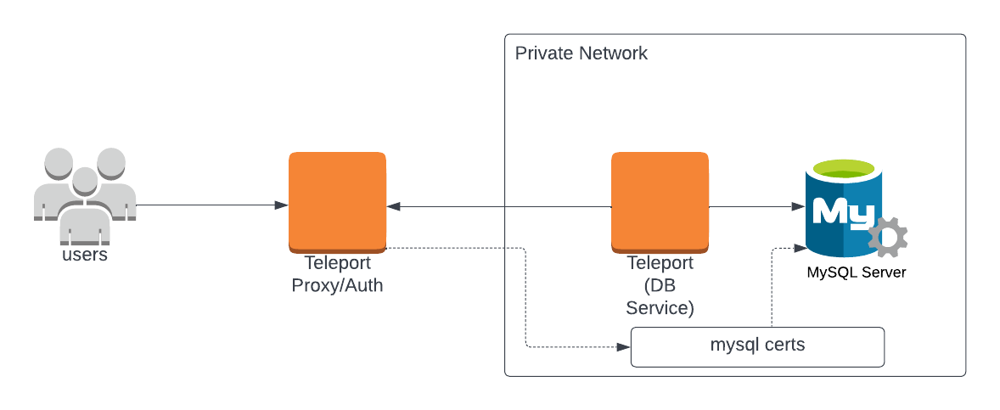

(!docs/pages/includes/database-access/self-hosted-introduction.mdx dbType="SingleStore"!)

## How it works

(!docs/pages/includes/database-access/how-it-works/mtls.mdx db="SingleStore"!)

<Tabs>
<TabItem scope={["oss", "enterprise"]} label="Self-Hosted">

</TabItem>
<TabItem scope={["cloud"]} label="Teleport Enterprise Cloud">

</TabItem>

</Tabs>

## Prerequisites

(!docs/pages/includes/edition-prereqs-tabs.mdx!)

- A self-hosted SingleStore instance managed by [SingleStore Toolbox](https://docs.singlestore.com/db/v9.0/user-and-cluster-administration/cluster-management-with-tools/singlestore-toolbox/).
- A host, e.g., an Amazon EC2 instance, where you will run the Teleport Database
  Service.
- Optional: a certificate authority that issues certificates for
  your self-hosted database.
- (!docs/pages/includes/tctl.mdx!)

## Step 1/4. Create the Teleport Database Token

(!docs/pages/includes/tctl-token.mdx serviceName="Database" tokenType="db" tokenFile="/tmp/token"!)

## Step 2/4. Create a certificate/key pair

(!docs/pages/includes/database-access/tctl-auth-sign-3-files-with-ca.mdx dbname="SingleStore" databaseAddress="s2.example.com" !)

## Step 3/4. Configure SingleStore

To configure SingleStore to accept TLS connections, run the following commands to update SSL configuration on the server:

```bash
sdb-admin update-config --key ssl_cert --value /path/to/server.crt --all --yes
sdb-admin update-config --key ssl_key --value /path/to/server.key --all --yes
sdb-admin update-config --key ssl_ca --value /path/to/teleport-bundle.pem --all --yes
sdb-admin update-config --key ssl_ca_for_client_cert --value /path/to/teleport-bundle.pem --all --yes
```

Restart the database instance to enable this configuration.

```
sdb-admin restart-node --all --yes
```

Your SingleStore database user accounts must be configured to require a
valid client certificate.

<Tabs>
<TabItem label="New User">
Create a new user:

```sql
CREATE USER 'alice'@'%' REQUIRE SUBJECT '/CN=alice';
```

By default, the created user may not have access to anything and won't be able
to connect, so let's grant it some permissions:

```sql
GRANT ALL ON `%`.* TO 'alice'@'%';
```

<Admonition type="warning">
This is an example command that grants database-wide permissions to a user.
In a production environment you should follow the principle of least privilege
</Admonition>
</TabItem>
<TabItem label="Existing User">

Because Teleport uses certificates to authenticate database users, the user must
not have a password set. Note that removing an existing user's password may break
existing integrations. Consider using a new Database user specifically for Teleport
access.

Update the existing user to require a valid certificate:

```sql
ALTER USER 'alice'@'%' REQUIRE SUBJECT '/CN=alice';
```

Remove the password from the user:

```sql
SET PASSWORD FOR 'alice'@'%' = PASSWORD("");
```

</TabItem>
</Tabs>

See
[Configuring SingleStore to Use Encrypted Connections](https://docs.singlestore.com/db/v9.0/security/encryption/ssl-secure-connections/server-configuration-for-secure-client-and-intra-cluster-connections/)
for more details.

### Create a Teleport user

(!docs/pages/includes/database-access/create-user.mdx!)

### Configure and Start the Database Service

Install and configure Teleport where you will run the Teleport Database Service:

<Tabs>
<TabItem label="Linux Server">

(!docs/pages/includes/install-linux.mdx!)

(!docs/pages/includes/database-access/self-hosted-config-start.mdx dbName="example-singlestore" dbProtocol="mysql" databaseAddress="s2.example.com:3306" !)

</TabItem>
<TabItem label="Kubernetes Cluster">
  Teleport provides Helm charts for installing the Teleport Database Service in Kubernetes Clusters.

  (!docs/pages/includes/kubernetes-access/helm/helm-repo-add.mdx!)

  (!docs/pages/includes/database-access/self-hosted-db-helm-install.mdx dbName="example-singlestore" dbProtocol="mysql" databaseAddress="s2.example.com:3306" !)
</TabItem>
</Tabs>

(!docs/pages/includes/database-access/multiple-instances-tip.mdx !)

## Step 4/4. Connect

Once the Database Service has joined the cluster, log in to see the available
databases:

<Tabs>
<TabItem scope={["oss", "enterprise"]} label="Self-Hosted">

```code
$ tsh login --proxy=teleport.example.com --user=alice
$ tsh db ls
# Name                Description         Labels
# ------------------- ------------------- -------
# example-singlestore Example SingleStore env=dev
```

</TabItem>
<TabItem scope={["cloud"]} label="Teleport Enterprise Cloud">

```code
$ tsh login --proxy=mytenant.teleport.sh --user=alice
$ tsh db ls
# Name                Description         Labels
# ------------------- ------------------- -------
# example-singlestore Example SingleStore env=dev
```

</TabItem>

</Tabs>

Note that you will only be able to see databases your role has access to. See
the [RBAC](../rbac.mdx) guide for more details.

To retrieve credentials for a database and connect to it:

```code
$ tsh db connect --db-user=alice --db-name=<database> example-singlestore
```

<Admonition type="note" title="Note">
  The `mysql` or `mariadb` command-line client should be available in `PATH` in order to be
  able to connect. `mariadb` is a default command-line client for SingleStore.
</Admonition>

(!docs/pages/includes/database-access/db-access-webui-ad.mdx dbType="SingleStore"!)

To log out of the database and remove credentials:

```code
# Remove credentials for a particular database instance.
$ tsh db logout example-singlestore
# Remove credentials for all database instances.
$ tsh db logout
```

