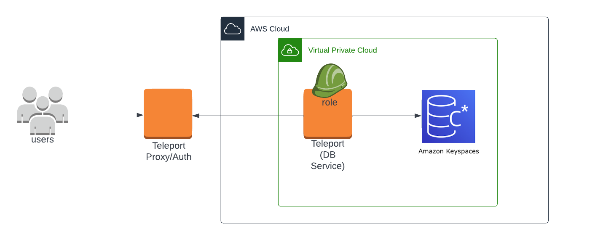
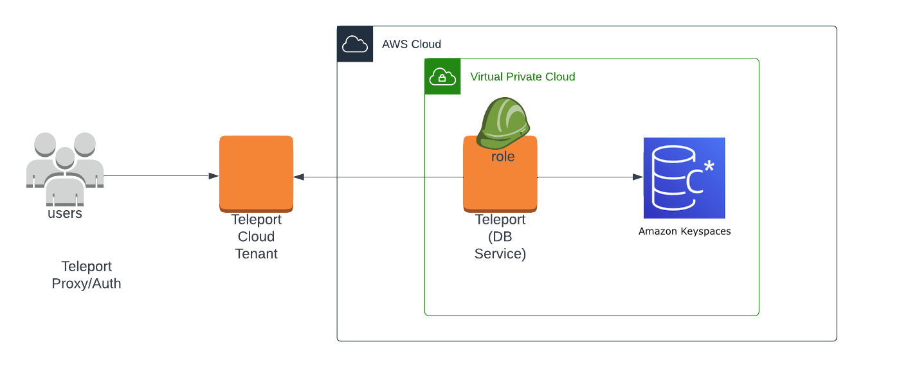

(!docs/pages/includes/database-access/db-introduction.mdx dbType="Amazon Keyspaces (Apache Cassandra)" dbConfigure="with IAM authentication"!)

## How it works

(!docs/pages/includes/database-access/how-it-works/iam.mdx db="Amazon Keyspaces" cloud="AWS"!)

<Tabs>
<TabItem scope={["oss", "enterprise"]} label="Self-Hosted">

</TabItem>
<TabItem scope={["cloud"]} label="Teleport Enterprise Cloud">

</TabItem>

</Tabs>

## Prerequisites

(!docs/pages/includes/edition-prereqs-tabs.mdx!)

- AWS Account with Amazon Keyspaces database and permissions to create and attach IAM policies
- The `cqlsh` Cassandra client installed and added to your system's `PATH` environment variable.
- A host, e.g., an Amazon EC2 instance, where you will run the Teleport Database Service.
- An IAM principal for the Teleport Database Service. We assume that this is
  either an IAM role called `TeleportDatabaseServiceRole` or an IAM user called
  `TeleportDatabaseServiceUser`.
- (!docs/pages/includes/tctl.mdx!)

## Step 1/5. Set up the Teleport Database Service

(!docs/pages/includes/tctl-token.mdx serviceName="Database" tokenType="db" tokenFile="/tmp/token"!)

(!docs/pages/includes/database-access/alternative-methods-join.mdx!)

(!docs/pages/includes/install-linux.mdx!)

<Tabs>
<TabItem scope={["oss", "enterprise"]} label="Self-Hosted">

Create a configuration for the Teleport Database Service, pointing the
`--proxy` flag to the address of your Teleport Proxy Service:

```code
$ sudo teleport db configure create \
   -o file \
  --token=/tmp/token \
  --proxy=teleport.example.com:443 \
  --name=keyspaces \
  --protocol=cassandra \
  --aws-account-id=12345678912 \
  --aws-region=us-east-1 \
  --labels=env=dev
```

</TabItem>
<TabItem scope={["cloud"]} label="Teleport Enterprise Cloud">

Create a configuration for the Teleport Database Service, pointing the
`--proxy` flag to the address of your Teleport Proxy Service:

```code
$ sudo teleport db configure create \
   -o file \
  --token=/tmp/token \
  --proxy=mytenant.teleport.sh:443 \
  --name=keyspaces \
  --protocol=cassandra \
  --aws-account-id=12345678912 \
  --aws-region=us-east-1 \
  --labels=env=dev
```

</TabItem>

</Tabs>

(!docs/pages/includes/aws-credentials.mdx service="the Teleport Database Service"!)

(!docs/pages/includes/start-teleport.mdx service="the Teleport Database Service"!)

## Step 2/5. Create a Teleport user

(!docs/pages/includes/database-access/create-user.mdx!)

## Step 3/5. Create an Amazon Keyspaces role

Create an AWS IAM Role that will be used as your Keyspaces user.

1. Define a trust policy for the role. The following command retrieves your AWS
   account ID and grants access to the account to the principal you selected
   when starting this guide. Select the tab for your principal:

   <Tabs>
   <TabItem label="Role">

   ```code
   $ ACCOUNT_ID=$(aws sts get-caller-identity --query Account --output text)
   $ jq -n --arg acct "$ACCOUNT_ID" \
     '{"Version":"2012-10-17","Statement":[{"Effect":"Allow","Principal":{"AWS":("arn:aws:iam::"+$acct+":role/TeleportDatabaseServiceRole")},"Action":"sts:AssumeRole"}]}' > keyspaces-trust-policy.json
   ```

   </TabItem>
   <TabItem label="User">

   ```code
   $ ACCOUNT_ID=$(aws sts get-caller-identity --query Account --output text)
   $ jq -n --arg acct "$ACCOUNT_ID" \
     '{"Version":"2012-10-17","Statement":[{"Effect":"Allow","Principal":{"AWS":("arn:aws:iam::"+$acct+":user/TeleportDatabaseServiceUser")},"Action":"sts:AssumeRole"}]}' > keyspaces-trust-policy.json
   ```

   </TabItem>
   </Tabs>

   This command writes a trust policy document to `keyspaces-trust-policy.json`.

1. Create an IAM role called `KeyspacesReader` that uses this trust policy. We
   will use this role to connect to the database later in this guide:

   ```code
   $ aws iam create-role \
     --role-name KeyspacesReader \
     --assume-role-policy-document file://keyspaces-trust-policy.json
   ```

1. Assign permissions to the `KeyspacesReader` role.

   AWS provides the `AmazonKeyspacesReadOnlyAccess` and
   `AmazonKeyspacesFullAccess` IAM policies that you can incorporate into your
   Keyspaces user's role.  You can choose `AmazonKeyspacesReadOnlyAccess` for
   read-only access to Amazon Keyspaces or `AmazonKeyspacesFullAccess` for full
   access.

   Assign one of these policies to the role you created:

   <Tabs>
   <TabItem label="Read-only">

    ```code
    $ aws iam attach-role-policy \
      --role-name KeyspacesReader \
      --policy-arn arn:aws:iam::aws:policy/AmazonKeyspacesReadOnlyAccess
    ```

   </TabItem>
   <TabItem label="Full access">

    ```code
    $ aws iam attach-role-policy \
      --role-name KeyspacesReader \
      --policy-arn arn:aws:iam::aws:policy/AmazonKeyspacesFullAccess
    ```

   </TabItem>
   </Tabs>

<Admonition type="tip">
  The `AmazonKeyspacesReadOnlyAccess` and `AmazonKeyspacesFullAccess` policies may
  provide too much or not enough access for your intentions.
  Validate that these meet your expectations if you plan on using them.
  You can also create your own custom Amazon Keyspaces Permissions Policies: [Amazon Keyspaces identity-based policy examples](https://docs.aws.amazon.com/keyspaces/latest/devguide/security_iam_id-based-policy-examples.html).
</Admonition>

## Step 4/5. Give Teleport permissions to assume roles

Next, attach the following policy to the IAM role or IAM user the Teleport
Database Service instance is using, which allows the Database Service to assume
the IAM roles. 

1. Save the following JSON document as `assume-role.json`:

   ```json
   {
     "Version": "2012-10-17",
     "Statement": [
       {
         "Effect": "Allow",
         "Action": "sts:AssumeRole",
         "Resource": "*"
       }
     ]
   }
   ```

1. Create the policy and attach it to the Teleport Database Service. This
   depends on whether the Database Service authenticates as an IAM role or IAM
   user:

   <Tabs>
   <TabItem label="Role">

   ```code
   $ aws iam put-role-policy \
     --role-name TeleportDatabaseServiceRole \
     --policy-name TeleportAssumeRole \
     --policy-document file://assume-role.json
   ```

   </TabItem>
   <TabItem label="User">

   ```code
   $ aws iam put-user-policy \
     --user-name TeleportDatabaseServiceUser \
     --policy-name TeleportAssumeRole \
     --policy-document file://assume-role.json
   ```

   </TabItem>
   </Tabs>

<Admonition type="tip">
  You can make the policy more strict by providing specific IAM role resource
  ARNs in the "Resource" field instead of using a wildcard.
</Admonition>

## Step 5/5. Connect

Once the Database Service has joined the cluster, log in to see the available
databases:

<Tabs>
<TabItem scope={["oss", "enterprise"]} label="Self-Hosted">

  ```code
  $ tsh login --proxy=teleport.example.com --user=alice
  $ tsh db ls
  # Name      Description Allowed Users Labels  Connect
  # --------- ----------- ------------- ------- -------
  # keyspaces             [*]           env=dev
  ```

</TabItem>
<TabItem scope={["cloud"]} label="Teleport Enterprise Cloud">

  ```code
  $ tsh login --proxy=mytenant.teleport.sh --user=alice
  $ tsh db ls
  # Name      Description Allowed Users Labels  Connect
  # --------- ----------- ------------- ------- -------
  # keyspaces             [*]           env=dev
  ```

</TabItem>

</Tabs>

To connect to a particular database instance using the `KeyspacesReader`  AWS IAM Keyspaces role as a database user:
```code
$ tsh db connect --db-user=KeyspacesReader keyspaces
# Connected to Amazon Keyspaces at localhost:55084
# [cqlsh 6.0.0 | Cassandra 3.11.2 | CQL spec 3.4.4 | Native protocol v4]
# Use HELP for help.
# KeyspacesReader@cqlsh>
```

(!docs/pages/includes/database-access/proxy-db-tunnel.mdx db="keyspaces" dbArgs="--db-user=KeyspacesReader"!)

To log out of the database and remove credentials:

```code
# Remove credentials for a particular database instance.
$ tsh db logout keyspaces
# Remove credentials for all database instances.
$ tsh db logout
```

## Further reading

- [How Amazon Keyspaces works with IAM](https://docs.aws.amazon.com/keyspaces/latest/devguide/security_iam_service-with-iam.html)
- [What is Amazon Keyspaces (for Apache Cassandra)?](https://docs.aws.amazon.com/keyspaces/latest/devguide/what-is-keyspaces.html)

## Next steps

(!docs/pages/includes/database-access/guides-next-steps.mdx!)

