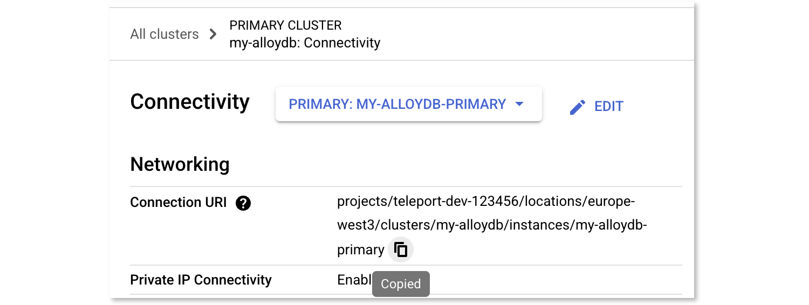

(!docs/pages/includes/database-access/db-introduction.mdx dbType="AlloyDB" dbConfigure="with a service account"!)

## How it works

(!docs/pages/includes/database-access/how-it-works/iam.mdx db="AlloyDB" cloud="Google Cloud"!)


## Prerequisites

(!docs/pages/includes/edition-prereqs-tabs.mdx!)

- Google Cloud account with an AlloyDB cluster and instance deployed, configured for [IAM database authentication](https://cloud.google.com/alloydb/docs/database-users/manage-iam-auth).
- `psql` installed and in your system `PATH`.
- A host (e.g., a Compute Engine instance) to run the Teleport Database Service.
- (!docs/pages/includes/tctl.mdx!)

## Step 1/4. Configure IAM and create a database user

In this step, you will create two required service accounts.

- `teleport-db-service`: used by the Teleport Database Service to access AlloyDB metadata and generate tokens.
- `alloydb-user`: used by end-users to authenticate to the database.

### Create a service account for the Teleport Database Service

<Tabs>
<TabItem label="Google Cloud Console">

Go to [Service Accounts](https://console.cloud.google.com/iam-admin/serviceaccounts)
and create a service account named `teleport-db-service`.
Assign the predefined [`roles/alloydb.client`](https://cloud.google.com/alloydb/docs/reference/iam-roles-permissions) role.

</TabItem>
<TabItem label="gcloud CLI">

Set <Var name="project-id" /> to your GCP project ID.
```code
# 1. Create the Service Account explicitly in the target project
$ gcloud iam service-accounts create teleport-db-service \
    --display-name="Teleport Database Service" \
    --project=<Var name="project-id" />

# 2. Grant the role to that specific account
$ gcloud projects add-iam-policy-binding <Var name="project-id" /> \
    --member="serviceAccount:teleport-db-service@<Var name="project-id" />.iam.gserviceaccount.com" \
    --role="roles/alloydb.client"
```

</TabItem>
</Tabs>

### Create the database user account

<Admonition type="note">
If you already have a GCP service account for database access with the required roles, you can use it instead.
</Admonition>

<Tabs>
<TabItem label="Google Cloud Console">

Go to [Service Accounts](https://console.cloud.google.com/iam-admin/serviceaccounts)
and create a service account named `alloydb-user`.
Assign these roles:

* `roles/alloydb.databaseUser`
* `roles/alloydb.client`
* [`roles/serviceusage.serviceUsageConsumer`](https://cloud.google.com/service-usage/docs/access-control#serviceusage.serviceUsageConsumer)

Then, on the `alloydb-user` overview page, go to the "Principals with Access" tab, click "Grant Access", and add `teleport-db-service` with the **Service Account Token Creator** role.
</TabItem>
<TabItem label="gcloud CLI">

```code
$ gcloud iam service-accounts create alloydb-user --display-name="AlloyDB User" --project=<Var name="project-id" />

$ for role in roles/alloydb.databaseUser roles/alloydb.client roles/serviceusage.serviceUsageConsumer;
  do \
  gcloud projects add-iam-policy-binding <Var name="project-id" /> \
    --member="serviceAccount:alloydb-user@<Var name="project-id" />.iam.gserviceaccount.com" \
    --role="$role"; \
  done \

$ gcloud iam service-accounts add-iam-policy-binding \
    alloydb-user@<Var name="project-id" />.iam.gserviceaccount.com \
    --member="serviceAccount:teleport-db-service@<Var name="project-id" />.iam.gserviceaccount.com" \
    --role="roles/iam.serviceAccountTokenCreator"
```

</TabItem>
</Tabs>

### Add the IAM database user to AlloyDB

<Admonition type="note">
Skip this if your AlloyDB instance already has an IAM user for this service account.
</Admonition>

Ensure [IAM authentication](https://cloud.google.com/alloydb/docs/database-users/manage-iam-auth) 
is enabled on your instance (the `alloydb.iam_authentication` flag must be set) before adding the User.

<Admonition type="warning" title="Instance Restart Required">
Enabling the static `alloydb.iam_authentication` flag triggers a mandatory restart of the AlloyDB instance. 
This will cause a brief period of downtime (typically 60 - 120 seconds) as the instance performs a maintenance update. 
We recommend performing this during a scheduled maintenance window.
</Admonition>

<Tabs>
<TabItem label="Google Cloud Console">

1. Go to the AlloyDB Clusters page.
2. Click Edit on your primary-instance, scroll to Advanced configuration options, and under Flags ensure `alloydb.iam_authentication` is present and set to on.
3. Go to the Users page of your AlloyDB instance.
4. Click Add User Account.
5. Choose Cloud IAM authentication.
6. In the Principal field, enter `alloydb-user@<Var name="project-id" />.iam`.

</TabItem>
<TabItem label="gcloud CLI">

  Enable IAM authentication on your instance:

```code
$ gcloud alloydb instances update <Var name="instance-name" /> \
    --cluster=<Var name="cluster-name" /> \
    --region=<Var name="region" /> \
    --project=<Var name="project-id" /> \
    --database-flags=alloydb.iam_authentication=on
```
<Admonition type="warning">
If your instance already has custom database flags, include them in the
`--database-flags` list along with `alloydb.iam_authentication=on`. Any flags
you omit are reset to their default values.

To review the instance's current manually set flags:

```code
$ gcloud alloydb instances describe <Var name="instance-name" /> \
    --cluster=<Var name="cluster-name" /> \
    --region=<Var name="region" />
```
</Admonition>

Create the IAM-based database user to link the service account to the database:

```code
$ gcloud alloydb users create alloydb-user@<Var name="project-id" />.iam \
    --cluster=<Var name="cluster-name" /> \
    --region=<Var name="region" /> \
    --project=<Var name="project-id" /> \
    --type=IAM_BASED
```

</TabItem>
</Tabs>

## Step 2/4. Create a Teleport Database Service host

The Teleport Database Service must run on a host that can reach the AlloyDB instance and authenticate with GCP.

<Admonition type="note">
If you already have a host running the Teleport Database Service with the `teleport-db-service` credentials, skip to Step 3.
</Admonition>

Create a GCE instance and attach the `teleport-db-service` service account in the "Identity and API access" section.

<details>
<summary>Attaching the service account to an existing GCE instance</summary>
<Tabs>
<TabItem label="Google Cloud Console">

1. Navigate to [VM instances](https://console.cloud.google.com/compute/instances) and open your instance.
2. Stop the instance.
3. Edit the instance, find **Service account** under **Identity and API access**, and select `teleport-db-service`.
4. Save and restart.

</TabItem>
<TabItem label="gcloud CLI">

If you have an existing GCE instance, you can attach the service account using the `gcloud` command-line tool.
Set the variables:

* <Var name="instance-name" /> instance name
* <Var name="zone" /> instance zone
* <Var name="project-id" /> GCP project ID

```code
# The instance must be stopped before modifying the service account
# 1. Stop the instance
gcloud compute instances stop <Var name="instance-name" /> \
    --project=<Var name="project-id" /> \
    --zone=<Var name="zone" />

# 2. Update the Service Account and Scopes
gcloud compute instances set-service-account <Var name="instance-name" /> \
    --service-account=teleport-db-service@<Var name="project-id" />.iam.gserviceaccount.com \
    --scopes=https://www.googleapis.com/auth/cloud-platform \
    --project=<Var name="project-id" /> \
    --zone=<Var name="zone" />

# 3. Restart the instance
gcloud compute instances start <Var name="instance-name" /> \
    --project=<Var name="project-id" /> \
    --zone=<Var name="zone" />
```

Verify the instance is running with the correct service account and scopes:

```code
$ gcloud compute instances describe <Var name="instance-name" /> --zone=<Var name="zone" /> \
   --format="yaml(status,serviceAccounts)"
```

</TabItem>
</Tabs>
</details>

If the Database Service is running outside of GCE, use [workload identity federation](https://cloud.google.com/iam/docs/workload-identity-federation) to provide credentials.

<details>
<summary>Using service account keys (not recommended for production)</summary>

Create a JSON key for the `teleport-db-service` account. If you use `systemd` to start Teleport, add the environment variable to the service's `EnvironmentFile`:

```code
$ echo 'GOOGLE_APPLICATION_CREDENTIALS=/path/to/credentials.json' | \
sudo tee -a /etc/default/teleport
```

<Admonition type="warning">
Service account keys are a security risk. Use workload identity or attached service accounts in production.
See [Google Cloud authentication docs](https://cloud.google.com/docs/authentication#service-accounts) for details.
</Admonition>
</details>

## Step 3/4. Configure Teleport

In this step, you will configure the Teleport Database Service to connect to AlloyDB and handle authentication and access on behalf of users.

### Install the Teleport Database Service

(!docs/pages/includes/install-linux.mdx!)

### Create a join token

(!docs/pages/includes/tctl-token.mdx serviceName="Database" tokenType="db" tokenFile="/tmp/token"!)

### Configure and start the Database Service

In the command below, replace `<Var name="teleport.example.com:443" />` with the
host and port of your Teleport Proxy Service or Enterprise Cloud site, and
replace `<Var name="connection-uri" />` with your AlloyDB connection URI.

The connection URI has the format `projects/PROJECT-ID/locations/REGION/clusters/CLUSTER/instances/INSTANCE`.
You can copy it from the AlloyDB instance details page in the Google Cloud console.



Run the command as follows. Make sure to include the mandatory `alloydb://` prefix in the specified URI.

```code
$ sudo teleport db configure create \
   -o file \
   --name=alloydb \
   --protocol=postgres \
   --labels=env=dev \
   --token=/tmp/token \
   --proxy=<Var name="teleport.example.com:443" />  \
   --uri=alloydb://<Var name="connection-uri" />
```

By default, Teleport uses the private AlloyDB endpoint. 
To use a [public](https://cloud.google.com/alloydb/docs/connect-public-ip) or 
[Private Service Connect (PSC)](https://cloud.google.com/alloydb/docs/about-private-service-connect) 
endpoint instead, set `endpoint_type` in the config:

```yaml
db_service:
  resources:
    - name: alloydb
      protocol: postgres
      uri: alloydb://projects/PROJECT-ID/locations/REGION/clusters/CLUSTER/instances/INSTANCE
      gcp:
        alloydb:
          endpoint_type: public  # private | public | psc
```

Create `alloydb.yaml`:

```yaml
kind: db
version: v3
metadata:
  name: alloydb-dynamic
  labels:
    env: dev
spec:
  protocol: "postgres"
  uri: "alloydb://<Var name="connection-uri" />"
  gcp:
    alloydb:
      endpoint_type: private
```

Apply it:

```code
$ tctl create -f alloydb.yaml
```

Start the Database Service:

(!docs/pages/includes/start-teleport.mdx service="the Teleport Database Service"!)

## Step 4/4. Connect to your database

You will only be able to see databases that your Teleport role has access to. 
See our [RBAC guide](../../../../zero-trust-access/rbac-get-started/rbac-get-started.mdx) for more details.

(!docs/pages/includes/database-access/create-user.mdx!)

Log in and list databases:

```code
$ tsh login --proxy=teleport.example.com --user=alice
$ tsh db ls
  Name    Description Labels
  ------- ----------- -------
  alloydb GCP AlloyDB env=dev
```

The database user name is shown on the Users page of your AlloyDB instance. 
Connect using the service account name (minus `.gserviceaccount.com`):

```code
$ tsh db connect --db-user=alloydb-user@<Var name="project-id"/>.iam --db-name=postgres alloydb
```

<Admonition type="tip">
From version `17.1`, you can also 
[connect via the Web UI](../../../../connect-your-client/teleport-clients/web-ui.mdx#starting-a-database-session).
</Admonition>

To log out:

```code
$ tsh db logout alloydb
# Or for all databases:
$ tsh db logout
```

## Optional: least-privilege access

When possible, enforce least-privilege by defining custom IAM roles that grant only the required permissions.

### Custom role for the Teleport Database Service

The Teleport Database Service, running as the `teleport-db-service` service account, needs permissions to access the AlloyDB instance.

Create a custom role with the following permissions:

```ini
# Used to generate client certificate
alloydb.clusters.generateClientCertificate
# Used to fetch connection information
alloydb.instances.connect
```

For impersonating the `alloydb-user` service account, the built-in "Service Account Token Creator" IAM role
is broader than necessary. To restrict permissions for that service account, create a custom role 
that includes only:

```ini
iam.serviceAccounts.getAccessToken
```

### Custom role for the database user

The `alloydb-user` service account used for database access requires permissions to connect 
to the instance and authenticate as a database user. Create a custom role with:

```ini
alloydb.instances.connect
alloydb.users.login
serviceusage.services.use
```

## Troubleshooting

<Checkpoint
  title="Unable to connect to the database"
  description="Confirm that you can access the database without errors."
>
  Here are some common errors and troubleshooting tips:

  - (!docs/pages/includes/database-access/gcp-troubleshooting.mdx!)
  - (!docs/pages/includes/database-access/pg-cancel-request-limitation.mdx!)
  - (!docs/pages/includes/database-access/psql-ssl-syscall-error.mdx!)
</Checkpoint>

## Next steps

* Learn more about [IAM authentication for AlloyDB](https://cloud.google.com/alloydb/docs/database-users/manage-iam-auth).
* Learn more about [service account authentication](https://cloud.google.com/docs/authentication#service-accounts) in Google Cloud.
* Learn more about AlloyDB [Auth Proxy permissions](https://cloud.google.com/alloydb/docs/auth-proxy/connect#required-iam-permissions).

