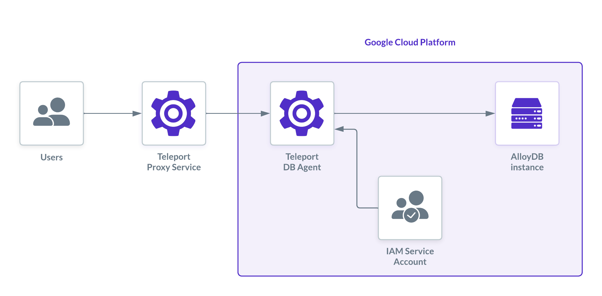

(!docs/pages/includes/database-access/db-introduction.mdx dbType="AlloyDB" dbConfigure="with a service account"!)

## How it works

(!docs/pages/includes/database-access/how-it-works/iam.mdx db="AlloyDB" cloud="Google Cloud"!)



## Prerequisites

(!docs/pages/includes/edition-prereqs-tabs.mdx!)

- Google Cloud account with an AlloyDB cluster and instance deployed, configured for [IAM database authentication](https://cloud.google.com/alloydb/docs/database-users/manage-iam-auth).
- `psql` installed and in your system `PATH`.
- A host (e.g., a Compute Engine instance) to run the Teleport Database Service.
- (!docs/pages/includes/tctl.mdx!)

## Step 1/4: Configure GCP IAM and database user

You need two service accounts:
- `teleport-db-service`: used by the Teleport Database Service to access AlloyDB metadata and generate tokens.
- `alloydb-user`: used by end-users to authenticate to the database.

### Create the Database Service account

<Tabs>
<TabItem label="Google Cloud Console">

Go to [Service Accounts](https://console.cloud.google.com/iam-admin/serviceaccounts)
and create a service account named `teleport-db-service`.

Assign the predefined [`roles/alloydb.client`](https://cloud.google.com/alloydb/docs/reference/iam-roles-permissions) role.

</TabItem>
<TabItem label="gcloud CLI">

Set <Var name="project-id" /> to your GCP project ID.

```code
$ gcloud iam service-accounts create teleport-db-service \
    --display-name="Teleport Database Service"

$ gcloud projects add-iam-policy-binding <Var name="project-id" /> \
    --member="serviceAccount:teleport-db-service@<Var name="project-id" />.iam.gserviceaccount.com" \
    --role="roles/alloydb.client"
```

</TabItem>
</Tabs>

### Create the database user account

<Admonition type="note">
  If you already have a GCP service account for database access with the required roles, you can use it instead.
</Admonition>

<Tabs>
<TabItem label="Google Cloud Console">

Go to [Service Accounts](https://console.cloud.google.com/iam-admin/serviceaccounts)
and create a service account named `alloydb-user`.

Assign these roles:
- `roles/alloydb.databaseUser`
- `roles/alloydb.client`
- [`roles/serviceusage.serviceUsageConsumer`](https://cloud.google.com/service-usage/docs/access-control#serviceusage.serviceUsageConsumer)

Then, on the `alloydb-user` overview page, go to the "Principals with Access" tab, click "Grant Access", and add `teleport-db-service` with the **Service Account Token Creator** role.

</TabItem>
<TabItem label="gcloud CLI">

```code
$ gcloud iam service-accounts create alloydb-user \
    --display-name="AlloyDB User"

$ for role in roles/alloydb.databaseUser roles/alloydb.client roles/serviceusage.serviceUsageConsumer; do \
    gcloud projects add-iam-policy-binding <Var name="project-id" /> \
      --member="serviceAccount:alloydb-user@<Var name="project-id" />.iam.gserviceaccount.com" \
      --role="$role"; \
  done

$ gcloud iam service-accounts add-iam-policy-binding \
    alloydb-user@<Var name="project-id" />.iam.gserviceaccount.com \
    --member="serviceAccount:teleport-db-service@<Var name="project-id" />.iam.gserviceaccount.com" \
    --role="roles/iam.serviceAccountTokenCreator"
```

</TabItem>
</Tabs>

### Add the IAM database user to AlloyDB

<Admonition type="note">
  Skip this if your AlloyDB instance already has an IAM user for this service account.
</Admonition>

Ensure [IAM authentication](https://cloud.google.com/alloydb/docs/database-users/manage-iam-auth) is enabled on your instance (the `alloydb.iam_authentication` flag must be set).

Go to the Users page of your AlloyDB instance, click "Add User Account", choose "Cloud IAM" authentication, and add `alloydb-user`.

## Step 2/4: Set up the Database Service host

<Admonition type="note">
  If you already have a host running the Teleport Database Service with the `teleport-db-service` credentials, skip to Step 3.
</Admonition>

Create a GCE instance and attach the `teleport-db-service` service account in the "Identity and API access" section.

<details>
<summary>Attaching the service account to an existing GCE instance</summary>
<Tabs>
<TabItem label="Google Cloud Console">

1. Navigate to [VM instances](https://console.cloud.google.com/compute/instances) and open your instance.
2. Stop the instance.
3. Edit the instance, find **Service account** under **Identity and API access**, and select `teleport-db-service`.
4. Save and restart.

</TabItem>
<TabItem label="gcloud CLI">

If you have an existing GCE instance, you can attach the service account using the `gcloud` command-line tool.

Set the variables:
- <Var name="instance-name" /> instance name
- <Var name="zone" /> instance zone
- <Var name="project-id" /> GCP project ID

```code
$ gcloud compute instances stop <Var name="instance-name" /> --zone=<Var name="zone" />

$ gcloud compute instances set-service-account <Var name="instance-name" />                 \
    --service-account=teleport-db-service@<Var name="project-id" />.iam.gserviceaccount.com \
    --zone=<Var name="zone" />

$ gcloud compute instances start <Var name="instance-name" /> --zone=<Var name="zone" />
```

Verify the instance is running with the correct service account:
```code
$ gcloud compute instances describe <Var name="instance-name" /> --zone=<Var name="zone" /> \
   --format="yaml(status,serviceAccounts)"
```

</TabItem>
</Tabs>
</details>

If running on a non-GCE host, use [workload identity federation](https://cloud.google.com/iam/docs/workload-identity-federation) to provide credentials.

<details>
<summary>Using service account keys (not recommended for production)</summary>

Create a JSON key for the `teleport-db-service` account and set the environment variable:
```code
$ echo 'GOOGLE_APPLICATION_CREDENTIALS=/path/to/credentials.json' | sudo tee -a /etc/default/teleport
```

<Admonition type="warning">
Service account keys are a security risk. Use workload identity or attached service accounts in production. See [Google Cloud authentication docs](https://cloud.google.com/docs/authentication#service-accounts) for details.
</Admonition>
</details>

## Step 3/4: Configure and start Teleport

(!docs/pages/includes/install-linux.mdx!)

(!docs/pages/includes/tctl-token.mdx serviceName="Database" tokenType="db" tokenFile="/tmp/token"!)

Replace `<Var name="teleport.example.com:443" />` with your Teleport Proxy address and `<Var name="connection-uri" />` with your AlloyDB connection URI (format: `projects/PROJECT/locations/REGION/clusters/CLUSTER/instances/INSTANCE`, found on the instance details page).

```code
$ sudo teleport db configure create \
   -o file \
   --name=alloydb \
   --protocol=postgres \
   --labels=env=dev \
   --token=/tmp/token \
   --proxy=<Var name="teleport.example.com:443" />  \
   --uri=alloydb://<Var name="connection-uri" />
```

<Admonition type="tip" title="Endpoint type">
By default, Teleport uses the private AlloyDB endpoint. To use [public](https://cloud.google.com/alloydb/docs/connect-public-ip) or [PSC](https://cloud.google.com/alloydb/docs/about-private-service-connect) endpoints, set `endpoint_type` in the config:

```yaml
db_service:
  resources:
    - name: alloydb
      protocol: postgres
      uri: alloydb://projects/PROJECT/locations/REGION/clusters/CLUSTER/instances/INSTANCE
      gcp:
        alloydb:
          endpoint_type: public  # private | public | psc
```
</Admonition>

<details>
<summary>Using a dynamic resource instead</summary>

Create `alloydb.yaml`:

```yaml
kind: db
version: v3
metadata:
  name: alloydb-dynamic
  labels:
    env: dev
spec:
  protocol: "postgres"
  uri: "alloydb://<Var name="connection-uri" />"
  gcp:
    alloydb:
      endpoint_type: private
```

Apply it:

```code
$ tctl create -f alloydb.yaml
```

</details>

Start the Database Service:

(!docs/pages/includes/start-teleport.mdx service="the Teleport Database Service"!)

## Step 4/4: Connect

(!docs/pages/includes/database-access/create-user.mdx!)

Log in and list databases:

```code
$ tsh login --proxy=teleport.example.com --user=alice
$ tsh db ls
# Name    Description Labels
# ------- ----------- -------
# alloydb GCP AlloyDB env=dev
```

Connect using the service account name (minus `.gserviceaccount.com`):

```code
$ tsh db connect --db-user=alloydb-user@<Var name="project-id"/>.iam --db-name=postgres alloydb
```

<Admonition type="tip">
  From version `17.1`, you can also [connect via the Web UI](../../../../connect-your-client/teleport-clients/web-ui.mdx#starting-a-database-session).
</Admonition>

To log out:

```code
$ tsh db logout alloydb
# Or for all databases:
$ tsh db logout
```

## Optional: least-privilege IAM roles

For tighter security, replace the predefined roles with custom roles containing only the required permissions.

**For `teleport-db-service`:**
- `alloydb.clusters.generateClientCertificate`
- `alloydb.instances.connect`
- `iam.serviceAccounts.getAccessToken` (replaces the broader "Service Account Token Creator" role)

**For `alloydb-user`:**
- `alloydb.instances.connect`
- `alloydb.users.login`
- `serviceusage.services.use`

## Troubleshooting

(!docs/pages/includes/database-access/gcp-troubleshooting.mdx!)

(!docs/pages/includes/database-access/pg-cancel-request-limitation.mdx!)

(!docs/pages/includes/database-access/psql-ssl-syscall-error.mdx!)

## Next steps

(!docs/pages/includes/database-access/guides-next-steps.mdx!)

- Learn more about [IAM authentication for AlloyDB](https://cloud.google.com/alloydb/docs/database-users/manage-iam-auth).
- Learn more about [service account authentication](https://cloud.google.com/docs/authentication#service-accounts) in Google Cloud.
- Learn more about AlloyDB [Auth Proxy permissions](https://cloud.google.com/alloydb/docs/auth-proxy/connect#required-iam-permissions).
