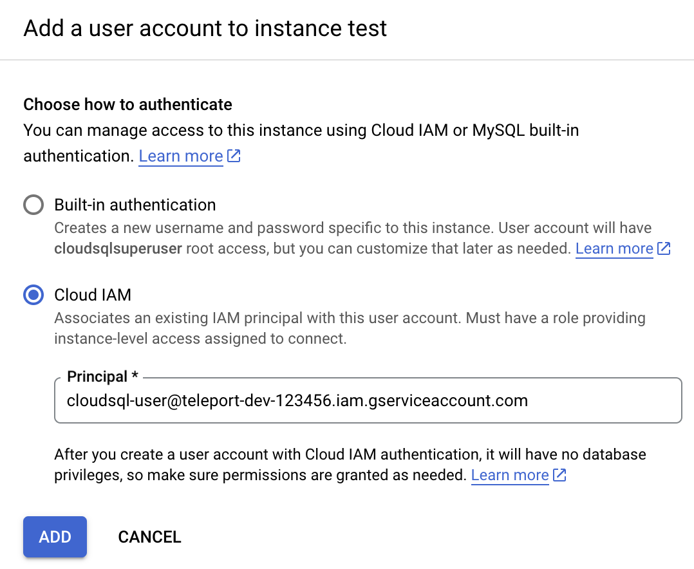

(!docs/pages/includes/database-access/db-introduction.mdx dbType="MySQL on Google Cloud SQL" dbConfigure="with a service account"!)

## How it works

(!docs/pages/includes/database-access/how-it-works/iam.mdx db="MySQL" cloud="Google Cloud"!)

<Tabs>
<TabItem label="Self-Hosted">

</TabItem>
<TabItem label="Cloud-Hosted">

</TabItem>
</Tabs>

## Prerequisites

(!docs/pages/includes/edition-prereqs-tabs.mdx!)

- Google Cloud account
- A host, e.g., a Compute Engine instance, where you will run the Teleport Database
  Service
- (!docs/pages/includes/tctl.mdx!)

<Admonition type="tip" title="Discover your GCP project ID">
If you are unsure of your GCP project ID, run:

```code
$ gcloud config get-value project
```

</Admonition>

## Step 1/9. Create a service account for the Teleport Database Service

(!docs/pages/includes/database-access/cloudsql-create-service-account-for-db-service.mdx !)

<Admonition type="tip" title="CLI alternative">
You can create the service account using the `gcloud` CLI instead of the Cloud Console:

```code
$ gcloud iam service-accounts create teleport-db-service \
    --display-name="Teleport Database Service" \
    --project=<Var name="project-id" />
```

</Admonition>

### (Optional) Grant permissions

(!docs/pages/includes/database-access/cloudsql_grant_db_service_account.mdx!)

<Admonition type="tip" title="CLI alternative">
Grant the required Cloud SQL permissions to the Database Service account using the CLI:

```code
$ gcloud projects add-iam-policy-binding <Var name="project-id" /> \
    --member="serviceAccount:teleport-db-service@<Var name="project-id" />.iam.gserviceaccount.com" \
    --role="roles/cloudsql.client"

$ gcloud projects add-iam-policy-binding <Var name="project-id" /> \
    --member="serviceAccount:teleport-db-service@<Var name="project-id" />.iam.gserviceaccount.com" \
    --role="roles/cloudsql.instanceUser"
```

</Admonition>

### (Optional) Grant permission to check user type

When users connect to the Cloud SQL database via Teleport, they must specify
the name of the service account that they intend to use as a database user.
They can use either the short name or the full email of the service account,
e.g. if the account email is `cloudsql-user@project.iam.gserviceaccount.com` 
then they can use "cloudsql-user" instead of the full email.

However, if they use the short name of the service account, then Teleport will
need permissions to determine the kind of authentication that it should use: 
IAM auth or legacy one-time password auth. If it does not have this permission,
then it will attempt to use a one-time password by default.
The following permission is required to support IAM auth with the short name
of a service account:

```ini
# Used to check database user type.
cloudsql.users.get
```

The pre-defined "Cloud SQL Viewer" role has this permission, but also has other
permissions that are not needed. Define and bind a custom role to the service
account to follow the principle of least privilege.

<Admonition type="tip" title="CLI alternative">
To grant the Cloud SQL Viewer role (or a custom role with `cloudsql.users.get`):

```code
$ gcloud projects add-iam-policy-binding <Var name="project-id" /> \
    --member="serviceAccount:teleport-db-service@<Var name="project-id" />.iam.gserviceaccount.com" \
    --role="roles/cloudsql.viewer"
```

</Admonition>

<Admonition type="note">
Support for legacy one-time password authentication will be deprecated.
If you are following this guide and have already set up Teleport prior to the
introduction of support for IAM database user authentication, then you should
configure your database users to use IAM auth as described in this guide.
</Admonition>

## Step 2/9. Create a service account for a database user

Teleport uses service accounts to connect to Cloud SQL databases.

(!docs/pages/includes/database-access/cloudsql_create_db_user_account.mdx!)

<Admonition type="tip" title="CLI alternative">
Create the database user service account using the CLI:

```code
$ gcloud iam service-accounts create cloudsql-user \
    --display-name="Cloud SQL Database User" \
    --project=<Var name="project-id" />
```

</Admonition>

(!docs/pages/includes/database-access/cloudsql_grant_db_user.mdx!)

<Admonition type="tip" title="CLI alternative">
Grant the Cloud SQL Instance User role to the database user service account:

```code
$ gcloud projects add-iam-policy-binding <Var name="project-id" /> \
    --member="serviceAccount:cloudsql-user@<Var name="project-id" />.iam.gserviceaccount.com" \
    --role="roles/cloudsql.instanceUser"
```

</Admonition>

(!docs/pages/includes/database-access/cloudsql-grant-impersonation.mdx!)

<Admonition type="tip" title="CLI alternative">
Grant the Database Service account permission to impersonate the database user account:

```code
$ gcloud iam service-accounts add-iam-policy-binding \
    cloudsql-user@<Var name="project-id" />.iam.gserviceaccount.com \
    --member="serviceAccount:teleport-db-service@<Var name="project-id" />.iam.gserviceaccount.com" \
    --role="roles/iam.serviceAccountTokenCreator"
```

</Admonition>

<Checkpoint
  title="Verify service account impersonation"
  description="Confirm that the Database Service account can impersonate the database user account."
>

Run:

```code
$ gcloud iam service-accounts get-iam-policy \
    cloudsql-user@<Var name="project-id" />.iam.gserviceaccount.com
```

The output should include a binding that pairs `teleport-db-service` with `roles/iam.serviceAccountTokenCreator`:

```yaml
bindings:
- members:
  - serviceAccount:teleport-db-service@<project-id>.iam.gserviceaccount.com
  role: roles/iam.serviceAccountTokenCreator
```

</Checkpoint>

## Step 3/9. Configure your Cloud SQL database

### Enable Cloud SQL IAM authentication

Teleport uses [IAM
authentication](https://cloud.google.com/sql/docs/mysql/iam-authentication)
with Cloud SQL MySQL instances.

(!docs/pages/includes/database-access/cloudsql_enable_iam_auth.mdx type="MySQL" flag="cloudsql_iam_authentication" !)

<Admonition type="tip" title="CLI alternative">
Enable IAM authentication on your Cloud SQL MySQL instance:

```code
$ gcloud sql instances patch <Var name="instance-name" /> \
    --database-flags=cloudsql_iam_authentication=on
```

</Admonition>

### (Optional) SSL mode "require trusted client certificates"

When using Cloud SQL MySQL with "require trusted client certificates" enabled,
Teleport connects to the database's Cloud SQL Proxy port `3307` instead of the
default `3306` as the default Cloud SQL MySQL listener does not trust generated 
ephemeral certificates. For this reason, you should make sure to allow port 
`3307` when using "require trusted client certificates".

<Admonition type="note">
The "require trusted client certificates" SSL mode only forces the client
(Teleport) to provide a trusted client certificate. Teleport will always connect
to the database over encrypted TLS regardless of the instance's SSL mode 
setting.
</Admonition>

### Create a database user

<Tabs>
<TabItem label="Google Cloud console">

Now go back to the Users page of your Cloud SQL instance and add a new user
account. In the sidebar, choose "Cloud IAM" authentication type and add the
"cloudsql-user" service account you created in
[the second step](#step-29-create-a-service-account-for-a-database-user):



Press "Add". See [Creating and managing IAM
users](https://cloud.google.com/sql/docs/mysql/add-manage-iam-users) in Google
Cloud documentation for more info.

</TabItem>
<TabItem label="gcloud CLI">

Create an IAM-based database user linked to your service account:

```code
$ gcloud sql users create cloudsql-user@<Var name="project-id" />.iam.gserviceaccount.com \
    --instance=<Var name="instance-name" /> \
    --type=CLOUD_IAM_SERVICE_ACCOUNT
```

<Admonition type="tip" title="Discover your Cloud SQL instance name">
List your Cloud SQL instances:

```code
$ gcloud sql instances list --format="table(name,databaseVersion,region,state)"
```

</Admonition>

</TabItem>
</Tabs>

<Checkpoint
  title="Verify IAM database user"
  description="Confirm that the IAM user was created on the Cloud SQL instance."
>

```code
$ gcloud sql users list --instance=<Var name="instance-name" /> \
    --format="table(name,type)"
```

You should see a user with type `CLOUD_IAM_SERVICE_ACCOUNT` for your service account.

</Checkpoint>

## Step 4/9. Install Teleport

(!docs/pages/includes/install-linux.mdx!)

## Step 5/9. Configure the Teleport Database Service

<Admonition type="note" title="Where to run commands">
Run the commands in this step on the host where you will run the Teleport Database Service (e.g., a Compute Engine instance).
</Admonition>

### Create a join token

(!docs/pages/includes/tctl-token.mdx serviceName="Database" tokenType="db" tokenFile="/tmp/token" !)

### (Optional) Download the Cloud SQL CA certificate

(!docs/pages/includes/database-access/cloudsql_download_root_ca.mdx!)

### Generate Teleport config

(!docs/pages/includes/database-access/cloudsql-configure-create.mdx dbPort="3306" dbProtocol="mysql" token="/tmp/token" !)

## Step 6/9. Configure GCP credentials

(!docs/pages/includes/database-access/cloudsql_service_credentials.mdx serviceAccount="teleport-db-service"!)

<Admonition type="tip" title="Recommended: use attached service accounts">
When running on a GCE instance, attach the `teleport-db-service` service account directly to the instance instead of using service account keys. This avoids managing key files:

```code
$ gcloud compute instances set-service-account <Var name="gce-instance-name" /> \
    --service-account=teleport-db-service@<Var name="project-id" />.iam.gserviceaccount.com \
    --scopes=https://www.googleapis.com/auth/cloud-platform \
    --zone=<Var name="zone" />
```

</Admonition>

## Step 7/9. Start the Teleport Database Service

(!docs/pages/includes/start-teleport.mdx service="the Teleport Database Service"!)

<Checkpoint
  title="Verify the Database Service joined the cluster"
  description="Confirm that the Teleport Database Service is running and has joined the cluster."
>

```code
$ tsh db ls
```

You should see your Cloud SQL MySQL database in the output:

```
Name     Description         Labels
-------- ------------------- --------
cloudsql GCP Cloud SQL MySQL env=dev
```

If the database does not appear, verify your Teleport role permissions. See the [RBAC](../../rbac.mdx) guide.

</Checkpoint>

## Step 8/9. Create a Teleport user

(!docs/pages/includes/database-access/create-user.mdx!)

## Step 9/9. Connect

Once the Teleport Database Service has joined the cluster, log in to see the
available databases:

<Tabs>
<TabItem label="Self-Hosted">

```code
$ tsh login --proxy=teleport.example.com --user=alice
$ tsh db ls
# Name     Description         Labels
# -------- ------------------- --------
# cloudsql GCP Cloud SQL MySQL env=dev
```

</TabItem>
<TabItem label="Teleport Enterprise (cloud-hosted)">

```code
$ tsh login --proxy=mytenant.teleport.sh --user=alice
$ tsh db ls
# Name     Description         Labels
# -------- ------------------- --------
# cloudsql GCP Cloud SQL MySQL env=dev
```

</TabItem>

</Tabs>

<Admonition
  type="note"
>
You will only be able to see databases that your Teleport role has
access to. See our [RBAC](../../rbac.mdx) guide for more details.
</Admonition>

When connecting to the database, use either the database user name or the
service account's Email ID. Both the user name and the service account's Email
ID are shown on the Users page of your Cloud SQL instance.
Retrieve credentials for the "cloudsql" example database and connect to it,
assigning <Var name="project-id" /> to your Google Cloud project ID:

```code
# Connect with the short name of the database user service account:
$ tsh db connect --db-user=cloudsql-user --db-name=mysql cloudsql
# Or connect the full email ID:
$ tsh db connect --db-user=cloudsql-user@<Var name="project-id"/>.iam.gserviceaccount.com --db-name=mysql cloudsql
```

(!docs/pages/includes/database-access/proxy-db-tunnel.mdx db="cloudsql" dbArgs="--db-user=cloudsql-user --db-name=mysql"!)

(!docs/pages/includes/database-access/db-access-webui-ad.mdx dbType="MySQL"!)

To log out of the database and remove credentials:

```code
# Remove credentials for a particular database instance:
$ tsh db logout cloudsql
# Or remove credentials for all databases:
$ tsh db logout
```

## Troubleshooting

### Error when connecting to a replica instance

You may encounter the following error when connecting to a replica instance:

```code
$ tsh db connect --db-user=cloudsql-user --db-name=test cloudsql-replica
ERROR 1105 (HY000): Could not update Cloud SQL user "<username>" password:

  The requested operation is not valid for a replica instance.

...
```

Connecting as built-in database users with passwords are not supported for
Cloud SQL replica instances. Please follow this guide to use IAM authentication
instead.

(!docs/pages/includes/database-access/gcp-troubleshooting.mdx!)

## Next steps

(!docs/pages/includes/database-access/guides-next-steps.mdx!)

- Learn more about [authenticating as a service
  account](https://cloud.google.com/docs/authentication#service-accounts) in
  Google Cloud.
