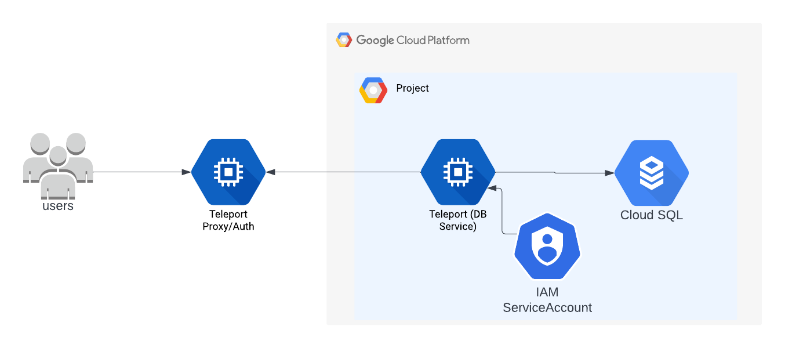
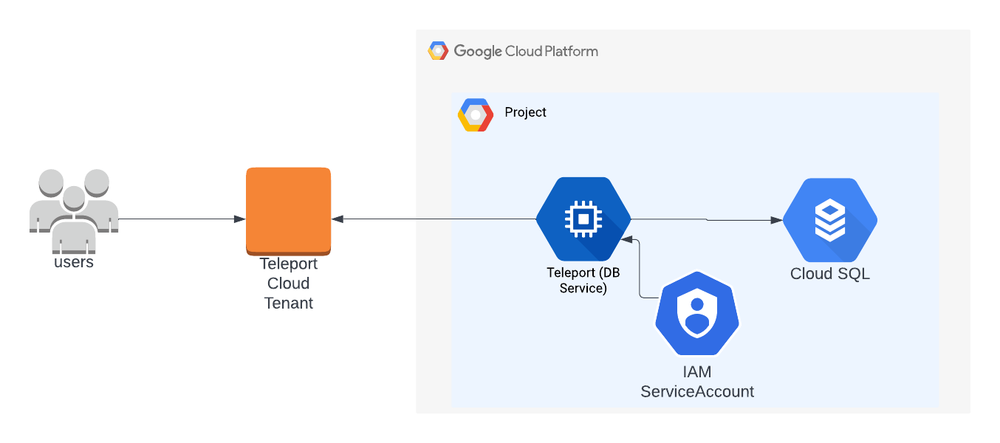
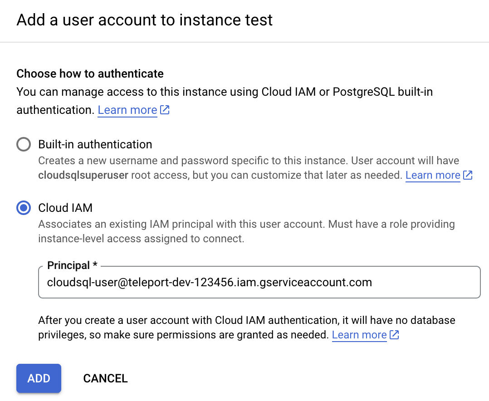
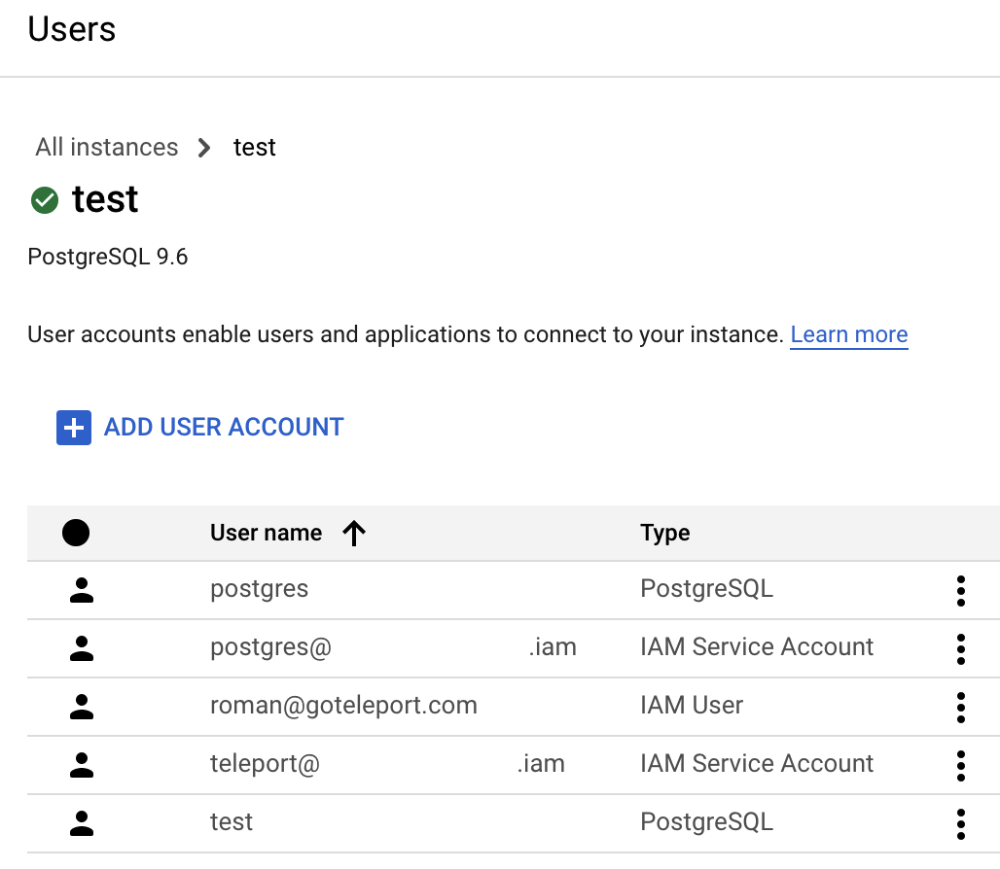

(!docs/pages/includes/database-access/db-introduction.mdx dbType="PostgreSQL on Google Cloud SQL" dbConfigure="with a service account"!)

## How it works

(!docs/pages/includes/database-access/how-it-works/iam.mdx db="PostgreSQL" cloud="Google Cloud"!)

<Tabs>
<TabItem label="Self-Hosted">

</TabItem>
<TabItem label="Cloud-Hosted">

</TabItem>
</Tabs>

## Prerequisites

(!docs/pages/includes/edition-prereqs-tabs.mdx!)

- Google Cloud account
- Command-line client `psql` installed and added to your system's `PATH` environment variable.
- A host, e.g., a Compute Engine instance, where you will run the Teleport Database
  Service
- (!docs/pages/includes/tctl.mdx!)

## Step 1/9. Create a service account for the Teleport Database Service

(!docs/pages/includes/database-access/cloudsql-create-service-account-for-db-service.mdx!)

Alternatively, create the service account using the `gcloud` CLI:

```code
$ gcloud iam service-accounts create teleport-db-service \
    --display-name="Teleport Database Service" \
    --project=<Var name="project-id" />
```

### (Optional) Grant permissions

(!docs/pages/includes/database-access/cloudsql_grant_db_service_account.mdx!)

To grant these permissions via the CLI instead:

```code
$ gcloud projects add-iam-policy-binding <Var name="project-id" /> \
    --member="serviceAccount:teleport-db-service@<Var name="project-id" />.iam.gserviceaccount.com" \
    --role="roles/cloudsql.client"
```

## Step 2/9. Create a service account for a database user

Teleport uses service accounts to connect to Cloud SQL databases.

(!docs/pages/includes/database-access/cloudsql_create_db_user_account.mdx!)

Alternatively, create the database user service account using the CLI:

```code
$ gcloud iam service-accounts create cloudsql-user \
    --display-name="Cloud SQL Database User" \
    --project=<Var name="project-id" />
```

(!docs/pages/includes/database-access/cloudsql_grant_db_user.mdx!)

To grant via the CLI instead:

```code
$ gcloud projects add-iam-policy-binding <Var name="project-id" /> \
    --member="serviceAccount:cloudsql-user@<Var name="project-id" />.iam.gserviceaccount.com" \
    --role="roles/cloudsql.instanceUser"
```

(!docs/pages/includes/database-access/cloudsql-grant-impersonation.mdx!)

To grant impersonation via the CLI instead:

```code
$ gcloud iam service-accounts add-iam-policy-binding \
    cloudsql-user@<Var name="project-id" />.iam.gserviceaccount.com \
    --member="serviceAccount:teleport-db-service@<Var name="project-id" />.iam.gserviceaccount.com" \
    --role="roles/iam.serviceAccountTokenCreator"
```

<Checkpoint
  title="Verify service account impersonation"
  description="Confirm that the Database Service account can impersonate the database user account."
>

Run:

```code
$ gcloud iam service-accounts get-iam-policy \
    cloudsql-user@<Var name="project-id" />.iam.gserviceaccount.com
```

The output should include a binding that pairs `teleport-db-service` with `roles/iam.serviceAccountTokenCreator`:

```yaml
bindings:
- members:
  - serviceAccount:teleport-db-service@<project-id>.iam.gserviceaccount.com
  role: roles/iam.serviceAccountTokenCreator
```

</Checkpoint>

## Step 3/9. Configure your Cloud SQL database

Teleport uses [IAM database authentication](https://cloud.google.com/sql/docs/postgres/authentication)
with Cloud SQL PostgreSQL instances.

(!docs/pages/includes/database-access/cloudsql_enable_iam_auth.mdx type="PostgreSQL" flag="cloudsql.iam_authentication"!)

To enable IAM authentication via the CLI instead:

```code
$ gcloud sql instances patch <Var name="instance-name" /> \
    --database-flags=cloudsql.iam_authentication=on
```

### Create a database user

<Tabs>
<TabItem label="Google Cloud console">

Now go back to the Users page of your Cloud SQL instance and add a new user
account. In the sidebar, choose "Cloud IAM" authentication type and add the
"cloudsql-user" service account that you created in
[the second step](#step-29-create-a-service-account-for-a-database-user):



Press "Add" and your Users table should look similar to this:



See [Creating and managing IAM users](https://cloud.google.com/sql/docs/postgres/create-manage-iam-users)
in Google Cloud documentation for more info.

</TabItem>
<TabItem label="gcloud CLI">

Create an IAM-based database user linked to your service account:

```code
$ gcloud sql users create cloudsql-user@<Var name="project-id" />.iam.gserviceaccount.com \
    --instance=<Var name="instance-name" /> \
    --type=CLOUD_IAM_SERVICE_ACCOUNT
```

</TabItem>
</Tabs>

<Admonition type="note" title="PostgreSQL IAM user naming convention">
For Cloud SQL PostgreSQL, IAM database users use a `.iam` suffix when connecting.
The database user name is the service account email with `.gserviceaccount.com`
replaced by `.iam`. For example, `cloudsql-user@my-project.iam.gserviceaccount.com`
becomes `cloudsql-user@my-project.iam` as the database user name in `tsh db connect`.
</Admonition>

## Step 4/9. Install Teleport

(!docs/pages/includes/install-linux.mdx!)

## Step 5/9. Configure the Teleport Database Service

Run the commands in this step on the host where you will run the Teleport
Database Service (e.g., a Compute Engine instance).

### Create a join token

(!docs/pages/includes/tctl-token.mdx serviceName="Database" tokenType="db" tokenFile="/tmp/token"!)

### (Optional) Download the Cloud SQL CA certificate

(!docs/pages/includes/database-access/cloudsql_download_root_ca.mdx!)

### Generate Teleport config

(!docs/pages/includes/database-access/cloudsql-configure-create.mdx dbPort="5432" dbProtocol="postgres" token="/tmp/token"!)

## Step 6/9. Configure GCP credentials

(!docs/pages/includes/database-access/cloudsql_service_credentials.mdx serviceAccount="teleport-db-service"!)

When running on a GCE instance, you can attach the `teleport-db-service` service
account directly to the instance instead of using service account keys:

```code
$ gcloud compute instances set-service-account <Var name="gce-instance-name" /> \
    --service-account=teleport-db-service@<Var name="project-id" />.iam.gserviceaccount.com \
    --scopes=https://www.googleapis.com/auth/cloud-platform \
    --zone=<Var name="zone" />
```

## Step 7/9. Start the Teleport Database Service

(!docs/pages/includes/start-teleport.mdx service="the Teleport Database Service"!)

<Checkpoint
  title="Verify the Database Service joined the cluster"
  description="Confirm that the Teleport Database Service is running and has joined the cluster."
>

```code
$ tsh db ls
```

You should see your Cloud SQL PostgreSQL database in the output:

```
Name     Description              Labels
-------- ------------------------ --------
cloudsql GCP Cloud SQL PostgreSQL env=dev
```

If the database does not appear, verify your Teleport role permissions. See the [RBAC](../../rbac.mdx) guide.

</Checkpoint>

## Step 8/9. Create a Teleport user

(!docs/pages/includes/database-access/create-user.mdx!)

## Step 9/9. Connect

Once the Database Service has joined the cluster, log in to see the available
databases:

<Tabs>
<TabItem label="Self-Hosted">

```code
$ tsh login --proxy=teleport.example.com --user=alice
$ tsh db ls
# Name     Description              Labels
# -------- ------------------------ --------
# cloudsql GCP Cloud SQL PostgreSQL env=dev
```

</TabItem>
<TabItem label="Teleport Enterprise (cloud-hosted)">

```code
$ tsh login --proxy=mytenant.teleport.sh --user=alice
$ tsh db ls
# Name     Description              Labels
# -------- ------------------------ --------
# cloudsql GCP Cloud SQL PostgreSQL env=dev
```

</TabItem>

</Tabs>

<Admonition
  type="note"
>
You will only be able to see databases that your Teleport role has
access to. See our [RBAC](../../rbac.mdx) guide for more details.
</Admonition>

When connecting to the database, use the name of the database's service account
that you added as an IAM database user
[above](#step-29-create-a-service-account-for-a-database-user),
minus the ".gserviceaccount.com" suffix. The database user name is shown on
the Users page of your Cloud SQL instance.
Retrieve credentials for the "cloudsql" example database and connect to it,
assigning <Var name="project-id" /> to your Google Cloud project ID:

```code
$ tsh db connect --db-user=cloudsql-user@<Var name="project-id"/>.iam --db-name=postgres cloudsql
```

<Admonition type="tip">
To connect to the database using a tool of your choice, like a graphical
database client, you can create a local tunnel and point it to your software:

```code
$ tsh proxy db cloudsql --tunnel --db-user=cloudsql-user@<Var name="project-id"/>.iam --db-name=postgres
```

See [Database GUI Clients](../../../../connect-your-client/third-party/gui-clients.mdx)
guide for more information on specific tools.
</Admonition>

(!docs/pages/includes/database-access/db-access-webui-ad.mdx dbType="PostgreSQL"!)

To log out of the database and remove credentials:

```code
# Remove credentials for a particular database instance:
$ tsh db logout cloudsql
# Or remove credentials for all databases:
$ tsh db logout
```

## Troubleshooting

(!docs/pages/includes/database-access/gcp-troubleshooting.mdx!)

(!docs/pages/includes/database-access/pg-cancel-request-limitation.mdx!)

(!docs/pages/includes/database-access/psql-ssl-syscall-error.mdx!)

## Next steps

(!docs/pages/includes/database-access/guides-next-steps.mdx!)

- Learn more about [authenticating as a service
  account](https://cloud.google.com/docs/authentication#service-accounts) in
  Google Cloud.
