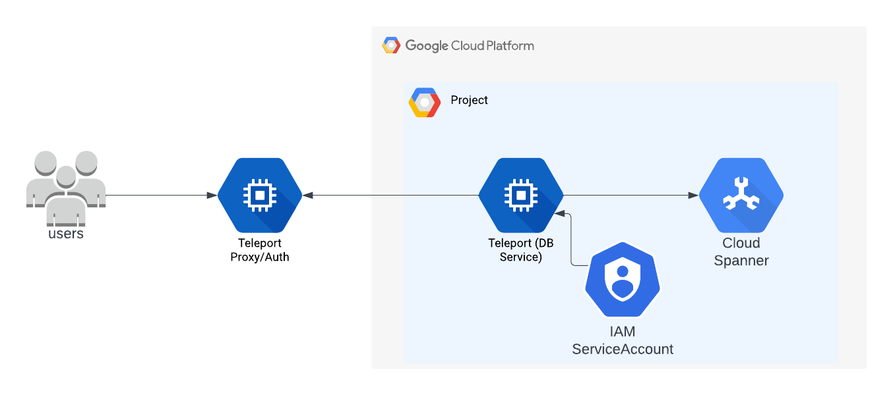
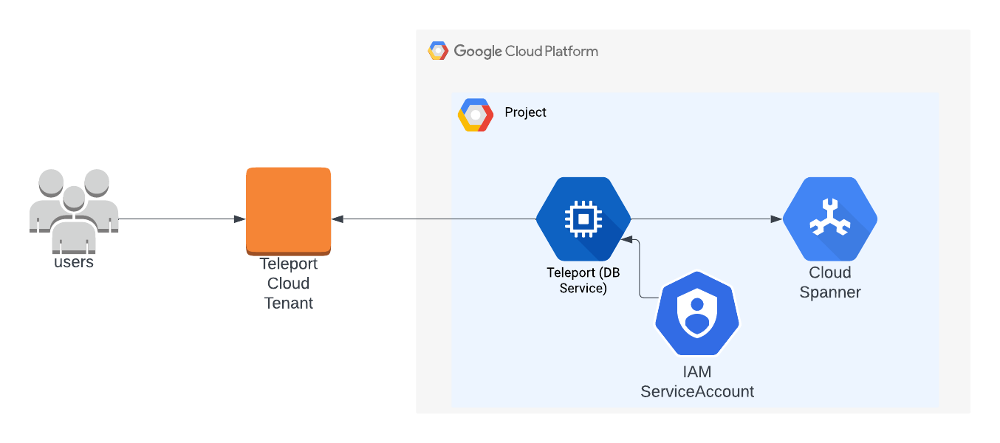

(!docs/pages/includes/database-access/db-introduction.mdx dbType="Cloud Spanner" dbConfigure="with a service account"!)

## How it works

(!docs/pages/includes/database-access/how-it-works/iam.mdx db="Spanner" cloud="Google Cloud"!)

<Tabs>

<TabItem label="Self-Hosted">

</TabItem>

<TabItem label="Cloud-Hosted">

</TabItem>

</Tabs>

## Prerequisites

(!docs/pages/includes/edition-prereqs-tabs.mdx!)

- A Google Cloud account
- A Cloud Spanner instance and database
- A host to run the Teleport Database Service (for example, a Compute Engine instance) 
  with outbound HTTPS access to `spanner.googleapis.com:443`
- (!docs/pages/includes/tctl.mdx!)

## Step 1/6. Create service accounts

Teleport requires two service accounts:

- **Database Service account**: used by the Teleport Database Service to access Google Cloud
- **Database user account**: impersonated per connection to represent the database identity

Fpr example, in the following steps, we will create `teleport-db-service` and `spanner-user` respectively.

### Create the database service account

This account represents the database identity. Teleport users specify this name when connecting.

<Tabs>
<TabItem label="Google Cloud console">

1. Navigate to **IAM & Admin** → **Service Accounts**
1. Click **Create Service Account**
1. Set the name to `teleport-db-service`
1. Skip optional steps and click **Done**. You will grant permissions later.

</TabItem>

<TabItem label="gcloud CLI">

```code
$ gcloud iam service-accounts create teleport-db-service --display-name="Teleport Database Service"
```

</TabItem>
</Tabs>

### Create the database identity account

This account represents the database identity. Teleport users specify this name when connecting.

<Tabs>
<TabItem label="Google Cloud console">

1. Navigate to **IAM & Admin** → **Service Accounts**
1. Click **Create Service Account**
1. Set the name to `spanner-user`
1. Skip optional steps and click **Done**. You will grant permissions later.

</TabItem>

<TabItem label="gcloud CLI">

```code
$ gcloud iam service-accounts create spanner-user --display-name="Spanner User"
```

</TabItem>
</Tabs>

## Step 2/6: Grant permissions

Grant the database user account access to Spanner, then allow the Database Service account to impersonate it.

### Grant Spanner access

<Tabs>
<TabItem label="Google Cloud console">

1. Navigate to **Spanner** → **Instances**
1. Select your instance
1. Click **Permissions** → **Add Principal**
1. Enter the `spanner-user` service account
1. Assign **Cloud Spanner Database User**
1. Click **Save**

</TabItem>

<TabItem label="gcloud CLI">

```code
$ gcloud spanner instances add-iam-policy-binding <Var name="instance-id" /> \
  --member="serviceAccount:spanner-user@<Var name="project-id" />.iam.gserviceaccount.com" \
  --role="roles/spanner.databaseUser"
```

</TabItem>
</Tabs>

<Admonition type="note" title="Custom Spanner role">
The **Cloud Spanner Database User** role is predefined. You can create custom IAM roles to further restrict access if needed.
</Admonition>

### Allow service account impersonation

Grant the Database Service account permission to impersonate the database user account.

<Tabs>
<TabItem label="Google Cloud console">

1. Navigate to **IAM & Admin** → **Service Accounts**
1. Select `spanner-user`
1. Open the **Permissions** tab
1. Click **Grant Access**
1. Add the `teleport-db-service` account
1. Assign **Service Account Token Creator**
1. Click **Save**

</TabItem>

<TabItem label="gcloud CLI">

```code
$ gcloud iam service-accounts add-iam-policy-binding \
  spanner-user@<Var name="project-id" />.iam.gserviceaccount.com \
  --member="serviceAccount:teleport-db-service@<Var name="project-id" />.iam.gserviceaccount.com" \
  --role="roles/iam.serviceAccountTokenCreator"
```

</TabItem>
</Tabs>

<Checkpoint
  title="Verify GCP permissions"
  description="Confirm that the Database Service account can impersonate the database user account."
>

Run:

```code
$ gcloud iam service-accounts get-iam-policy \
  spanner-user@<Var name="project-id" />.iam.gserviceaccount.com \
  --format=json | grep teleport-db-service
```

You should see the `roles/iam.serviceAccountTokenCreator` role.

</Checkpoint>

## Step 3/6: Install and configure the Teleport Database Service

(!docs/pages/includes/install-linux.mdx!)

(!docs/pages/includes/tctl-token.mdx serviceName="Database" tokenType="db" tokenFile="/tmp/token" !)

Provide the following information and then generate a configuration file for the
Teleport Database Service:

- <Var name="example.teleport.sh:443" /> The host **and port** of your Teleport Proxy Service
or cloud-hosted Teleport Enterprise site
- <Var name="project-id"/> The GCP project ID. You can normally see it in the
organization view at the top of the GCP dashboard.
- <Var name="instance-id"/> The name of your Cloud Spanner instance.

```code
$ sudo teleport db configure create \
  -o file \
  --name=spanner-example \
  --protocol=spanner \
  --labels=env=dev \
  --token=/tmp/token \
  --uri=spanner.googleapis.com:443 \
  --proxy=<Var name="example.teleport.sh:443" /> \
  --gcp-project-id=<Var name="project-id" /> \
  --gcp-instance-id=<Var name="instance-id" />
```

## Step 4/6: Configure GCP credentials

(!docs/pages/includes/database-access/cloudsql_service_credentials.mdx serviceAccount="teleport-db-service"!)

## Step 5/6: Start the Teleport Database Service

(!docs/pages/includes/start-teleport.mdx service="the Teleport Database Service"!)

<Checkpoint
  title="Verify database availability"
  description="Confirm that the Spanner database appears in Teleport."
>

Replace `example.teleport.sh` and `example-user` with the proxy and username in question.

```code
$ tsh login --proxy=<Var name="example.teleport.sh" /> --user=<Var name="example-user" />
$ tsh db ls
```

You should see:

```
Name            Description       Allowed Users Labels  Connect
--------------- ----------------- ------------- ------- -------
spanner-example GCP Cloud Spanner [*]           env=dev
```

If the database does not appear, verify your Teleport role permissions. See the [RBAC](../../rbac.mdx) guide.

</Checkpoint>

## Step 6/6: Connect using the service account

(!docs/pages/includes/database-access/create-user.mdx!)

Connect using the service account name (without the domain suffix):

```code
$ tsh db connect --db-user=spanner-user --db-name=example-db spanner-example
```

You should now have an authenticated connection using the impersonated service account.

To remove credentials:

```code
$ tsh db logout spanner-example
```

To remove all database credentials:

```code
$ tsh db logout
```

<Checkpoint
  title="Troubleshoot connection issues"
  description="Error: Could not find default credentials."
>

This error can come from either your client application or Teleport.

For a client application, ensure that you disable GCP credential loading.
Your client should not attempt to load credentials because GCP credentials will
be provided by the Teleport Database Service.

If you see the credentials error message in the Teleport Database Service logs
(at DEBUG log level), then the Teleport Database Service does not have GCP
credentials configured correctly.

If you are using a service account key, then ensure that the environment
variable
`GOOGLE_APPLICATION_CREDENTIALS=/path/to/credentials.json` is set and restart
your Teleport Database Service to ensure that the env var is available to
`teleport`.
For example, if your Teleport Database Service runs as a `systemd` service:
```code
$ echo 'GOOGLE_APPLICATION_CREDENTIALS=/path/to/credentials.json' | sudo tee -a /etc/default/teleport
$ sudo systemctl restart teleport
```

See [authentication](https://cloud.google.com/docs/authentication#service-accounts)
in the Google Cloud documentation for more information about service account
authentication methods.

</Checkpoint>

## Next steps

(!docs/pages/includes/database-access/guides-next-steps.mdx!)

- Learn how to [connect with a GUI client](../../../../connect-your-client/third-party/gui-clients.mdx#cloud-spanner-datagrip).
- Learn more about [service account authentication](https://cloud.google.com/docs/authentication#service-accounts).
