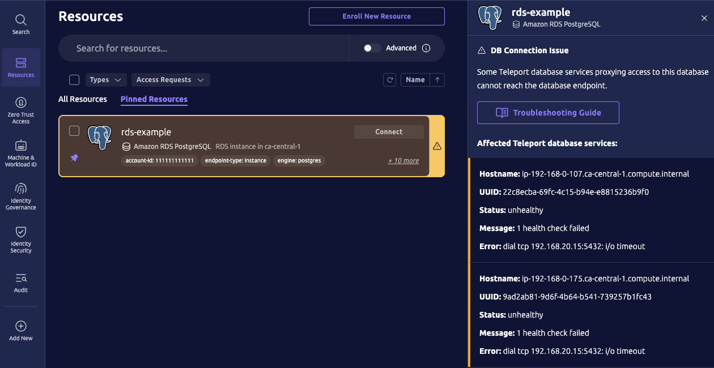

This documentation explains how to manage database health checks.
Available in Teleport 18, database health checks are used to monitor connectivity from Teleport Database Service instances to databases enrolled in a Teleport cluster.

Why monitor database connectivity with health checks?

- **Observability**: Discover networking problems before a user attempts to connect to a database. Unhealthy databases are highlighted in the Teleport web UI and can be discovered programmatically through your Teleport cluster's API.
- **High Availability**: Multiple Teleport Database Service instances can be deployed to proxy connections to the same enrolled databases. Teleport prioritizes routing user connections through Database Service instances that can reach the database endpoint over those that cannot.

## How it works

When a user connects to a database through Teleport, the connection is routed via a Teleport Database Service.
The Database Service must be able to reach the database's endpoint to proxy the connection.

Teleport Database Service instances will perform regular health checks for databases that match a global `health_check_config` resource's label selectors.
If no `health_check_config` matches a database, then health checks will not be enabled for that database.

To perform a health check, Teleport Database Service instances will attempt to establish a TCP connection to the database's endpoint and report whether the connection succeeded.

<Admonition type="note">
Only TCP health checks are available at this time.
</Admonition>

When a database is registered, it will initially have an "unknown" health status.
If health checks are disabled, then the health status will remain "unknown".
If health checks are enabled, then the first health check result will determine the database's health status: either "healthy" or "unhealthy".

After the first health check for a database, its health status will only change once the number of consecutive passing or failing health checks reaches a configurable threshold.

## Configuration

Teleport's `health_check_config` resource determines which databases will have health checks enabled and what settings will be used for those checks:

```yaml
kind: health_check_config
version: v1
metadata:
  name: example
  description: Example healthcheck configuration
spec:
  # interval is the time between each health check. Default 30s.
  interval: 30s
  # timeout is the health check connection establishment timeout. Default 5s.
  timeout: 5s
  # healthy_threshold is the number of consecutive passing health checks
  # after which a target's health status becomes "healthy". Default 2.
  healthy_threshold: 2
  # unhealthy_threshold is the number of consecutive failing health checks
  # after which a target's health status becomes "unhealthy". Default 1.
  unhealthy_threshold: 1
  # match is used to select databases that these settings apply to.
  # Databases are matched by label selectors and at least one label selector
  # must be set.
  # If multiple `health_check_config` databases match the same database, then
  # the matching health check configs are sorted by name and only the first
  # config applies.
  match:
    # db_labels matches database labels. An empty value is ignored.
    # If db_labels_expression is also set, then the match result is the logical
    # AND of both.
    db_labels:
      - name: env
        values:
          - dev
          - staging
    # db_labels_expression is a label predicate expression to match databases.
    # An empty value is ignored.
    # If db_labels is also set, then the match result is the logical AND of both.
    db_labels_expression: 'labels["owner"] == "database-team"'
```

There can be multiple `health_check_config` in a cluster and each config can provide different settings for different sets of databases.
If more than one `health_check_config` matches the same database, then the matching health check configs are sorted, in ascending order by name, and only the first config applies (e.g., the name "00-my-config" has greater precedence than "10-my-config").

### Managing configuration

Use `tctl` to manage `health_check_config` resources in your cluster.

A preset default `health_check_config` is created starting in Teleport 18.
The default config enables TCP health checks for all enrolled databases.

Try viewing the default configuration with `tctl`:

```code
$ tctl get health_check_config/default
kind: health_check_config
metadata:
  description: Enables all health checks by default
  labels:
    teleport.internal/resource-type: preset
  name: default
  namespace: default
spec:
  match:
    db_labels:
    - name: '*'
      values:
      - '*'
version: v1
```

You can create your own health check config with `tctl create`:

```code
$ tctl create health_check_config.yaml
```

Or update an existing config interactively with `tctl edit`:

```code
$ tctl edit health_check_config/example
```

To delete a health check config, run:

```code
$ tctl rm health_check_config/example
```

When a config is created, updated, or deleted, all Teleport Database Service instances will reevaluate which health check config matches and applies for each of the registered databases they proxy.

## Target health

Target health information is reported by Teleport Database Service instances in `db_server` heartbeat objects for each database that they proxy.
Among the information is a health status field.
There are three health statuses:

- "unknown": Health checks for this database are disabled or still initializing
- "healthy": The Teleport service is able to reach the database's endpoint. 
- "unhealthy": The Teleport service is not able to reach the database's endpoint. 

<Admonition type="note">
Teleport Database Service instances running a version of Teleport that does not support health checks will not report target health information for the databases that they proxy.
</Admonition>

You can use `tctl` to view target health information in `db_server.status.target_health`, for example:

```code
$ tctl get db_server/example-postgres-db | yq -y .status
target_health:
  # address is the database address.
  address: "localhost:5432",
  # message is additional information meant for a user.
  message: "1 health check failed"
  # protocol is the health check connection protocol, such as "TCP".
  protocol: "TCP",
  # status is the health status, one of "unknown", "healthy", or "unhealthy".
  status: "unhealthy",
  # transition_reason is a unique reason for the last transition: one of "initialized", "disabled", "threshold_reached", or "internal_error".
  transition_reason: "threshold_reached",
  # transition_timestamp is the time that the last status transition occurred.
  transition_timestamp: "2025-06-09T22:40:24.147753Z",
  # transition_error shows the health check error observed when the transition to "unhealthy" happened.
  transition_error: "dial tcp 127.0.0.1:5432: connect: connection refused",
```

## Troubleshooting

The Teleport web UI will highlight unhealthy databases.
You can click on a highlighted database to view some health check failure details or other warnings:



In this AWS RDS database example the health check error is a connection dial timeout, which is commonly caused by AWS security groups blocking connections to the database.

You can use `tctl` to view more information about the affected Teleport Database Service.
For example, the affected Teleport Database Service instances in the screenshot were deployed using the [Teleport AWS RDS enrollment wizard](../../../zero-trust-access/management/guides/awsoidc-integration-rds.mdx), which is indicated by the `teleport.dev/awsoidc-agent` label:

```code
$ tctl get db_service/22c8ecba-69fc-4c15-b94e-e8815236b9f0
kind: db_service
metadata:
  expires: "2025-06-29T03:55:52Z"
  labels:
    teleport.dev/awsoidc-agent: "true"
  name: 22c8ecba-69fc-4c15-b94e-e8815236b9f0
  revision: 089129ef-52e2-4a8f-8451-c1e91879c14e
spec:
  hostname: ip-192-168-0-107.ca-central-1.compute.internal
  resources:
  - aws: {}
    labels:
      account-id: "111111111111"
      region: ca-central-1
      vpc-id: vpc-abc123abc123abc12
version: v1
```
  
Refer to the [Database Service troubleshooting guide](../troubleshooting.mdx) for general troubleshooting steps.

## FAQ

### Why are MySQL health checks disabled?

MySQL tracks connection errors for each remote host that tries to connect to the database.
Each TCP health check is counted as a connection error and eventually MySQL will
block a host when `sum_connect_errors >= max_connect_errors`.
As a result, TCP health checks eventually cause MySQL databases to block Teleport.

To re-enable TCP health checks:
- set `max_connect_errors` to its maximum value on the database to effectively disable the automatic host blocking.
- set the environment variable `TELEPORT_ENABLE_MYSQL_DB_HEALTH_CHECKS=1` on your Teleport Database Service instance(s).

<Admonition type="warning">
[MySQL documentation](https://dev.mysql.com/doc/refman/8.4/en/host-cache.html#:~:text=The%20value%20of%20the%20max_connect_errors,host%20from%20further%20connection%20requests) notes:
> The value of the max_connect_errors system variable determines how many successive interrupted connection requests the server permits before blocking a host. After max_connect_errors failed requests without a successful connection, the server assumes that something is wrong (for example, that someone is trying to break in), and blocks the host from further connection requests.

Setting `max_connect_errors` to its maximum value will effectively disable MySQL's host blocking feature.
See https://dev.mysql.com/doc/refman/8.4/en/server-system-variables.html#sysvar_max_connect_errors
</Admonition>

### How to disable database health checks?

You can disable health checks for databases by updating your cluster's `health_check_config` resources to only match specific databases.

For example, update the default preset configuration to match only databases with the label `"healthcheck": "enabled"`:

```code
$ tctl create <<EOF
kind: health_check_config
metadata:
  description: Enables all health checks by default
  labels:
    teleport.internal/resource-type: preset
  name: default
  namespace: default
spec:
  match:
    db_labels:
    - name: healthcheck
      values:
      - enabled
version: v1
EOF
```

### Do health checks respect proxy environment variables?

Health checks will respect HTTP proxy environment variables for the following Teleport database protocols:

- `clickhouse-http`
- `dynamodb`
- `opensearch`

The following environment variables in both uppercase and lowercase form are supported:

- `http_proxy`
- `https_proxy`
- `no_proxy`

If HTTP proxy environment variables configure a proxy for a database endpoint, then TCP health checks will dial the proxy rather than the endpoint.

### How can I list all unhealthy databases?

```code
$ tctl db ls --query 'health.status == "unhealthy"' 
```
