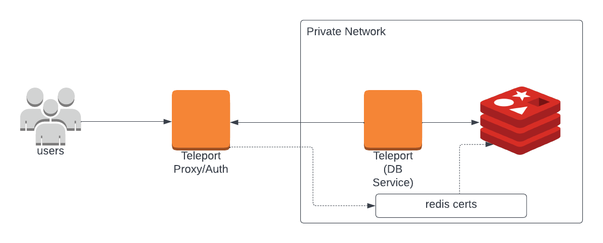
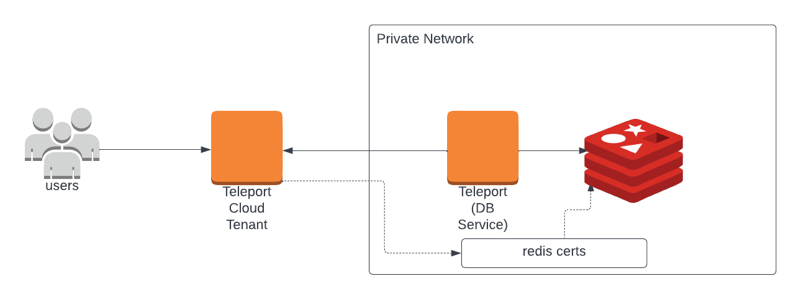

If you want to configure Redis Cluster, please read [Database Access with Redis Cluster](redis-cluster.mdx).

(!docs/pages/includes/database-access/db-introduction.mdx  dbType="Redis" dbConfigure="Redis database with mutual TLS authentication" dbName="Redis" !)

<Tabs>
<TabItem scope={["oss", "enterprise"]} label="Self-Hosted">

</TabItem>
<TabItem scope={["cloud","team"]} label="Teleport Cloud">

</TabItem>

</Tabs>

## Prerequisites

(!docs/pages/includes/edition-prereqs-tabs.mdx!)

- Redis version `6.0` or newer.

  <Admonition type="note" title="Note">
  RESP3 (REdis Serialization Protocol) is currently not supported.
  </Admonition>

- `redis-cli` version `6.2` or newer installed and added to your system's `PATH` environment variable.

- A host where you will run the Teleport Database Service.

  See [Installation](../../../installation.mdx) for details.

- (!docs/pages/includes/tctl.mdx!)

## Step 1/5. Set up the Teleport Database Service

(!docs/pages/includes/tctl-token.mdx serviceName="Database" tokenType="db" tokenFile="/tmp/token"!)

Install and configure Teleport where you will run the Teleport Database Service:

<Tabs>
<TabItem label="Linux Server">

(!docs/pages/includes/install-linux.mdx!)

(!docs/pages/includes/database-access/db-configure-start.mdx dbName="example-redis" dbProtocol="redis" databaseAddress="rediss://redis.example.com:6379" !)

</TabItem>
<TabItem label="Kubernetes Cluster">
  Teleport provides Helm charts for installing the Teleport Database Service in Kubernetes Clusters.

  (!docs/pages/includes/kubernetes-access/helm/helm-repo-add.mdx!)

  (!docs/pages/includes/database-access/db-helm-install.mdx dbName="example-redis" dbProtocol="redis" databaseAddress="rediss://redis.example.com:6379" !)
</TabItem>
</Tabs>

(!docs/pages/includes/database-access/multiple-instances-tip.mdx !)

## Step 2/5. Create a Teleport user

(!docs/pages/includes/database-access/create-user.mdx!)

## Step 3/5. Create Redis users

(!docs/pages/includes/database-access/redis-create-users.mdx!)

## Step 4/5. Set up mutual TLS

(!docs/pages/includes/database-access/tctl-auth-sign.mdx!)

We will show you how to use `tctl auth sign` below.

When connecting to standalone Redis, sign the certificate for the hostname over
which Teleport will be connecting to it.

For example, if your Redis server is accessible at `redis.example.com`,
run:

```code
$ tctl auth sign --format=redis --host=redis.example.com --out=server --ttl=2190h
```

(!docs/pages/includes/database-access/ttl-note.mdx!)

The command will create three files:
- `server.cas` with Teleport's certificate authority
- `server.key` with a generated private key
- `server.crt` with a generated user certificate

You will need these files to enable mutual TLS on your Redis server.

Use the generated secrets to enable mutual TLS in your `redis.conf` configuration
file and restart the database:

```ini
tls-port 6379
port 0
aclfile /path/to/users.acl
tls-ca-cert-file /path/to/server.cas
tls-cert-file /path/to/server.crt
tls-key-file /path/to/server.key
tls-protocols "TLSv1.2 TLSv1.3"
```

Once mutual TLS has been enabled, you will no longer be able to connect to
the cluster without providing a valid client certificate. You can use the
`tls-auth-clients optional` setting to allow connections
from clients that do not present a certificate.

See [TLS Support](https://redis.io/topics/encryption)
in the Redis documentation for more details.

## Step 5/5. Connect

(!docs/pages/includes/database-access/redis-connect.mdx!)

### Supported Redis commands

Redis in standalone mode doesn't support the commands below. If one of the listed commands is called Teleport
returns the <nobr>`ERR Teleport: not supported by Teleport`</nobr> error.

- `HELLO`
- `PUNSUBSCRIBE`
- `SSUBSCRIBE`
- `SUNSUBSCRIBE`

## Next steps

(!docs/pages/includes/database-access/guides-next-steps.mdx!)

