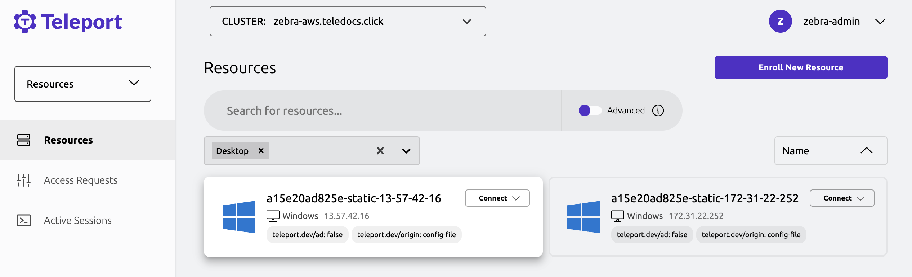

This guide demonstrates how to connect an Active Directory domain and how to log
into a Windows desktop from the connected domain.

You should note that Teleport requires the Kerberos authentication protocol to support
certificate-based authentication for Active Directory. Because Azure Active Directory
doesn't use Kerberos, you can't use the Teleport Windows Desktop Service for
Azure Active Directory.

## Prerequisites

To complete the steps in this guide, verify your environment meets the following requirements:

- Access to a running Teleport cluster, `tctl` admin tool, and `tsh` client tool
  version >= (=teleport.version=).

  You can verify the tools you have installed by running the following commands:

  ```code
  $ tctl version
  # Teleport Enterprise v(=teleport.version=) go(=teleport.golang=)

  $ tsh version
  # Teleport v(=teleport.version=) go(=teleport.golang=)
  ```

  You can download these tools by following the appropriate [Installation
  instructions](../../installation.mdx#linux) for the Teleport
  edition you use.

- A Linux server to run the Teleport Windows Desktop Service.
  You can use an existing server that runs the Teleport agent for other resources.

- An Active Directory domain that is configured for LDAPS. Because Teleport requires an
  encrypted LDAP connection, you should verify that your domain uses Active Directory
  Certificate Services or a non-Microsoft certification authority (CA) to issue LDAPS
  certificates.

- Administrative access to a domain controller.

- (!docs/pages/includes/tctl.mdx!)

## Option 1: Automated configuration

For relatively simple Active Directory environments, you can use the `tctl` generated configuration script
to bootstrap your Active Directory domain for use with Teleport. At a high level, the script does the following:

1. Create a restrictive service account named `Teleport Service Account` with the SAM account name `svc-teleport` and create the necessary LDAP containers.
1. Prevent the service account from performing interactive logins by creating and linking a Group Policy Object (GPO) named `Block teleport-svc Interactive Login`.
1. Configure a GPO named `Teleport Access Policy` to allow Teleport connections, including:
   - Importing the Teleport CA certificate.
   - Configuring firewall rules.
   - Allowing remote RDP connections.
   - Enabling RemoteFX for improved remote desktop performance.
1. Read the LDAP CA certificate (required for secure LDAPS connections).
1. Generate a Teleport configuration file for the Windows Desktop Service.

For more complex Active Directory environments, you may need to modify the generated script to meet your specific requirements.
It may also be easier to comprehend what the script does by following the manual configuration steps below.

To use the `tctl` generated configuration script, run the following command:

```code
# Generate the script and save it to a file named configure-ad.ps1.
tctl desktop bootstrap > configure-ad.ps1
```

After generating the script, transfer it to a Windows domain controller and run it in a PowerShell console.

## Option 2: Manual configuration

### Step 1/7. Create a restrictive service account

Teleport requires a service account to connect to your Active Directory domain.
You should create a dedicated service account with restrictive permissions
for maximum security.

To create the service account:

1. Open PowerShell on a Windows domain computer.

1. Create a service account with a randomly-generated password by copying and pasting
   the following script into the PowerShell console:

   ```powershell
   $Name="Teleport Service Account"
   $SamAccountName="svc-teleport"

   # Generate a random password that meets the "Password must meet complexity
   # requirements" security policy setting.
   # Note: if the minimum complexity requirements have been changed from the
   # Windows default, this part of the script may need to be modified.
   Add-Type -AssemblyName 'System.Web'
   do {
      $Password=[System.Web.Security.Membership]::GeneratePassword(15,1)
   } until ($Password -match '\d')
   $SecureStringPassword=ConvertTo-SecureString $Password -AsPlainText -Force

   New-ADUser `
     -Name $Name `
     -SamAccountName $SamAccountName `
     -AccountPassword $SecureStringPassword `
     -Enabled $true
   ```

   The password generated for the service account is discarded immediately.
   Teleport doesn't need the password because it uses x509 certificates for LDAP
   authentication. You can reset the password for the service account if you need
   to perform password authentication.

1. Set the minimum permissions that must granted to the service account by running the
   following script in the PowerShell console:

   ```powershell
   # Save your domain's distinguished name to a variable.
   $DomainDN=$((Get-ADDomain).DistinguishedName)

   # Create the CDP/Teleport container.
   # If the command fails with "New-ADObject : An attempt was made to add an object
   # to the directory with a name that is already in use", it means the object
   # already exists and you can move on to the next step.
   New-ADObject -Name "Teleport" -Type "container" -Path "CN=CDP,CN=Public Key Services,CN=Services,CN=Configuration,$DomainDN"

   # Allow Teleport to create LDAP containers in the CDP container.
   dsacls "CN=CDP,CN=Public Key Services,CN=Services,CN=Configuration,$DomainDN" /I:T /G "$($SamAccountName):CC;container;"

   # Allow Teleport to create and delete cRLDistributionPoint objects in the CDP/Teleport container.
   dsacls "CN=Teleport,CN=CDP,CN=Public Key Services,CN=Services,CN=Configuration,$DomainDN" /I:T /G "$($SamAccountName):CCDC;cRLDistributionPoint;"

   # Allow Teleport to write the certificateRevocationList property in the CDP/Teleport container.
   dsacls "CN=Teleport,CN=CDP,CN=Public Key Services,CN=Services,CN=Configuration,$DomainDN " /I:T /G "$($SamAccountName):WP;certificateRevocationList;"

   # Allow Teleport to read the cACertificate property in the NTAuthCertificates container.
   dsacls "CN=NTAuthCertificates,CN=Public Key Services,CN=Services,CN=Configuration,$DomainDN" /I:T /G "$($SamAccountName):RP;cACertificate;"
   ```

1. Get the security identifier for the new service account.
   For example, run the following command:

   ```powershell
   Get-AdUser -Identity $SamAccountName | Select SID
   ```

   The command returns the security identifier for the specified account:

   ```powershell
   SID
   ---
   S-1-5-21-209875886-835680547-4265310078-1113
   ```

1. Copy the full security identifier—beginning with `S-`—returned.

   You'll use this value for the `sid` field when you configure the `ldap` settings
   in a later step.

### Step 2/7. Prevent the service account from performing interactive logins

The next steps modify group policy objects (GPOs). Changes to group policies
can take time to propagate to all hosts. You can force changes to take effect
immediately on your current host by opening PowerShell and running
`gpupdate.exe /force`. However, the change might still take time to propagate to other
hosts in the domain.

The Teleport service account is only needed to authenticate over LDAP. The account
doesn't need to log on to Windows computers like an ordinary user.
You can prevent the service account from being used to log on by creating a new
Group Policy Object (GPO) linked to your entire domain, and then denying interactive
logins.

#### Create a GPO

1. Open PowerShell and specify a name for the new group policy object with the `$GPOName` variable:

   ```powershell
   $GPOName="Block teleport-svc Interactive Login"
   ```

1. Create the new GPO by running the following command in the PowerShell console:

   ```powershell
   New-GPO -Name $GPOName | New-GPLink -Target $((Get-ADDomain).DistinguishedName)
   ```

#### Deny interactive login

1. Open **Group Policy Management** and expand **`Forest > Domains > $YOUR_DOMAIN > Group Policy Objects`**
   to locate the group policy object you just created.

1. Select the group policy object, click **Action**, then select **Edit**.

1. Expand **`Computer Configuration > Policies > Windows Settings > Security Settings > Local Policies > User Rights Assignment`**.

1. Double-click **Deny log on locally**, then select **Define these policy settings**.

1. Click **Add User or Group**, then click **Browse**.

1. Type all or part of the service account name—for example, `svc-teleport`—then click **Check Names**.

1. Verify the **Teleport Service Account** is selected, then click **OK** in all the dialogs.

   <Figure align="left" bordered caption="Deny Interactive Login">
   
   </Figure>

1. Repeat these steps for **Deny log on through Remote Desktop Services**.

  For added security, you can disable username and password authentication completely.
  If you disable username and password authentication, only the Teleport virtual smart
  card can be used to access Windows computers in the domain.

### Step 3/7. Configure a GPO to allow Teleport connections

To enable access to Windows desktop sessions through Teleport, you must configure a
group policy object that allows Windows computers to trust the Teleport certificate
authority and accept certificate-based smart card authentication.

You need to do the following to configure the group policy object:

- Export a certificate signed by the Teleport certificate authority for an existing
  Teleport cluster.
- Create a new group policy object and import the signed Teleport certificate.
- Publish the signed Teleport certificate to the Active Directory domain.
- Publish the signed Teleport certificate to the NTAuth Store.
- Enable smart card authentication.
- Allow remote desktop connections.

You must repeat these steps if you rotate the Teleport user certificate authority.

#### Export the Teleport certificate

To export the Teleport user CA certificate:

1. Log on to a Windows domain controller where you can access **Group Policy Management**.

1. Open PowerShell and download the Teleport user certificate authority by running the following
   command and replacing `teleport.example.com` with the address of your Teleport cluster:

   ```code
   $ curl.exe -fo user-ca.cer https://<Var name="teleport.example.com"/>/webapi/auth/export?type=windows
   ```

1. Take note of the path to the `user-ca.cer` file for use in a later step.

#### Create the GPO for the Teleport certificate

To configure the group policy object:

1. Create a new group policy object with the name `Teleport Access Policy` by running the following
   command:

   ```powershell
   $GPOName="Teleport Access Policy"
   New-GPO -Name $GPOName | New-GPLink -Target $((Get-ADDomain).DistinguishedName)
   ```

   This command applies the GPO to the entire Active Director domain.
   If you only want to protect a subset of computers in the domain, you can apply the GPO to
   a specific organizational unit (OU) that only includes those computers.

   If you use AWS Managed Microsoft Active Directory, AWS Delegated Domain Administrator
   accounts are not granted permissions to apply GPOs at the domain level. Instead, you
   should apply this GPO to the automatically-created OU with the NetBIOS domain name
   containing `Computers` and `Users` nested one level inside the domain root.

   <Figure align="left" bordered caption="AWS Managed AD OU Location">
   
   </Figure>

1. Open **Group Policy Management** and expand Forest, Domains, your domain, and
   Group Policy Objects to locate the GPO you just created.

1. Select the new GPO—for example, `Teleport Access Policy`, right-click, then select **Edit**.

1. In the group policy editor, expand
   **`Computer Configuration > Policies > Windows Settings > Security Settings > Public Key Policies`**.

1. Right-click **Trusted Root Certification Authorities**, then click **Import**.

1. Use the wizard to select and import the Teleport certificate.

   <Figure align="left" bordered caption="Import Teleport CA">
   
   </Figure>

1. To ensure your GPO update takes effect immediately on this host,
   open PowerShell and run the following command (optional):

   ```powershell
   gpupdate.exe /force
   ```

#### Publish the Teleport CA to the Active Directory domain

To publish the Teleport certificate in the Active Directory domain:

1. Log on to a Windows computer that is joined to the Active Directory domain with
   an account that's a member of the **Domain Administrators** or **AWS Delegated
   Domain Administrators** group.

1. Open PowerShell and run the following command using the path to the `user-ca.cer`
   file you exported from Teleport:

   ```powershell
   certutil -dspublish -f <Var name="user-ca.cer"/> RootCA
   ```

   This command enables the domain controllers to trust the Teleport CA so that
   certificate-based smart card authentication through Teleport can succeed.

#### Publish the Teleport CA to the NTAuth Store

For authentication with Teleport-issued certificates to succeed, the
Teleport CA also must be published to the enterprise NTAuth store.
Teleport periodically publishes its CA after it is able to authenticate, but
this step must be performed manually the first time for Teleport to have LDAP
access.

To publish the Teleport CA to LDAP:

1. Open PowerShell and run the following command using the path to the `user-ca.cer`
   file:

   ```powershell
   certutil -dspublish -f <Var name="user-ca.cer"/> NTAuthCA
   ```

1. Force the retrieval of the CA from LDAP by running the following command:

   ```powershell
   certutil -pulse
   ```

   This step isn't strictly required. However, it allows you to proceed to the
   next steps without waiting for the certificate to propagate.

#### Enable smart card authentication

Teleport performs certificate-based authentication by emulating a smart card.

To add smart card authentication to your group policy object:

1. Verify that you have the `Teleport Access Policy` group policy object open in the
   group policy editor.

1. Expand **`Computer Configuration > Policies > Windows Settings > Security Settings > System Services`**.

1. Double-click **Smart Card** and select **Define this policy setting**.

1. Select **Automatic**, then click **OK**.

   <Figure align="left" bordered caption="Enable the Smart Card Service">
   
   </Figure>

1. To ensure your GPO update takes effect immediately on this host,
   open PowerShell and run the following command (optional):

   ```powershell
   gpupdate.exe /force
   ```

#### Allow remote desktop connections

Next you need to configure policies that allow remote connections to domain computers.

1. Verify that you have the `Teleport Access Policy` group policy object open in the
   group policy editor.

1. Expand **`Computer Configuration > Policies > Administrative Templates > Windows Components > Remote Desktop Services > Remote Desktop Session Host > Connections`**.

1. Right-click **Allow users to connect remotely by using Remote Desktop Services**,
   select **Edit**, select **Enabled**, then click **OK**.

1. Under Remote Desktop Session Host, select **Security**.

1. Right-click **Require user authentication for remote connections by using
   Network Level Authentication**, select **Edit**, select **Disabled**, then click **OK**.

   <Admonition type="note" title="NLA Support">
   Teleport 16.2.0 and later support NLA. If you are running a supported version
   and enable NLA, you can skip this step. Read more in the
   [NLA](#network-level-authentication-nla) section.
   </Admonition>

   <Figure align="left" bordered caption="Disable Require user authentication...">
   
   </Figure>

1. Right-click **Always prompt for password upon connection**, select **Edit**,
   select **Disabled**, then click **OK**.

   The Teleport certificate-based smart card authentication generates a random smart card
   PIN for each desktop session and provides the PIN to the desktop when establishing the RDP
   connection.
   Because the PIN is never provided to the Teleport user, the **Always prompt for password
   upon connection** policy must be **disabled** for authentication to succeed.

1. Expand Computer Configuration, Policies, Windows Settings, Security Settings to select
   **Windows Firewall with Advanced Security**.

1. Right-click **Inbound Rules**, select **New Rule**.

   - Under Predefined, select **Remote Desktop**, then click **Next**.
   - Select **User Mode (TCP-in)**, then click **Next**.
   - Select **Allow the connection**, then click **Finish**.

   <Figure align="left" bordered caption="Open the Firewall">
   
   </Figure>

1. To ensure your GPO update takes effect immediately on this host,
   open PowerShell and run the following command (optional):

   ```powershell
   gpupdate.exe /force
   ```

#### Enable RemoteFX

To finish configuring the `Teleport Access Policy` group policy object, you must
enable RemoteFX. RemoteFX is a compression technology that significantly improves
the performance of remote desktop connections.

1. Verify that you have the `Teleport Access Policy` group policy object open in the
   group policy editor.

1. Expand **`Computer Configuration > Policies > Administrative Templates > Windows Components > Remote Desktop Services > Remote Desktop Session Host > Remote Session Environment > RemoteFX for Windows Server 2008 R2`**

1. Right-click **Configure RemoteFX**, select **Edit**, select **Enabled**, then click **OK**.

   <Figure align="left" bordered caption="Enable RemoteFX (Step 1)">
   
   </Figure>

1. Now left-click **Remote Session Environment**
   (**`Computer Configuration > Policies > Administrative Templates > Windows Components > Remote Desktop Services > Remote Desktop Session Host > Remote Session Environment`** in the left pane)
   and from the items in the right pane, right-click **Enable RemoteFX encoding for RemoteFX clients designed for Windows Server 2008 R2 SP1**, select **Edit**, select **Enabled**, then click **OK**.

   <Figure align="left" bordered caption="Enable RemoteFX (Step 2)">
   
   </Figure>

1. Again left-click **Remote Session Environment** in the left pane, and from the items in the right pane, right-click **Limit maximum color depth**, select **Edit**, select **Enabled**, then click **OK**.

   <Figure align="left" bordered caption="Enable RemoteFX (Step 3)">
   
   </Figure>

1. Open PowerShell and run the following command to update your Teleport
   group policy object:

   ```powershell
   gpupdate.exe /force
   ```

### Step 4/7. Configure a certificate for RDP connections

The Teleport RDP client requires secure cryptographic algorithms to make
TLS connections. However, Windows Server 2012 R2 doesn't support these algorithms
by default.

You can configure Windows Server 2012 R2 to support the
required algorithms by doing the following:

- Create a new certificate template that uses elliptic curve cryptography.
- Update the Teleport group policy object to use the new certificate template
  when issuing certificates for remote desktop connections.

If your hosts support the required algorithms, you can skip this step
and go to [Export your LDAP CA certificate](#step-57-export-your-ldap-ca-certificate).

#### Create a certificate template

To create a certificate template that uses elliptic curve P-384 and SHA384 as the
signature algorithm:

1. Click Start, Control Panel, and Administrative Tools to select **Certificate Authority**.

1. Open your CA computer, right-click **Certificate Templates**, then select **Manage**.

1. Select the *Computer* template, right-click, then select **Duplicate Template**.

1. Select the **Compatibility** tab:

   - Change **Certification Authority** to **Windows Server 2012 R2**, then click **OK**.
   - Change **Certificate recipient** to **Windows Server 2012 R2**, then click **OK**.

1. Select the **General** tab:

   - Change **Template display name** to **RemoteDesktopAccess**.
   - Verify that **Template name** is also **RemoteDesktopAccess**.

1. Select the **Cryptography** tab:

   - Change **Provider Category** to **Key Storage Provider**.
   - Change **Algorithm name** to **ECDH_P384**.
   - Change **Request hash** to **SHA384**.

1. Select the **Extensions** tab:

   - Select **Application Polices**, then click **Edit**.
   - Remove all entries from the list.

1. Select the **Security** tab:

   - Select **Domain Computers** and give the group **Read** and **Enroll** permissions.

1. Click **OK** to create the Template.

1. Go back to the Certificate Authority console, right-click **Certificate Templates**.

1. Click **New**, select **Certificate Template to Issue**, then select **RemoteDesktopAccess**.

1. Click **OK**.

#### Update GPO to use a new certificate template

To update the Teleport group policy object to use the new certificate template:

1. Open the `Teleport Access Policy` group policy object in the group policy editor.

1. Expand **`Computer Configuration > Policies > Administrative Templates > Windows Components > Remote Desktop Services > Remote Desktop Session Host > Security`**.

1. Right-click **Server authentication certificate template**, select **Edit**, select
   **Enabled**, then set the Certificate Template Name to **RemoteDesktopAccess**.

   <Figure align="left" bordered caption="RDP Certificate Template">
   
   </Figure>

1. Expand Computer Configuration, Policies, and Windows Settings to select
   **Public Key Policies**.

1. Double-click **Certificate Services Client - Auto-Enrollment**, then select
   **Enabled** in the Configuration Model.

1. Open PowerShell and run the following command to update your Teleport
   group policy object:

   ```powershell
   gpupdate.exe /force
   ```

### Step 5/7. Export your LDAP CA certificate

Teleport connects to your domain controller using LDAPS. This means that you must
let Teleport know that the certificate sent by your domain controller during the
initial connection is trusted. If your domain controller's certificate is
trusted by the system repository on the system running Teleport, you can skip
this step.

If you are unable to acquire the LDAP CA certificate, you can skip
TLS verification by setting `insecure_skip_verify: true`. However, you shouldn't
skip TLS verification in production environments.

To export a CA certificate:

{/* Adapted from https://www.ibm.com/docs/it/rds/5.2.1?topic=security-exporting-certificate-from-active-directory-server */}

1. Click Start, Control Panel, and Administrative Tools to select **Certificate Authority**.
1. Select your CA computer, right-click, then select **Properties**.
1. One the General tab, click **View Certificate**.
1. Select **Details**, then click **Copy to File**.
1. Click *Next* in the Certificate Export Wizard, and ensure that **DER encoded binary X.509 (.CER)**
   is selected.
1. Select a name and location for the certificate and click through the wizard.
1. Transfer the exported file to the system where you're running Teleport. You
can either add this certificate to your system's trusted repository or provide
the file path to the `der_ca_file` configuration variable.

### Step 6/7. Configure Teleport

To configure Teleport to protect access to Windows desktops:

1. Install Teleport on the Linux host that will run the Teleport Windows Desktop Service:

   (!docs/pages/includes/install-linux.mdx!)

1. Sign in to your Teleport cluster from your administrative workstation.

1. Generate an invitation token for the cluster with the following command:

   ```code
   $ tctl tokens add --type=windowsdesktop
   ```

1. Copy the invitation token to a file on the Linux host that will run the Windows Desktop
   Service.

1. Add the configuration for the Windows Desktop Service to the `/etc/teleport.yaml`
   on the Linux host.

   The `/etc/teleport.yaml` should include configuration settings similar to the following:

   ```yaml
   version: v3
   teleport:
     auth_token: "path/to/token"
     proxy_server: <Var name="teleport.example.com"/> # replace with your proxy address
   windows_desktop_service:
     enabled: yes
     ldap:
       # Port must be included for the addr.
       # LDAPS port is 636 by default (example.com:636)
       addr: "$LDAP_SERVER_ADDRESS"
       domain: "$LDAP_DOMAIN_NAME"
       username: "$LDAP_USERNAME"
       sid: "$LDAP_USER_SID"
       # Path to the certificate you exported.
       der_ca_file: "path/to/exported/cert"
     discovery:
       base_dn: "*"
   auth_service:
     enabled: no
   proxy_service:
     enabled: no
   ssh_service:
     enabled: no
   ```

   For a detailed description of the configuration fields, see
   [Desktop Configuration Reference](../../reference/agent-services/desktop-access-reference/configuration.mdx).

1. (!docs/pages/includes/start-teleport.mdx service="the Teleport Desktop Service"!)

### Step 7/7. Log in using Teleport

Teleport users must have appropriate permissions to access remote Windows desktops.
For example, you can create a role that gives its users access to all Windows
desktop labels and the local "Administrator" user.

To create a role for accessing Windows desktops:

1. Create a file called `windows-desktop-admins.yaml` with the following content:

   ```yaml
   kind: role
   version: v5
   metadata:
     name: windows-desktop-admins
   spec:
     allow:
       windows_desktop_labels:
         "*": "*"
       windows_desktop_logins: ["jsmith"]
   ```

   Note that user names shared between domain and local users create login conflicts.

1. Create the role:

   ```code
   $ tctl create -f windows-desktop-admins.yaml
   ```

1. (!docs/pages/includes/add-role-to-user.mdx role="windows-desktop-admins"!)

   Now that you have a Linux host running the Windows Desktop Service and
   a role that allows Teleport users to connect to Windows computers, you can
   use the Teleport user assigned the `windows-desktop-admins` role
   to connect to Windows desktops from the Teleport Web UI.

To connect to a Windows desktop:

1. Sign in to the Teleport cluster using an account that's assigned the
   `windows-desktop-admins` role.

1. Select **Resources**.

1. Click **Type**, then select **Desktops**.

1. Click **Connect** for the Windows computer you want to access, then select the
   login to use for the connection.

   

   Teleport opens a remote desktop connection and starts recording the desktop session. When you're
   finished working with the Windows desktop, click the **More items** menu, then click **Disconnect**.

   

   To view the recording, select **Management** in the Teleport Web UI, then click **Session Recordings**
   in the Activity section.

## LDAP Discovery

In Active Directory environments, Teleport can be configured to discover hosts
via LDAP. LDAP discovery is enabled by setting the `discovery.base_dn` field in
the Teleport Windows Desktop Service configuration. You can set `base_dn` to a
wildcard `'*` to search from the root of the domain, or you can specify an alternate
base distinguished name to search from.

```yaml
windows_desktop_service:
  enabled: yes
  discovery:
    base_dn: '*'
```

### Filters

Teleport optionally accepts a set of filters that can be used to narrow the
search results for discovery. The filters are specified with [LDAP
Filter](https://ldap.com/ldap-filters/) syntax. Teleport will automatically
compute a logical AND of all filters specified.

```yaml
windows_desktop_service:
  enabled: yes
  discovery:
    base_dn: '*'
  filters:
  - '(location=Oakland)'
  - '(!(primaryGroupID=516))'
```

### Labeling

It is often necessary to apply labels to discovered hosts to control access. You
can configure Teleport to convert LDAP attributes to Teleport labels by setting
the `discovery.label_attributes` field in the Teleport Windows Desktop Service
configuration.

```yaml
windows_desktop_service:
  enabled: yes
  discovery:
    base_dn: '*'
    label_attributes:
      - 'location'
      - 'department'
```

Each of the specified attributes will be placed in a Teleport label prefixed with `ldap/`.

For example, if an AD computer object had a location attribute with a value of Oakland,
and a department attribute with a value of Engineering, the Teleport resource for this
host would have both `ldap/location=Oakland` and `ldap/department=Engineering` labels.

## Security hardening

By default, the Default Domain Policy grants the **Add workstations to domain
user** right to all authenticated users. As a security best practice, Teleport
recommends that you only grant this right to administrators or other privileged groups.

To change the default domain policy:

1. Open **Group Policy Management** and expand Forest, Domains, your domain, and
   Group Policy Objects.
1. Right-click **Default Domain Controller Policy**, then select **Edit**.
1. In the group policy editor, expand Computer Configuration, Policies, Windows
   Settings, Security Settings, Local Policies, and User Rights Assignment to select
   **Add workstations to domain**.
1. Double-click the  **Add workstations to domain** policy and ensure that the
   **Authenticated Users** group is not present.

## Multiple domains

Each `windows_desktop_service` is designed to support connecting to hosts in a
single Active Directory domain. If you have multiple independent domains, you
can deploy multiple Teleport agents to service them.

If you have multiple domains with a trust relationship between them, you can
configure Teleport to perform PKI operations against one domain, while generating
certificates for users in another domain.

In order for this to work, the hosts that you want to connect to and the AD
users that you want to connect as must reside in the same domain.

For example, suppose you have a root domain at `example.com` and a child domain
for developers at `dev.example.com`. If your PKI is configured at the root, but
you want to allow users in the child domain to connect to hosts in the child
domain, you would do the following:

1. Import Teleport's CA certificate as a trusted root certificate in the root
   domain's group policy and add the certificate to the NTAuth store as
   described in the
   [section above](#publish-the-teleport-ca-to-the-ntauth-store).
1. Configure Teleport to perform PKI against the root domain, while
   issuing certificates for users and hosts in the child domain:

  ```yaml
  windows_desktop_service:
    enabled: yes

    # configure LDAP settings to point at the child domain
    ldap:
      addr: dev.example.com:636
      username: 'DEV\svc-teleport'

    # optional: configure discovery for the child domain
    discovery:
      base_dn: CN=Computers,DC=dev,DC=example,DC=com

    # perform PKI against the root domain
    pki_domain: root.example.com
  ```

With this configuration, Teleport will generate certificates for users in
`dev.example.com`, but it will publish its CA and CRLs to `example.com`.

## Network Level Authentication (NLA)

With Teleport 16.2.0 and later, you can configure `windows_desktop_service` to
perform Network Level Authentication (NLA) when connecting to Windows hosts. NLA
is a security feature that authenticates the user *prior* to establishing the
remote desktop connection, which ensures that the remote Windows host doesn't
consume system resources to present a login screen to an unauthenticated user.

In order to perform NLA, Teleport's `windows_desktop_service` needs to be able
to make an outbound Kerberos connection to a key distribution center (KDC). This
is most commonly performed on TCP port 88.

By default, Teleport will assume that a KDC is available on the same host that
is specified in the `ldap` configuration's `addr` field, using the default
Kerberos port.

For example, with the following configuration, Teleport will attempt to perform
NLA against `example.com:88`.

```yaml
windows_desktop_service:
    enabled: yes
    ldap:
      addr: example.com:636
```

Alternatively, you can override the KDC address by specifying the `kdc_address`
in your Teleport configuration file.

```yaml
windows_desktop_service:
    enabled: yes
    kdc_address: kdc.example.com   # defaults to port 88 if unspecified
```

To enable NLA, set the `TELEPORT_ENABLE_RDP_NLA` environment variable to `yes`
on any hosts running the Teleport's `windows_desktop_service`. Note that NLA is
only supported when connecting to hosts that are part of an Active Directory
domain. Teleport will not perform NLA when connecting to hosts as a local
Windows user.

### Computer Name

In order to complete a successful authentication flow, Teleport needs to know
the hostname of the target Windows server. If you are using Teleport's
LDAP-based discovery no action is necessary - Teleport will default to using the
`teleport.dev/computer_name` label which is automatically populated. If this
label is not present then Teleport will use the desktop's `addr` field.

If you register your Windows hosts via configuration file or via Teleport's API
and you want to enable NLA, then you should either:

- manually set the `teleport.dev/computer_name` label to the proper hostname
- ensure that the host's `addr` is its actual hostname

## Next steps

If you encounter any issues, see [Troubleshooting](./troubleshooting.mdx) for
common problems and solutions. For information about configuring
Windows-specific role permissions, see
[Role-Based Access Control for Desktops](./rbac.mdx).
